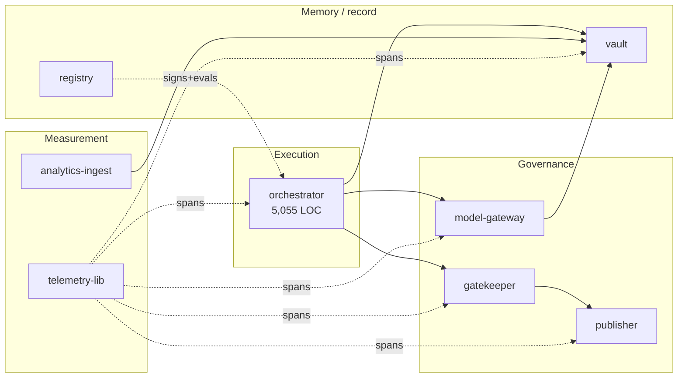
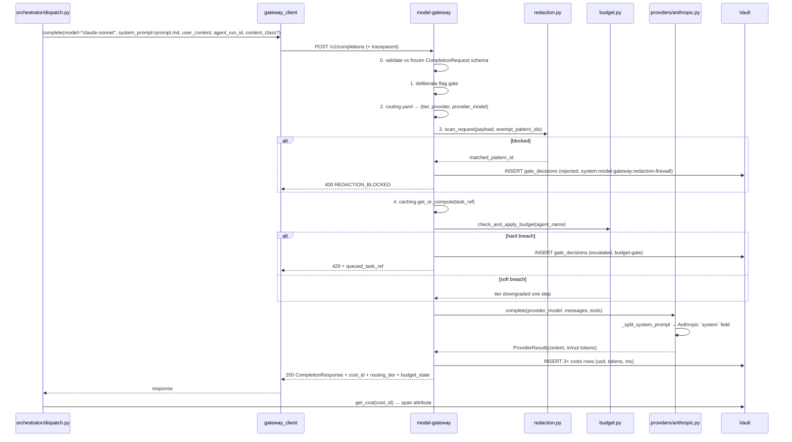
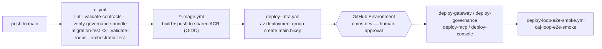

# 01 — System Architecture

*Reverse-engineered from `infra/`, `services/`, `mcp/`, `console/`,
`contracts/` and `.github/workflows/`. Diagrams are Mermaid.*

---

## 1. Architectural style

Three styles are layered, deliberately:

1. **Contract-first, frozen-interface architecture.** `contracts/` holds ten
   files hash-pinned in `contracts/.frozen-v1.sha256` and enforced by
   `scripts/validate_contracts.py` in CI. Services read these contracts *at
   runtime*, not just at build time — `services/model-gateway/completion.py`
   validates every request against the `CompletionRequest` schema read out
   of `contracts/model-gateway/openapi.yaml`; `redaction.py` compiles its
   patterns from `contracts/model-gateway/redaction-rules.yaml`;
   `orchestrator/loop_loader.py` validates loop YAML against
   `contracts/orchestrator/loop-definition.schema.json`. **The contract is
   not documentation — it is the running validator.**

2. **Choreographed, event-driven services.** Two Service Bus queues
   (`event`, `task`) carry all inter-service work. No service calls another
   to *start* work; they publish. Synchronous HTTP is used only for
   *queries and decisions* (gateway completions, gate checks, Vault CRUD).

3. **Policy-as-data.** Every governance decision is driven by a YAML file
   that a human can read and diff: `gatekeeper/policy/autonomy.yaml`,
   `model-gateway/policy/routing.yaml`, `model-gateway/policy/budgets.yaml`,
   `contracts/model-gateway/redaction-rules.yaml`,
   `docs/permission-register.yaml`, `orchestrator/loops/*.yaml`,
   `functions/09-*/fetch_sources.yaml`. Changing platform behaviour is a
   reviewed one-line data change, not a code change. `routing.yaml`'s own
   header states this explicitly: *"a model upgrade is one reviewed line,
   not a code change."*

## 2. The whole system

```mermaid
flowchart TB
  subgraph SCHED["Scheduling — Logic Apps (Consumption)"]
    LA1["dailySignalLoopTrigger<br/>06:00 SAST"]
    LA2["weeklyPlanningTrigger<br/>Mon 07:00 SAST"]
    LA3["monthEndReportingTrigger<br/>last day of month"]
  end

  subgraph BUS["Azure Service Bus (Standard, disableLocalAuth)"]
    EVQ[["queue: event"]]
    TKQ[["queue: task"]]
  end

  subgraph CAE["Container Apps Environment — cae-cmos-dev (VNet-integrated)"]
    ORCH["ca-orchestrator<br/>FastAPI + background worker loop"]
    GW["ca-model-gateway<br/>routing / redaction / budget / metering"]
    GK["ca-gatekeeper<br/>internal: /gate-check /decisions /approval-status"]
    GKA["ca-gatekeeper-approval<br/>EXTERNAL + Entra Easy Auth<br/>/approval-action/{token}"]
    PUB["ca-publisher<br/>token verify / hash / jti / Buffer"]
    VLT["ca-vault<br/>9 object types + taxonomy/consent/retention"]
    CON["ca-console<br/>EXTERNAL + Entra Easy Auth<br/>6 read screens + 1 write"]
    MW["mcp-web"]
    MB["mcp-buffer"]
    MC["mcp-canva"]
  end

  subgraph DATA["Data plane (all private endpoints)"]
    PG[("Postgres Flexible Server 16<br/>public: schemas public / governance<br/>vault_internal / analytics / mcp_ops")]
    KV[["Key Vault<br/>publicNetworkAccess: Disabled"]]
    BLOB[("Storage<br/>vault-assets · analytics-fabric-export")]
    ACR[["Container Registry (Basic)"]]
  end

  subgraph OBS["Observability"]
    AI["Application Insights<br/>(workspace-based, southafricanorth)"]
    LAW["Log Analytics log-cmos-dev"]
  end

  subgraph EXT["External"]
    ANTH["Anthropic Messages API"]
    BUF["Buffer GraphQL"]
    CANVA["Canva REST"]
    NEWS["learn.microsoft.com<br/>moneyweb.co.za<br/>businesstech.co.za"]
    TEAMS["Teams Workflows webhook"]
    FABRIC["Microsoft Fabric shortcut"]
  end

  LA1 & LA2 & LA3 --> EVQ
  EVQ --> ORCH
  ORCH --> TKQ
  TKQ --> ORCH
  ORCH --> GW & GK & VLT & MW
  GW --> ANTH
  GW --> PG
  GK --> PG
  GK --> KV
  GK --> TEAMS
  GKA --> PG
  PUB --> PG
  PUB --> MB
  MB --> BUF
  MC --> CANVA
  MW --> NEWS
  VLT --> PG
  VLT --> BLOB
  CON --> VLT
  CON --> AI
  ORCH & GW & GK & PUB & VLT & CON --> AI
  AI --> LAW
  ACR -.image pull.-> CAE

  subgraph JOBS["Container Apps Jobs (one-shot / scheduled)"]
    J1["caj-analytics-nightly-ingest<br/>cron 0 1 * * *"]
    J2["caj-vault-retention-expiry"]
    J3["caj-*-migrate ×5"]
    J4["caj-*-smoke ×5"]
  end
  J1 --> PG
  J1 --> BLOB
  BLOB --> FABRIC
```



## 3. Layer-by-layer

### 3.1 Frontend / UI

There is exactly **one** human UI: `console/`. It is a server-rendered
FastAPI + Jinja2 app. There is no SPA, no React, no build step, no
JavaScript framework — seven templates in
`console/app/templates/` (`base.html`, `tasks.html`, `trace.html`,
`approvals.html`, `vault_search.html`, `costs.html`, `kill_switch.html`).

The defining design choice is **dual-surface rendering**:
`console/app/rendering.py`'s `render_or_json(request, template, data,
templates)` serves the *same* `data` dict as HTML or JSON based on the
`Accept` header. `console/app/services.py` is the single source of truth for
both. This is what makes the console agent-native — an agent and a human get
byte-equivalent information.

Route inventory (`console/app/routes_reads.py`, `routes_write.py`):

| Method | Path | Screen |
|---|---|---|
| GET | `/` | redirect → `/tasks` |
| GET | `/tasks` | Task queue (agent runs) |
| GET | `/tasks/{task_ref}/trace` | Trace timeline (App Insights KQL) |
| GET | `/approvals` | Approval inbox (read-only) |
| GET | `/vault-search` | Taxonomy-filtered Vault search |
| GET | `/costs` | Cost ledger (`group_by=function\|day`) |
| GET | `/kill-switch` | Kill-switch state + last audit entry |
| POST | `/kill-switch/toggle` | **the only mutating route** |
| GET | `/health` | unauthenticated probe |

Two hardening details worth noting: `require_principal` is applied as a
FastAPI `Depends` on *every* route as a **code-level backstop** to the
Bicep-wired Easy Auth layer (`RISK-003` — defence in depth against infra
drift); and the toggle route accepts both JSON (agent) and
form-urlencoded (browser), with an Origin/Referer same-origin check applied
only to the form path as CSRF defence (`_same_origin_or_reject`).

### 3.2 Backend services

All eight are Python 3.12. Six are FastAPI HTTP services; two
(`registry`, `telemetry-lib`) are libraries/CLI toolchains.



**Ingress posture** (`infra/modules/**`):

| App | Ingress | Auth |
|---|---|---|
| `ca-console` | **external** | Container Apps Easy Auth (Entra ID), FIC-secretless |
| `ca-gatekeeper-approval` | **external** | Easy Auth, `unauthenticatedClientAction=Return401` |
| `ca-gatekeeper` | internal | none (network isolation) |
| `ca-publisher` | internal | none |
| `ca-model-gateway` | internal | none |
| `ca-vault` | internal | **none — documented accepted risk** |
| `mcp-web` / `mcp-buffer` / `mcp-canva` | internal | none |

Only **two** surfaces are reachable from the internet, and both are Entra-
protected. The route separation between `ca-gatekeeper` (internal, holds
`/gate-check`) and `ca-gatekeeper-approval` (external, holds only
`/approval-action`) is enforced by *two separate FastAPI app objects*
(`main.py` vs `approval_main.py`) — the docstring is explicit: *"Two
separate app objects means route separation cannot be lost to a
misconfigured flag."*

### 3.3 Database

**One** Postgres 16 Flexible Server (`Standard_B1ms`, Burstable,
`publicNetworkAccess: Disabled`, private endpoint into `snet-pe`), with
**five schemas** owned by different services:

| Schema | Owner | Tables | Migration |
|---|---|---|---|
| `public` (9 tables) | Vault (frozen) | signals, opportunity_cards, briefs, assets, campaigns, agent_runs, gate_decisions, costs, consent_register | `contracts/vault-schema/schema.sql` (hash-frozen) |
| `public` (2 tables) | Orchestrator (additive) | task_state, task_transitions | `services/orchestrator/migrations/0001-0004` |
| `vault_internal` (7) | Vault sidecar | object_taxonomy, consent_linkage, audit_log, retention_policy, retention_run, access_log, utilisation_daily | `services/vault/migrations/0001` |
| `governance` (6) | Gatekeeper + Publisher | schema_migrations, kill_switches, approval_inbox, approval_actions, publish_attempts, jti_ledger | `infra/modules/governance/migrations/0001` |
| `analytics` (11) | analytics-ingest | 4 raw fact tables, utm_campaign_map, utm_quarantine, scheduled_posts, 4 kpi_rollup_* | `services/analytics-ingest/migrations/0001` |
| `mcp_ops` | MCP servers | tool_calls | `mcp/mcp_ops/schema.sql` |

**The `vault_internal` split is the single most consequential schema
decision.** `contracts/vault-schema/schema.sql` is hash-frozen, so taxonomy,
consent linkage, retention and utilisation *could not* be added as columns.
They went into a sidecar schema instead, and the Vault API stitches them
back together with a `LEFT JOIN` on every read
(`services/vault/vault/routers/objects.py`, `fetch_object`). This is
recorded as an accepted risk with a deferred v2 consolidation path
(`docs/accepted-risks.md`).

Every migration is applied by an in-VNet **Container Apps Job**, and every
one base64-encodes its SQL because *Container Apps collapses a literal `$$`
in secret values to `$`*, which corrupts PL/pgSQL dollar-quoting (learning
L-0012). CI reproduces that exact encoding round-trip before applying
(`.github/workflows/ci.yml`).

### 3.4 Queues

Two Service Bus queues, both `lockDuration: PT1M`, `maxDeliveryCount: 10`,
`deadLetteringOnMessageExpiration: true` (`infra/modules/service-bus.bicep`).

- **`event`** carries two discriminated message shapes: `HeartbeatEvent`
  (has `event_type: "heartbeat"`) and `DeadLetterAlert` (has
  `alert_version`). `worker.py::_event_message_kind` routes between them —
  a fix (`F-EVENTQ-DISCRIMINATE`) added after every dead-letter produced 8
  Pydantic errors in the logs.
- **`task`** carries `TaskEnvelope` — **metadata only**. This is the
  compensating control for running Standard SKU without a private endpoint:
  `contracts/service-bus/spec.md` states the blast radius of the public
  endpoint is limited to task metadata because content is referenced by id
  and fetched from the Vault.

**The retry state machine is entirely application-level and deliberately
decoupled from the transport.** `services/orchestrator/orchestrator/state_machine.py`:
`retry_count` lives in `task_state`, backoff is `2 * 2^(attempt-1) + jitter`,
dead-letter fires at exactly the 3rd failure, and the whole thing is
idempotent against redelivery (short-circuits if already `dead_lettered`).

### 3.5 Scheduling

**Five** Consumption Logic Apps *(was three; updated 17 Aug 2026)*, each with
its own SystemAssigned identity and its own Service Bus Data Sender role
assignment (`infra/modules/scheduling/*.bicep`), on `South Africa Standard Time`:

| Logic App | Fires | Loop |
|---|---|---|
| `la-daily-signal-loop-trigger` | 06:00 SAST daily | `daily-signal-loop` |
| `la-weekly-planning-trigger` | **07:00 SAST daily** — see below | `weekly-content-loop` |
| `la-month-end-reporting-trigger` | last day of month | `month-end-reporting` |
| `la-publish-trigger` | per Bicep | `publish-loop` |
| `la-source-discovery-trigger` | per Bicep | `source-discovery-loop` |

Plus one Schedule-triggered Container Apps Job for analytics
(`caj-analytics-nightly-ingest`, cron `0 1 * * *` = 03:00 SAST).

**`weekly-content-loop` fires daily, and that is deliberate.** The loop id and
its `monday-` … `friday-` task-id prefixes are **dependency-chain names, not a
schedule**: one heartbeat decomposes the whole graph and runs it as fast as
`depends_on` allows, so a daily fire produces one *complete* Mon–Fri content
cycle per day, not one weekday's slice per day. The trigger carried a
`TEMPORARY` marker and a commented-out weekly block until 17 Aug 2026; both are
gone, because the revert they promised was never coming. Sends every reader
down the wrong path otherwise — it did exactly that once.

`services/orchestrator/loops/nightly-analytics-ingest-loop.yaml` is
explicitly **documentary** — its own header states the real trigger is the
Container Apps Job, and the loop file exists as registry metadata. This is
an honest, unusual piece of self-documentation. **[INFERRED]** it also
signals an intent to eventually unify all scheduling under the orchestrator.

### 3.6 AI services

**How handlers are registered.** `DISPATCH_TABLE` maps `task_type` → handler
and covers **39 task_types**. Most are literal entries, but the eleven S10
intelligence scanners are built by a factory and merged in as a **dict spread**:

```python
SCANNER_TASKS: dict[str, tuple[str, str, str]] = {
    # task_type: (function_id, default profile_id, agent_name)
    "competitor-discovery-scan": ("10-competitor-discovery-scanner", ...),
    ...
}
SCANNER_HANDLERS = {t: _make_scanner_handler(...) for t in SCANNER_TASKS}
DISPATCH_TABLE = { **SCANNER_HANDLERS, "ingest-signals": ..., ... }
```

Their scan scope is data, in `functions/_shared/scan-profiles.yaml`. They
deliberately do **not** write straight to `opportunity_cards`: the eleven share
three listening scopes, so one event legitimately surfaces several times, and
de-duplication is `dedupe-signal-cards`' job.

> **Reading this table programmatically:** a grep for `"task-type":` inside
> `DISPATCH_TABLE` misses all eleven factory-registered scanners and reports
> them as unwired no-ops. Resolve `SCANNER_TASKS` first. This has already
> produced one false audit result.




**Provider extensibility is one register call.** `providers/base.py` is a
one-method `Protocol`; `providers/registry.py` is a name→class map;
`routing.yaml` names the provider as a string. No vendor name appears in
`config.py`, `completion.py`, or `routing.py`. Adding a second LLM vendor is
a new module + one `register()` + a YAML edit.

### 3.7 Memory

There are **four distinct memory systems**, and they are not interchangeable:

| Memory | Store | Lifetime | Purpose |
|---|---|---|---|
| **Task state / run memory** | `task_state.result_ref` (jsonb) | run | How a task hands a *pointer* (not content) to its successor. Resolved by `resolve_lineage_result()` walking `depends_on` up to 6 hops |
| **Artefact memory** | Vault `public` + blobs | retention-class bounded (30d/1y/3y/legal hold) | The durable system of record: signals, briefs, assets, agent_runs |
| **Institutional memory** | `.compound/learnings/**` (79 files) | permanent | Cross-session engineering knowledge, classified `architecture/conventions/known-hard/security` |
| **Strategic memory** | `docs/positioning.md` | manual | The "Tier-2 strategy source of truth" that function prompts quote verbatim |

**There is no vector store, no embeddings, no RAG, and no conversational
memory anywhere in this repository.** Agent context is assembled
deterministically from: a static `prompt.md` + a structured `user_content`
JSON built by the dispatch handler + content fetched by id from the Vault.
That is a significant architectural stance — see `05-ai-architecture.md`.

### 3.8 Knowledge

Knowledge enters the system through exactly one door: **mcp-web's
`fetch_url` tool**, restricted to an allowlist. The sources are named in
`functions/09-market-intelligence-director/fetch_sources.yaml` (3 domains:
`learn.microsoft.com`, `moneyweb.co.za`, `businesstech.co.za`), and the
allowlist is mirrored into `MCP_WEB_ALLOWLIST` in `infra/main.bicep`.
`web_search` is declared in function 09's `tools.yaml` but **not implemented**
in mcp-web — the fetch_sources.yaml header documents this as a config-only
future activation path.

### 3.9 Storage

- **Content-addressed blob storage** for assets
  (`services/vault/vault/storage.py`): blob name = SHA-256 hex of the bytes.
  `exists()` before write, so identical bytes never duplicate; a concurrent
  `ResourceExistsError` is treated as successful dedup. Deletion is
  reference-counted against `assets.content_hash`.
- **`analytics-fabric-export`** container for the nightly Fabric payload.
- Managed identity only — no storage keys, no connection strings.

### 3.10 Reporting

Two independent reporting paths:

1. **Operational** — `console/costs`, `console/tasks`,
   `console/tasks/{ref}/trace`, plus `GET /utilisation/rollup` on the Vault
   (daily reads per object_class per caller_service).
2. **Analytical** — `analytics-ingest` nightly: 4 sources ingested → UTM
   reconciliation (unmatched → `analytics.utm_quarantine` with a reason) →
   4 KPI rollups → schema-validated Fabric export
   (`analytics/contracts/fabric-nightly-export.schema.json`) → blob →
   Power BI starter dataset (`analytics/powerbi/analytics-dataset.json`).

The four KPIs are the platform's own scorecard:
`engagement_rate_by_post_archetype`, `publishing_reliability`,
**`cost_per_accepted_asset`**, `vault_utilisation`. The third one is the
tell — it is a *unit-economics-of-AI-labour* metric, computed as
`SUM(costs) / COUNT(assets WHERE approval_state='approved')` joined through
`agent_runs.agent_name` (`analytics_ingest/rollup.py`).

### 3.11 Messaging / notifications

| Channel | Mechanism | State |
|---|---|---|
| Teams approval card | Adaptive Card v1.4 via Power Automate Workflows webhook (`gatekeeper/app/teams_client.py`) | **Flag-gated** — `TEAMS_WEBHOOK_URL` absent by default; falls back to the inbox row |
| Teams brief-ready | `orchestrator/teams_notify.py` | Flag-gated, same webhook |
| Approval inbox | `governance.approval_inbox` row | **Always written** — the row *is* the delivery when no webhook |
| Dead-letter alert | `DeadLetterAlert` on the `event` queue | Emitted and observable; nothing consumes it yet |
| Email / SMS / Slack | — | **Not built** |

Classic O365 connector webhooks were retired May 2026, so the code targets
Workflows HTTP triggers with Adaptive Cards, and uses `Action.OpenUrl` deep
links rather than submit-style postbacks — deliberately, because *"a
submit-style postback would make 'who clicked' a claim of the card payload
rather than an authenticated identity"*.

### 3.12 Deployment



13 workflows. Zero client secrets anywhere — **OIDC federated identity
only** (`AZURE_CLIENT_ID` / `AZURE_TENANT_ID` / `AZURE_SUBSCRIPTION_ID`).
ACR admin user is disabled; image pull is by managed identity with an
explicit `AcrPull` role assignment.

Two patterns here are hard-won and worth naming (they appear as learnings
L-0018, L-0048, L-0049, L-0060, L-0061):
- **Image bootstrap contract**: every Bicep `containerImage` param defaults
  to a *public MCR placeholder*, and the deploy workflow's preflight
  resolves the app's *current live image* — but only if
  `latestReadyRevisionName` is non-empty. Otherwise it re-bootstraps.
- **Never declare `registries[]` on a new `Microsoft.App/jobs` resource** —
  a user-assigned identity cannot be newly attached and simultaneously
  referenced for ACR pull in the same create.

### 3.13 Observability

`services/telemetry-lib` is a shared package adopted by all six services.
Its distinguishing feature is that the span attribute API is a **closed
enum, not a dict**:

```python
class SpanAttributeKey(str, Enum):
    FUNCTION_ID, TASK_REF, MODEL, REGISTRY_VERSION, COST   # required on every span
    STATUS, DURATION_MS, ERROR_CODE                        # optional allowlist
```

`set_span_attribute()` raises `ValueError` on an unrecognised key **and on
any string value over `MAX_TEXT_LEN = 200`** — free-text-shaped values are
structurally rejected before they reach the exporter. This mirrors the
Service Bus redaction convention into telemetry. It is the same principle
applied a third time (queues, prompts, spans): *content never travels; only
identifiers do.*

W3C `traceparent` is injected on every outbound call
(`orchestrator/clients/*`) and joined on every inbound request
(each service's `telemetry_wiring.py`), so one `task_ref` stitches the whole
chain in App Insights.

## 4. Cross-cutting invariants (the platform's real "architecture")

These seven rules hold everywhere, and are individually test-enforced:

1. **Fail closed.** Autonomy default level 0; permission register default
   deny; `VaultLookupError` refuses to publish; missing consent → 403;
   unknown gate-token alg → reject.
2. **Content never travels; ids do.** Queues, spans, `result_ref`,
   `metadata` bags.
3. **Append-only audit.** `gate_decisions` has no `updated_at` *by design*;
   `task_transitions`, `approval_actions`, `publish_attempts`,
   `vault_internal.audit_log` are insert-only. Rejection audits are written
   on an *isolated connection* (`write_audit_isolated`) so they survive the
   transaction rollback that the rejection itself causes.
4. **Uncached where correctness depends on freshness.** Kill switch is a
   fresh SELECT on every gate decision and every publish; `/status` reads
   the DB with no cache. Autonomy policy *is* cached — deliberately, because
   it is a build-time artefact.
5. **Never guess a hostname.** Every FQDN is resolved live via
   `az containerapp show` or an env override (learning L-0025).
6. **Idempotent migrations, applied twice in CI.**
7. **Two implementations, one behaviour, proven by a parity test.** The kill
   switch is duplicated in gatekeeper and publisher (they share no library);
   `test_kill_switch_parity.py` loads *both files* and asserts identical
   behaviour across the full scope matrix.
