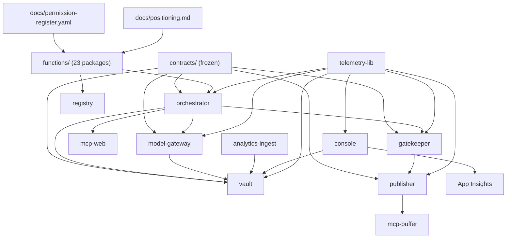

# 02 — Module Catalogue

*Every module in the repository. "Maturity" is assessed on evidence in the
code: tests present, deployed, proven live, or stubbed.*

Maturity scale used throughout:
- **L4 Proven live** — deployed and verified against `cmos-dev` with evidence in code comments/learnings
- **L3 Deployed** — Bicep + workflow exist, unit-tested, not independently proven end-to-end
- **L2 Built & tested** — real implementation with tests, not wired to infra
- **L1 Scaffold** — shape exists, behaviour stubbed
- **L0 Declared only** — named but not implemented

---

## M1 — Orchestrator (`services/orchestrator`)

| | |
|---|---|
| **Purpose** | The execution engine. Turns a schedule tick into a completed, governed multi-agent workflow. |
| **Business capability** | Marketing Work Orchestration; Autonomous Task Execution |
| **Maturity** | **L4 Proven live** — `ca-orchestrator`, 19 test modules, real production incident history in comments |

**Features**
- Loop registry: loads `loops/*.yaml` on startup, JSON-Schema-validates each, checks acyclicity via Kahn's algorithm (`loop_loader.py`)
- Deterministic decomposition: `uuid5(heartbeat.event_id, loop_task_id)` — same heartbeat ⇒ same task ids, enabling golden-file tests and smoke-test correlation (`decompose.py`)
- Dependency-ordered dispatch with `dispatchable` gating (`db.advance_dependents`)
- Application-level retry/backoff/dead-letter state machine, decoupled from Service Bus `maxDeliveryCount` (`state_machine.py`)
- Cascade dead-letter: a task blocked on a permanently-failed dependency dead-letters *immediately* instead of burning ~15 min through requeue + 3-strike (`DependencyDeadLetteredError`)
- Five real task handlers + a byte-identical legacy pass-through for every other task_type (`dispatch.py`)
- Lineage resolution: BFS up `depends_on` to find the nearest ancestor carrying a `result_ref` — transparently walks *past* unhandled pass-through stages
- Agent-native run state: `GET /runs/{task_ref}` returns every stage, span presence, and the **real** human approval status (distinct from the request-approval task's own always-COMPLETED state)

**Pages / surfaces**: `GET /health`, `GET /status`, `GET /runs/{task_ref}`

**Data used**: `task_state`, `task_transitions` (owned); Vault via REST; `governance.approval_inbox` via Gatekeeper

**Dependencies**: Service Bus, Postgres, model-gateway, Vault, Gatekeeper, mcp-web, `functions/02,09,42` (staged into the image via `FUNCTIONS_DIR`), `contracts/orchestrator/*` (staged via `CONTRACTS_DIR`)

**Users**: Logic Apps (producer), itself (consumer), console + smoke jobs (readers)

**Inputs**: `HeartbeatEvent`, `TaskEnvelope` · **Outputs**: `TaskEnvelope`, `DeadLetterAlert`, Vault objects, gate-check requests

**Missing**
- No task cancellation, pause, or replay-from-step
- No priority handling — `TaskEnvelope.priority` is in the contract but never read
- `_retry_or_dead_letter` re-invokes handlers that are **not idempotent** — the docstring admits duplicate Vault rows are possible
- No dynamic loop registration: loops are baked into the image
- `DeadLetterAlert` is emitted but nothing consumes it — no alerting, no paging

---

## M2 — Model Gateway (`services/model-gateway`)

| | |
|---|---|
| **Purpose** | The single, mandatory chokepoint between every agent and every LLM provider. |
| **Business capability** | AI Cost Control; Data-Loss Prevention; Model Portability |
| **Maturity** | **L4 Proven live** — real Anthropic calls + real metering proven (learning L-0027) |

**Features** (in execution order, `completion.py`)
0. Runtime validation against the frozen `CompletionRequest` schema — *read out of the contract file, never hand-copied*
1. `deliberate` reasoning-hint feature flag → explicit `NOT_IMPLEMENTED`, never silently ignored
2. Routing: logical id → (risk tier, provider, provider_model) from `policy/routing.yaml`
3. **Redaction firewall** with per-content-class pattern exemptions
4. `task_ref` idempotency cache — in-flight futures + bounded `OrderedDict` (10k), so two concurrent requests for one `task_ref` produce one upstream call
5. Budget: soft breach downgrades a tier, hard breach queues + 429
6. Provider call, then 3 `costs` rows
7. One structured JSON log line per request, on every path

**Startup behaviour worth noting**: `_validate_routing_against_live_models()`
calls Anthropic's `/v1/models` once per process start and **logs** (never
raises) if a configured `provider_model` has been retired. Born from learning
L-0026, where every originally-configured model id turned out to be retired.

**Data used**: Vault `costs`, `gate_decisions` (writes only)

**Missing**
- Cache is process-local — multi-replica double-spend is possible and explicitly declared out of scope
- No streaming, no tool-use loop, no multi-turn conversation
- `PRICE_PER_MTOK` is a hardcoded dict — prices drift silently
- Only one provider implemented despite the extension point

---

## M3 — Gatekeeper (`services/gatekeeper`)

| | |
|---|---|
| **Purpose** | Decide whether an agent may perform an action; obtain and record human approval; mint the authorisation token. |
| **Business capability** | Autonomy Policy Management; Human-in-the-Loop Approval; Emergency Stop |
| **Maturity** | **L4 Proven live** — `caj-governance-smoke` exercises the real level-1 path |

**Features**
- Autonomy levels 0–4 mapped from `(function_id, action_class)`, fail-closed default 0 (`policy/autonomy.yaml`)
- Exactly one `gate_decisions` row on **every** branch, with a distinct `reason` string per branch
- Kill switch checked **first**, uncached, on every request
- Single-use, 24h-expiring approval links; consumption is an atomic conditional `UPDATE ... AND link_consumed_at IS NULL`
- Approver identity from Easy Auth headers, never from link possession
- Four distinguishable click outcomes, each with its own `approval_actions` audit row: `approved`, `rejected`, `link_expired`, `link_already_used`
- Gate token: RS256, Key Vault-held signing key, `function_id`+`content_hash` packed as **canonical JSON** in the `resource` claim (because the frozen schema sets `additionalProperties: false`)
- `GET /approval-status` — reports the *real* pending/approved/rejected/expired state, which `GET /decisions/{id}` structurally cannot

**Surfaces**: internal `POST /gate-check`, `GET /decisions/{id}`, `GET /approval-status`, `GET /healthz`; external `GET /approval-action/{link_token}?choice=`

**Missing**
- Level 2 ("elevated") is implemented identically to level 1 — quorum/second-approver is reserved, not built
- No REST API over kill switches or the approval inbox — this is why the console still runs its Gatekeeper client in `mock` mode
- No delegation, escalation timeout, or approval reminder
- No per-function kill switch UI (the table supports `scope='function'`; nothing surfaces it)

**Deliberate absence worth documenting**: there is *no* `smoke.*` or `test.*`
entry in `autonomy.yaml`, and a test enforces that no `publish`-class entry
sits above level 2. A previous `smoke.governance_cycle` level-4 entry was
removed because `/gate-check` authenticates no caller — it was a standing
auto-approve backdoor (learning L-0029).

---

## M4 — Publisher (`services/publisher`)

| | |
|---|---|
| **Purpose** | The last gate before the outside world. Verifies authorisation and refuses with a recorded reason. |
| **Business capability** | Publication Control; Non-repudiation |
| **Maturity** | **L3 Deployed** — 21 test modules; the actual Vault write is a **stub** |

**The refusal matrix** — one `publish_attempts` row on every branch:

| Condition | Outcome | Reason |
|---|---|---|
| no token | rejected | `token_absent` |
| alg not pinned (incl. `none`, HS256 confusion) | rejected | `invalid_alg` |
| expired | rejected | `token_expired` |
| malformed / forged / non-canonical `resource` | rejected | `token_invalid` |
| kill switch active | rejected | `kill_switch_active:<scope>[:fn]` |
| recomputed hash ≠ bound hash | rejected | `content_hash_mismatch` |
| `asset_id` given, Vault lookup failed | rejected | `vault_lookup_failed` |
| Vault's stored hash disagrees | rejected | `content_hash_mismatch` |
| `jti` already consumed | rejected | `token_replayed` |
| live mode, Buffer queue ≥ 10 | rejected | `buffer_queue_cap_exceeded` |
| dry-run (default, or proof-circuit forced) | published | `published_dry_run` |
| all checks pass, live | published | `published` |

**The ordering is itself a security control** and is documented as such: kill
switch *after* token verification but *before* jti consumption (so a
pre-issued token cannot outlive an operator flipping the switch); Vault
cross-check before the jti burn (so a failed lookup doesn't spend the token);
jti burned last (so a token refused for any other reason is not wasted).

**Missing**
- `vault_adapter.py` is `StubVaultRecordingAdapter` — an in-memory list. **The "publish record" is never persisted to the Vault.** This is the single largest functional gap in the governance chain.
- Only LinkedIn via Buffer. `BUFFER_LINKEDIN_CHANNEL_ID` is hardcoded in config despite the weekly loop's YAML carrying three channel ids.
- No scheduling — `create_draft` only, by design (mcp-buffer hardcodes `status="draft"` server-side)

---

## M5 — Vault (`services/vault`)

| | |
|---|---|
| **Purpose** | The system of record for every business object, with governance metadata mandatory on write. |
| **Business capability** | Master Data Management; Consent Management; Records Retention |
| **Maturity** | **L4 Proven live** — deployed, smoke-tested; **zero authentication** |

**Features**
- Generic CRUD factory: 9 object types declared *declaratively* in `models.py` (`OBJECT_TYPES` registry), one router factory generates all of them. `assets` is the only special case (content-addressed blobs).
- **6 mandatory taxonomy fields on every write**: `vertical`, `function_id`, `campaign`, `evidence_grade`, `consent_status`, `retention_class`. Missing/invalid → 422 naming the exact field, *with an audit row*.
- Taxonomy fields are **immutable post-create** — PATCH attempting a change → 422.
- Consent gate: a write carrying `data_subject_ref` requires `consent_channel` + `consent_purpose` and an active matching `consent_register` row, else 403 + audit. On success the object is durably linked to the consent row (`consent_linkage`).
- Single-statement batched create: object row + taxonomy row + retention row in one writable-CTE INSERT.
- Content-addressed dedup blob storage.
- Retention sweep: `expires_at <= now()` → delete + audit, **fails closed on blob-delete error** (row left for retry), `SELECT ... FOR UPDATE SKIP LOCKED` inside an explicit outer transaction so the locks actually hold.
- Utilisation: every GET writes an `access_log` row keyed by `X-Caller-Service`; a daily rollup upserts `utilisation_daily`.

**Retention classes** (`retention.py`): `ephemeral_30d` (30d), `standard_1y` (365d), `extended_3y` (1095d), `legal_hold` (year-9999 sentinel, never swept).

**Missing / risks**
- **No authentication or authorisation on any endpoint.** Network isolation is the only control. Documented as an accepted risk not yet approved by the budget owner.
- `X-Caller-Service` is self-asserted and explicitly *not* a trust boundary.
- List endpoints support only limit/offset — no server-side taxonomy filter, which is why the console filters in Python after fetching everything.
- No soft delete, no versioning API beyond the `predecessor_asset_id` chain, no bulk export, no search.

---

## M6 — Registry (`services/registry`)

| | |
|---|---|
| **Purpose** | Treat agent definitions as versioned, signed, testable software artefacts. |
| **Business capability** | AI Asset Lifecycle Management; Model/Prompt Governance |
| **Maturity** | **L2 Built & tested** — CLI toolchain + CI workflow; **not consumed at runtime** |

**Features**
- `validate_package.py` — 13 named rules over the function-package shape, including `prompt-missing-json-output-contract`, added after function 42's prompt never told the model to return JSON and every production call failed to parse (`F-PROMPT-OUTPUT-CONTRACT`; a repo-wide sweep found 6 of 23 packages affected)
- `build_registry.py` — canonical-JSON manifest, byte-identically reproducible, Ed25519-signed with a detached signature (deliberately *not* an OCI image)
- `eval_harness.py` — golden eval sets graded against a **mocked gateway driven by each package's own `prompt.md`**, so deleting a rule from a prompt fails the task that grades it. `fixtures/regression/42-linkedin-post-writer-broken/` is a copy with the roof-line rule removed, and it must fail by task id.
- `safety_suite.py` — deterministic brand rules with paired good/bad fixtures
- `lint_rubrics.py` — rejects empty or subjective rubrics

**The critical gap**: nothing in the running platform reads the registry.
`dispatch.py` reads `prompt.md` straight off disk via `functions_dir()`. The
`registry_version` span attribute exists in `telemetry-lib` but is populated
by each service's own wiring, not by the registry. **The signature is never
verified at runtime.**

Also: `registry.yml` CI hardcodes the three original package paths (02/09/42)
and does not auto-discover the other 20 (documented in
`docs/function-register-coverage.md`).

---

## M7 — Analytics Ingest (`services/analytics-ingest`)

| | |
|---|---|
| **Purpose** | Close the loop — measure what the agents actually produced. |
| **Business capability** | Marketing Performance Measurement; AI Unit Economics |
| **Maturity** | **L3 Deployed** — real nightly job; 3 of 4 sources are fixture-backed |

**Dual-mode**: Buffer goes live when `BUFFER_API_KEY` resolves; GA4, Search
Console and LinkedIn are fixture-only (`tests/fixtures/*.json`). The pattern
is "goes live automatically once real credentials exist, zero code change" —
which learning L-0074 flags as a design that needs explicit verification.

**Pipeline** (`cli.py nightly`): ingest 4 sources → reconcile every
`utm_campaign` against `utm_campaign_map` (unmatched → `utm_quarantine` with a
reason) → 4 KPI rollups → schema-validated Fabric export → blob upload.

**Idempotency convention** is explicit and split by table class: raw fact
tables use `UNIQUE(source, day, natural_row_id)` + `ON CONFLICT DO NOTHING`
(never clobbers a hand-corrected row); rollup tables use
`UNIQUE(day, kpi_name, dims)` + `ON CONFLICT DO UPDATE` (refresh cleanly).

**Missing**: no attribution model beyond UTM matching; no funnel/pipeline
metrics; no CRM integration; no revenue linkage; Power BI dataset is a
starter definition with no provisioned workspace.

---

## M8 — Telemetry Lib (`services/telemetry-lib`)

| | |
|---|---|
| **Purpose** | Uniform, PII-safe distributed tracing. |
| **Maturity** | **L4 Proven live** — adopted by all six services; each has a `test_telemetry_wiring.py` |

Closed-enum attribute keys, 5 mandatory attributes, 200-char rejection of
free-text values, W3C trace propagation. `emit_synthetic_trace.py` exists so
a deploy can prove ingestion works.

---

## M9 — Console (`console/`)

| | |
|---|---|
| **Purpose** | The human operator surface. |
| **Business capability** | Operational Oversight; Emergency Control |
| **Maturity** | **L3 Deployed** — live behind Easy Auth; **reads mostly mock data** |

Six read screens, one write action. Dual-surface HTML/JSON. Decimal-only
arithmetic in the cost ledger (never float) so a byte-for-byte comparison
against an independent aggregation is achievable.

**The material gap**: `GATEKEEPER_API_MODE` is `mock`. The approval-inbox
screen and the kill-switch screen are reading a fixture, not production,
because Gatekeeper exposes no REST route over those tables. `console/README.md`
documents this honestly and corrects an earlier "config-only cutover" claim.

`VAULT_API_MODE` can be flipped to `real` with two env vars — that cutover
*is* config-only and was field-by-field re-verified against the merged
contract.

---

## M10 — MCP Tool Plane (`mcp/`)

| | |
|---|---|
| **Purpose** | Give agents a governed, uniform way to touch external systems. |
| **Business capability** | Tool Governance; Integration Abstraction |
| **Maturity** | **L3 Deployed** — three apps, 11 test modules, in-VNet smoke job |

Three servers, one protocol (`POST /mcp`, JSON-RPC 2.0: `initialize`,
`tools/list`, `tools/call`), no external MCP SDK — a from-scratch FastAPI
scaffold (`mcp/common/mcp_common/protocol.py`).

| Server | Tools | Guardrail |
|---|---|---|
| `mcp-web` | `fetch_url` | Host allowlist checked *before* any network call; sliding-window rate limiter |
| `mcp-buffer` | `list_queue`, `get_post`, `create_draft` | **No publish path exists in the manifest.** `create_draft` accepts no status/mode/state argument; the server hardcodes `status="draft"`. A test greps tool names and descriptions against `publish\|share.?now\|send.?now\|go.?live`. |
| `mcp-canva` | `create_design_from_template`, `bulk_create_from_csv`, `export_design` | **Template-locked** — `template_id` required on both creation tools; no free-form design path |

Every tool call is best-effort logged to `mcp_ops.tool_calls` through a
bounded shared connection pool — a Postgres outage must never take down a
tool call.

**Fixture-first by default**: live mode activates purely on the presence of a
credential env var. No code or config edit.

**Missing**: `web_search` is declared in function 09's tools.yaml but not
implemented; none of the 10 pytest markers are wired into `ci.yml` (documented
as a known operational gap).

---

## M11 — Function Definition Packages (`functions/NN-*`)

23 packages. Each is a five-file contract:
`prompt.md` · `skill.md` · `tools.yaml` · `schema.json` · `evals/*.json`
(+ optional `tool_check.py`, `permission_check.py`).

| Group | Packages | Purpose |
|---|---|---|
| **QA gate** | 02 | Brand Steward QA — the publish gate |
| **Market intelligence** | 09 | Signal scanning with source attribution |
| **Competitive intelligence** | 10, 11, 12, 13, 16 | Discovery, change monitoring, positioning, content performance, Fabric ecosystem |
| **Vertical intelligence** | 18-01…18-06 | Logistics/fleet, mining/industrial, manufacturing, construction, FMCG/beverage, financial services |
| **Response strategy** | 25 | Severity-ranked competitive response plan |
| **Advocacy** | 26 | Consent-gated testimonial harvesting |
| **Content studio** | 39, 41, 42, 43, 45, 46, 47, 52 | Story editor, research brief, LinkedIn post, executive ghostwriter, carousel, newsletter, case study, repurposer |

**Maturity: L2 for 23 of them; L4 for exactly 3.** Only functions 02, 09 and
42 are staged into the orchestrator image and actually invoked by
`dispatch.py`. The other 20 exist as validated, eval-tested packages that the
loop YAML references by `task_type` — but those task_types fall through to
`legacy_task_pass_through`, which transitions RUNNING → COMPLETED and does
nothing. **This is the single biggest execution gap in the platform.**

**Notably rigorous details:**
- Function 18-03 (Manufacturing) is *deliberately proof-light* because
  `positioning.md` §4 doesn't name manufacturing as a proof vertical — its
  evals default `evidence_grade` to `light`, never `strong`.
- Functions 26 and 47 ship their own `permission_check.py` exercising the
  default-deny path directly rather than assuming it.
- Every `function_id` used for gate-checks is one of the four real
  `autonomy.yaml` pairs — never an invented identifier, which would
  fail-closed forever.

---

## M12 — Contracts (`contracts/`)

Ten hash-frozen files + the actively-developed `vault-api.yaml` (1,623 lines,
23 paths, 38 schemas) and `function-definition/tools.schema.json`.

`scripts/validate_contracts.py` validates OpenAPI 3.1 structure, JSON Schema
Draft 2020-12 validity, presence of `/vN/` version anchors, the gate-token
security-claim requirements, **and** a `check_no_internal_leak` assertion that
`vault-api.yaml` never mentions `vault_internal` — the contract must not leak
the sidecar-schema implementation detail.

**Maturity: L4** — this is the most mature module in the repository.

---

## M13 — Compound Learning System (`.compound/`)

79 numbered learnings across four classes (`architecture` 26, `conventions`
38, `known-hard` 9, `security` 6), each with an id, a class, a one-line
statement, and a status carrying strengthening/recurrence history.

This is not documentation of the product. It is **documentation of how to
build this product**, accumulated across sessions. It has no code
dependencies and no runtime role — and it is plausibly the most valuable
artefact in the repository. See `07-operating-model.md`.

---

## Module dependency map

Note the two **dashed** relationships that *should* exist but don't:
`registry → orchestrator` (signatures never verified at runtime) and
`console → gatekeeper` (no REST API to call).
