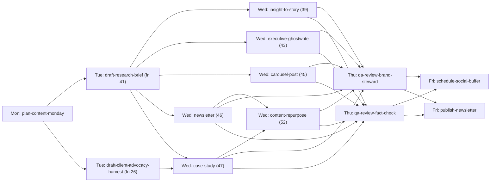

# 03 — User Journeys

*Every flow that exists in code. Flows that a typical SaaS would have but
this platform does not are listed at the end — because their absence is
itself a finding.*

---

## Journey inventory

| # | Journey | Actor | Exists? |
|---|---|---|---|
| J1 | Daily signal loop (ingest → brief → QA → approval) | System | ✅ L4 proven live |
| J2 | Weekly content studio (Mon–Fri) | System | ⚠️ L2 — DAG defined, 8 of 9 stages pass-through |
| J3 | Nightly analytics ingestion | System | ✅ L3 deployed |
| J4 | Human approval of a publish | Approver | ✅ L4 |
| J5 | Operator monitors a run | Operator | ✅ L3 (partly mock data) |
| J6 | Operator pulls the emergency stop | Operator | ✅ L3 |
| J7 | Agent inspects run state programmatically | Agent | ✅ L4 |
| J8 | Author/change a function definition | Engineer | ✅ L2 |
| J9 | Deploy a change | Engineer | ✅ L4 |
| J10 | Knowledge ingestion | System | ✅ L4 (narrow) |
| J11 | Retention expiry / erasure | System | ✅ L3 |
| J12 | Bootstrap console authentication | Admin | ✅ manual runbook |
| — | Registration / sign-up | — | ❌ does not exist |
| — | Tenant onboarding | — | ❌ does not exist |
| — | Project creation by a user | — | ❌ does not exist |
| — | Conversational agent chat | — | ❌ does not exist |
| — | Campaign creation by a user | — | ❌ does not exist |

---

## J1 — The daily signal loop (the flagship journey)

```mermaid
sequenceDiagram
  autonumber
  participant LA as Logic App 06:00 SAST
  participant EV as SB event queue
  participant W as orchestrator worker
  participant DB as task_state
  participant TQ as SB task queue
  participant H as dispatch handler
  participant MW as mcp-web
  participant MG as model-gateway
  participant V as Vault
  participant GK as Gatekeeper
  participant T as Teams / inbox

  LA->>EV: HeartbeatEvent{loop_id: daily-signal-loop}
  W->>EV: receive(max_count=10)
  W->>W: _event_message_kind → "heartbeat"
  W->>W: decompose(loop, heartbeat) — uuid5 task ids
  W->>DB: insert_task_batch (deps empty → dispatchable, else pending)
  loop every task
    W->>TQ: publish TaskEnvelope (metadata only)
  end
  W->>TQ: receive
  W->>H: dispatch_task(envelope)
  alt state != dispatchable
    H-->>W: TaskNotReadyError → requeue (bounded 20)
  else dependency dead_lettered or failed
    H-->>W: DependencyDeadLetteredError → cascade dead-letter now
  end
  Note over H: task_type = ingest-signals
  H->>MW: fetch_url × 4 (allowlisted domains)
  H->>V: get_or_create_campaign, create_agent_run(running)
  H->>MG: complete(claude-haiku, prompt 09, content_class=public_source_content)
  MG-->>H: JSON signal batch + cost_id
  H->>V: create_signal, update_agent_run(succeeded)
  H->>DB: set_result_ref{vault_signal_id,...}; COMPLETED; advance_dependents
  Note over H: task_type = draft-brief (2 hops back via lineage)
  H->>V: get_signal → _render_brief (NO LLM call)
  H->>V: create_brief ×2 (full + executive edition)
  H->>T: notify_brief_ready (flag-gated)
  Note over H: task_type = qa-review
  H->>V: get_brief → draft_text
  H->>MG: complete(claude-sonnet, prompt 02, channel="internal-brief")
  MG-->>H: {"pass":bool,"violations":[...]}
  alt pass = false
    H->>DB: FAILED / reason=qa_blocked — advance_dependents NEVER called
  else pass = true
    H->>DB: COMPLETED; advance_dependents
  end
  Note over H: task_type = request-approval (proof circuit)
  H->>GK: POST /gate-check(publish.social_post, publish, content_hash, [LOOP-PROOF] title)
  GK->>GK: kill switch → level lookup → escalate
  GK->>T: Adaptive Card / inbox row
  GK-->>H: decision_id, approve_url, reject_url
  H->>DB: COMPLETED — never waits for the human
```

**Key journey properties visible in the code:**

- The loop DAG has **24 tasks**: the original 5-stage chain, an 11-way
  intelligence fan-out off `ingest`, a dedupe join, response strategising,
  two brief-rollup nodes, and a 3-task S8 proof circuit.
- Of those 24, **exactly 4 task types do real work** (`ingest-signals`,
  `draft-brief`, `qa-review`, `draft-content`, `request-approval` — 5
  handlers). The 11 fan-out scanners, the dedupe, the strategist and both
  rollups all hit `legacy_task_pass_through`: RUNNING → COMPLETED, no work.
- `request-approval` **completes as soon as `/gate-check` responds**. It
  never polls. The human decision arrives asynchronously and is discovered
  later via `GET /runs/{task_ref}` → Gatekeeper `/approval-status`.
- `draft-brief` performs **no LLM call** — it is deterministic rendering
  (`_render_brief`), and cites sources by **domain only**, never the bare
  URL, so that function 02's customer-facing link rules don't fire on an
  internal citation.

### The S8 "Proof Circuit" — a genuinely interesting pattern

Three tasks in the daily loop carry `params.proof_circuit: true`, which
`worker._task_metadata` promotes onto the envelope's `metadata` bag. Every
handler that sees it tags its Vault `agent_run` with
`agent_name = "loop-proof-circuit"` and stamps the approval card's
`preview_title` / `preview_reference` with `[LOOP-PROOF]`.

The payoff: `services/publisher/app/vault_lookup.py` resolves an
`asset_id` → `agent_run.agent_name`, and if it equals
`AGENT_NAME_LOOP_PROOF`, publishing is **forced dry-run regardless of
`PUBLISHER_DRY_RUN`**. The two services share no library, so the constant is
duplicated — and a test in *each* service asserts they stay equal.

**This is an end-to-end production smoke test that exercises the real path,
against the real platform, with a structural guarantee that it can never
actually publish.** That is a genuinely strong safety pattern, and it has a
name in the industry: a *canary transaction with a poison pill*.

---

## J2 — The weekly content studio

`services/orchestrator/loops/weekly-content-loop.yaml` — a Mon–Fri DAG:



**Dual-verdict gating** is the notable design: Friday's two publishing tasks
both `depends_on` *both* Thursday verdicts. Nothing ships unless Brand
Steward QA **and** a fact-check verdict both pass.

**Reality check:** none of these 15 task_types is in `DISPATCH_TABLE`. Every
one falls through to `legacy_task_pass_through`. The DAG, the dependency
semantics, the day-prefixed task ids, the Buffer channel ids and the
weekly cap (`buffer_weekly_post_cap: 8`, below Buffer Free's 10) are all
real and validated — **but no content is produced.** The weekly loop is a
fully-specified, correctly-gated, currently-empty pipeline.

---

## J3 — Nightly analytics ingestion

`caj-analytics-nightly-ingest`, cron `0 1 * * *` UTC = 03:00 SAST, running
`python -m analytics_ingest.cli nightly --day <yesterday>`:

1. Ingest Buffer (live if `BUFFER_API_KEY`), GA4, Search Console, LinkedIn
   (fixtures)
2. For every row with a `utm_campaign`, `reconcile_utm()` against
   `utm_campaign_map`; unmatched/malformed → `utm_quarantine` with a reason
3. Four rollups: engagement-by-archetype, publishing reliability,
   **cost per accepted asset**, Vault utilisation
4. `export_fabric_day()` — assemble, validate against
   `analytics/contracts/fabric-nightly-export.schema.json`, upload to
   `analytics-fabric-export` blob
5. Microsoft Fabric picks it up via shortcut; Power BI reads the starter
   dataset

Note the division-by-zero discipline: every rollup **skips** rather than
writes a zero — channels with `scheduled_count = 0`, archetypes with
`SUM(impressions) = 0` (via `HAVING`), agents with 0 approved assets.

---

## J4 — Human approval

```mermaid
sequenceDiagram
  participant O as orchestrator
  participant GK as ca-gatekeeper (internal)
  participant DB as governance schema
  participant TM as Teams Workflows
  participant HU as Approver (browser)
  participant GKA as ca-gatekeeper-approval (external, Easy Auth)

  O->>GK: POST /gate-check
  GK->>DB: SELECT kill_switches WHERE active (uncached)
  GK->>GK: policy.level_for(function_id, action_class) → 1
  GK->>DB: SELECT latest_approved(...) → none
  GK->>DB: INSERT gate_decisions(escalated, level_1_requires_approval)
  GK->>DB: INSERT approval_inbox(pending, link_token=token_urlsafe(32), expires_at=+24h)
  alt TEAMS_WEBHOOK_URL configured
    GK->>TM: POST Adaptive Card (Action.OpenUrl ×2)
  else
    Note over GK: the inbox row IS the delivery
  end
  GK-->>O: decision_id, approve_url, reject_url, approval_expires_at

  HU->>GKA: GET /approval-action/{token}?choice=approve
  GKA->>GKA: Easy Auth injects X-MS-CLIENT-PRINCIPAL-*
  GKA->>GKA: principal_from_headers() — else 401
  GKA->>DB: SELECT by link_token
  alt already consumed
    GKA->>DB: INSERT approval_actions(link_already_used) → 409
  else expired
    GKA->>DB: UPDATE status='expired'; INSERT approval_actions(link_expired) → 410
  end
  GKA->>DB: UPDATE ... SET status, decided_by=principal WHERE link_consumed_at IS NULL
  GKA->>DB: INSERT gate_decisions(approved, decided_by=principal)
  GKA->>DB: UPDATE approval_inbox SET gate_decision_id
  GKA->>DB: INSERT approval_actions(approved)
  GKA-->>HU: {outcome, reason, approval_id, decision_id, decided_by}

  Note over O,GK: on the NEXT /gate-check for the same<br/>(agent_run_id, function_id, content_hash),<br/>latest_approved() finds it → gate token issued
```

**Three properties an auditor would care about, all enforced in code:**

1. **Possession ≠ identity.** The link carries only an opaque token. The
   recorded approver is the Easy-Auth principal *on this request*. There is
   no module-level state in `auth.py` — every helper takes headers as an
   argument, so an identity can never be cached between requests.
2. **Single use is atomic.** `UPDATE ... AND link_consumed_at IS NULL` —
   two concurrent clicks cannot both win.
3. **All four outcomes are audited**, including the two failure modes.

---

## J5 — Operator monitors a run

Landing at `/` redirects to `/tasks`. From there: `/tasks/{task_ref}/trace`
runs a KQL query against App Insights, but only after `task_ref` matches
`^[A-Za-z0-9][A-Za-z0-9_-]{0,127}$` — an invalid ref is a **400**, not an
empty render (RISK-001, injection defence). Any *other* App Insights failure
degrades to the empty state with a `query_failed` flag rather than a 500.

The exact same KQL is published in `console/README.md` so an agent can
bypass the console entirely and query App Insights directly.

---

## J6 — Emergency stop

```
POST /kill-switch/toggle  {"active": true, "reason": "incident"}
```

Requires an authenticated principal (401 otherwise). The operator identity is
read from Easy Auth headers and recorded. Form submissions additionally pass
an Origin/Referer same-origin check and get a 303 redirect (POST-redirect-GET);
JSON callers get the state back directly.

**Propagation is sub-5s by construction**, not by cache expiry: both
`gatekeeper/app/kill_switch.py` and `publisher/app/kill_switch.py` issue a
fresh SELECT on every single decision. The rationale is documented at length:
*"a cache with any TTL above zero would make the 5s bound a function of cache
expiry rather than of the operator's action."*

**Current limitation**: the console's Gatekeeper client is in `mock` mode, so
this toggle currently writes to a fixture, not to `governance.kill_switches`.

---

## J7 — Agent inspects run state

```
GET /runs/{task_ref}
→ { task_ref, stage_count, stages[{task_id, task_type, state, result_ref}],
    span_presence: present|absent|not_checked,
    approval_decision_status: {status, decided_by, decided_at} }
```

This endpoint exists because of a subtle truth: **the `request-approval`
task's own state says nothing about whether a human approved.** It is
COMPLETED the moment the gate-check responds. So `run_state.py` walks the
lineage backwards, finds the `request-approval` stage, pulls
`agent_run_id`/`function_id`/`content_hash` off its `result_ref`, and asks
Gatekeeper `/approval-status` for the *real* decision. A Gatekeeper outage
degrades to `{"status": "unknown"}` rather than failing the whole response.

---

## J8 — Author or change a function definition

```
1. Copy contracts/function-definition/TEMPLATE/ → functions/NN-name/
2. Write prompt.md — MUST contain "Return a single JSON object"
3. Write skill.md (purpose / when to invoke / when NOT to invoke)
4. Write tools.yaml → validated against contracts/function-definition/tools.schema.json
5. Write schema.json with a /vN/ segment in $id
6. Write ≥5 golden eval tasks in evals/
7. python services/registry/validate_package.py --all
8. python services/registry/eval_harness.py --all
9. python services/registry/safety_suite.py --dir <package>
10. python services/registry/lint_rubrics.py --all
11. python services/registry/build_registry.py --out dist/ --sign
```

To make it *actually run*, three more things are required and are not
automated: add the `task_type` to a loop YAML, add a handler to
`DISPATCH_TABLE`, and add the package path to the orchestrator Dockerfile's
staging step. That three-step manual gap is why 20 of 23 packages are inert.

---

## J9 — Deploy

Push to `main` → `ci.yml` (7 jobs) → `*-image.yml` builds and pushes to the
shared ACR via OIDC → `deploy-infra.yml` runs `az deployment group create`
against `main.bicep` → **a human approves the `cmos-dev` GitHub Environment
gate** → app-specific deploy workflows → `deploy-loop-e2e-smoke.yml` starts
`caj-loop-e2e-smoke`, which injects a synthetic heartbeat and polls
`/status` for the predicted task ids.

The smoke test's success criterion was itself amended
(`F-SMOKE-GREEN-REDEFINITION`): **a legitimate `QA_BLOCKED` verdict counts as
proof of life**, because reaching a real QA verdict means the whole chain
worked. That is an unusually mature definition of "green".

---

## J10 — Knowledge ingestion

The only ingestion path: `ingest_signals_handler` → mcp-web `fetch_url` over
4 allowlisted URLs → bodies truncated to 2,000 chars each → assembled into a
prompt → sent to Claude Haiku → structured signals written to Vault.

The **redaction-fallback** deserves a mention as a journey in itself: real
news prose routinely trips the `full-name-like` pattern (any two consecutive
Title-Case words). Rather than failing, `_complete_ingest_with_redaction_fallback`
drops one source at a time and retries until a request clears — degrading
signal *completeness* instead of dead-lettering the task. And the firewall's
ruling is always authoritative; the fallback never second-guesses it.

---

## J11 — Retention expiry / erasure

Triggerable two ways, one implementation: `POST /retention-expiry-runs` or
`caj-vault-retention-expiry` running `python -m vault.retention`. Sweeps
expired rows, deletes the object, dedup-safely deletes the blob, writes one
audit row per deletion, and **fails closed** if the blob delete errors —
leaving the row eligible for retry with a `retention_deletion_failed` audit
event rather than recording a deletion that didn't happen.

`legal_hold` never expires (year-9999 sentinel, so the NOT NULL constraint
holds uniformly).

**This is the closest thing to a POPIA erasure mechanism in the platform.**
There is no subject-initiated erasure request flow, no data-subject access
request handler, and no export-my-data endpoint.

---

## What does not exist — and why that matters

| Absent flow | Consequence |
|---|---|
| **Registration / sign-up** | Not a SaaS. Users are provisioned by an Entra admin (`docs/console-auth-runbook.md`, `scripts/bootstrap-console-auth.sh`) |
| **Tenant / organisation model** | **Single-tenant, single-company.** No `tenant_id` anywhere in any schema. Every multi-tenant assumption a buyer would make is false today |
| **User-initiated project or campaign creation** | Campaigns are created *by handlers* via `get_or_create_campaign(f"run-{campaign_id}")`. A human cannot create one |
| **Conversational agent interaction** | No chat, no threads, no session memory. Agents are batch functions in a DAG |
| **Content editing / revision UI** | Assets are versioned in the schema (`version`, `predecessor_asset_id`) but nothing writes a v2 or renders a diff |
| **Role-based access control** | Any authenticated tenant user reaches the kill switch. Documented accepted risk; mitigated only by an Entra "Assignment required" Portal setting |
| **Notification preferences / digests** | One webhook URL, globally |
| **Onboarding / configuration wizard** | All configuration is YAML in git, deployed by pipeline |
