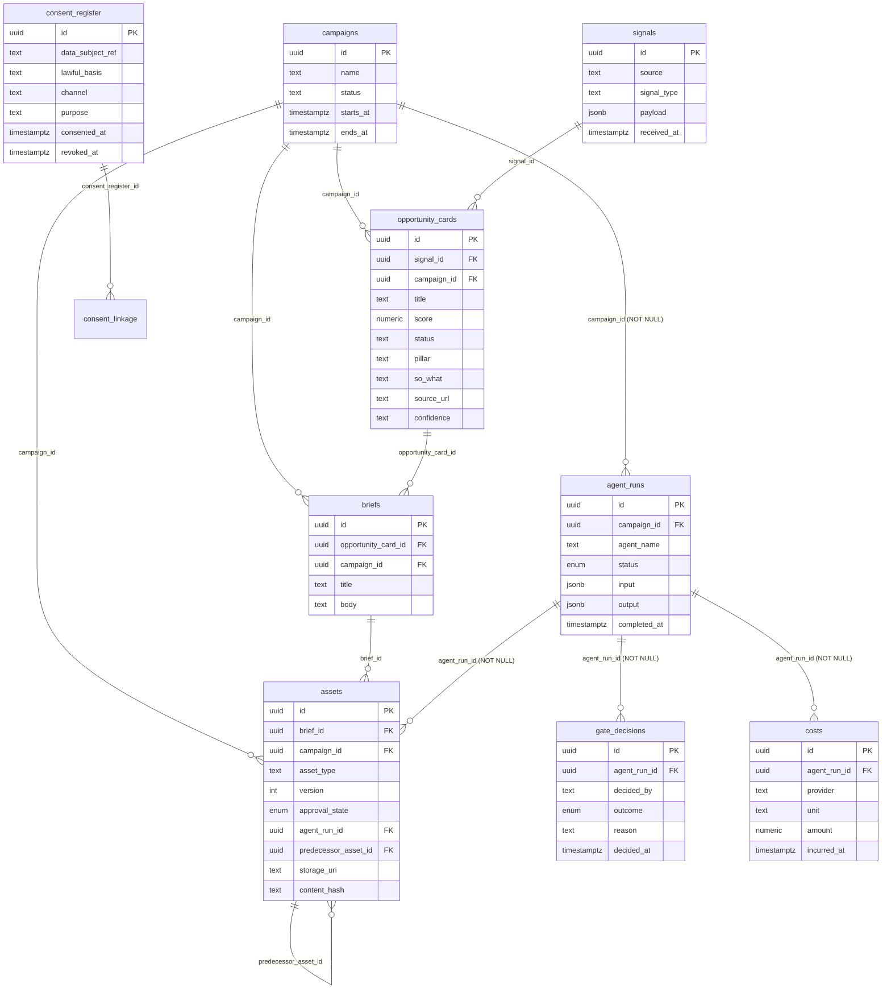
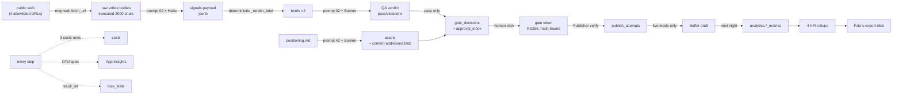

# 04 — Data Model

*Every entity, from DDL. Five schemas in one Postgres 16 instance, owned by
four different services.*

---

## 1. Entity-relationship overview



## 2. The nine core Vault entities (`public`, frozen)

Source: `contracts/vault-schema/schema.sql`, hash-pinned in
`contracts/.frozen-v1.sha256`.

### 2.1 `campaigns` — top of the roll-up chain
The aggregate root. Everything financial rolls up here. In practice campaigns
are auto-created by handlers as `run-{envelope.campaign_id}` where
`campaign_id = uuid5(heartbeat.event_id, f"campaign:{loop_id}")` — so **one
campaign per loop per heartbeat**, not a marketing campaign in the business
sense. **[INFERRED]** The entity is named for a future state it does not yet
serve.

### 2.2 `signals` — raw inbound market signal
`payload jsonb` holds function 09's whole structured output. Immutable in
practice (patchable but nothing patches it).

### 2.3 `opportunity_cards` — scored opportunities
Written by `score_signals_handler`, one row per signal in the day's batch,
ranked highest-score-first. `score` is function 09's own `confidence`
mapped to a number and multiplied by that pillar's weight, under the policy
in `functions/_shared/scoring-policy.yaml`.

`pillar`, `so_what`, `source_url` and `confidence` were added after the v1
schema froze — additive, nullable, with the frozen baseline refreshed
deliberately for that one file. Before them a card carried a headline and a
number, which meant it could be listed but not *used*: a reader had no
source to check the claim against, and the weekly planner had to re-derive
every score from raw signal payloads because the field it selects on was
not on the card. Cards written before that change carry NULL in all four
and are skipped by readers rather than guessed at.

### 2.4 `briefs` — creative/marketing briefs
Written by `draft_brief_handler`, twice per run (a full brief and an
"Executive Edition"). `opportunity_card_id` names the batch's **lead card** — the
highest-scored signal, the one the brief leads with. A brief covers the
whole batch, so no single id is the complete truth; the lead card is what a
one-column FK can honestly record. A brief drafted with no scoring ancestor
still leaves it NULL.

### 2.5 `agent_runs` — **the central entity of the whole data model**
Every model invocation is an `agent_run`. It is the join point for:
- cost attribution (`costs.agent_run_id`, NOT NULL)
- governance (`gate_decisions.agent_run_id`, NOT NULL)
- authorship/approval of artefacts (`assets.agent_run_id`, NOT NULL)
- budget enforcement (`budget.py` resolves `agent_run_id → agent_name`)
- the proof-circuit dry-run forcing (`agent_name == "loop-proof-circuit"`)

`status` is an enum: `pending | running | succeeded | failed | cancelled`.
Handlers create it `running`, then update to `succeeded`/`failed` with the
output payload.

**If you want to understand this platform's data model in one sentence:
`agent_runs` is the ledger of AI labour, and everything else hangs off it.**

### 2.6 `assets` — versioned, approvable artefacts
Four things make this table unusually well-designed:
- `version integer` + `predecessor_asset_id` self-FK with a
  `CHECK (predecessor_asset_id IS DISTINCT FROM id)` — an asset chain is
  reconstructable
- `approval_state` enum: `draft | pending_review | approved | rejected | superseded`
- `content_hash` — the sha256 that binds into gate tokens
- `storage_uri` — points at the content-addressed blob

**How to answer "which gate decision approved this asset version?"** There is
no direct FK. The schema documents the join convention inline:
```sql
SELECT gd.* FROM gate_decisions gd
WHERE gd.agent_run_id = <assets.agent_run_id>
ORDER BY gd.decided_at DESC LIMIT 1;
```
Because `gate_decisions` is append-only, the latest `decided_at` for that
`agent_run_id` *is* the authoritative outcome. This is a deliberate design
note in the DDL, not an accident.

### 2.7 `gate_decisions` — append-only governance ledger
**Has no `updated_at` column, deliberately, "to discourage in-place mutation
of a recorded decision."** A re-decision is a new row.

Written by three distinct deciders, namespaced by convention:
| `decided_by` | Written by |
|---|---|
| `gatekeeper:policy` | Autonomy policy evaluation |
| `gatekeeper:kill-switch` | Kill switch block |
| `<name> (<oid>)` | A human via Easy Auth |
| `system:model-gateway:redaction-firewall` | PII block |
| `system:model-gateway:budget-gate` | Budget hard breach |

**This table is the platform's single most important audit artefact.** It is
the one place where "an AI wanted to do something and here is what was
decided, by whom, and why" is recorded — for both human and machine
deciders, in the same shape.

### 2.8 `costs` — three rows per completion
`unit` is free text, which is what lets one schema carry three signals
without a migration: `usd`, `tokens`, `ms`
(`services/model-gateway/metering.py`). The unbroken FK chain
`costs → agent_runs → campaigns` is called out explicitly in the DDL as the
per-campaign roll-up path.

### 2.9 `consent_register` — POPIA-shaped
Three design decisions are called out in the DDL comments and matter legally:
- `lawful_basis text NOT NULL` — **a real value, not a boolean.** POPIA s11
  recognises consent as *one* of several lawful bases; a boolean would model
  only consent.
- `channel` + `purpose` columns — **not a single global opt-in flag.**
  Consent is per-channel, per-purpose.
- `revoked_at` distinct from `consented_at` — revocation is its own event,
  not a mutation of the grant.
- `UNIQUE (data_subject_ref, channel, purpose, consented_at)` — repeated
  grants over time are all preserved.

---

## 3. `vault_internal` — the governance sidecar (7 tables)

Exists because the public schema is frozen. Every table is keyed by
`(object_table, object_id)` — a **polymorphic association**, uniformly
applied to all 9 object types.

| Table | Purpose | Key constraint |
|---|---|---|
| `object_taxonomy` | The 6 mandatory taxonomy fields for every object | `UNIQUE(object_table, object_id)`; `campaign_id` carries a real FK to `public.campaigns` |
| `consent_linkage` | Binds a client-derived object to the exact consent row that authorised it | `UNIQUE(object_table, object_id)` |
| `audit_log` | Every taxonomy rejection, consent rejection, retention deletion | indexed on event_type, object, correlation_id |
| `retention_policy` | `retention_class → expires_at`, with `deleted_at` | partial index `WHERE deleted_at IS NULL` |
| `retention_run` | Sweep bookkeeping | — |
| `access_log` | One row per object GET, keyed by `X-Caller-Service` | 90-day self-purge |
| `utilisation_daily` | Daily rollup of access_log | `UNIQUE(day, object_table, caller_service)` |

**The taxonomy is the governance metamodel.** Six fields, mandatory, immutable
after create:

| Field | Domain | Enforced by |
|---|---|---|
| `vertical` | free text | presence only |
| `function_id` | free text | presence only |
| `campaign` | uuid, FK to `campaigns` | uuid parse + FK |
| `evidence_grade` | `A \| B \| C \| D \| unverified` | closed set |
| `consent_status` | `granted \| revoked \| not_required \| pending` | closed set |
| `retention_class` | `ephemeral_30d \| standard_1y \| extended_3y \| legal_hold` | closed set |

`evidence_grade` is the most interesting of the six: it means **every object
in the system carries a claim about how well-evidenced it is.** That maps
directly to `positioning.md`'s "proof over platitude" rule. The data model
encodes the brand policy.

---

## 4. `governance` — the control plane (6 tables)

| Table | Owner | Lifecycle |
|---|---|---|
| `kill_switches` | Gatekeeper + Publisher (read) | mutable `active` flag; CHECK ensures `scope='global' ⇒ function_id IS NULL` and vice versa |
| `approval_inbox` | Gatekeeper | `pending → approved\|rejected\|expired`; `link_consumed_at` is the single-use latch |
| `approval_actions` | Gatekeeper | append-only, 4 CHECK-constrained outcomes |
| `publish_attempts` | Publisher | append-only, `published\|rejected` + reason |
| `jti_ledger` | Publisher | `jti` **is** the primary key — the PK is the enforcement mechanism |
| `schema_migrations` | migration job | — |

**Zero dollar signs in this migration file, deliberately** — constrained
domains are CHECK constraints over `text`, never `CREATE TYPE`, because
`CREATE TYPE` needs a `DO $$ ... $$` block and Container Apps collapses `$$`
to `$` in secret values.

---

## 5. Orchestrator tables (`public`, additive)

```
task_state(task_id PK, loop_id, task_type, state, retry_count,
           depends_on jsonb, vault_write_failed_count, result_ref jsonb,
           created_at, updated_at)

task_transitions(id PK, task_id FK, from_state, to_state,
                 reason CHECK IN (10 values), occurred_at)
```

**Two defence-in-depth mechanisms in one place:** `reason` is a closed
`TransitionReason` enum in Python *and* a CHECK constraint in Postgres. The
history of that constraint is instructive — migrations 0003 and 0004 both had
to be rewritten to `ADD CONSTRAINT ... NOT VALID` because the migration script
re-applies all four files on *every* deploy, so a later migration's wider
vocabulary broke an earlier migration's re-validation.

The ten reasons:
`created`, `dependency_satisfied`, `dispatched`, `completed`,
`failed_attempt_1`, `failed_attempt_2`, `dead_lettered`,
`dependency_dead_lettered`, `vault_write_failed`, `qa_blocked`.

Each of those last three encodes a distinct business meaning:
- `dead_lettered` — "we tried three times and gave up"
- `dependency_dead_lettered` — "we never tried; it was already impossible"
- `qa_blocked` — "a normal business verdict said no" (not a failure)

**`result_ref` is the platform's inter-task memory.** It is deliberately a
*small structured pointer*, never content: `{vault_signal_id, brief_id,
content_hash, agent_run_id, campaign_id, decision_id, ...}`. A downstream
handler resolves what to do by reading its predecessor's `result_ref` off the
lineage — never by re-deriving or guessing.

---

## 5b. Options inbox (`public`, additive v2 — the ratification model)

Three tables, not in the frozen file — additive v2 (`services/vault/migrations/0002_options_inbox_init.sql`,
`0003`), each mirroring its own contract (`contracts/option-card.schema.json`, etc.) rather than a fourth copy of one.

| Table | Owner | Lifecycle |
|---|---|---|
| `option_cards` | option-card-emitting orchestrator handlers | a machine-generated menu of choices awaiting one human ratification; `expires_at`-bound |
| `approval_decisions` | Gatekeeper's `GET /decide` | **one row per card** (`UNIQUE(card_id)`) — single-use, not append-only, unlike `gate_decisions` |
| `standing_permissions` | a human ratifying a standing-permission card | durable "always allow this class" grant, with a `review_by` date |

This is the newer, general-purpose sibling to `governance.approval_inbox` /
`gate_decisions` — introduced for the Appendix D function set, not a
replacement. The two mechanisms currently coexist.

---

## 6. `analytics` — the measurement schema (11 tables)

4 raw fact tables (`buffer_post_metrics`, `ga4_metrics`,
`search_console_metrics`, `linkedin_metrics`), each
`UNIQUE(source, day, natural_row_id)`; `utm_campaign_map` +
`utm_quarantine`; `scheduled_posts` (the reliability denominator); and 4
`kpi_rollup_*` tables.

**analytics-ingest never connects to the Vault's database directly** — it
reads Vault exclusively over REST (`C-VAULT-TABLES`). That is a real
architectural boundary, not a convention.

---

## 6b. `mcp_ops` — tool-call logging (1 table)

`mcp_ops.tool_calls` — one row per real call through any MCP server's shared
logging wrapper: server, tool, caller identity, latency, outcome. Arguments
are never stored, only a SHA-256 hash of their canonical-JSON form
(POPIA-safe by construction). Owns no FK into `public` — tool-call logging
is deliberately not campaign-scoped.

---

## 7. Ownership and lifecycle

| Entity | Created by | Mutated by | Deleted by | Terminal states |
|---|---|---|---|---|
| `campaigns` | dispatch handlers (`get_or_create_campaign`) | Vault PATCH | retention sweep | — |
| `signals` | `ingest_signals_handler` | — | retention sweep | — |
| `opportunity_cards` | `score_signals_handler` | Vault PATCH | retention sweep | — |
| `briefs` | `draft_brief_handler` | — | retention sweep | — |
| `agent_runs` | every handler | handler on completion | retention sweep | succeeded / failed / cancelled |
| `assets` | `draft_content_handler` | Vault PATCH (approval_state) | retention sweep (+ blob) | approved / rejected / superseded |
| `gate_decisions` | Gatekeeper ×3 paths, model-gateway ×2 paths | **never** | never | append-only |
| `costs` | model-gateway metering | **never** | never | append-only |
| `consent_register` | manual / API | PATCH `revoked_at` only | never | revoked |
| `task_state` | `insert_task_batch` | `transition`, `set_result_ref` | never | completed / dead_lettered / failed |
| `approval_inbox` | `/gate-check` level 1–2 | `consume_link` once | never | approved / rejected / expired |
| `jti_ledger` | Publisher | **never** (PK insert only) | never | consumed |

## 8. How information flows through the system



**Three information-flow invariants, each enforced structurally:**

1. **Content is never on the wire between components.** Queues carry ids
   (`contracts/service-bus/spec.md`). `result_ref` carries ids
   (`0002_task_result_ref.sql` header). Spans carry ≤200-char enum-keyed
   values (`telemetry_lib/attributes.py`). Content lives in the Vault and is
   fetched by id.

2. **PII cannot reach a provider un-scanned.** The redaction firewall is step
   3 of the gateway's own pipeline, before any adapter call, and it scans the
   `tools[]` passthrough too — because *"client-identifying data smuggled
   into a tool definition would bypass a messages-only scanner entirely."*

3. **Every rejection produces a durable audit row on an isolated
   connection.** `write_audit_isolated()` exists precisely because the
   rejection path raises and rolls back its own transaction — a shared
   connection would roll back the audit row along with it, "silently losing
   the very audit trail the rejection is supposed to produce."

## 9. Data-model gaps worth naming

| Gap | Impact |
|---|---|
| **No `tenant_id` / `organisation_id` anywhere** | Single-tenant by construction. Multi-tenancy is a schema-wide change, not a feature |
| No FK `assets ↔ gate_decisions` | Resolvable only by the documented join convention; a direct FK would be safer |
| No `users` / `roles` / `permissions` tables | Identity is entirely delegated to Entra; there is no in-app authorisation model. `standing_permissions` (§5b) grants action-classes, not users — it doesn't close this gap |
| `publish_attempts.agent_run_id` has no FK | It is in a different schema from `agent_runs`; referential integrity is by convention |
| Publisher's Vault "publish record" is a stub | The publication event is recorded in `publish_attempts` but never in the Vault |
| No campaign→brief→asset lineage query API | Reconstructable by hand; not exposed |

## 10. Table catalogue — operator function, user journey, writers, readers

Every table, why it exists in plain terms, and the read/write edges that
justify it. Short by design — §§2–6b above give the full detail for anything
that needs it. "Written by" is the only writer(s); "Read by" excludes the
writer reading its own row back.

### `public` — frozen core (9)

| Table | Exists for | Written by | Read by |
|---|---|---|---|
| `campaigns` | Groups everything under one run, so cost rolls up per campaign | Vault API (`get_or_create_campaign`, called by every handler) | cost/asset roll-ups, console |
| `signals` | The record of what the market scan noticed | `ingest-signals` + the 11 scanner handlers | `score-signals`, `draft-brief`'s lineage walk |
| `opportunity_cards` | Scored, ranked signals — "what's worth acting on today" | `score-signals`, `dedupe-signal-cards` | Monday planning (evidence-led pillar pick), morning-brief rollup, console |
| `briefs` | The narrative artefact an operator actually reads | `draft-brief`, `draft-research-brief`, both brief-rollup handlers | QA handlers, drafting handlers, console, Teams brief card |
| `agent_runs` | One row per agent/tool call — the audit spine everything else hangs off | every handler (`create_agent_run`/`update_agent_run`) | budget check, cost join, gate-token issuance (approving identity), console trace |
| `assets` | Versioned content — drafts through to published copy | every drafting handler; QA retry loop (new version per regen) | QA handlers, Publisher (hash cross-check), console |
| `gate_decisions` | Append-only ledger of every allow/deny ruling | **two writers**: Gatekeeper (policy/approval) and Model Gateway (redaction/budget) | Publisher (approval lookup), console, audit |
| `costs` | Three rows per model call — what this cost and how long it took | Model Gateway `metering.py` | budget check, analytics cost-per-asset KPI, console cost ledger |
| `consent_register` | POPIA lawful-basis record per subject/channel/purpose | Vault API, from an external consent-collection process | Vault's own consent gate, on every create carrying `data_subject_ref` |

### `public` — orchestrator, additive (2)

| Table | Exists for | Written by | Read by |
|---|---|---|---|
| `task_state` | The task graph's live state, and the `result_ref` bus one task hands the next | orchestrator only | orchestrator, console task list |
| `task_transitions` | Append-only "what happened to this task, in order" | orchestrator `state_machine.py` | console trace/detail, an operator debugging a stuck loop |

### `public` — options inbox / ratification model, additive v2 (3)

| Table | Exists for | Written by | Read by |
|---|---|---|---|
| `option_cards` | A menu of choices put to a human for one ratification decision | option-card-emitting handlers (Appendix D functions) | Gatekeeper `/decide`, Teams render, console options inbox |
| `approval_decisions` | The one decision made on one card — single-use, never re-decided | Gatekeeper `GET /decide` (Teams link or console form) | whatever executes the chosen option, audit |
| `standing_permissions` | A durable "always allow this" grant, so the same class of action isn't asked twice | a human ratifying a standing-permission card | option-card-emitting handlers, checking before they ask |

### `governance` (6)

| Table | Exists for | Written by | Read by |
|---|---|---|---|
| `kill_switches` | The emergency stop an operator can throw | Console kill-switch toggle | Gatekeeper + Publisher, uncached, on every decision |
| `approval_inbox` | Single-use, TTL-bound human approval link (the original gate-check flow) | Gatekeeper, on a level-1/2 escalation | the external approval-action app |
| `approval_actions` | Append-only record of every click — approved, rejected, expired, already-used | the approval-action app | audit, console |
| `publish_attempts` | Append-only, one row per Publisher call, including every refusal | Publisher | console, audit |
| `jti_ledger` | Stops a gate token being replayed — the PK enforces it | Publisher | Publisher only |
| `schema_migrations` | Migration bookkeeping | the governance migration job | — |

### `vault_internal` — the sidecar the frozen schema can't carry (7)

| Table | Exists for | Written by | Read by |
|---|---|---|---|
| `object_taxonomy` | Vertical, evidence grade, consent status, retention class — fields the frozen file can't hold | Vault API, on every object create | Vault's own `fetch_object` join, the retention sweep |
| `consent_linkage` | Durably ties a client-derived object to the exact consent that permitted it | Vault's consent gate | audit, a POPIA data-subject request |
| `audit_log` | Rejection and deletion audit trail | Vault (consent rejection, retention deletion) | audit |
| `retention_policy` | This object's expiry date, by retention class | Vault API, on create | the retention sweep job |
| `retention_run` | One row per retention sweep — how many deleted, when | `vault/retention.py` | console, ops |
| `access_log` | One row per GET on an object — who read what, when | Vault's request middleware | the utilisation rollup |
| `utilisation_daily` | Daily rollup of `access_log` by object class | Vault `rollup.py` | `GET /utilisation/rollup`, the vault-utilisation KPI |

### `analytics` — the measurement schema (11)

| Table | Exists for | Written by | Read by |
|---|---|---|---|
| `buffer_post_metrics`, `ga4_metrics`, `search_console_metrics`, `linkedin_metrics` | Raw per-day performance facts, one table per channel | analytics-ingest's nightly per-source ingest | the 4 KPI rollups |
| `utm_campaign_map` | Registers a `utm_campaign` against a real Vault campaign/asset, so a post can be attributed | `publish-newsletter` (registers on send) | `reconcile_utm` |
| `utm_quarantine` | Rows whose `utm_campaign` didn't match the map — never silently dropped | `reconcile_utm` | ops investigating an attribution gap |
| `scheduled_posts` | How many posts were scheduled per channel/day — the reliability KPI's denominator | orchestrator `record_scheduled_post()` | `rollup_publishing_reliability` |
| `kpi_rollup_engagement_by_archetype`, `_publishing_reliability`, `_cost_per_accepted_asset`, `_vault_utilisation` | The 4 nightly headline numbers an operator actually reports | analytics-ingest `rollup.py` (upsert) | Fabric export, Power BI, the month-end report |

### `mcp_ops` (1)

| Table | Exists for | Written by | Read by |
|---|---|---|---|
| `tool_calls` | One row per real MCP tool call — never arguments, only their hash | every MCP server's shared logging wrapper | ops (rate/error investigation); no console reader exists yet |

**Reading the writer/reader columns as a journey, end to end:** a signal
(`signals`) becomes a scored opportunity (`opportunity_cards`), becomes a
brief (`briefs`), becomes drafted content (`assets`) tied to whoever wrote it
(`agent_runs`) and what it cost (`costs`); it clears review, and a human
either clicks an `approval_inbox` link or ratifies an `option_cards` card
(`approval_decisions` or `gate_decisions` records which); Publisher checks
`jti_ledger` and `kill_switches` and appends to `publish_attempts`; and only
once it is live does `analytics.*` pick it up, attributed through
`utm_campaign_map`, and feed the KPI a human reads next month. Every arrow in
that sentence is a table above.
