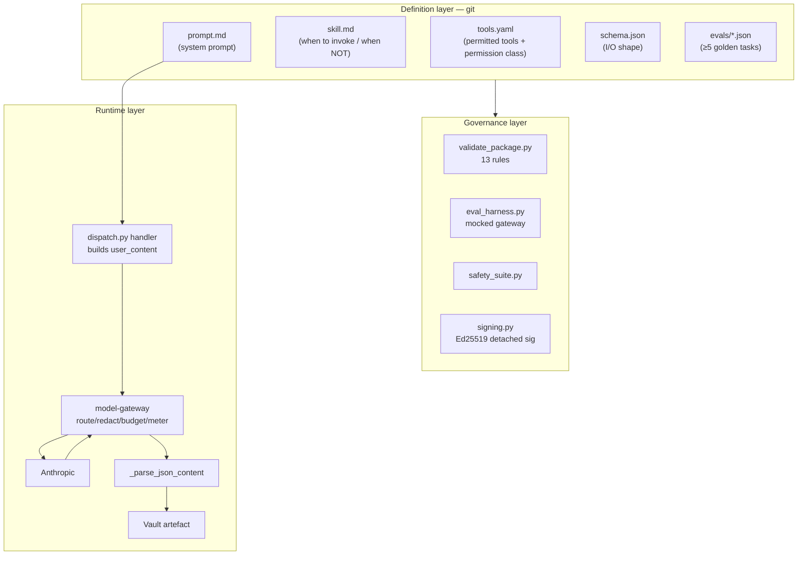
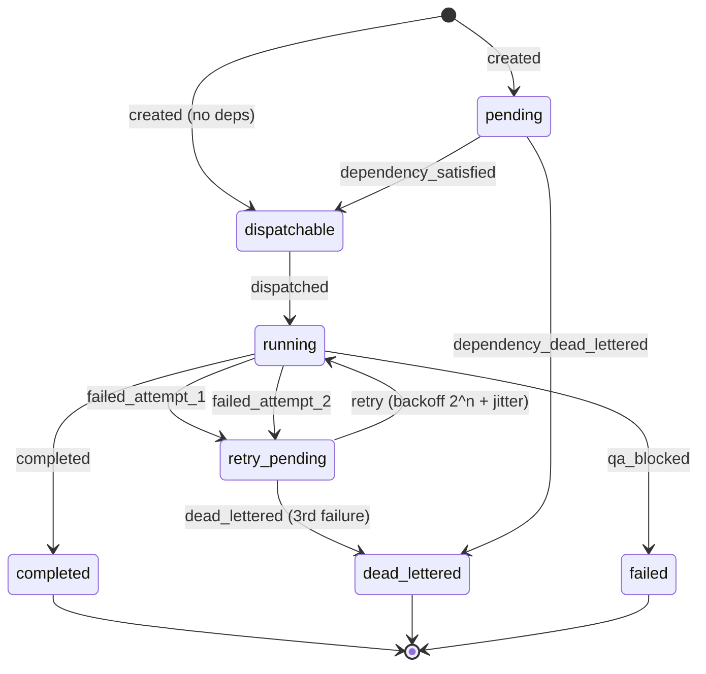

# 05 — AI Architecture

*Every AI capability in the platform, and — just as importantly — every AI
capability that is conventionally expected and is deliberately absent.*

---

## 1. The shape of the AI system

This is **not** an agentic framework in the LangChain/AutoGPT sense. There is
no planner, no ReAct loop, no tool-calling loop, no self-reflection, no
multi-turn conversation, and no vector store. What exists instead:

> **A deterministic DAG of single-shot, schema-constrained, prompt-versioned
> LLM invocations, each routed through one governed chokepoint, each
> producing a validated JSON artefact that becomes the next node's input by
> reference.**

That is a deliberate and defensible architecture. It trades agent autonomy
for *auditability, cost predictability and reproducibility*. Every decision
in the codebase is consistent with that trade.



## 2. Agents — what actually runs

Strictly speaking there are **five runtime agent behaviours**, invoked from
`DISPATCH_TABLE` (`services/orchestrator/orchestrator/dispatch.py`):

| task_type | Function package | Model tier | LLM call? | Produces |
|---|---|---|---|---|
| `ingest-signals` | 09 Market Intelligence Director | `claude-haiku` | ✅ | `signals` row + `agent_run` |
| `draft-brief` | `brief.compose` (no package) | — | ❌ **deterministic** | 2 × `briefs` |
| `qa-review` | 02 Brand Steward QA | `claude-sonnet` | ✅ | verdict → COMPLETED or FAILED/`qa_blocked` |
| `draft-content` | 42 LinkedIn Post Writer | `claude-sonnet` | ✅ | `assets` + blob |
| `request-approval` | — (`publish.social_post`) | — | ❌ | gate decision + approval card |

Everything else — 20 function packages, ~30 loop task_types — resolves to
`legacy_task_pass_through`, which transitions RUNNING → COMPLETED and does
nothing. **The gap between the designed agent estate (23) and the running
agent estate (3) is the platform's defining execution gap.**

Model tier assignment is meaningful, not arbitrary: extraction/triage work
(ingest) runs on Haiku; judgement work (QA) and generative work (drafting)
run on Sonnet; Opus is configured but currently unused by any handler.

## 3. Prompts

Prompts are **files in git**, one per function, with a rigid house style
visible across all 23:

1. **Role statement** — "You are the Brand Steward. You do not write
   marketing copy — you judge it."
2. **Output contract** — a literal JSON block, and the exact phrase *"Return
   a single JSON object and nothing else"*. This phrase is now
   **mechanically enforced** by `validate_package.py`'s
   `prompt-missing-json-output-contract` rule.
3. **Numbered hard rules** — each one corresponding to a violation code.
4. **Method / structure** — how to reason, not just what to output.

### The prompt-as-eval-oracle pattern

This is the most sophisticated idea in the AI layer, and it is easy to miss.
From `services/registry/README.md`:

> *"The mocked gateway is driven by each package's own `prompt.md`. A
> package's `tool_check.py` derives its simulated output from the rules
> stated in its prompt. Delete a rule from a prompt and the tasks grading
> that rule fail."*

And there is a permanent regression fixture proving it:
`services/registry/fixtures/regression/42-linkedin-post-writer-broken/` is a
copy of function 42 with the roof-line rule removed, and it **must fail by
task id**. Without that coupling, *"'evals passed' would only ever mean 'the
code still runs'."*

**Enterprise name for this:** prompt regression testing with a
behaviour-coupled oracle. Very few teams do this.

### Prompt injection surface

The prompts are *static, developer-authored, checked into git*. Dynamic
content only ever enters via the `user` role, as a JSON blob the handler
constructs. That property is load-bearing — it is the entire justification
for exempting `system`-role content from the redaction firewall
(see §7).

The one real injection vector is `ingest-signals`: fetched news article
bodies (2,000 chars each) go into the `user` message. **There is no prompt-
injection defence on that path** beyond the redaction firewall (which looks
for PII, not instructions). A malicious payload on `moneyweb.co.za` could
attempt to steer function 09's output. Mitigations that *do* exist: the
output is schema-constrained, the domain allowlist is tiny, and the
downstream QA gate is a separate model call.

## 4. Tools

Tool access is declared per function in `tools.yaml`, validated against
`contracts/function-definition/tools.schema.json`, with a coarse permission
class the orchestrator is meant to enforce:

```yaml
permissions: read-only | read-write | none
scope: <optional narrowing note>
```

**Honest finding: the `permissions` field is declarative documentation, not
an enforced runtime capability grant.** `dispatch.py` does not read
`tools.yaml` at all. The real enforcement is architectural — handlers only
call the clients they were written to call, and mcp-web/mcp-buffer/mcp-canva
enforce their own guardrails server-side (allowlist, draft-only,
template-locked). That is *defence by construction*, which is arguably
stronger, but it is not what the manifest implies.

The three real tool servers:

| Server | Tools | Server-side guardrail |
|---|---|---|
| mcp-web | `fetch_url` | host allowlist checked before any network call; sliding-window rate limit |
| mcp-buffer | `list_queue`, `get_post`, `create_draft` | `_CREATE_DRAFT_STATUS = "draft"` hardcoded; no status argument accepted; a test greps every tool name and description against `publish\|share.?now\|send.?now\|go.?live` |
| mcp-canva | `create_design_from_template`, `bulk_create_from_csv`, `export_design` | `template_id` required on both creation tools — no free-form design generation exists |

**The guardrail philosophy is "make the dangerous thing unrepresentable."**
mcp-buffer cannot publish because no publish tool exists in the manifest —
not because a flag is set to false.

## 5. Memory

| Layer | Store | Scope | How it is read |
|---|---|---|---|
| Inter-task | `task_state.result_ref` (jsonb) | one run | `resolve_lineage_result()` — BFS up `depends_on`, ≤6 hops, returns the first ancestor with a non-null `result_ref` |
| Artefact | Vault `public` + blobs | retention-bounded | by id, over REST |
| Strategic | `docs/positioning.md` | permanent | quoted **verbatim into prompt.md** at authoring time |
| Permission | `docs/permission-register.yaml` | permanent | read at runtime by `permission_check.py` |
| Engineering | `.compound/learnings/` | permanent | by humans/agents at design time |

**There is no vector database, no embedding model, no similarity search and
no retrieval-augmented generation anywhere in this repository.** Confirmed by
absence across all 344 Python files.

`resolve_lineage_result` deserves attention because it is doing the job a
memory system would do in a conventional agent framework:

> *"draft-brief's immediate predecessor is 'score', but the real content it
> needs lives 2 hops back at 'ingest'. qa-review's own two loop positions each
> have a result_ref-bearing IMMEDIATE predecessor, so this same walk resolves
> both in one hop for qa-review and two for draft-brief — one mechanism, no
> per-loop-position special casing."*

That is **content-addressed working memory over a DAG**, and it works without
any semantic layer because the DAG is deterministic.

## 6. Knowledge

Knowledge enters through one door and one door only: mcp-web's `fetch_url`
over four URLs across three domains
(`functions/09-market-intelligence-director/fetch_sources.yaml`), mirrored
into `MCP_WEB_ALLOWLIST` in `infra/main.bicep`.

`web_search` is declared in function 09's `tools.yaml` but **not implemented**
in mcp-web. The `fetch_sources.yaml` header documents the activation path:
add search results to the same `urls`-shaped evidence set, no code change.

Knowledge quality is governed by three mechanisms:
- `evidence_grade` on every Vault object (`A|B|C|D|unverified`)
- function 09's hard rules: ≥3 signals, ≥2 distinct domains, every signal
  carries an `https://` `source_url`, `confidence: low` for thin evidence
- the "proof over platitude" rule enforced by function 02's
  `unsupported-claim` violation code

## 7. Decision making — the redaction firewall as a case study

This is where the platform's AI-safety thinking is most visible, and it is
worth reading as a narrative, because the code preserves it.

**Original design:** scan every message role plus the `tools[]` payload
against four patterns from a frozen contract (name-shape, email, SA phone,
SA ID) plus exact-match fixtures.

**Incident 1 (2026-08-03, deploy-loop-e2e-smoke #19).** The `full-name-like`
pattern is *any two consecutive Title-Case words*. Functions 02/09/42's own
static `prompt.md` files trip it constantly — "Market Intelligence", "Brand
Steward", "South African", "Microsoft Fabric". Since the scanner covered
system role, **every LLM call the platform ever made was structurally
guaranteed to be blocked.** Fix: narrow to non-system roles, justified
because `system_prompt` is always `_read_prompt()`'s output — a static file
read — and because system role is the universal API convention for
developer instructions, never end-user content.

**Incident 2 (round 15).** Real news bodies trip the same pattern. The
per-source drop-and-retry fallback always exhausted to zero. Fix: an
explicit `content_class` request field mapping to a **reviewed, gateway-side
allowlist** of pattern ids to exempt:
```python
CONTENT_CLASS_PATTERN_EXEMPTIONS = {"public_source_content": frozenset({"full-name-like"})}
```
Note the design: the caller names a *content class*, not a pattern. It
"can only ever widen this file's own reviewed mapping, never let a caller
silently choose what to bypass."

**Incident 3 (rounds 17–19).** Two further call sites authorised, each as its
own named ruling with its own reasoning, recorded in the module docstring —
QA review of a rendered brief (same public news text, one hop later), and QA
review of a drafted LinkedIn post (static positioning.md content). Round 18
deliberately left the second un-exempted pending real evidence; round 19
found the assumption didn't hold and fixed it.

**What this demonstrates:** a security control that was *too strict to
function*, narrowed four times, with each narrowing scoped to one pattern and
one named content class, each recorded with its justification and its
authoriser, and never widened silently. Every block still writes a
`gate_decisions` row precisely because *"pattern coverage is known to be
incomplete — which is exactly why every block is written to gate_decisions
as an audit row."*

**Two subtle security properties in the same module:**
- Matched-pattern ids are **opaque contract-side coordinates**
  (`fixture:client_names:0`), never the matched text. An earlier design used
  `f"fixture:{value}"` — which echoed the client's real name back to the
  caller in the 400 body *and wrote it permanently into the audit column*,
  "defeating the firewall through its own audit trail."
- Non-string content is `json.dumps`'d and scanned, never skipped: *"A
  scanner that silently continues past a shape it did not expect is a bypass,
  not a scanner."*

## 8. Orchestration and agent communication

**Agents do not talk to each other.** There is no message passing, no shared
scratchpad, no negotiation, no debate. Communication is exclusively:

```
handler A → set_result_ref(task_id, {small structured pointer})
         → db.advance_dependents(task_id)
handler B → resolve_lineage_result(task_id) → reads A's pointer
         → fetches the real content from the Vault by id
```

The orchestration topology is a **static, declarative, acyclic DAG in YAML**,
validated by JSON Schema plus Kahn's algorithm at load time. Fan-out (11
parallel scanners), fan-in (dedupe joining all 11), and dual-gate joins
(Friday depends on both Thursday verdicts) are all expressible.

**Enterprise name:** this is *choreography*, not orchestration-by-agent — and
the deterministic `uuid5` decomposition makes it a *reproducible* workflow,
which is rare in agent systems.

## 9. Failures, retries and cascade



Five distinct failure semantics, each with its own handling — this is
unusually granular:

| Condition | Exception | Handling |
|---|---|---|
| Task's turn hasn't come | `TaskNotReadyError` | Requeue the same envelope, bounded at 20 (tuned against **observed** ~14s production requeue cadence, not theory) |
| A dependency is permanently blocked | `DependencyDeadLetteredError` | Cascade dead-letter **immediately** — no requeue, no backoff, no 3-strike |
| Handler genuinely failed | any `Exception` | `_retry_or_dead_letter`: 3-strike state machine, retrying the *same handler directly* |
| Business verdict says no | — | `FAILED` / `qa_blocked`, `advance_dependents` **never called** |
| Process crashed mid-message | `delivery_count > 1` | `reconcile_redelivered_task` → `record_failure` |

**Two design decisions here are genuinely good and worth preserving:**

1. **`qa_blocked` is not a failure.** It gets its own transition reason,
   its own DB CHECK value, and the smoke test explicitly counts it as
   proof-of-life. The system distinguishes *"the AI broke"* from *"the AI
   correctly said no."* Most platforms conflate these.

2. **Cascade fail-fast.** Discovered live in round 17: a `QA_BLOCKED` draft's
   dependent sat requeuing for ~15 minutes because only `DEAD_LETTERED` was
   recognised as permanent. `_PERMANENTLY_BLOCKED_STATES` now includes
   `FAILED`. The one-hop check is deliberately shallow, with a documented
   proof that wave-by-wave propagation makes a recursive walk unnecessary.

**Known weakness, admitted in the code:** `_retry_or_dead_letter`'s docstring
states *"a handler that partially wrote to Vault before failing is not
guaranteed idempotent on retry (e.g. a duplicate signal/agent_run row is
possible)."* Flagged, accepted, not fixed.

## 10. Context building

Context is assembled **deterministically**, never retrieved:

```python
system_prompt = _read_prompt("02-brand-steward-qa")     # static file
user_content  = json.dumps({"draft_text": ..., "client_references": [],
                            "channel": "internal-brief"})
```

Two things about that snippet are load-bearing:

- `channel` is not cosmetic. It selects which of function 02's rules apply —
  `"internal-brief"` exempts the draft from `missing-cta` and `url-utm`
  checks, per a documented ruling. **The prompt reads a runtime discriminator
  and changes its own rule set.** That is policy parameterisation inside a
  prompt.
- `client_references` is *always an empty list* in the current code, meaning
  the deterministic uncleared-client check (`permission_check.find_uncleared_references`)
  currently always passes trivially. The mechanism is real and tested; the
  data feeding it is not yet wired. **This is a live gap, not a design
  choice.**

## 11. Human approvals

Covered fully in `03-user-journeys.md` §J4. The AI-relevant point: the
approval is bound to `content_hash`, not to an id. Approving *this asset*
means approving *these exact bytes*. If one byte changes, the token's bound
hash no longer matches the recomputed hash and publishing is refused with
`content_hash_mismatch`.

**This is the single strongest AI-safety property in the platform**, because
it closes the "approve a benign draft, publish a different one" attack
entirely — including against the AI itself.

## 12. Learning opportunities — what the system does not yet do

The platform generates a large volume of high-quality training signal and
**uses none of it**:

| Available signal | Where it lands | Currently used for |
|---|---|---|
| Every QA verdict + violation codes | `agent_runs.output`, `task_transitions` | nothing |
| Every human approve/reject + identity | `approval_actions`, `gate_decisions` | nothing |
| Every redaction block + pattern id | `gate_decisions` | nothing |
| Every budget breach | `gate_decisions` | nothing |
| `cost_per_accepted_asset` per agent | `kpi_rollup_cost_per_accepted_asset` | reporting only |
| Engagement by post archetype | `kpi_rollup_engagement_by_archetype` | reporting only |
| Every eval result | CI output | gating only |

The four highest-value closed loops that the data model **already supports**
and nobody has built:

1. **Approval-rate feedback → autonomy level.** A `(function_id,
   action_class)` pair with 50 consecutive human approvals and zero rejections
   is empirically safe to promote from level 1 to level 3.
   `autonomy.yaml` is already the single point of change.
2. **QA violation frequency → prompt improvement.** `violations[]` codes are
   already structured and countable per function.
3. **Engagement by archetype → content planning.** The rollup already exists;
   nothing reads it back into the weekly plan.
4. **`cost_per_accepted_asset` → model tier routing.** If Haiku's accepted-
   asset cost beats Sonnet's for a given function, `routing.yaml` is a
   one-line change — the file's own header already frames a model change as
   "one reviewed line."

**[INFERRED]** None of these require new data collection. They require a
feedback service that reads what is already being written. That is the single
highest-leverage AI investment available to this codebase.

## 13. AI architecture scorecard

| Dimension | Assessment |
|---|---|
| Prompt versioning & testing | **Excellent** — git-versioned, 5+ golden evals each, prompt-coupled oracle, regression fixture |
| Cost governance | **Excellent** — per-function budgets, tier downgrade, 3-row metering, unit-economics KPI |
| Data protection | **Strong** — firewall + consent gate + audited exemptions; pattern coverage admittedly incomplete |
| Output governance | **Excellent** — hash-bound approval, single-use tokens, default-deny naming |
| Failure handling | **Strong** — 5 distinct semantics, cascade fail-fast, business-verdict separation |
| Observability | **Strong** — closed-enum spans, W3C propagation, structured JSON logs |
| Agent capability | **Weak** — 3 of 23 agents run; no tool-use loop; no multi-step reasoning |
| Memory | **Weak** — no semantic memory; DAG-lineage only |
| Learning | **Absent** — rich signal captured, zero feedback loops |
| Model portability | **Strong in design, single-provider in fact** |
