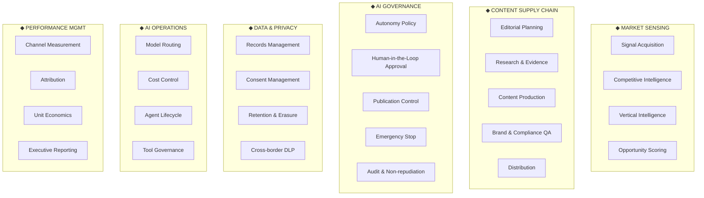
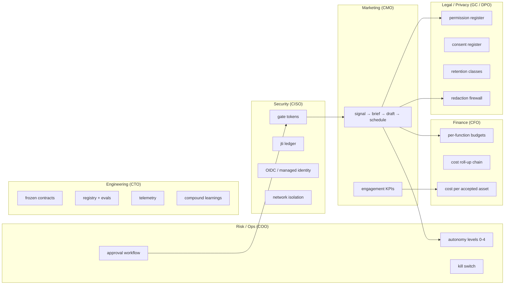
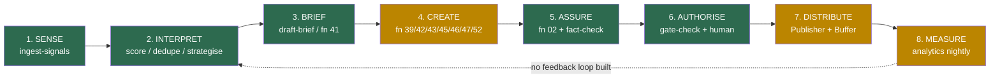

# 06 — Business Architecture

*Mapping every implemented feature to business capability, department,
process, objective, enterprise function, executive owner and value
delivered. Executive owners are **[INFERRED]** — the codebase names no
org chart. They are assigned by the standard functional accountability
that a Series A/B company would apply.*

---

## 1. Business Capability Map

The classic three-tier capability map (Level 1 domains → Level 2
capabilities → Level 3 features), built from what the code actually does.

## 2. Capability → implementation → maturity

| L2 Capability | Implemented by | Maturity |
|---|---|---|
| **Signal Acquisition** | `ingest_signals_handler` + mcp-web + fn 09 + `fetch_sources.yaml` | **L4** live |
| **Competitive Intelligence** | fn 10/11/12/13/16 packages; 5 loop task_types | **L1** packages exist, task_types pass through |
| **Vertical Intelligence** | fn 18-01…18-06 + `_shared/vertical-intelligence-method.md` | **L1** same |
| **Opportunity Scoring** | `score_signals_handler`; `functions/_shared/scoring-policy.yaml`; `opportunity_cards` | **L3** live and read; the rule itself is still confidence-only |
| **Editorial Planning** | `weekly-content-loop.yaml` Monday node | **L1** DAG only |
| **Research & Evidence** | fn 41; `evidence_grade` taxonomy; fn 09 source rules | **L2** |
| **Content Production** | fn 39/42/43/45/46/47/52; `draft_content_handler` | **L2**, only fn 42 runs (**L4**) |
| **Brand & Compliance QA** | fn 02 + `permission_check.py` + `safety_suite.py` + `qa_review_handler` | **L4** live, terminal verdict |
| **Distribution** | Publisher + mcp-buffer + `schedule-social-buffer` | **L3**, dry-run only |
| **Autonomy Policy** | `autonomy.yaml` + `policy_loader.py` + `/gate-check` | **L4** |
| **Human-in-the-Loop Approval** | `approval_inbox` + `approval_action` + Teams card | **L4** |
| **Publication Control** | Publisher's 12-branch refusal matrix + gate tokens | **L3** (Vault record stubbed) |
| **Emergency Stop** | `kill_switches` + uncached reads in 2 services | **L3** (console client mocked) |
| **Audit & Non-repudiation** | `gate_decisions`, `approval_actions`, `publish_attempts`, `audit_log`, `task_transitions` | **L4** |
| **Records Management** | Vault 9 object types + 6-field taxonomy | **L4** |
| **Consent Management** | `consent_register` + `consent.py` gate + `consent_linkage` | **L3** (no subject-facing flow) |
| **Retention & Erasure** | `retention.py` + `caj-vault-retention-expiry` | **L3** |
| **Cross-border DLP** | `redaction.py` + frozen rules contract | **L4** |
| **Model Routing** | `routing.yaml` + provider registry | **L4** |
| **Cost Control** | `budgets.yaml` + `budget.py` + `metering.py` | **L4** |
| **Agent Lifecycle** | `services/registry` toolchain | **L2**, not consumed at runtime |
| **Tool Governance** | 3 MCP servers + `tools.yaml` manifests | **L3** |
| **Channel Measurement** | `analytics-ingest` 4 sources | **L3**, 3 of 4 fixture-backed |
| **Attribution** | `utm.py` + `utm_campaign_map` + `utm_quarantine` | **L2** |
| **Unit Economics** | `kpi_rollup_cost_per_accepted_asset` | **L3** |
| **Executive Reporting** | Fabric export + Power BI starter dataset + console `/costs` | **L2** |

## 3. Feature → business mapping (the full table)

| Feature (code) | Business capability | Department | Business process | Business objective | Enterprise function | Exec owner **[INFERRED]** | Value delivered |
|---|---|---|---|---|---|---|---|
| `daily-signal-loop.yaml` | Signal Acquisition | Marketing | Market monitoring | Never miss a relevant market move | Demand Generation | CMO | Replaces a daily manual scan; runs 06:00 unattended |
| fn 09 + `fetch_sources.yaml` | Signal Acquisition | Marketing | Source curation | Evidence-backed claims only | Brand | CMO | Every claim traceable to a URL; `confidence` never rounded up |
| `_render_brief` (deterministic) | Editorial Planning | Marketing | Daily brief production | Cheap, reproducible internal briefing | Internal Comms | CMO | Zero LLM cost; byte-identical for identical input |
| fn 42 + `draft_content_handler` | Content Production | Marketing | Social content creation | Scale thought leadership | Brand | CMO | Draft produced from positioning.md, not improvisation |
| fn 02 + `qa_review_handler` | Brand & Compliance QA | Marketing + Legal | Pre-publication review | Never publish an indefensible claim | Brand + Risk | CMO / GC | A blocking, machine-readable brand gate; no partial pass |
| `docs/permission-register.yaml` | Consent Management | Legal | Client reference clearance | Never name a client without written permission | Legal & Compliance | **General Counsel** | Default-deny; absence blocks identically to UNCLEARED |
| `autonomy.yaml` levels 0–4 | Autonomy Policy | Risk / Ops | Delegation of authority | Explicit, reviewable AI mandate | Enterprise Risk | **COO / CRO** | The AI's "delegation of authority matrix" as code |
| `approval_inbox` + Teams card | Human-in-the-Loop | Marketing Ops | Approval workflow | Accountable human sign-off | Governance | COO | Single-use, expiring, identity-bound approval |
| Gate token (RS256, hash-bound) | Publication Control | Security | Authorisation | Approve *these bytes*, not "this thing" | InfoSec | **CISO** | Closes approve-A-publish-B entirely |
| `jti_ledger` | Publication Control | Security | Replay prevention | One authorisation = one action | InfoSec | CISO | Durable across replicas and restarts |
| `kill_switches` | Emergency Stop | Ops | Incident response | Stop everything in <5s | Business Continuity | COO | Uncached; global or per-function |
| `gate_decisions` (append-only) | Audit | Compliance | Evidence retention | Reconstruct any decision | Internal Audit | **CFO / GC** | One shape for human and machine deciders |
| `redaction.py` firewall | Cross-border DLP | Legal / Security | Data transfer control | No PI to a US inference provider | Privacy | **DPO / GC** | Blocks pre-transfer; every block audited |
| `consent_register` + gate | Consent Management | Legal | Lawful-basis management | POPIA s11 compliance posture | Privacy | DPO | Per-channel, per-purpose, revocable |
| `retention_class` + sweep | Retention & Erasure | Legal / IT | Records lifecycle | Defensible disposal | Records Mgmt | GC / CIO | 4 classes incl. legal hold; fails closed |
| 6-field taxonomy (immutable) | Records Management | Data Governance | Metadata management | Every object classified at birth | Data Governance | **CDO** | Search, retention and evidence all key off it |
| `budgets.yaml` + `budget.py` | Cost Control | Finance | AI spend control | Predictable AI opex | FP&A | **CFO** | Soft breach degrades service, never blocks work |
| 3 `costs` rows per completion | Cost Control | Finance | Cost allocation | Attribute spend to a function | FP&A | CFO | Unbroken chain costs→agent_runs→campaigns |
| `kpi_rollup_cost_per_accepted_asset` | Unit Economics | Finance + Marketing | Performance mgmt | Know the cost of usable output | FP&A | CFO | The AI-labour productivity metric |
| `routing.yaml` tiers | Model Routing | Engineering | Vendor management | Avoid provider lock-in | IT Architecture | **CTO** | Provider swap = 1 module + 1 register call |
| `services/registry` | Agent Lifecycle | Engineering | Change management | Prompts are versioned software | Engineering | CTO | Signed, reproducible, eval-gated artefacts |
| mcp-buffer draft-only | Tool Governance | Engineering / Risk | Least privilege | Tools cannot exceed their mandate | InfoSec | CISO | Publish path does not exist to be misused |
| `telemetry-lib` closed enum | Observability | Engineering | Monitoring | Trace without leaking | IT Ops | CTO | PII structurally excluded from telemetry |
| `console/` 6 screens | Operational Oversight | Marketing Ops | Daily operations | One place to see what the AI did | Operations | COO | Dual HTML/JSON — human and agent parity |
| `analytics-ingest` nightly | Channel Measurement | Marketing | Performance reporting | Close the produce→perform loop | Analytics | CMO / CDO | 4 sources → 4 KPIs → Fabric |
| Fabric export + Power BI | Executive Reporting | Finance / Exec | Management reporting | Board-ready numbers | Corporate Reporting | CFO | Lands in the company's own Fabric estate |
| OIDC-only CI/CD | Secrets Management | Engineering | Deployment | No standing credentials | InfoSec | CISO | Zero client secrets in 13 workflows |
| `.compound/learnings/` | Knowledge Management | Engineering | Continuous improvement | Don't repeat a mistake | Org Learning | CTO | 79 classified, cross-referenced learnings |

## 4. Departmental view — who this platform serves

**The observation that matters commercially:** a conventional marketing
automation platform serves the CMO alone. This one has *material,
code-level* deliverables for the **GC, the DPO, the CFO, the COO, the CISO
and the CDO** — each of which is an independent budget holder and, in an
enterprise sale, an independent blocker. See `08-product-positioning.md`.

## 5. Process map — the end-to-end value chain

Green = fully operational · Amber = partially operational · Red = modelled
but not implemented.

**The hole at step 2 is closed; the broken return arrow at step 8
remains.** `score-signals` writes a ranked `opportunity_cards` row per
signal, the brief leads with the best-evidenced ones, and the weekly
content loop picks its pillar from those cards rather than from an ISO-week
rotation. What is still missing is the return arrow: nothing feeds measured
performance back into what gets planned. That one gap is now the difference
between a *pipeline* and an *operating system* — see `07-operating-model.md`.

Step 2 is green in the sense that it runs, is read, and is governed by a
reviewed policy file. It is not green in the sense of being *finished*: the
score is function 09's own `confidence` weighted by pillar, and no
selection cut is configured, so scoring today reorders the brief rather
than filtering it. Both are one reviewed edit to
`functions/_shared/scoring-policy.yaml` away.

## 6. Business rules encoded in code (the compliance register)

Every one of these is a business policy that exists as executable code, not
as a document someone might read:

| # | Rule | Where |
|---|---|---|
| BR-01 | No client may be named publicly without written permission; **absence from the register is not permission** | `permission_check.py` (with a self-test proving absent ≡ UNCLEARED) |
| BR-02 | Every claim carries a client, a number or an artefact | fn 02 `unsupported-claim`; fn 42 hard rule 1 |
| BR-03 | South African English throughout | fn 02 `sa-english-spelling` |
| BR-04 | Exactly one CTA per publishable asset; internal briefs exempt | fn 02 rule 4 |
| BR-05 | Every URL is a canvasintelligence.com link with 3 UTM params; internal briefs exempt | fn 02 rule 5 |
| BR-06 | No link shorteners (they break attribution and hide destinations) | fn 02 rule 2 |
| BR-07 | Posts close on the roof line "Your Data. Delivered." | fn 42 hard rule 3 |
| BR-08 | Exactly five messaging pillars, named verbatim | fn 09 rule 4, fn 42 |
| BR-09 | ≥3 signals, ≥2 distinct domains, every signal source-attributed | fn 09 rules 1–3 |
| BR-10 | Thin evidence is never rounded up to medium confidence | fn 09 rule 5 |
| BR-11 | Manufacturing is proof-light — never `evidence_grade: strong` | fn 18-03 |
| BR-12 | Paid media spend is **blocked outright** (level 0) | `autonomy.yaml` `publish.paid_ad` |
| BR-13 | Long-form owned content requires elevated approval (level 2) | `autonomy.yaml` `publish.blog_article` |
| BR-14 | No `smoke.*` / `test.*` function may exist in the autonomy policy | `test_policy.py` invariant |
| BR-15 | No `publish`-class entry may sit above level 2 | `test_policy.py` invariant |
| BR-16 | Buffer Free tier: ≤10 queued posts; the weekly plan caps at 8 | `config.py` + `weekly-content-loop.yaml` |
| BR-17 | Nothing publishes live by default | `PUBLISHER_DRY_RUN=true` |
| BR-18 | A proof-circuit asset can never publish live, whatever the flag says | `vault_lookup.py` agent_name check |
| BR-19 | Consent is per-channel, per-purpose, and revocable | `consent_register` schema |
| BR-20 | Every object declares its retention class at creation, immutably | `object_taxonomy` + PATCH 422 |

**This list is the strongest commercial artefact in the repository.** Twenty
business policies, each independently testable, each with a named violation
code. That is what an auditor or an enterprise procurement team asks for and
almost never gets.
