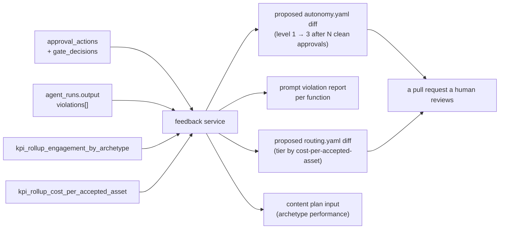

# 07 — Operating Model

*What operating model has been built — including the one that was built
unintentionally, which is the more interesting of the two.*

---

## Part A — The operating model you meant to build

### A.1 The model, named

Using the standard McKinsey operating-model frame (People · Process ·
Technology · Governance · Data · Performance), what exists is:

> **A machine-executed marketing operating model with human authority
> retained at exactly one point — the publication gate — and with all
> delegation of that authority expressed as versioned policy.**

The conventional marketing operating model asks: *who does the work, and who
approves it?* This one answers: **the machine does the work; the human
approves only the irreversible step; and the boundary between those two is a
YAML file under change control.**

### A.2 Operating-model canvas, as implemented

| Dimension | Conventional marketing org | What the code implements |
|---|---|---|
| **Work allocation** | People assigned to briefs | `loops/*.yaml` DAG; `uuid5` deterministic task ids |
| **Capacity** | Headcount | Model tier + `budgets.yaml` daily USD limit |
| **Escalation** | Manager judgement | `autonomy.yaml` levels 0–4, fail-closed at 0 |
| **Quality control** | Peer review | fn 02 Brand Steward QA — blocking, machine-readable, no partial pass |
| **Sign-off** | Email / Slack approval | Single-use expiring link, identity from Entra, hash-bound to exact bytes |
| **Audit** | Recollection + inbox archaeology | `gate_decisions`, `approval_actions`, `publish_attempts`, `task_transitions` — all append-only |
| **Emergency control** | "Stop posting" in a group chat | `kill_switches`, uncached, <5s, global or per-function |
| **Cost control** | Retainer / budget line | Per-function daily USD limit, soft breach downgrades tier |
| **Performance mgmt** | Monthly report deck | Nightly rollups incl. `cost_per_accepted_asset` |
| **Knowledge** | Tribal, in people's heads | `positioning.md` quoted verbatim into prompts; 79 compound learnings |

### A.3 The autonomy ladder as a delegation-of-authority matrix

`services/gatekeeper/policy/autonomy.yaml` is, in enterprise-governance
terms, a **Delegation of Authority (DoA) matrix** — normally a board-approved
document living in a policy library. Here it is executable:

| Level | Meaning | Currently assigned to |
|---|---|---|
| **0** blocked always | No approval can unblock it | `publish.paid_ad`; **and every unlisted pair** (default) |
| **1** single approver | One human click | `publish.social_post` |
| **2** elevated | *Currently identical to 1*; reserved for quorum | `publish.blog_article` |
| **3** auto-approved, audited | No human; decision row written | `draft.social_post`, `draft.brief` |
| **4** autonomous passthrough | No human; logged | `analyse.signal`, `analyse.campaign_performance` |

Read as a business statement, this policy says: *"AI may read and analyse
freely. AI may draft freely, with a record. AI may propose a social post but
a human must click. AI may propose long-form but with more scrutiny. AI may
never spend money on paid media. Anything not explicitly listed is
forbidden."*

That is a complete, coherent, defensible AI mandate — and it fits on one
screen. **Most enterprises spend six months in committee to produce a worse
version of this document, and then cannot enforce it.**

### A.4 Operating rhythm (cadence)

| Cadence | Trigger | What runs |
|---|---|---|
| **Daily 06:00 SAST** | `dailySignalLoopTrigger` | Signal loop: ingest → brief → QA → approval card |
| **Weekly Mon 07:00 SAST** | `weeklyPlanningTrigger` | Content studio: plan → research → draft ×6 → dual QA → schedule |
| **Nightly 03:00 SAST** | `caj-analytics-nightly-ingest` | Ingest 4 sources → reconcile UTM → 4 KPIs → Fabric export |
| **Monthly, last day** | `monthEndReportingTrigger` | Fires a heartbeat — **no loop definition matches it** |
| **On demand** | `POST /retention-expiry-runs` or the CA Job | Retention sweep |
| **Per deploy** | `deploy-loop-e2e-smoke.yml` | Live end-to-end proof of life |

**Finding:** the month-end trigger publishes a heartbeat that
`handle_heartbeat_message` will log as `heartbeat_unknown_loop` and discard.
The monthly reporting cadence exists in infrastructure and not in software.

## Part B — The operating model you built unintentionally

This is the more important half of this document.

### B.1 What actually happened

The repository was **built by an AI agent loop, running one unit of work per
git worktree per branch**, and it accumulated its own engineering knowledge
as it went. Evidence:

- `README.md` documents worktree-per-session: `git worktree add
  ../cmos-session-<id> -b session/<id> main`. Branch names are `session/{id}`
  (`s0-foundation`, `s1-gateway`, `s2-vault`, `s3-orchestrator`,
  `s4-governance`, `s6-registry`, `s7-console`, `s8`, `s9-analytics`,
  `s10-intelligence`, `s11-content`).
- `.compound/learnings/` — 79 numbered learnings across four classes, each
  with a status field carrying strengthening and recurrence history
  ("*strengthened again 2026-08-02 — 3rd recurrence on s9-analytics*").
- Commit messages and code comments carry finding codes and live incident
  references: `F-CASCADE-QA-BLOCKED (4 Aug 2026, heartbeat round 17)`,
  `F-INGEST-PUBLIC-SOURCE`, `deploy-loop-e2e-smoke #33`.
- Comments preserve *root-cause narratives*, not just fixes — see
  `migrations/0003_qa_blocked_reason.sql`, which explains that the previously
  attempted fix in 0004 "had zero effect for exactly this reason: 0004 was
  never reached."
- References to `.loop/spec.json`, `.loop/plan.json`, `.loop/review.json`,
  `.loop/lenses.json`, `.loop/domain.md` — a formal spec→plan→build→review
  loop with acceptance criteria (`AC-xx`), constraints (`C-x`), decisions
  (`DE-x`) and multi-lens review (risk-security, data-residency,
  performance).

### B.2 The unintentional model, named

> **You have built a Compound Engineering Operating Model: a
> spec-driven, isolation-per-unit-of-work, multi-lens-reviewed, learning-
> accumulating software factory in which AI agents are the labour, and the
> organisational memory is a first-class versioned artefact.**

Five properties, each visible in the repository:

1. **Isolation per unit of work.** Worktree + branch per session. No shared
   working directory, no branch-switching races, `main` protected.
2. **Frozen interfaces as coordination protocol.** Parallel sessions
   coordinate through hash-pinned contracts and a documented *first-to-land-
   wins* rule (`mcp/README.md` records exactly this playing out for
   `tools.schema.json` — the MCP session's version was dropped in favour of
   the registry session's, and the manifests were reshaped to fit).
3. **Learning capture as a build artefact.** Not a retro doc — a classified,
   numbered, cross-referenced corpus that later specs cite as criteria
   (`LEARN-000`, "learnings-as-criteria").
4. **Multi-lens adversarial review.** `.loop/lenses.json` and `review.json`
   are referenced by finding codes throughout (`RS-01` risk-security, `PERF-2`
   performance, `DR-3/4/5` data-residency, `DE-x` decisions). Findings
   propagate into code as named comments.
5. **Live production as the test environment of record.** The smoke test runs
   against `cmos-dev` and its green criterion was *redefined* to accept a
   legitimate QA_BLOCKED verdict as proof-of-life
   (`F-SMOKE-GREEN-REDEFINITION`). Failures are root-caused from Log
   Analytics and the analysis is written into the code.

### B.3 Why this is the more valuable asset

Read the two assets side by side:

| | Canvas Marketing OS | The Compound Engineering Loop |
|---|---|---|
| **What it is** | An AI marketing platform for one company | A method for building governed AI systems |
| **Addressable market** | Canvas Intelligence + lookalike SA data firms | Every enterprise deploying AI agents |
| **Replicability** | High — competitors can build a marketing tool | Low — this took 79 learnings and ~20 live incidents to develop |
| **Evidence of value** | A working platform | A working platform, *built by the method* |
| **Defensibility** | Feature parity is achievable | The learning corpus is path-dependent |

The compound learnings are not documentation about the product. They are
**proof that the method works**, with the product as the exhibit. That
inverts the usual pitch: instead of "buy our marketing platform", the
stronger position is *"we built a fully-governed, POPIA-aware, cost-metered,
human-gated AI production system with an agent loop — here it is running in
production, and here are the 79 things we learned doing it."*

**[INFERRED]** This is the single most under-exploited asset in the
repository.

## Part C — Operating-model gap analysis

### C.1 What exists (operational today)

| Component | Evidence |
|---|---|
| Scheduled autonomous execution | 3 Logic Apps + 1 CA Job, live |
| Deterministic, reproducible decomposition | `uuid5`, golden-file tests |
| Application-level reliability engineering | retry/backoff/dead-letter/cascade state machine |
| Policy-as-code delegation of authority | `autonomy.yaml`, fail-closed |
| Identity-bound, hash-bound human approval | Easy Auth + RS256 + `jti` ledger |
| Complete append-only audit across 5 tables | `gate_decisions` et al. |
| Sub-5s emergency stop | uncached kill switch in 2 services |
| Per-function AI cost budgets with graceful degradation | soft breach → tier downgrade |
| Pre-transfer PII interdiction, every block audited | `redaction.py` |
| Default-deny client-naming clearance | `permission-register.yaml`, nothing CLEARED |
| Immutable governance taxonomy on every object | `object_taxonomy`, PATCH 422 |
| Retention classes with fail-closed erasure | `retention.py` |
| Prompt-as-software lifecycle with regression evals | `services/registry` |
| PII-safe distributed tracing | closed-enum spans |
| Zero-standing-credential deployment | OIDC + managed identity, 13 workflows |
| Nightly measurement incl. AI unit economics | 4 KPI rollups |
| Organisational learning capture | 79 compound learnings |

### C.2 What is partially implemented

| Component | State | What's missing |
|---|---|---|
| **The agent estate** | 3 of 23 packages run | 20 task_types fall through to a no-op pass-through |
| **The weekly content studio** | DAG valid, gates correct | Every stage is a pass-through; no content produced |
| **Publication** | Full verification chain built | `PUBLISHER_DRY_RUN=true`; Vault publish record is a stub |
| **The console** | Deployed behind Easy Auth | Gatekeeper client is `mock`; approval/kill-switch screens read fixtures |
| **Measurement** | Pipeline runs nightly | 3 of 4 sources are fixtures; no Power BI workspace provisioned |
| **Registry** | Full toolchain, signed artefacts | Nothing verifies the signature at runtime; `registry.yml` covers 3 of 23 packages |
| **Consent** | Gate + linkage + revocation | No subject-facing request flow, no DSAR handler |
| **Notifications** | Teams cards built and tested | `TEAMS_WEBHOOK_URL` absent by default; inbox row is the fallback |
| **Approval semantics** | Levels 0–4 defined | Level 2 behaves identically to level 1 |

### C.3 What is missing entirely

| Missing capability | Business consequence |
|---|---|
| **Any feedback loop** | The system produces, governs and measures — but never *learns*. Approval rates, QA violation frequencies, engagement by archetype and cost-per-accepted-asset are all captured and none is read back. **This is the single largest gap between "pipeline" and "operating system."** |
| **Opportunity scoring** | `opportunity_cards` exists in DDL and is never written. Nothing prioritises. Everything ingested is treated as equally important. |
| **Multi-tenancy** | No `tenant_id` in any of 5 schemas. The platform serves exactly one company. Every commercial model except "internal tool" or "managed service per instance" requires a schema-wide change. |
| **Role-based authorisation** | Any authenticated tenant user reaches the kill switch, the cost ledger and Vault search. Mitigated only by an Entra Portal setting a human must remember. |
| **Vault API authentication** | Zero authn/authz on the system of record. Network isolation is the only control, and it is documented as an unapproved accepted risk. |
| **Month-end reporting** | Logic App fires; no loop matches; heartbeat discarded. |
| **Dead-letter alerting** | `DeadLetterAlert` is published to the event queue; nothing consumes it. Silent failure. |
| **Cost forecasting / spend caps beyond daily** | Daily USD per function only. No monthly cap, no forecast, no anomaly detection. |
| **Content editing / revision** | `version` + `predecessor_asset_id` exist; nothing writes a v2. A rejected draft has no revision path. |
| **Rollback / undo of a publication** | No unpublish, no retraction workflow. |
| **SLA / SLO definitions** | No latency, availability or freshness targets anywhere. |
| **Runbooks for the AI failure modes** | Runbooks exist for deploy and auth; none for "the agent produced something wrong and it shipped." |

## Part D — Target operating model

The three moves that convert what exists into a genuine operating system:

### D.1 Close the learning loop (highest leverage, lowest cost)

Build one service — call it `services/feedback` — that reads what is already
being written and proposes changes to the policy files that already exist:



Every output is a **diff to a versioned policy file**, reviewed by a human,
merged by CI. No new autonomy is granted implicitly. This is the "auto-tuning
governance" pattern and it is directly enabled by decisions already made.

### D.2 Activate the agent estate

The gap between 23 packages and 3 running handlers is closed by making
dispatch **registry-driven** rather than table-driven:

```
DISPATCH_TABLE (hardcoded, 5 entries)
  → registry-resolved handler: task_type → function package
    → generic handler: read prompt.md, build user_content from schema.json,
      call gateway, validate output against schema.json, write artefact
```

Four of the five existing handlers already share that exact shape. Extracting
a generic handler and letting `registry.json` name the function per task_type
would activate 20 packages **without writing 20 handlers** — and would give
the registry a runtime role, closing the "signature never verified" gap at
the same time.

### D.3 Decide the tenancy question

Multi-tenancy is not a feature; it is a schema decision that gets
exponentially more expensive with every row written. The three viable
answers, in order of increasing investment:

1. **Single-tenant, deployed per customer** (nearest to today) — package
   `main.bicep` as a deployable unit; each customer gets their own resource
   group. No code change. Highest ops cost, fastest to market.
2. **Schema-per-tenant** — one Postgres, one schema set per tenant, tenant
   resolved at connection time. Moderate change; retains the frozen-contract
   guarantee.
3. **Row-level tenancy** — `tenant_id` on all 27 tables + RLS. Cheapest to
   run, most expensive to build, and **breaks the frozen v1 contract**,
   which is precisely the kind of change the freeze exists to force a
   deliberate decision about.

This decision should be made before more production data accumulates.
