# 09 — Technical Debt Register

*Prioritised by business impact, not by engineering annoyance. Every item
cites the file. Severity: **S1** blocks revenue or creates liability ·
**S2** blocks scale or credibility · **S3** slows delivery · **S4** hygiene.*

---

## Priority 1 — Business-blocking

*IDs are stable identifiers assigned in discovery order, not priority ranks.*

### TD-31 · mcp-web's live mode is undeclared config drift — the next infra deploy silently reverts all knowledge intake to a synthetic fixture · **S1**

**Where:** `infra/main.bicep` L960–978 (`mcpWebApp`), `infra/modules/mcp/container-app.bicep` (`env: concat(envVars, keyVaultSecretEnv)`), `mcp/mcp-web/app/tools.py::fetch_url`.

`fetch_url` returns a checked-in synthetic fixture unless `MCP_WEB_LIVE_MODE`
is truthy. **`MCP_WEB_LIVE_MODE` appears nowhere in `infra/`.** `mcpWebApp`'s
`envVars` array contains exactly one entry, `MCP_WEB_ALLOWLIST`.

It *is* set on the live app — `.compound/learnings/architecture/L-0074.md`
records it directly: *"`ca-mcp-web`'s `MCP_WEB_LIVE_MODE` flag was separately
set"* (2026-08-02), and the same learning confirms the live
`MCP_WEB_ALLOWLIST` had "already diverged from the code's own
example.com-inclusive default." So the deployed app fetches real content
because a human set an environment variable by hand, outside
infrastructure-as-code.

**Why that is not survivable:**

1. ARM replaces the container's `env` list declaratively. A deploy sets
   mcp-web's environment to exactly `MCP_WEB_ALLOWLIST` — dropping
   `MCP_WEB_LIVE_MODE`.
2. `mcpDeployToken` defaults to `utcNow()`, so **every** deployment forces a
   fresh revision; the container restarts on the Bicep-declared env.
3. **Nine workflows** reference `main.bicep`, and at least two run
   `az deployment group create` against the whole template — `deploy-infra.yml`
   and `deploy-governance.yml` (commit `e148d18` documents exactly this blast
   radius, where a governance deploy rotated the live Postgres admin password).

**What breaks, and how quietly.** In fixture mode `fetch_url` ignores the URL
entirely and returns the same 1-sentence placeholder for all four sources:

```
SYNTHETIC-TEST-DATA: this is a synthetic fixture response body for mcp-web's
fetch_url tool. It contains no real personal or client data (POPIA s72
fixture-mode default, AC-7).
```

`ingest_signals_handler` would fetch four URLs, receive four identical
placeholders, hand them to function 09 as "retrieved evidence", and write the
resulting hallucinated signals to the Vault with `evidence_grade` and
`source_url` attached. The daily loop goes **green**. There is no failure, no
alert, and no dead-letter.

**Nothing would catch it.** The only automated check on mcp-web's mode is
`caj-mcp-smoke`, which asserts `source == "fixture"` — it **passes** in the
broken state and would fail in the correct one. L-0074's fix
(`force_fixture_mode()`, a request-scoped override) makes the smoke test
deliberately mode-independent, so it now tells you nothing about ambient
configuration either way.

**Fix (~1 hour):** add `{ name: 'MCP_WEB_LIVE_MODE', value: 'true' }` to
`mcpWebApp`'s `envVars` in `main.bicep`. Then add the standing guard: a check
that `ingest-signals` rejects a fetched body matching
`^SYNTHETIC-TEST-DATA`, so fixture content can never be laundered into a
Vault signal with a real `source_url`.

**The replacement mechanism is now verified against Microsoft's own
documentation, not just against my reading of the template.** ARM's
incremental mode is incremental *per resource*, not *per property*: a
resource present in the template is applied as a full replacement, and
*"properties that aren't included in the template are reset to the default
values."* Because `env` is computed as `concat(envVars, keyVaultSecretEnv)`,
a redeploy sets it to exactly that list and drops anything set by hand. See
`19-live-verification-log.md` P3 for the citation and its caveats.

**Secondary consequence worth its own review.** The redaction firewall's
`public_source_content` exemption (`redaction.py` INCIDENT 2, round 15) was
authorised on the stated grounds that this content is *"real bodies from
fetch_sources.yaml's public news domains."* That justification is only true
while live mode is on. In fixture mode the exemption is still applied — to a
placeholder — which is harmless in itself, but it means **the exemption's
premise is a deployment-state assumption, not a code invariant.** Worth
re-reading with that in mind.

### TD-01 · 20 of 23 function packages never execute · **S1**
**Where:** `services/orchestrator/orchestrator/dispatch.py` `DISPATCH_TABLE`
(5 entries) vs `functions/` (23 packages) vs `loops/*.yaml` (~30 task_types).

Every task_type not in `DISPATCH_TABLE` hits `legacy_task_pass_through`,
which transitions RUNNING → COMPLETED and does nothing. The entire weekly
content studio (15 task_types) and the entire S10 intelligence fan-out (11
task_types) are inert. The DAG runs green and produces nothing.

**Impact:** the platform's advertised capability is ~8× larger than its
delivered capability. Any demo of the weekly loop shows a fully-green run
with zero output.
**Root cause:** wiring a package requires three uncoordinated manual steps —
add to `DISPATCH_TABLE`, add the path to the orchestrator Dockerfile's
staging step, add the task_type to a loop YAML.
**Fix:** extract a generic registry-driven handler (four of the five existing
handlers already share the shape: read prompt → build user_content → gateway
→ parse JSON → write artefact → set_result_ref → advance). ~2 weeks.

### TD-02 · Publisher's Vault record is an in-memory stub · **S1**
**Where:** `services/publisher/app/vault_adapter.py` —
`StubVaultRecordingAdapter` appends to a Python list.

The docstring is candid: *"What 'publishing' means here is: record the
publication in the Vault (Postgres) through this adapter"* — and the adapter
does not do that. `governance.publish_attempts` records the attempt, but the
Vault, which is the system of record, never learns that anything was
published.

**Impact:** the governance chain has a hole at its last link. `record_publish`
returns a `record_id` that references nothing. Any audit that starts from the
Vault cannot find the publication.
**Fix:** implement a real Vault write (a `gate_decisions` row and/or an
`assets` state transition to `approved`). ~2 days.

### TD-03 · Vault API has zero authentication · **S1**
**Where:** `services/vault/vault/main.py` and every router — no auth
dependency anywhere. Documented in `docs/accepted-risks.md`, and *explicitly
flagged as a builder judgement call, not a budget-owner-approved risk*.

Anything inside `cae-cmos-dev` can read, write or delete every business
object, every consent record and every cost row. `X-Caller-Service` is
self-asserted and explicitly not a trust boundary.

**Impact:** a single compromised container app or a mis-scoped future
workload owns the entire system of record. Also a hard blocker for any
enterprise security review.
**Fix:** the accepted-risks doc already specifies it — a Key-Vault-sourced
bearer token validated by a FastAPI dependency, ideally managed-identity
service-to-service auth. ~1 week including infra wiring and smoke-test
updates.

### TD-04 · Console authenticates but does not authorise · **S1**
**Where:** `infra/modules/console/console-app.bicep` — `allowedApplications`
is empty and no app-role or group claim is required.

Any user who can obtain a token for the console's App Registration reaches
the kill switch, the cost ledger and Vault search. The only mitigation is a
Portal setting ("Assignment required = Yes") a human must remember to apply.

**Impact:** the emergency stop is available to every authenticated tenant
user. In an org of any size this fails a security review immediately.
**Fix:** app-role claim in the `authConfig` `validation` block **and** a
matching check in `require_principal` — defence in depth, matching the
RISK-003 pattern the codebase already uses for authentication. ~2 days.

### TD-05 · Single-tenant by construction · **S1 (commercial)**
**Where:** all five schemas. No `tenant_id`, `org_id` or `workspace_id`
column exists anywhere in 27 tables.

**Impact:** every commercial model except "internal tool" or "one deployment
per customer" is blocked. And the cost of retrofitting grows with every row
written.
**Fix:** a decision, not a patch. Three options costed in
`07-operating-model.md` §D.3. **Make this decision before more production
data accumulates.**

---

## Priority 2 — Scale and credibility

### TD-06 · Model-gateway cache is process-local · **S2**
**Where:** `services/model-gateway/caching.py` — module-level dicts, with the
scope note *"Multi-replica / cross-process cache consistency is explicitly
out of scope."*

`ca-model-gateway` autoscales. Two replicas serving the same `task_ref`
produce two upstream calls, two sets of `costs` rows, two charges. The
idempotency guarantee the module exists to provide **does not hold in
production**.

**Fix:** move to Redis, or to a Postgres advisory-lock + `completions` table
keyed on `task_ref`. ~3 days.

### TD-07 · Handler retries are not idempotent · **S2**
**Where:** `worker.py::_retry_or_dead_letter` — admitted in its own docstring:
*"a handler that partially wrote to Vault before failing is not guaranteed
idempotent on retry (e.g. a duplicate signal/agent_run row is possible)."*

A handler that creates an `agent_run`, calls the gateway, and then fails on
the Vault write will, on retry, create a second `agent_run` and incur a second
model charge.

**Fix:** derive a deterministic idempotency key from `task_id` for
`agent_run` creation (the `uuid5` decomposition already gives a stable seed),
or make handlers resumable by checking for an existing `agent_run` first.
~1 week.

### TD-08 · Kill switch duplicated across two services · **S2**
**Where:** `services/gatekeeper/app/kill_switch.py` and
`services/publisher/app/kill_switch.py` — byte-similar files, kept honest by
`test_kill_switch_parity.py` which loads *both files by path* and asserts
identical behaviour across the scope matrix.

The parity test is genuinely clever and is the right mitigation for today.
But the same pattern repeats elsewhere: `AGENT_NAME_LOOP_PROOF` duplicated
with a cross-service equality test; `CANONICAL_JSON_SEPARATORS` and
`parse_resource_claim` duplicated between `gatekeeper/app/tokens.py` and
`publisher/app/verifier.py` with a comment *"Must stay byte-identical."*

**Impact:** three critical security behaviours are maintained in two places
each. The tests catch divergence — but only for the cases they enumerate.
**Fix:** a shared `services/governance-lib` package, adopted exactly the way
`telemetry-lib` already is. `verifier.py`'s "standalone by design" constraint
is about not importing `app.*` across services — a neutral shared package
satisfies it. ~1 week.

### TD-09 · The registry has no runtime role · **S2**
**Where:** `services/registry/` builds a signed, reproducible manifest.
`dispatch.py` reads `prompt.md` straight off disk via `functions_dir()`.
Nothing ever calls `verify_signature.py` at runtime.

**Impact:** the entire supply-chain-integrity story is theatre. A modified
`prompt.md` in the container image runs happily. `registry_version` is a span
attribute nothing authoritative populates.
**Fix:** verify the manifest signature at orchestrator startup and resolve
prompts *through* it. This also fixes TD-01. ~1 week (combined).

### TD-10 · Console reads mock data for governance screens · **S2**
**Where:** `console/app/clients/gatekeeper_mock.py` is the default;
`GATEKEEPER_API_MODE=mock` in `console-app.bicep`.

The approval inbox and kill-switch screens — the two most operationally
important — display fixtures. `console/README.md` documents this precisely
and corrects an earlier "config-only cutover" claim: Gatekeeper exposes no
REST route over `kill_switches` or `approval_inbox`.

**Impact:** an operator looking at the kill-switch screen is not looking at
production state. **Under an incident, this is dangerous.**
**Fix:** add `GET/POST /kill-switch`, `GET /kill-switch/audit/last`,
`GET /approval-inbox` to Gatekeeper's internal app; flip the env var. ~3 days.

### TD-11 · Three of four analytics sources are fixtures · **S2**
**Where:** `analytics_ingest/{ga4,search_console,linkedin}_client.py` return
bundled JSON fixtures. Only Buffer goes live, and only if `BUFFER_API_KEY`
resolves.

**Impact:** every KPI except the Buffer slice is synthetic. `cost per
accepted asset` is real (it reads the Vault) but engagement and reliability
are not. Reporting on fixture data is worse than not reporting.
**Fix:** real API clients + credentials. Note learning L-0074's warning about
"goes live automatically once credentials exist" designs — the live path must
be independently verified, not assumed. ~1 week per source.

### TD-12 · Postgres is a Burstable B1ms with 50 max connections · **S2**
**Where:** `infra/modules/postgres.bicep` — `Standard_B1ms`, 32GB, single
zone, no read replica, no HA.

The connection budget is already tight and has already caused an incident:
`vault/db.py` documents reducing the pool from 20 to 12 because 3 replicas ×
20 = 60 exceeded `max_connections=50` (PERF-2). Five schemas, six services,
and every Container Apps Job share this one server.

**Impact:** a genuine scaling wall, and a single point of failure with no HA.
**Fix:** General Purpose tier + HA + PgBouncer before any real load. ~2 days
of infra, plus cost.

### TD-13 · Dead-letter alerts go nowhere · **S2**
**Where:** `dead_letter.py::emit_alert` publishes a `DeadLetterAlert`.
`worker.py` receives it, logs `dead_letter_alert_received`, and moves on —
its own comment says *"informational only today — nothing in the worker loop
consumes DeadLetterAlert yet."*

**Impact:** a permanently failed task is silent. No paging, no email, no Teams
card, no console surface. The one place it would be visible is
`/status`, which nobody watches at 06:00.
**Fix:** route to the existing Teams webhook path, and/or an Azure Monitor
alert rule on the log event. ~2 days.

### TD-32 · The brand rules have never been run against the brand's real output · **S2**
**Where:** `functions/02-brand-steward-qa/prompt.md` L40–44 (`link-shortener`),
the `url-utm` and `sa-english-spelling` rules in the same file, and function
42's roof line. Measured against 100 real published posts pulled from the live
Buffer account — see `19-live-verification-log.md` V2.

| fn 02 rule | Result against real output |
|---|---|
| `link-shortener` — bans `bit.ly`, `lnkd.in`, `tinyurl.com`, `ow.ly`, `buff.ly` | **86 of 100 would FAIL** (85 `bit.ly`, 1 `lnkd.in`) |
| `url-utm` — Canvas URLs need 3 UTM params | 12 posts carry a Canvas link, 4 carry any `utm_` → 8 fail |
| `sa-english-spelling` | `center` ×3, `behavior` ×4 → fails |
| fn 42 roof line `Your Data. Delivered.` | all 6 real occurrences read `Your data. Delivered.` |

**Impact:** `qa_review_handler`'s `pass: false` is *terminal* — it transitions
the task to `FAILED` with reason `qa_blocked` and never calls
`advance_dependents`. A rule set this far from actual practice means that the
day the platform is put in the publishing path, the overwhelming majority of
drafts in its own house style die at the QA gate with no route past it. There
is no override, by design.

Note that `buff.ly` — Buffer's own shortener, the one that would appear as a
tooling artefact — occurs **zero** times. `bit.ly` is a deliberate, systematic
editorial choice that the codified policy names as a blocking failure.

**Fix:** run `functions/02-brand-steward-qa/safety_suite.py` over an export of
real published posts as a one-off calibration pass, then reconcile — either
the rules move or the practice does. That is a decision for the CMO, not for
engineering. No new code. ~1 day, and it is the cheapest de-risking available
before TD-01 activates the agents. The roof-line casing is a one-character fix
in whichever of the two places is wrong.

---

## Priority 3 — Delivery friction

### TD-14 · Contract freeze forces architectural workarounds · **S3**
The frozen `vault-schema/schema.sql` produced `vault_internal` — a 7-table
sidecar schema stitched back on with a `LEFT JOIN` on every read. The frozen
`gate-token/schema.json` (with `additionalProperties: false`) forced
`function_id` and `content_hash` into a canonical-JSON string packed inside
the `resource` claim, which then required byte-equality re-canonicalisation
checks in **two** services.

Both workarounds are well-executed and well-documented. Both are debt: an
extra join on every Vault read, and a parsing/serialisation contract that
must stay byte-identical across two independently-maintained files.

**Fix:** a v2 contract window that consolidates `vault_internal` and
promotes `function_id`/`content_hash` to first-class claims. The forward plan
is already written into `contracts/gate-token/spec.md`. ~2 weeks + migration.

### TD-15 · Migration script re-applies all four files on every deploy · **S3**
**Where:** `infra/main.bicep`'s `orchestratorMigrationSql` joins 0001–0004
into one `psql -f` with `ON_ERROR_STOP=1`, run unconditionally on every
`deploy-infra`.

This caused a real production outage: migration 0003's `DROP + ADD
CONSTRAINT` re-validated the whole live table on every deploy, and once rows
with `dependency_dead_lettered` existed (added by 0004), 0003's older
9-value list failed — aborting the script *before* 0004 could run and
supersede it. The fix (`ADD CONSTRAINT ... NOT VALID`) is correct, but the
underlying design — no migration ledger, everything re-applied every time —
remains.

**Fix:** adopt the `governance.schema_migrations` pattern the governance
schema already uses, and apply only unapplied versions. ~2 days.

### TD-16 · Duplicated Azure client code across services · **S3**
`resolve_live_fqdn` via `az containerapp show` is implemented independently
in `orchestrator/clients/azure_fqdn.py`, `publisher/app/buffer_client.py` and
`registry/gateway_client.py`. Same for HTTP client construction, traceparent
injection and contract-shape validation.

The rationale (avoiding cross-service coupling) is sound. The cost is three
copies of a subtle behaviour, only one of which has full test coverage.

### TD-17 · `dispatch.py` is 1,138 lines and growing · **S3**
Five handlers, lineage resolution, permission-check dynamic loading, redaction
fallback, proof-circuit tagging, brief rendering, and the not-ready/cascade
gate all in one module. Roughly 40% of its lines are comments — which is
genuinely valuable (the incident narratives are the institutional memory) —
but the module now has at least six responsibilities.

**Fix:** split into `dispatch/handlers/*.py` + `dispatch/lineage.py` +
`dispatch/gating.py`, preserving every comment. ~3 days.

### TD-18 · Registry CI covers 3 of 23 packages · **S3**
`registry.yml` hardcodes the paths for 02/09/42. Documented in
`docs/function-register-coverage.md`. 20 packages have golden evals that CI
never runs.

### TD-19 · MCP test suite is not in CI · **S3**
`mcp/README.md` documents this as a known operational gap: none of the 10
pytest markers are wired into `ci.yml`, which does not touch `/mcp` at all.
Only the `mcp_conformance` subset runs, once per deploy, in
`caj-mcp-smoke`.

### TD-20 · Hardcoded prices, channel ids and cadence · **S3**
`metering.PRICE_PER_MTOK` (silently drifts from actual billing);
`BUFFER_LINKEDIN_CHANNEL_ID` in `publisher/app/config.py` (despite the weekly
loop YAML carrying three channel ids); `ACCESS_LOG_RETENTION = 90 days`;
`NOT_READY_MAX_REQUEUES = 20`. All of these belong in policy YAML given the
codebase's own strong policy-as-data convention everywhere else.

---

## Priority 4 — Hygiene

| # | Item | Where |
|---|---|---|
| TD-21 | `opportunity_cards` fully specified, never written | `contracts/vault-schema/schema.sql` |
| TD-22 | Month-end Logic App fires a heartbeat with no matching loop | `infra/modules/scheduling/month-end-reporting-trigger.bicep` |
| TD-23 | `TaskEnvelope.priority` in the frozen contract, never read | `contracts/service-bus/task-envelope.schema.json` |
| TD-24 | `web_search` declared in fn 09's tools.yaml, not implemented | `mcp/mcp-web/app/tools.py` |
| TD-25 | Registry signed with a committed dev key; Ed25519 unusable in Key Vault — **verified 2026-08-06**, and at *every* tier including premium and Managed HSM, not only standard, so no SKU upgrade lifts it. Supported curves are P-256/P-256K/P-384/P-521 only. The `accepted-risks.md` option (a) ES256 switch is the right path. See `19` P4. | `services/registry/keys/`, learning L-0031 |
| TD-26 | `redaction.py` docstring says "9 hash-guarded frozen contract files"; there are 10 | `contracts/.frozen-v1.sha256` |
| TD-27 | Level 2 autonomy behaves identically to level 1 | `gatekeeper/app/routers/gate_check.py` |
| TD-28 | `client_references` is always `[]` at the qa-review call site, so the deterministic uncleared-client check always passes trivially | `dispatch.py::qa_review_handler` |
| TD-29 | `functions/task-worker/` is a health-check placeholder | `function_app.py` |
| TD-30 | Console filters Vault search in Python after fetching everything (no server-side filter in the contract) | `console/app/services.py::search_vault` |
| TD-33 | `signing.py`'s module docstring predates the L-0031 correction: it gives only the *networking* reason the `keyvault://` path fails, and promises *"moving to a production signing key is a configuration swap, never a code change"* — which `docs/accepted-risks.md` now establishes is false for the recommended ES256 path. Blocks nothing; misdirects whoever picks up TD-25. Three-line fix. | `services/registry/signing.py` L7–11, vs `docs/accepted-risks.md` "Algorithm correction" |

---

## Security concerns, consolidated

| # | Concern | Severity | State |
|---|---|---|---|
| SEC-1 | Vault API: no authn/authz | **Critical** | Accepted risk, *not budget-owner approved* |
| SEC-2 | Console: authenticated but not authorised | **High** | Accepted risk; Portal-only mitigation |
| SEC-3 | Service Bus: public endpoint (Standard SKU) | Medium | Accepted; `disableLocalAuth` + TLS 1.2 + metadata-only envelopes |
| SEC-4 | Registry: committed signing key | Medium | Accepted; loud runtime warning, env-var-first resolution, no `alg:none` path |
| SEC-5 | Redaction: regex coverage structurally incomplete | Medium | Acknowledged in the contract itself; every block audited *because* coverage is incomplete |
| SEC-6 | Prompt injection via fetched news bodies | Medium | **Unmitigated** — no defence beyond schema constraints and a tiny domain allowlist |
| SEC-7 | `X-Caller-Service` self-asserted | Low | Explicitly documented as not a trust boundary |
| SEC-8 | POPIA s72 cross-border transfer unresolved for App Insights | Medium | Documented as open for legal review |
| SEC-9 | Postgres admin password rotated on every governance deploy, leaving Key Vault stale | Medium | Fixed (commit `8277d38`); the class of bug remains — shared `main.bicep` deploys have wide blast radius |

**What is genuinely strong:** zero client secrets across 13 workflows;
managed identity for every data-plane access; private endpoints on Postgres,
Key Vault and Storage; internal-only ingress on six of eight apps; RS256 with
explicit algorithm pinning and `alg:none` rejection; durable replay ledger;
append-only audit everywhere; and audit rows written on isolated connections
so they survive the rollback of the transaction that triggered them.

---

## Testing gaps

400 test functions across 128 files — genuinely substantial. What is
**not** covered:

| Gap | Risk |
|---|---|
| No load or performance test anywhere | Unknown behaviour at any scale; the B1ms wall is untested |
| No chaos test (Postgres down, Service Bus down, Anthropic 500) | Degradation paths are argued in comments, not proven |
| No end-to-end test of the *full* chain including a live publish | Dry-run is the only tested publish path |
| No test that 20 unwired packages are unwired | The pass-through gap is invisible to CI — every loop goes green |
| MCP markers absent from CI | 10 markers, ~11 modules, run only locally |
| Registry CI covers 3 of 23 packages | 20 golden eval sets never run in CI |
| No mutation testing | Coverage numbers unvalidated |

**The most valuable missing test:** an assertion that every `task_type`
appearing in any `loops/*.yaml` either has a `DISPATCH_TABLE` entry or is on
an explicit allowlist of intentional pass-throughs. That one test converts
TD-01 from invisible to loud, and would have surfaced it immediately.

---

## Documentation debt

Uniquely for a codebase of this size, documentation is a **strength**, not a
gap. `docs/` holds 12 substantive documents; `.compound/` holds 79 learnings;
module docstrings routinely run 40+ lines and carry root-cause narratives.

What is missing:
- **No single architecture overview existed before this document set.**
- No API reference generated from the OpenAPI specs (they exist; nothing
  renders them).
- No onboarding path — a new engineer must read `.compound/index.md` to
  understand why anything is the way it is.
- No incident runbook for AI-specific failures ("the agent published
  something wrong") — only deploy and auth runbooks.
- Several docs carry known-stale sections, flagged in-place
  (`credentials-runbook.md`'s secret names; `redaction.py`'s "9 files").

---

## Remediation sequence (recommended)

```mermaid
gantt
  dateFormat X
  axisFormat %s
  section Wave 1
  TD-03 Vault authentication          :0, 5
  TD-04 Console authorisation         :0, 2
  TD-02 Publisher Vault write         :2, 2
  TD-10 Gatekeeper REST + cutover     :2, 3
  TD-13 Dead-letter alerting          :5, 2
  section Wave 2
  TD-01+09 Registry-driven dispatch   :7, 10
  TD-07 Handler idempotency           :7, 5
  TD-06 Distributed cache             :12, 3
  section Wave 3
  TD-05 Tenancy decision              :17, 3
  TD-12 Postgres tier + HA            :17, 2
  TD-11 Real analytics sources        :19, 10
  TD-08 governance-lib extraction     :19, 5
  section Wave 4
  TD-14 v2 contract window            :29, 10
  TD-15 Migration ledger              :29, 2
  TD-17 Split dispatch.py             :31, 3
```



*Wave 1 — unblock (≈4 weeks) · Wave 2 — activate (≈6 weeks) · Wave 3 — scale
(≈6 weeks) · Wave 4 — pay down (ongoing). Horizontal axis is working days.*

**Wave 1 is the one that matters.** Five items, roughly four weeks, and they
convert the platform from "impressive but unshippable to an enterprise" to
"passes a security review". Everything else can wait.
