# 09 — Technical Debt Register

*Prioritised by business impact, not by engineering annoyance. Every item
cites the file. Severity: **S1** blocks revenue or creates liability ·
**S2** blocks scale or credibility · **S3** slows delivery · **S4** hygiene.*

> **Re-verified against `main` @ `53a2560`, 17 Aug 2026.** Resolved items are
> struck through and kept, with the evidence that closed them, rather than
> deleted — a register that only shows open debt hides how it was paid down.
>
> **Closed this pass:** TD-01 (the largest item in the register), TD-22, TD-30.
> **Closed 2 Sep 2026:** TD-34 (`post_archetype` writer, PR #129 — resolved with
> a documented fallback, see entry).
> **Closed 6 Sep 2026:** TD-02 (Publisher's Vault write).
> **Re-measured and raised:** TD-17 (1,138 → **7,068 lines**, S3 → S2), TD-13
> (no alerting exists anywhere in IaC, not just for dead-letters).
> **Added:** TD-34 (`post_archetype` has no writer), TD-35 (unapproved QA policy
> gating publication), TD-36 (Buffer queue cap at the daily cadence), TD-37
> (`mcp-canva` deployed and credentialled with no caller).
>
> A withdrawn finding is recorded too, because the failure mode is cheap to
> repeat: an earlier pass read `weekly-planning-trigger.bicep`'s stale
> `TEMPORARY` marker as a defect and costed the daily cadence as ~7× overspend.
> Daily is the intended cadence. **A comment describing intent is not evidence
> of intent** — the marker has since been removed and the file states the ruling.

---

## Priority 1 — Business-blocking

*IDs are stable identifiers assigned in discovery order, not priority ranks.*

### TD-31 · mcp-web's live mode is undeclared config drift — the next infra deploy silently reverts all knowledge intake to a synthetic fixture · **S1**

**Where:** `infra/main.bicep` L960–978 (`mcpWebApp`), `infra/modules/mcp/container-app.bicep` (`env: concat(envVars, keyVaultSecretEnv)`), `mcp/mcp-web/app/tools.py::fetch_url`.

`fetch_url` returns a checked-in synthetic fixture unless `MCP_WEB_LIVE_MODE`
is truthy. **`MCP_WEB_LIVE_MODE` appears nowhere in `infra/`.** `mcpWebApp`'s
`envVars` array contains exactly one entry, `MCP_WEB_ALLOWLIST`.

It *is* set on the live app — `.compound/learnings/architecture/L-0074.md`
records it directly: *"`ca-mcp-web`'s `MCP_WEB_LIVE_MODE` flag was separately
set"* (2026-08-02), and the same learning confirms the live
`MCP_WEB_ALLOWLIST` had "already diverged from the code's own
example.com-inclusive default." So the deployed app fetches real content
because a human set an environment variable by hand, outside
infrastructure-as-code.

**Why that is not survivable:**

1. ARM replaces the container's `env` list declaratively. A deploy sets
   mcp-web's environment to exactly `MCP_WEB_ALLOWLIST` — dropping
   `MCP_WEB_LIVE_MODE`.
2. `mcpDeployToken` defaults to `utcNow()`, so **every** deployment forces a
   fresh revision; the container restarts on the Bicep-declared env.
3. **Nine workflows** reference `main.bicep`, and at least two run
   `az deployment group create` against the whole template — `deploy-infra.yml`
   and `deploy-governance.yml` (commit `e148d18` documents exactly this blast
   radius, where a governance deploy rotated the live Postgres admin password).

**What breaks, and how quietly.** In fixture mode `fetch_url` ignores the URL
entirely and returns the same 1-sentence placeholder for all four sources:

```
SYNTHETIC-TEST-DATA: this is a synthetic fixture response body for mcp-web's
fetch_url tool. It contains no real personal or client data (POPIA s72
fixture-mode default, AC-7).
```

`ingest_signals_handler` would fetch four URLs, receive four identical
placeholders, hand them to function 09 as "retrieved evidence", and write the
resulting hallucinated signals to the Vault with `evidence_grade` and
`source_url` attached. The daily loop goes **green**. There is no failure, no
alert, and no dead-letter.

**Nothing would catch it.** The only automated check on mcp-web's mode is
`caj-mcp-smoke`, which asserts `source == "fixture"` — it **passes** in the
broken state and would fail in the correct one. L-0074's fix
(`force_fixture_mode()`, a request-scoped override) makes the smoke test
deliberately mode-independent, so it now tells you nothing about ambient
configuration either way.

**Fix (~1 hour):** add `{ name: 'MCP_WEB_LIVE_MODE', value: 'true' }` to
`mcpWebApp`'s `envVars` in `main.bicep`. Then add the standing guard: a check
that `ingest-signals` rejects a fetched body matching
`^SYNTHETIC-TEST-DATA`, so fixture content can never be laundered into a
Vault signal with a real `source_url`.

**The replacement mechanism is now verified against Microsoft's own
documentation, not just against my reading of the template.** ARM's
incremental mode is incremental *per resource*, not *per property*: a
resource present in the template is applied as a full replacement, and
*"properties that aren't included in the template are reset to the default
values."* Because `env` is computed as `concat(envVars, keyVaultSecretEnv)`,
a redeploy sets it to exactly that list and drops anything set by hand. See
`19-live-verification-log.md` P3 for the citation and its caveats.

**Secondary consequence worth its own review.** The redaction firewall's
`public_source_content` exemption (`redaction.py` INCIDENT 2, round 15) was
authorised on the stated grounds that this content is *"real bodies from
fetch_sources.yaml's public news domains."* That justification is only true
while live mode is on. In fixture mode the exemption is still applied — to a
placeholder — which is harmless in itself, but it means **the exemption's
premise is a deployment-state assumption, not a code invariant.** Worth
re-reading with that in mind.

### TD-01 · 20 of 23 function packages never execute · ~~**S1**~~ · ✅ **RESOLVED 17 Aug 2026**
**Where:** `services/orchestrator/orchestrator/dispatch.py` `DISPATCH_TABLE`
(5 entries) vs `functions/` (23 packages) vs `loops/*.yaml` (~30 task_types).

> **Resolved.** `DISPATCH_TABLE` now covers **39 task_types**, and every task in
> every shipped loop resolves to a real handler except the 7 in
> `nightly-analytics-ingest-loop.yaml`, which are documentary by design (see
> `01` §3.5). Daily-signal-loop went from 17 no-op tasks of 23 to **zero**.
>
> The fix landed **exactly as the "Fix" line below proposed** — a
> registry-driven factory. `SCANNER_TASKS` (task_type → function_id, profile,
> agent_name) is expanded by `_make_scanner_handler` into `SCANNER_HANDLERS`
> and merged in as a **dict spread**: `DISPATCH_TABLE = { **SCANNER_HANDLERS, ... }`.
>
> **Trap for whoever audits this next:** grepping `DISPATCH_TABLE` for
> `"task-type":` misses all eleven factory-registered scanners and reports
> eleven false no-ops. Resolve `SCANNER_TASKS` before concluding anything is
> unwired. This exact mistake was made while re-verifying this entry.

Every task_type not in `DISPATCH_TABLE` hits `legacy_task_pass_through`,
which transitions RUNNING → COMPLETED and does nothing. The entire weekly
content studio (15 task_types) and the entire S10 intelligence fan-out (11
task_types) are inert. The DAG runs green and produces nothing.

**Impact:** the platform's advertised capability is ~8× larger than its
delivered capability. Any demo of the weekly loop shows a fully-green run
with zero output.
**Root cause:** wiring a package requires three uncoordinated manual steps —
add to `DISPATCH_TABLE`, add the path to the orchestrator Dockerfile's
staging step, add the task_type to a loop YAML.
**Fix:** extract a generic registry-driven handler (four of the five existing
handlers already share the shape: read prompt → build user_content → gateway
→ parse JSON → write artefact → set_result_ref → advance). ~2 weeks.

### TD-02 · Publisher's Vault record is an in-memory stub · ~~**S1**~~ · ✅ **RESOLVED 6 Sep 2026**
**Where:** `services/publisher/app/vault_adapter.py` —
was `StubVaultRecordingAdapter`, appending to a Python list.

> **Resolved.** `record_publish` keeps its exact pre-fix signature
> (`agent_run_id`, `function_id`, `content_hash`, `gate_decision_id`, `jti`)
> and its "called exactly once, never on a refusal branch" contract
> (`tests/test_publish_exactly_once.py`, extended rather than replaced) —
> but now makes a real HTTP round trip to Vault: `write_gate_decision`
> GETs `/gate-decisions/{gate_decision_id}` (the decision the publish's own
> gate token was bound to) for its taxonomy fields, then POSTs a NEW
> `/gate-decisions` row scoped to that same taxonomy, `decided_by:
> service:publisher`, `outcome: approved`. `gate_decisions` is append-only
> by design (`contracts/vault-schema/schema.sql`), so this never mutates
> the original decision — it adds one recording that the authorized
> content was actually shipped. Failure (unreachable Vault, non-2xx, a
> response missing a taxonomy field) raises `VaultWriteError` and fails
> closed, mirroring `app/vault_lookup.py`'s existing contract.
>
> No live Vault service runs in the test suite, so
> `tests/conftest.py::fake_vault_posts` stands in for it via
> `httpx.MockTransport` (the same pattern `vault_lookup.py`'s own tests
> use), wired into the adapter's injectable `http_client`. New unit
> coverage in `tests/test_vault_adapter.py` pins the fail-closed paths.

The docstring used to be candid: *"What 'publishing' means here is: record
the publication in the Vault (Postgres) through this adapter"* — and the
adapter did not do that. `governance.publish_attempts` recorded the
attempt, but the Vault, which is the system of record, never learned that
anything was published.

**Residual risk worth flagging for whoever reviews this next:** the Vault
write happens *after* the jti is burned and (in live mode) after Buffer's
`create_draft` call, so a Vault write failure at this point still surfaces
as a 500 with no `publish_attempts` row recorded, even though the jti is
already consumed and a live draft may already exist. `routers/publish.py`'s
call-site ordering was deliberately left untouched by this fix (the task
was scoped to the adapter); tightening that ordering, or wrapping this call
so a Vault failure degrades to a distinctly-reasoned rejection instead of
an unhandled 500, is follow-on work.

### TD-03 · Vault API has zero authentication · ~~**S1**~~ · ✅ **RESOLVED**
**Where:** `services/vault/vault/main.py` and every router — no auth
dependency anywhere. Documented in `docs/accepted-risks.md`, and *explicitly
flagged as a builder judgement call, not a budget-owner-approved risk*.

> **Resolved.** Every router except `GET /health` now depends on
> `vault/auth.py`'s `require_service_token` (wired at `include_router(...,
> dependencies=[Depends(require_service_token)])` in `vault/main.py`),
> which validates `Authorization: Bearer <token>` against a value resolved
> the same two-step way `vault/db.py` resolves `DATABASE_URL`: the
> `VAULT_API_TOKEN` env var first, else a Key Vault fetch of
> `vault-api-token`. `infra/main.bicep`'s `vaultApiToken` param (no
> default, generated fresh every deploy via `openssl rand -hex 32`, same
> as `administratorLoginPassword`) threads the SAME value to ca-vault and
> to all 4 real callers — orchestrator, publisher, analytics-ingest, and
> console (its `VAULT_API_MODE=real` path) — in one `az deployment group
> create`, so there is no cross-deploy staleness window. Local dev/CI
> (neither env var nor Key Vault configured) falls back to a committed,
> obviously-fake dev token with a runtime WARNING every time it's the
> token in effect (L-0041's pattern for exactly this situation) — never a
> silently-open API, since a real deploy's `vaultApiToken` param has no
> default and fails at template-compile time if omitted.
>
> **Found and fixed in the same change:** auditing every real Vault
> caller (L-0013's "shared-mechanism fix is a bug-class fix") turned up
> that `infra/modules/governance/publisher-app.bicep` never declared
> `VAULT_API_URL` at all — a pre-existing gap, unrelated to auth, that
> left `app/vault_lookup.py`/`app/vault_adapter.py` failing closed on
> every real publish's `asset_id` lookup and TD-02's own `gate_decisions`
> write in the live deploy. Fixed alongside this change since a bearer
> token is meaningless without a URL to send it to — see `L-0084`.

Anything inside `cae-cmos-dev` can read, write or delete every business
object, every consent record and every cost row. `X-Caller-Service` is
self-asserted and explicitly not a trust boundary.

**Impact:** a single compromised container app or a mis-scoped future
workload owns the entire system of record. Also a hard blocker for any
enterprise security review.
**Original fix line:** the accepted-risks doc already specified it — a
Key-Vault-sourced bearer token validated by a FastAPI dependency, ideally
managed-identity service-to-service auth. ~1 week including infra wiring
and smoke-test updates. (Full managed-identity/Entra service-to-service
auth remains a further hardening step, not attempted here — see
`docs/accepted-risks.md`'s updated entry.)

### TD-04 · Console authenticates but does not authorise · ~~**S1**~~ · ✅ **RESOLVED**
**Where:** `infra/modules/console/console-app.bicep` — `allowedApplications`
was empty and no app-role or group claim was required.

> **Resolved.** `allowedApplications` now names `ca-console`'s own App
> Registration and `allowedPrincipals.groups` requires the designated
> console-operators security group (`consoleOperatorsGroupId`, no default —
> same fail-closed AUTH-003 bootstrap shape as `consoleClientId`), duplicated
> as a RISK-003-style code-level backstop in
> `console/app/auth.py::require_principal` (fails closed — 403 — if the
> config is missing, never silently degrades to authentication-only).
>
> **Correction to the original fix line below:** it isn't an app-role claim.
> `Microsoft.App/containerApps/authConfigs` has no schema field for app-role
> validation at ANY API version this session could find a property reference
> for — Microsoft's own docs are explicit that role-claim validation must
> happen in application code, never the Easy Auth layer itself ("The
> Container Apps authentication layer doesn't perform the validation
> steps... validate that expected roles are now present in the token" —
> cited in full in `auth.py`'s module docstring). A **security-group**
> claim is the actual enforceable primitive at the IaC layer, and
> `docs/accepted-risks.md`'s own text already allowed for this ("app-role
> **or** security-group claim enforcement"). The Portal "Assignment
> required = Yes" step is retained as a third, independent layer, but the
> console no longer depends on a human remembering it.

Any user who could obtain a token for the console's App Registration reached
the kill switch, the cost ledger and Vault search. The only mitigation was a
Portal setting ("Assignment required = Yes") a human had to remember to apply.

**Impact:** the emergency stop was available to every authenticated tenant
user. In an org of any size this fails a security review immediately.
**Original fix line (see correction above):** app-role claim in the
`authConfig` `validation` block **and** a matching check in
`require_principal` — defence in depth, matching the RISK-003 pattern the
codebase already uses for authentication.

### TD-05 · Single-tenant by construction · **S1 (commercial)**
**Where:** all five schemas. No `tenant_id`, `org_id` or `workspace_id`
column exists anywhere in **39 tables** (re-verified against the current
migration files — the 27 previously cited here was already stale; only 3 of
the 12-table gap cleanly postdate it (the options-inbox v2 addition), and the
rest was most likely an original undercount rather than later drift — see
`20-multi-tenancy-decision-memo.md` §1.1 for the re-derivation and the dating
evidence).

**Impact:** every commercial model except "internal tool" or "one deployment
per customer" is blocked. And the cost of retrofitting grows with every row
written.
**Fix:** a decision, not a patch. Three options costed in
`07-operating-model.md` §D.3, scored table-by-table against the real schema
in `20-multi-tenancy-decision-memo.md`, which recommends schema-per-tenant
pending business-owner sign-off. **Make this decision before more production
data accumulates.**

---

## Priority 2 — Scale and credibility

### TD-06 · Model-gateway cache is process-local · ~~**S2**~~ · ✅ **RESOLVED**
**Where:** `services/model-gateway/caching.py` — module-level dicts, with the
scope note *"Multi-replica / cross-process cache consistency is explicitly
out of scope."*

`ca-model-gateway` autoscales. Two replicas serving the same `task_ref`
produce two upstream calls, two sets of `costs` rows, two charges. The
idempotency guarantee the module exists to provide **does not hold in
production**.

> **Resolved.** The fix landed as proposed below: a Postgres advisory-lock +
> `completions` table keyed on `task_ref`, no new infra dependency.
> `caching.py` now exposes a `Cache` protocol with two implementations —
> `LocalCache` (the original process-local dicts, kept for tests/local dev)
> and `PostgresCache` (the production default, wired via FastAPI
> `Depends(caching.get_cache)`, same pattern as `db.get_repository`).
> `PostgresCache` runs the whole check -> compute -> store window on one
> borrowed connection: `pg_advisory_lock(hashtextextended(task_ref, 0))`
> makes a second replica's caller for the same `task_ref` block at the
> Postgres level until the first finishes, and a completed response lands in
> a new `completions` table (own migration,
> `services/model-gateway/migrations/0001_completions_init.sql`, applied by
> `caj-gateway-migrate` — never touching the frozen
> `contracts/vault-schema/schema.sql`). Session-scoped locks release
> automatically if a replica's connection dies mid-compute, so a crash can
> never permanently strand a `task_ref`; the one thing that must not happen
> is a cache-hit path returning its connection to the pool without
> unlocking first — a real bug caught in review (`tests/
> test_postgres_cache.py::test_a_cache_hit_releases_its_advisory_lock`
> reproduces and guards it). Reuses `db.py`'s existing connection pool via a
> new `db.get_pool()` rather than opening a second one.
>
> **Trade accepted, not eliminated:** holding one pooled connection for the
> full duration of every `task_ref`-bearing request (not just genuinely
> concurrent duplicates) costs headroom on the same already-tight connection
> budget TD-12 tracks — the price of "no new infra dependency." Also
> unresolved: model-gateway had no CI job at all before this fix; a new
> `model-gateway-tests` job (Postgres service, applies the completions
> migration, runs the full suite including `PostgresCache`'s advisory-lock
> tests) closes that gap as part of this change, but nothing yet exercises a
> real multi-replica ca-model-gateway deployment end-to-end.

**Fix:** move to Redis, or to a Postgres advisory-lock + `completions` table
keyed on `task_ref`. ~3 days.

### TD-07 · Handler retries are not idempotent · **S2**
**Where:** `worker.py::_retry_or_dead_letter` — admitted in its own docstring:
*"a handler that partially wrote to Vault before failing is not guaranteed
idempotent on retry (e.g. a duplicate signal/agent_run row is possible)."*

A handler that creates an `agent_run`, calls the gateway, and then fails on
the Vault write will, on retry, create a second `agent_run` and incur a second
model charge.

**Fix:** derive a deterministic idempotency key from `task_id` for
`agent_run` creation (the `uuid5` decomposition already gives a stable seed),
or make handlers resumable by checking for an existing `agent_run` first.
~1 week.

### TD-08 · Kill switch duplicated across two services · **S2**
**Where:** `services/gatekeeper/app/kill_switch.py` and
`services/publisher/app/kill_switch.py` — byte-similar files, kept honest by
`test_kill_switch_parity.py` which loads *both files by path* and asserts
identical behaviour across the scope matrix.

The parity test is genuinely clever and is the right mitigation for today.
But the same pattern repeats elsewhere: `AGENT_NAME_LOOP_PROOF` duplicated
with a cross-service equality test; `CANONICAL_JSON_SEPARATORS` and
`parse_resource_claim` duplicated between `gatekeeper/app/tokens.py` and
`publisher/app/verifier.py` with a comment *"Must stay byte-identical."*

**Impact:** three critical security behaviours are maintained in two places
each. The tests catch divergence — but only for the cases they enumerate.
**Fix:** a shared `services/governance-lib` package, adopted exactly the way
`telemetry-lib` already is. `verifier.py`'s "standalone by design" constraint
is about not importing `app.*` across services — a neutral shared package
satisfies it. ~1 week.

### TD-09 · The registry has no runtime role · **S2**
**Where:** `services/registry/` builds a signed, reproducible manifest.
`dispatch.py` reads `prompt.md` straight off disk via `functions_dir()`.
Nothing ever calls `verify_signature.py` at runtime.

**Impact:** the entire supply-chain-integrity story is theatre. A modified
`prompt.md` in the container image runs happily. `registry_version` is a span
attribute nothing authoritative populates.
**Fix:** verify the manifest signature at orchestrator startup and resolve
prompts *through* it. This also fixes TD-01. ~1 week (combined).

### TD-10 · Console reads mock data for governance screens · **S2**
**Where:** `console/app/clients/gatekeeper_mock.py` is the default;
`GATEKEEPER_API_MODE=mock` in `console-app.bicep`.

The approval inbox and kill-switch screens — the two most operationally
important — display fixtures. `console/README.md` documents this precisely
and corrects an earlier "config-only cutover" claim: Gatekeeper exposes no
REST route over `kill_switches` or `approval_inbox`.

**Impact:** an operator looking at the kill-switch screen is not looking at
production state. **Under an incident, this is dangerous.**
**Fix:** add `GET/POST /kill-switch`, `GET /kill-switch/audit/last`,
`GET /approval-inbox` to Gatekeeper's internal app; flip the env var. ~3 days.

### TD-11 · Three of four analytics sources are fixtures · **S2**
**Where:** `analytics_ingest/{ga4,search_console,linkedin}_client.py` return
bundled JSON fixtures. Only Buffer goes live, and only if `BUFFER_API_KEY`
resolves.

**Impact:** every KPI except the Buffer slice is synthetic. `cost per
accepted asset` is real (it reads the Vault) but engagement and reliability
are not. Reporting on fixture data is worse than not reporting.
**Fix:** real API clients + credentials. Note learning L-0074's warning about
"goes live automatically once credentials exist" designs — the live path must
be independently verified, not assumed. ~1 week per source.

### TD-12 · Postgres is a Burstable B1ms with 50 max connections · **S2**
**Where:** `infra/modules/postgres.bicep` — `Standard_B1ms`, 32GB, single
zone, no read replica, no HA.

The connection budget is already tight and has already caused an incident:
`vault/db.py` documents reducing the pool from 20 to 12 because 3 replicas ×
20 = 60 exceeded `max_connections=50` (PERF-2). Five schemas, six services,
and every Container Apps Job share this one server.

**Impact:** a genuine scaling wall, and a single point of failure with no HA.
**Fix:** General Purpose tier + HA + PgBouncer before any real load. ~2 days
of infra, plus cost.

> **Tier/HA merged (PR #183), then REVERTED in the same session once a real
> budget constraint surfaced.** `postgres.bicep` briefly moved to
> `Standard_D2ds_v5`/`GeneralPurpose` with zone-redundant HA (Burstable
> cannot carry HA at all regardless of budget — confirmed against
> Microsoft's own docs, not assumed). After merge, the budget owner set a
> **USD $200/month total infra cap** — General Purpose alone runs an
> estimated ~$131/mo baseline (third-party estimate; this session could not
> reach Azure's own pricing calculator to confirm live), before HA doubles
> it, well over that cap on its own. `postgres.bicep` is back on
> `Standard_B1ms` Burstable; **the connection-ceiling and no-HA problems
> both remain open**, gated on a future budget increase, not silently
> dropped.
>
> **PgBouncer shipped and stays** (`infra/modules/pgbouncer-app.bicep`, own
> image built from `pgbouncer/Dockerfile`, `pool_mode = session` —
> deliberately not `transaction`, since orchestrator's and model-gateway's
> session-scoped `pg_advisory_lock` usage would silently break under it) —
> re-tuned for Burstable's much tighter 35-usable-connection budget (single
> replica, `default_pool_size=25`, see that module's header). It sits
> between Postgres and the 6 long-running services that hold persistent
> pools (ca-model-gateway, ca-gatekeeper, ca-gatekeeper-approval,
> ca-publisher, ca-vault, ca-orchestrator); one-shot migration/smoke-test/
> retention jobs stay on a direct Postgres connection, unchanged.
> `vault/db.py`'s pool is restored to its pre-PERF-2 `max_size=20`;
> `model-gateway/db.py`'s `ThreadedConnectionPool` raised from 1–10 to
> 1–20 — both now sit behind PgBouncer's own enforced ceiling rather than
> hand-tuned replica-count math, which holds regardless of Postgres tier.
>
> **A `Microsoft.Consumption/budgets` resource now enforces the USD $200/mo
> cap directly**, with alerts at 50%/80% and an automated shutoff (stop
> Postgres + scale every Container App to 0) at 100%, plus a shutoff-executed
> alert — see `infra/modules/cost-management/`. This is a backstop, not a
> hard real-time ceiling (Azure's cost data lags up to ~24h), and a shutoff
> is a full platform outage requiring manual restart — see that module's
> header for the full set of caveats (currency assumption, untested-live
> disclosure, residual fixed costs the shutoff can't eliminate).

### TD-13 · Dead-letter alerts go nowhere · **S2**
**Where:** `dead_letter.py::emit_alert` publishes a `DeadLetterAlert`.
`worker.py` receives it, logs `dead_letter_alert_received`, and moves on —
its own comment says *"informational only today — nothing in the worker loop
consumes DeadLetterAlert yet."*

**Impact:** a permanently failed task is silent. No paging, no email, no Teams
card, no console surface. The one place it would be visible is
`/status`, which nobody watches at 06:00.
**Fix:** route to the existing Teams webhook path, and/or an Azure Monitor
alert rule on the log event. ~2 days.

> **Re-verified 17 Aug 2026 — worse than recorded.** There are **no alert rules
> anywhere in `infra/`**: no `metricAlerts`, no `scheduledQueryRules`, no action
> groups. So the "and/or an Azure Monitor alert rule" half of the fix has no
> foundation to build on, and this is not an isolated gap — nothing pages on
> anything. It compounds with two others: a failed worker still returns
> `/health` 200 (the worker is a single `asyncio.Task`; if its startup raised,
> `worker_task = None` and the app serves happily), and a missing
> `TEAMS_WEBHOOK_URL`/`DATABASE_URL` logs at WARNING and continues. Together
> these make *doing nothing while looking healthy* the platform's most likely
> failure mode, with no automated detector. Treat as one piece of work: a
> `/readiness` endpoint distinct from `/health`, explicit expected-integration
> env vars, and alert rules declared in Bicep.

### TD-34 · `post_archetype` has no writer — the headline KPI groups on an empty column · ~~**S2**~~ · ✅ **RESOLVED 2 Sep 2026**
**Where:** `services/publisher/app/buffer_client.py::create_draft` sends exactly
`channel_id` and `text`. `analytics.post_archetype` is *read* by
`_render_month_end_report` and `db.py`'s engagement query, and written by nothing.

> **Resolved.** PR #129 (`f4d731d`, "A1: tag published posts so measurement can
> attribute them") adds `utm_campaign` and `post_archetype` to `create_draft` as
> **optional opaque labels** — resolved from the same `asset_id` Vault lookup
> `publish.py` already performs (`vault_lookup.py`'s new
> `AssetLookupResult.asset_type`/`campaign` fields, no extra request). Neither
> can refuse a publish or transition a post's state: a missing archetype costs
> a NULL in a KPI group, never a rejection, unlike `content_hash`/`agent_run_id`
> which still fail closed. AC-09's own test was strengthened in the same
> change — it now asserts the actual invariant (no parameter whose name
> contains status/mode/state) instead of pinning the literal argument count,
> which would have passed a `text` → `mode` rename undetected.
>
> **The live introspection this item asked for was run, and it refuted the
> assumption — as flagged as a live possibility below.** `buffer_introspect.py`
> against api.buffer.com's real GraphQL schema found no field, on any Buffer
> type, that is both writable on create and readable back: `archetype` and
> `utmCampaign` exist nowhere (`CreatePostInput.tagIds` references existing Tag
> entities with no `createTag` mutation; `CreatePostInput.source` is write-only,
> with no matching field on `Post`). Rather than stopping at that finding, the
> fix takes the one carrier that does round-trip: the archetype travels as
> `utm_content` on the CTA URL already embedded in the post text, parsed back
> out of `Post.text` downstream instead of read from Buffer metadata.
> `ASSUMED_METRIC_FIELDS` keeps `archetype`/`utmCampaign` listed on purpose, so
> `buffer_introspect.py::assert_expected_fields` keeps failing loudly on them —
> that's the check doing its job, not a regression to silence.
>
> **A larger, separate finding surfaced by the same introspection run, and
> deliberately left unfixed here (A1 was scoped to the writer, not the
> reader):** `analytics_ingest/buffer_client.py`'s `_POST_PERFORMANCE_QUERY`
> doesn't match the live schema in any part — there is no `organization` root
> field, `posts` takes `PostsInput!` rather than a `day` argument, and per-post
> metrics live on `Post.metrics: [PostMetric!]` (`{description, name, type,
> unit, value}`), not as scalar `impressions`/`reactions`/… fields at all.
> Every name in `ASSUMED_METRIC_FIELDS` except `id` is refuted this way.
> Nothing has caught it because `is_buffer_live_mode()` gates the live path off
> (TD-11) and it has never actually run — **this must be corrected before any
> live nightly Buffer ingest**, or the first live run fails outright rather
> than degrading.
>
> Verified: `services/publisher`'s suite — 97 passed, 0 skipped, 0 failed,
> re-run 6 Sep 2026 against a fresh Postgres with the Vault + governance
> schemas applied, matching `publisher-tests`' CI recipe.

**Impact:** `kpi_rollup_engagement_by_archetype` — the platform's headline
performance number — groups on a column the system never fills. It is also the
last of three attribution join keys; the other two (`analytics.scheduled_posts`
via `record_scheduled_post()`, and `analytics.utm_campaign_map`) were closed in
August, so this single gap is what still prevents published output being tied
back to the decision that produced it.

**Constraint on the fix:** AC-09 is a real safety invariant — `create_draft`
must never accept a status/mode/state argument, and `mcp-buffer` is
pytest-guarded against any tool name or description matching
`publish|share.?now|send.?now|go.?live`. Add `utm_campaign` and `post_archetype`
as **optional opaque labels** that cannot transition a post's state; resolve
both from the `asset_id` Vault lookup `publish.py` already performs. Also add
them to `ASSUMED_METRIC_FIELDS` so `buffer_introspect.py` verifies them live —
expect that to reveal whether Buffer's schema actually has an `archetype` field,
which is better learned at deploy time than after a quarter of NULL groups. ~2 days.

### TD-35 · An unapproved QA policy gates production publishing · **S2**
**Where:** `functions/48-fact-check-verdict/prompt.md` opens with
*"FIRST DRAFT — 6 Aug 2026. Not yet reviewed or approved by Pieter as settled
QA policy."*

That prompt is the Thursday fact-check gate: it decides whether content reaches
Buffer and the newsletter. It has been in the production critical path since
6 August. An over-strict verdict blocks good content; an under-strict one lets a
fabricated number reach a client's inbox.

**Fix:** a real review, then delete the banner and date the approval — or gate
the Thursday fact-check tasks off until that happens. **Do not delete the banner
without the review**; it is currently the only thing signalling the risk. ~half a day
of the owner's time, not an engineering task.

> **Re-verified and gated, 6 Sep 2026.** Between this entry's last
> re-verification (17 Aug) and now, a separate commit (`e687458`, "B2: sign
> off the fact-check prompt") replaced `prompt.md`'s FIRST DRAFT banner with
> a note claiming Pieter reviewed and signed the prompt off on 2 Sep 2026,
> and `qa_review_fact_check_handler`'s own docstring repeated the claim.
> **That claim was written by an engineering session and is not something
> this repository, or an automated agent, can verify** — an unconfirmed
> prose sign-off is exactly the failure mode this entry exists to flag,
> whether or not the underlying review happened. Per Pieter's own
> instruction (the task that produced this note), it had not.
>
> Fixed the way this entry's own "Fix" line always allowed: gated the
> Thursday fact-check tasks off, engineering-side, rather than granting or
> inferring the approval this entry explicitly reserves for the owner.
> `policies/fact-check-gate.yaml` (`approved: false` by default) is now the
> only thing `qa_review_fact_check_handler` and the QA retry loop's
> fact-check re-check consult — never `prompt.md`'s prose, never the
> presence or absence of a banner string. Every `qa-review-fact-check` task
> fails closed while `approved` is false: `FAILED`/`QA_BLOCKED`, logged, a
> Teams card posted, no model call, never a silent skip. See
> `functions/48-fact-check-verdict/REVIEW-PACKET.md` for what an actual
> review needs to cover, and this entry stays open until Pieter flips the
> flag after doing it.

### TD-36 · Daily cadence will breach Buffer's queue cap when publishing goes live · **S2**
**Where:** `weekly-content-loop.yaml` requests 4 Buffer posts per cycle
(`friday-schedule-social-buffer-*` × 4); `la-weekly-planning-trigger` fires daily
(deliberately — see `01` §3.5). ~28 queued posts/week against
`BUFFER_FREE_TIER_QUEUE_CAP = 10`, enforced by a live `list_queue` count.

**Impact:** masked today, because `PUBLISHER_DRY_RUN` defaults true and is set
nowhere in infra, so nothing is queued. It fails *safe* when it bites — a
`buffer_queue_cap_exceeded` refusal row, not a crash — but it will begin
refusing silently around day 3 of live publishing.
**Fix:** a decision, not code: a paid Buffer tier, fewer posts per cycle, or
accept the cap as a throttle. Record the choice next to
`BUFFER_FREE_TIER_QUEUE_CAP` so it is not rediscovered live.

### TD-37 · `mcp-canva` is deployed, credentialled, and called by nothing · ~~**S2**~~ · ✅ **RESOLVED 2 Sep 2026**

> **Resolved** by PR #138 ("A3: wire mcp-canva — to Canva's real API, and to
> function 45"), merged into `main` as `57cf47f`. `draft_carousel_post_handler`
> (`services/orchestrator/orchestrator/dispatch.py`) now runs
> `_generate_carousel_designs` as an `on_draft_complete` step: it parses
> function 45's `canva_bulk_create_csv` manifest (`_parse_canva_manifest`,
> lifting the job-level `brand_template_id` out of the per-slide rows and
> refusing to generate anything if rows disagree on template) and calls
> `mcp-canva`'s `bulk_create_from_csv` through `build_mcp_canva_client()`.
> The same change corrected `mcp-canva/app/dispatch.py`'s call shape to
> Canva's actual Autofill API (one autofill job per slide, `data` keyed by
> the brand template's own dataset field names — the original
> `{"brand_template_id", "data": <csv rows>}` shape doesn't exist in Canva's
> Connect API) and added the missing refresh-token exchange, since
> `CANVA_ACCESS_TOKEN` was never actually set anywhere.
>
> Covered by `services/orchestrator/tests/test_carousel_canva_wiring.py`
> (12 tests, all passing) plus the full orchestrator (717 passed) and `mcp/`
> (51 passed, Postgres-only markers excluded) suites, re-run 6 Sep 2026.
> `CMOS_CANVA_DRY_RUN` defaults **true** (mirroring `PUBLISHER_DRY_RUN`'s
> convention), so no live Canva call happens until it is explicitly flipped
> — a Canva failure or timeout is a logged warning, never a failed drafting
> task.
>
> **What this does not resolve:** `19-live-verification-log.md` P5 — whether
> any Canva brand template actually exists — is still open and cannot be
> settled from the repository. `bulk_create_from_csv` refuses loudly rather
> than guessing when a template exposes no autofill dataset, so a missing
> template fails safe once dry-run is turned off, but it has not been
> verified live. Confirm P5 before flipping `CMOS_CANVA_DRY_RUN`.

**Where:** `infra/main.bicep` declares `idMcpCanva`, `mcpCanvaKvRole`,
`mcpCanvaAcrRole` and `mcpCanvaApp`, wiring `CANVA_CLIENT_ID` and
`CANVA_CLIENT_SECRET`; `deploy-mcp.yml` builds and ships it.

**Original impact:** standing compute cost plus a live third-party credential
held by a service with no consumer — surface that exists only to be attacked.
Distinct from ordinary dead code, which costs nothing at runtime.

### TD-32 · The brand rules have never been run against the brand's real output · **S2**
**Where:** `functions/02-brand-steward-qa/prompt.md` L40–44 (`link-shortener`),
the `url-utm` and `sa-english-spelling` rules in the same file, and function
42's roof line. Measured against 100 real published posts pulled from the live
Buffer account — see `19-live-verification-log.md` V2.

| fn 02 rule | Result against real output |
|---|---|
| `link-shortener` — bans `bit.ly`, `lnkd.in`, `tinyurl.com`, `ow.ly`, `buff.ly` | **86 of 100 would FAIL** (85 `bit.ly`, 1 `lnkd.in`) |
| `url-utm` — Canvas URLs need 3 UTM params | 12 posts carry a Canvas link, 4 carry any `utm_` → 8 fail |
| `sa-english-spelling` | `center` ×3, `behavior` ×4 → fails |
| fn 42 roof line `Your Data. Delivered.` | all 6 real occurrences read `Your data. Delivered.` |

**Impact:** `qa_review_handler`'s `pass: false` is *terminal* — it transitions
the task to `FAILED` with reason `qa_blocked` and never calls
`advance_dependents`. A rule set this far from actual practice means that the
day the platform is put in the publishing path, the overwhelming majority of
drafts in its own house style die at the QA gate with no route past it. There
is no override, by design.

Note that `buff.ly` — Buffer's own shortener, the one that would appear as a
tooling artefact — occurs **zero** times. `bit.ly` is a deliberate, systematic
editorial choice that the codified policy names as a blocking failure.

**Fix:** run `functions/02-brand-steward-qa/safety_suite.py` over an export of
real published posts as a one-off calibration pass, then reconcile — either
the rules move or the practice does. That is a decision for the CMO, not for
engineering. No new code. ~1 day, and it is the cheapest de-risking available
before TD-01 activates the agents. The roof-line casing is a one-character fix
in whichever of the two places is wrong.

---

## Priority 3 — Delivery friction

### TD-14 · Contract freeze forces architectural workarounds · **S3**
The frozen `vault-schema/schema.sql` produced `vault_internal` — a 7-table
sidecar schema stitched back on with a `LEFT JOIN` on every read. The frozen
`gate-token/schema.json` (with `additionalProperties: false`) forced
`function_id` and `content_hash` into a canonical-JSON string packed inside
the `resource` claim, which then required byte-equality re-canonicalisation
checks in **two** services.

Both workarounds are well-executed and well-documented. Both are debt: an
extra join on every Vault read, and a parsing/serialisation contract that
must stay byte-identical across two independently-maintained files.

**Fix:** a v2 contract window that consolidates `vault_internal` and
promotes `function_id`/`content_hash` to first-class claims. The forward plan
is already written into `contracts/gate-token/spec.md`. ~2 weeks + migration.

### TD-15 · Migration script re-applies all four files on every deploy · **S3**
**Where:** `infra/main.bicep`'s `orchestratorMigrationSql` joins 0001–0004
into one `psql -f` with `ON_ERROR_STOP=1`, run unconditionally on every
`deploy-infra`.

This caused a real production outage: migration 0003's `DROP + ADD
CONSTRAINT` re-validated the whole live table on every deploy, and once rows
with `dependency_dead_lettered` existed (added by 0004), 0003's older
9-value list failed — aborting the script *before* 0004 could run and
supersede it. The fix (`ADD CONSTRAINT ... NOT VALID`) is correct, but the
underlying design — no migration ledger, everything re-applied every time —
remains.

**Fix:** adopt the `governance.schema_migrations` pattern the governance
schema already uses, and apply only unapplied versions. ~2 days.

### TD-16 · Duplicated Azure client code across services · **S3**
`resolve_live_fqdn` via `az containerapp show` is implemented independently
in `orchestrator/clients/azure_fqdn.py`, `publisher/app/buffer_client.py` and
`registry/gateway_client.py`. Same for HTTP client construction, traceparent
injection and contract-shape validation.

The rationale (avoiding cross-service coupling) is sound. The cost is three
copies of a subtle behaviour, only one of which has full test coverage.

### TD-17 · `dispatch.py` is 7,068 lines and growing · **S3 → S2**

> **Re-measured 17 Aug 2026: 7,068 lines, up from the 1,138 recorded below —
> 6× in the interval, and +148 in a single day.** Raised to S2. It is the
> highest-change-rate file in the repo and every incident touches it. The
> "~3 days" estimate below was sized against 1,138 lines and no longer holds.
> It now also carries scoring, the eleven-scanner factory, dedupe, brief
> rollups, month-end reporting and the QA retry loop.
>
> The split must be a **pure move with no behaviour change in the same PR**,
> preserving every dated incident comment verbatim — as the original entry
> already argued, those narratives are the institutional memory.

Five handlers, lineage resolution, permission-check dynamic loading, redaction
fallback, proof-circuit tagging, brief rendering, and the not-ready/cascade
gate all in one module. Roughly 40% of its lines are comments — which is
genuinely valuable (the incident narratives are the institutional memory) —
but the module now has at least six responsibilities.

**Fix:** split into `dispatch/handlers/*.py` + `dispatch/lineage.py` +
`dispatch/gating.py`, preserving every comment. ~3 days.

### TD-18 · Registry CI covers 3 of 23 packages · **S3**
`registry.yml` hardcodes the paths for 02/09/42. Documented in
`docs/function-register-coverage.md`. 20 packages have golden evals that CI
never runs.

### TD-19 · MCP test suite is not in CI · **S3**
`mcp/README.md` documents this as a known operational gap: none of the 10
pytest markers are wired into `ci.yml`, which does not touch `/mcp` at all.
Only the `mcp_conformance` subset runs, once per deploy, in
`caj-mcp-smoke`.

### TD-20 · Hardcoded prices, channel ids and cadence · **S3**
`metering.PRICE_PER_MTOK` (silently drifts from actual billing);
`BUFFER_LINKEDIN_CHANNEL_ID` in `publisher/app/config.py` (despite the weekly
loop YAML carrying three channel ids); `ACCESS_LOG_RETENTION = 90 days`;
`NOT_READY_MAX_REQUEUES = 20`. All of these belong in policy YAML given the
codebase's own strong policy-as-data convention everywhere else.

---

## Priority 4 — Hygiene

| # | Item | Where |
|---|---|---|
| ~~TD-22~~ | ✅ **RESOLVED 17 Aug 2026.** `month-end-reporting-loop.yaml` and `report_month_end_handler` now exist; the heartbeat lands on a real loop | `services/orchestrator/loops/month-end-reporting-loop.yaml` |
| TD-23 | `TaskEnvelope.priority` in the frozen contract, never read | `contracts/service-bus/task-envelope.schema.json` |
| TD-24 | `web_search` declared in fn 09's tools.yaml, not implemented | `mcp/mcp-web/app/tools.py` |
| TD-25 | Registry signed with a committed dev key; Ed25519 unusable in Key Vault — **verified 2026-08-06**, and at *every* tier including premium and Managed HSM, not only standard, so no SKU upgrade lifts it. Supported curves are P-256/P-256K/P-384/P-521 only. The `accepted-risks.md` option (a) ES256 switch is the right path. See `19` P4. | `services/registry/keys/`, learning L-0031 |
| TD-26 | `redaction.py` docstring says "9 hash-guarded frozen contract files"; there are 10 | `contracts/.frozen-v1.sha256` |
| TD-27 | Level 2 autonomy behaves identically to level 1 | `gatekeeper/app/routers/gate_check.py` |
| TD-28 | `client_references` is always `[]` at the qa-review call site, so the deterministic uncleared-client check always passes trivially | `dispatch.py::qa_review_handler` |
| TD-29 | `functions/task-worker/` is a health-check placeholder — **re-verified 17 Aug 2026: 23 lines, one route, and confirmed neither deployed nor built** (no reference in `infra/` or any workflow). Deletion is risk-free; the only cost of keeping it is that it implies an Azure Functions tier that does not exist | `function_app.py` |
| ~~TD-30~~ | ✅ **RESOLVED 17 Aug 2026.** Reads are paged over `limit`/`offset` (API-capped at 500), and the console flipped from the mock to the real Vault *only after* that was true — `VAULT_API_MODE: 'real'`. The ordering mattered: flipping first would have reported "no costs" for any day past the first page | `console/app/services.py`; `console-app.bicep`; `console/tests/test_vault_reads_are_paged.py` |
| TD-33 | `signing.py`'s module docstring predates the L-0031 correction: it gives only the *networking* reason the `keyvault://` path fails, and promises *"moving to a production signing key is a configuration swap, never a code change"* — which `docs/accepted-risks.md` now establishes is false for the recommended ES256 path. Blocks nothing; misdirects whoever picks up TD-25. Three-line fix. | `services/registry/signing.py` L7–11, vs `docs/accepted-risks.md` "Algorithm correction" |

---

## Security concerns, consolidated

| # | Concern | Severity | State |
|---|---|---|---|
| SEC-1 | Vault API: no authn/authz | **Critical** | Accepted risk, *not budget-owner approved* |
| SEC-2 | Console: authenticated but not authorised | ~~**High**~~ | ✅ Resolved (TD-04) — security-group claim enforced in both `consoleAuth` (IaC) and `require_principal` (code) |
| SEC-3 | Service Bus: public endpoint (Standard SKU) | Medium | Accepted; `disableLocalAuth` + TLS 1.2 + metadata-only envelopes |
| SEC-4 | Registry: committed signing key | Medium | Accepted; loud runtime warning, env-var-first resolution, no `alg:none` path |
| SEC-5 | Redaction: regex coverage structurally incomplete | Medium | Acknowledged in the contract itself; every block audited *because* coverage is incomplete |
| SEC-6 | Prompt injection via fetched news bodies | Medium | **Unmitigated** — no defence beyond schema constraints and a tiny domain allowlist |
| SEC-7 | `X-Caller-Service` self-asserted | Low | Explicitly documented as not a trust boundary |
| SEC-8 | POPIA s72 cross-border transfer unresolved for App Insights | Medium | Documented as open for legal review |
| SEC-9 | Postgres admin password rotated on every governance deploy, leaving Key Vault stale | Medium | Fixed (commit `8277d38`); the class of bug remains — shared `main.bicep` deploys have wide blast radius |

**What is genuinely strong:** zero client secrets across 13 workflows;
managed identity for every data-plane access; private endpoints on Postgres,
Key Vault and Storage; internal-only ingress on six of eight apps; RS256 with
explicit algorithm pinning and `alg:none` rejection; durable replay ledger;
append-only audit everywhere; and audit rows written on isolated connections
so they survive the rollback of the transaction that triggered them.

---

## Testing gaps

400 test functions across 128 files — genuinely substantial. What is
**not** covered:

| Gap | Risk |
|---|---|
| No load or performance test anywhere | Unknown behaviour at any scale; the B1ms wall is untested |
| No chaos test (Postgres down, Service Bus down, Anthropic 500) | Degradation paths are argued in comments, not proven |
| No end-to-end test of the *full* chain including a live publish | Dry-run is the only tested publish path |
| No test that a loop's task_types all have handlers | **Still missing, and still the highest-value gap.** TD-01 was closed by hand, so nothing stops it regressing — a new loop task with a typo'd `task_type` silently becomes a no-op and its loop still runs green |
| MCP markers absent from CI | 10 markers, ~11 modules, run only locally |
| Registry CI covers 3 of 23 packages | 20 golden eval sets never run in CI |
| No mutation testing | Coverage numbers unvalidated |

**The most valuable missing test:** an assertion that every `task_type`
appearing in any `loops/*.yaml` either has a `DISPATCH_TABLE` entry or is on
an explicit allowlist of intentional pass-throughs. That one test converts
TD-01 from invisible to loud, and would have surfaced it immediately.

> **Still true after TD-01 was resolved — arguably more so.** The wiring was
> fixed by hand; no test prevents it regressing. The allowlist is now a
> concrete, short list: the 7 documentary task_types in
> `nightly-analytics-ingest-loop.yaml`. Two implementation notes for whoever
> writes it: resolve `**SCANNER_HANDLERS` (a dict spread) rather than
> pattern-matching `DISPATCH_TABLE`'s literal keys, or the test will report
> eleven false failures; and assert the allowlist is *exhaustive*, so adding a
> new pass-through requires an explicit, reviewed edit.

---

## Documentation debt

Uniquely for a codebase of this size, documentation is a **strength**, not a
gap. `docs/` holds 12 substantive documents; `.compound/` holds 79 learnings;
module docstrings routinely run 40+ lines and carry root-cause narratives.

What is missing:
- **No single architecture overview existed before this document set.**
- No API reference generated from the OpenAPI specs (they exist; nothing
  renders them).
- No onboarding path — a new engineer must read `.compound/index.md` to
  understand why anything is the way it is.
- No incident runbook for AI-specific failures ("the agent published
  something wrong") — only deploy and auth runbooks.
- Several docs carry known-stale sections, flagged in-place
  (`credentials-runbook.md`'s secret names; `redaction.py`'s "9 files").

---

## Remediation sequence (recommended)

```mermaid
gantt
  dateFormat X
  axisFormat %s
  section Wave 1
  TD-03 Vault authentication          :0, 5
  TD-04 Console authorisation         :0, 2
  TD-02 Publisher Vault write         :2, 2
  TD-10 Gatekeeper REST + cutover     :2, 3
  TD-13 Dead-letter alerting          :5, 2
  section Wave 2
  TD-01+09 Registry-driven dispatch   :7, 10
  TD-07 Handler idempotency           :7, 5
  TD-06 Distributed cache             :12, 3
  section Wave 3
  TD-05 Tenancy decision              :17, 3
  TD-12 Postgres tier + HA            :17, 2
  TD-11 Real analytics sources        :19, 10
  TD-08 governance-lib extraction     :19, 5
  section Wave 4
  TD-14 v2 contract window            :29, 10
  TD-15 Migration ledger              :29, 2
  TD-17 Split dispatch.py             :31, 3
```



*Wave 1 — unblock (≈4 weeks) · Wave 2 — activate (≈6 weeks) · Wave 3 — scale
(≈6 weeks) · Wave 4 — pay down (ongoing). Horizontal axis is working days.*

**Wave 1 is the one that matters.** Five items, roughly four weeks, and they
convert the platform from "impressive but unshippable to an enterprise" to
"passes a security review". Everything else can wait.
