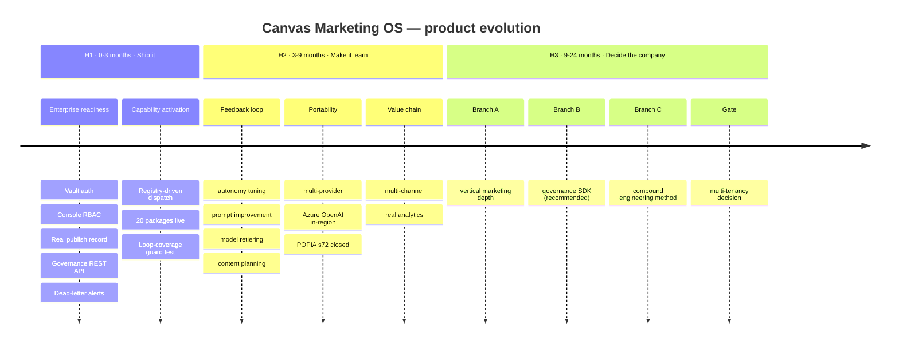

# 10 — Product Roadmap

*Derived from the codebase's own gaps and its own latent capabilities.
Every item is scored 1–5 on six axes. Nothing here is a generic
"add more AI" suggestion — each item names the file it changes.*

Scoring axes:
**BV** business value · **EE** engineering effort (5 = largest) ·
**SD** strategic differentiation · **ER** enterprise readiness ·
**AL** AI leverage · **CI** customer impact.

---

## Ranked backlog

| # | Item | BV | EE | SD | ER | AL | CI | Score* |
|---|---|---|---|---|---|---|---|---|
| R1 | Registry-driven generic dispatch (activate 20 packages) | 5 | 3 | 4 | 3 | 5 | 5 | **8.7** |
| R2 | Close the learning loop (feedback service) | 5 | 3 | 5 | 4 | 5 | 4 | **8.7** |
| R3 | Vault API authentication | 4 | 2 | 1 | 5 | 1 | 2 | **7.5** |
| R4 | Gatekeeper governance REST API + console cutover | 4 | 2 | 2 | 5 | 1 | 5 | **8.5** |
| R5 | Console role-based authorisation | 3 | 1 | 1 | 5 | 1 | 2 | **13.0** |
| R6 | Real Publisher Vault write | 4 | 1 | 2 | 5 | 1 | 2 | **15.0** |
| R7 | Dead-letter alerting | 3 | 1 | 1 | 4 | 1 | 3 | **13.0** |
| ~~R8~~ | ~~Opportunity scoring (activate `opportunity_cards`)~~ — **shipped**, see below | 5 | 3 | 4 | 2 | 5 | 5 | **8.0** |
| R9 | Multi-channel publishing (X, Facebook, email) | 4 | 3 | 2 | 2 | 2 | 5 | **5.3** |
| R10 | Handler idempotency | 3 | 3 | 1 | 4 | 1 | 2 | **4.7** |
| R11 | Distributed idempotency cache | 3 | 2 | 1 | 4 | 2 | 2 | **6.0** |
| R12 | Multi-provider LLM support (OpenAI/Azure OpenAI/Gemini) | 4 | 2 | 4 | 4 | 4 | 3 | **9.5** |
| R13 | Governance SDK extraction | 5 | 4 | 5 | 5 | 4 | 3 | **6.8** |
| R14 | Multi-tenancy | 5 | 5 | 2 | 5 | 1 | 5 | **4.6** |
| R15 | Editorial calendar & content plan UI | 4 | 4 | 2 | 2 | 2 | 5 | **3.8** |
| R16 | Real analytics sources (GA4/GSC/LinkedIn) | 4 | 3 | 1 | 3 | 2 | 4 | **4.7** |
| R17 | Prompt-injection defence on ingest | 3 | 2 | 3 | 4 | 4 | 1 | **7.5** |
| R18 | v2 contract window | 3 | 4 | 1 | 4 | 1 | 1 | **2.5** |
| R19 | Agent observability dashboard | 3 | 2 | 2 | 3 | 3 | 4 | **6.5** |
| R20 | Compound-learning productisation | 4 | 4 | 5 | 2 | 3 | 2 | **4.0** |

\* Score = (BV + SD + ER + AL + CI) / EE

---

## Horizon 1 — Next 90 days: *"make it shippable and make it produce"*

### R6 · Real Publisher Vault write — **1 week**
Replace `StubVaultRecordingAdapter` with an actual Vault call. Closes the
last link in the governance chain. Highest score in the whole backlog because
it is one file and it removes a hole in the platform's core claim.

### R5 · Console role-based authorisation — **2 days**
App-role claim in `console-app.bicep`'s `authConfig.validation` **plus** a
matching check in `console/app/auth.py::require_principal` — defence in
depth, exactly mirroring the RISK-003 pattern already used for
authentication. Removes the "any tenant user can pull the emergency stop"
finding.

### R7 · Dead-letter alerting — **2 days**
`worker.py` already receives and discriminates `DeadLetterAlert`. Route it to
the existing `teams_notify` path and add an Azure Monitor alert rule on the
log event. Two days to turn silent failure into a page.

### R4 · Gatekeeper governance REST API + console cutover — **3 days**
Add `GET/POST /kill-switch`, `GET /kill-switch/audit/last` and
`GET /approval-inbox` to `ca-gatekeeper`'s internal app; flip
`GATEKEEPER_API_MODE=real`. `console/README.md` already documents this as the
precondition and the client already exists. Makes the two most
operationally-critical screens show production state.

### R3 · Vault API authentication — **1 week**
Key-Vault-sourced bearer token validated by a FastAPI dependency, plus
`secret-writer-job.bicep` provisioning, container env wiring, and updates to
the smoke job and `test_contract_smoke.py`. The accepted-risks doc already
specifies the design.

### R1 · Registry-driven generic dispatch — **2–3 weeks**
The single highest-impact change in the repository.

```
today:  DISPATCH_TABLE = {5 hardcoded handlers}
        prompt read via functions_dir()
        registry signature never verified

target: startup: verify registry.json signature → load manifest
        dispatch: task_type → manifest entry → generic_function_handler()
        generic_function_handler:
          prompt   = manifest.prompt (content-hash verified)
          input    = build from schema.json.input + lineage result_ref
          response = gateway.complete(tier from manifest)
          validate response against schema.json.output
          write artefact per manifest.artefact_type
          set_result_ref; advance_dependents
```

Four of the five existing handlers already have this exact shape. This one
change activates 20 function packages, gives the registry a runtime role
(closing TD-09), and makes adding a new agent a **pure content change** —
no Python, no Dockerfile edit, no redeploy of the orchestrator.

**Add the guard test at the same time:** every `task_type` in any
`loops/*.yaml` must have a manifest entry or be on an explicit
intentional-pass-through allowlist.

**Horizon 1 outcome:** enterprise security review passes; the weekly content
studio produces real content; the console shows real state; failures page
someone.

---

## Horizon 2 — 3 to 9 months: *"make it learn and make it sell"*

### R2 · Close the learning loop — **3–4 weeks**
The platform's largest conceptual gap. A `services/feedback` service that
reads what is already written and emits **pull requests against policy
files**:

| Reads | Proposes |
|---|---|
| `approval_actions` + `gate_decisions` | `autonomy.yaml` diff — promote a `(function_id, action_class)` from level 1 to 3 after N consecutive clean approvals |
| `agent_runs.output.violations[]` | Per-function QA violation report → prompt improvement backlog |
| `kpi_rollup_cost_per_accepted_asset` | `routing.yaml` diff — retier a function whose cheaper tier has equal acceptance |
| `kpi_rollup_engagement_by_archetype` | Content-plan input for the Monday planning node |

**Critical design constraint:** every output is a *diff to a versioned file
that a human merges*. No autonomy is ever granted implicitly. This preserves
the platform's core property — that the AI's mandate is always an auditable
artefact — while making the mandate self-tuning.

This is the feature that turns a pipeline into an operating system, and no
competitor in the marketing-AI space has it.

### R12 · Multi-provider LLM support — **2 weeks**
The extension point is already built (`providers/base.py` is a one-method
Protocol; `registry.py` is a name→class map; `routing.yaml` names the
provider as a string; no vendor name appears in `config.py`, `completion.py`
or `routing.py`). Adding Azure OpenAI is one module plus one `register()`
plus a YAML edit.

Two payoffs: (a) **Azure OpenAI in `southafricanorth` removes the POPIA s72
cross-border question entirely** for functions that need it — which is a
sales unlock, not an engineering nicety; (b) it proves the portability claim
a buyer will test.

### ~~R8 · Opportunity scoring~~ — **SHIPPED**
`score-signals` writes a ranked `opportunity_cards` row per signal; the
brief leads with the best-evidenced ones; the weekly content loop picks its
pillar from those cards instead of an ISO-week rotation. `06-business-
architecture.md` §5's red node is green.

Two pieces of the original scope are deliberately **configuration rather
than code**, and both are unset:

  * **"feed only the top-N into `draft-brief`"** exists as
    `selection.top_n` / `selection.minimum_score` in
    `functions/_shared/scoring-policy.yaml`, with no value set — so scoring
    currently *reorders* the brief rather than filtering it. Setting one is
    a reviewed YAML edit; the brief then states in its own body how many
    signals were held back.
  * **The scoring rule itself** is function 09's `confidence` weighted by
    pillar. Recency decay and cross-source corroboration are absent because
    neither can be computed honestly from what a signal carries today
    (every signal in a batch shares one `received_at`; function 09 emits one
    item per story, not one per source). Adding either means changing what a
    scan *records* first — that is the real remaining work, and it is a scan
    change, not a scoring change.

### R9 · Multi-channel publishing — **3 weeks**
`weekly-content-loop.yaml` already carries three Buffer channel ids;
`publisher/app/config.py` hardcodes only LinkedIn. Add the other two, plus an
email path for the newsletter (`publish-newsletter` currently reuses
`publish.blog_article` because *"no email-specific gate-check identifier
exists"*).

### R16 · Real analytics sources — **3 weeks**
GA4, Search Console and LinkedIn clients. Heed learning L-0074: a
"goes-live-when-credentials-exist" design must be *independently verified
live*, not assumed.

### R17 · Prompt-injection defence — **2 weeks**
The only unmitigated attack surface. Fetched news bodies enter the `user`
role with no instruction-injection detection. Mitigations available: strict
output-schema validation (partially present), a delimiter/quoting convention
in the prompt, and a cheap Haiku pre-classifier over fetched content.

### R11 · Distributed idempotency cache — **3 days**
Redis or a `completions` table keyed on `task_ref`. Makes the double-spend
guarantee actually hold across replicas.

### R19 · Agent observability dashboard — **2 weeks**
The data exists (App Insights spans with 5 mandatory attributes, structured
JSON logs, `task_transitions`, `costs`). Nothing visualises agent behaviour
over time: success rate per function, cost trend, QA violation frequency,
approval latency, dead-letter rate.

---

## Horizon 3 — 9 to 24 months: *"decide what company this is"*

Horizon 3 is a **fork**, not a list. The three branches are mutually
compatible in code but not in go-to-market focus.

### Branch A — Deepen the vertical (marketing product)
R15 editorial calendar UI · richer content types (video briefs, ad copy,
landing pages) · CRM/MAP integration (HubSpot, Dynamics) · a real DAM
interface over the content-addressed blob store · A/B testing wired to the
engagement rollup.
**Comparable:** Jasper, Writer, Typeface. **Multiple:** 6–10× ARR.
**Risk:** crowded, well-funded, and the governance moat may not be priced.

### Branch B — Extract the horizontal (R13 · governance SDK) ★
The seam is already clean: `gatekeeper`, `model-gateway`, `publisher`,
`vault`, `registry` and `telemetry-lib` contain **zero marketing logic**.

```
canvas-agent-governance/
  policy/        autonomy levels, fail-closed defaults
  gateway/       routing, budgets, redaction, metering
  approval/      inbox, single-use links, identity binding
  authorisation/ signed action tokens, hash binding, replay ledger
  vault/         taxonomy, consent, retention, audit
  registry/      prompt/agent versioning, signing, evals
  telemetry/     closed-enum PII-safe spans
```

Ship as: a Python SDK + a deployable control plane + MCP-native integration
so any agent framework (LangChain, CrewAI, Claude Agent SDK, AutoGen) can
route its tool calls through the gate.

**The pitch:** *"Your agents already work. Now prove what they were allowed to
do, what they did, what it cost, and who said yes."*
**Comparable:** Credo AI, LLMOps platforms, "Vanta for AI agents".
**Multiple:** 15–25× ARR. **This is the branch the code most supports.**

### Branch C — Productise the method (R20)
The 79 compound learnings, the worktree-per-session model, the
spec→plan→build→multi-lens-review loop, and a live production system built by
it. Sell the *method* — as a consulting practice, a licensed framework, or an
agent-loop product — with Canvas Marketing OS as the reference implementation.

**Comparable:** none clean. **Risk:** requires extracting the method from
this one repository to be credible, and the method's evidence is currently
inseparable from the product.

### R14 · Multi-tenancy — the gate on all three branches
Branch A and Branch B both require it. Branch C does not. Three options are
costed in `07-operating-model.md` §D.3. **Make this decision in Horizon 2, not
Horizon 3** — the retrofit cost grows with every row written.

---

## The three-slide roadmap



---

## What NOT to build

Equally important, and each backed by something the code already establishes:

| Don't build | Why |
|---|---|
| **A conversational agent UI** | The whole architecture is deterministic, reproducible, auditable DAGs. Chat destroys reproducibility and every governance property that depends on it |
| **Autonomous publishing without human approval** | The approval gate *is* the product. Removing it removes the differentiator |
| **A vector store / RAG layer, by default** | Nothing currently needs semantic retrieval. Prompts are static; context is DAG-lineage-resolved. Add it only when a use case demands it, not for completeness |
| **More function packages** | 20 already exist and don't run. Activation beats creation until R1 ships |
| **A custom LLM / fine-tuning** | `routing.yaml` deliberately picks *conservative established snapshots over the newest generation*. Model choice is a data change; owning a model is a company change |
| **Your own agent framework** | MCP is already adopted. The differentiation is governance, not orchestration primitives |
| **A general-purpose workflow engine** | Temporal and Dagster exist and are better at it. The loop DAG is deliberately minimal and that minimality is what makes it verifiable |
