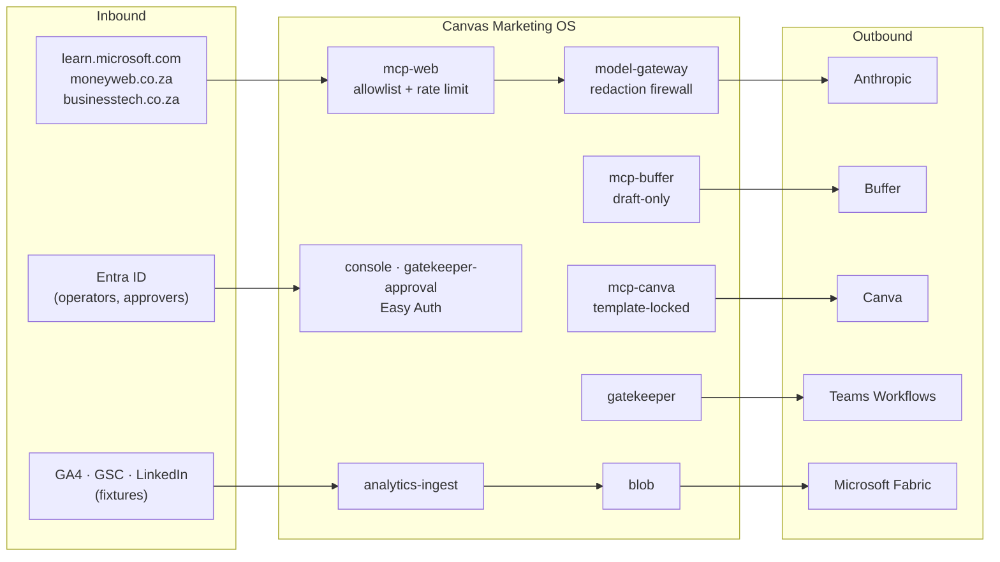

# 12 — Integration Catalogue

*Every external system the platform touches, how it authenticates, what
data crosses the boundary, and what happens when it fails.*

---

## 1. Integration inventory

| # | System | Direction | Via | Auth | Mode | Maturity |
|---|---|---|---|---|---|---|
| I1 | **Anthropic Messages API** | outbound | `providers/anthropic.py` (httpx, no SDK) | `x-api-key` from Key Vault → Container Apps secretRef | **live** | L4 |
| I2 | **Buffer** | outbound | mcp-buffer → GraphQL | `BUFFER_API_KEY` from Key Vault | **dual** — live if key resolves | L3 |
| I3 | **Canva** | outbound | mcp-canva → REST | OAuth2 + PKCE, client id/secret from Key Vault | **fixture** — no refresh token exists | L2 |
| I4 | **Public web** (3 domains) | inbound | mcp-web `fetch_url` | none (public) | dual, allowlisted | L4 |
| I5 | **Microsoft Teams** | outbound | Power Automate Workflows HTTP trigger | webhook URL from Key Vault | **flag-gated off** | L3 |
| I6 | **Microsoft Entra ID** | inbound | Container Apps Easy Auth | OIDC + Federated Identity Credential | **live** | L4 |
| I7 | **Azure Key Vault** | outbound | native Container Apps secretRef + SDK fallback | managed identity | live | L4 |
| I8 | **Azure Blob Storage** | both | `azure-storage-blob` | managed identity | live | L4 |
| I9 | **Azure Service Bus** | both | `azure-servicebus` | managed identity (`disableLocalAuth`) | live | L4 |
| I10 | **Application Insights / Log Analytics** | outbound | OpenTelemetry + `azure-monitor-query` | connection string / managed identity | live | L4 |
| I11 | **Microsoft Fabric** | outbound | blob shortcut | (Fabric-side) | **export written; shortcut not provisioned** | L2 |
| I12 | **Power BI** | outbound | starter dataset definition | — | **definition only** | L1 |
| I13 | **GitHub Actions → Azure** | outbound | OIDC federated identity | no client secret | live | L4 |
| I14 | **Azure Container Registry** | both | managed identity `AcrPull`; OIDC push | admin user **disabled** | live | L4 |
| I15 | **GA4** | inbound | `ga4_client.py` | — | **fixture only** | L1 |
| I16 | **Google Search Console** | inbound | `search_console_client.py` | — | **fixture only** | L1 |
| I17 | **LinkedIn API** | inbound | `linkedin_client.py` | — | **fixture only** | L1 |
| I18 | **Fireflies** | — | referenced by fn 26's skill.md | — | **not implemented** | L0 |

**Live external integrations: three** (Anthropic, the public web, and
Entra). Everything else is Azure-internal, fixture-backed, or flag-gated off.

---

## 2. Integration topology



**Every outbound integration passes through a chokepoint that enforces a
guardrail.** There is no direct vendor SDK call from any handler.

---

## 3. I1 · Anthropic — the only live AI provider

**Adapter:** `services/model-gateway/providers/anthropic.py`, ~160 lines,
raw httpx. The rationale is stated: httpx is already a dependency, exactly one
endpoint is called, an SDK "would not earn its keep."

**Endpoints:** `POST /v1/messages`, `GET /v1/models` (startup validation).
**Version header:** `anthropic-version: 2023-06-01`. **Timeout:** 60s.

**Models** (`policy/routing.yaml`):
| Logical id | Tier | Provider model |
|---|---|---|
| `claude-opus` | opus | `claude-opus-4-8` |
| `claude-sonnet` | sonnet | `claude-sonnet-4-6` |
| `claude-haiku` | haiku | `claude-haiku-4-5-20251001` |

The file's header is unusually rigorous and worth quoting: every original id
(`claude-opus-4-20250514`, `claude-sonnet-4-20250514`,
`claude-3-5-haiku-20241022`) was **absent** from a live `/v1/models` call —
retired, not merely stale. The current ids were proven live on 2026-07-30
against the real account key. And the choice is **deliberately conservative**:
established 4.x snapshots rather than the newest 5-generation, because the
5-generation "has not yet been evaluated against this gateway's routing
tiers/budgets."

**The `_split_system_prompt` fix** (`F-GATEWAY-SYSTEM-ROLE`, round 16) is
instructive: every caller builds `[{role:"system"},{role:"user"}]` — the
provider-agnostic shape the frozen contract expects. Anthropic **rejects**
`role: "system"` inside `messages` with an HTTP 400. The adapter is the one
place responsible for translating, exactly as its docstring promises. It was
discovered live because every unit test used a stub `Provider`, so **nothing
had ever asserted the real HTTP body shape end to end.**

**Data crossing the boundary:** system prompts (static, from git), user
content (structured JSON built by handlers — brief bodies, draft text, fetched
news article bodies). **Everything is redaction-scanned first except the
system role**, for the reasons documented at length in `redaction.py`.

**Failure:** `raise_for_status()` → `httpx.HTTPStatusError` → a `500
PROVIDER_ERROR` with the upstream status logged server-side. No retry at the
gateway layer; the orchestrator's own state machine handles it.

**Cross-border note:** this is a **US-hosted inference provider**. The
redaction firewall exists precisely because of that, and
`contracts/model-gateway/redaction-rules.yaml`'s own header is explicit that
it *"is not itself a transfer-lawfulness mechanism and does not establish a
ground for sending personal information to a US-hosted inference provider.
Treat it as one control among several, never as the control."*

---

## 4. I2 · Buffer — social scheduling

**Two independent clients**, deliberately (the services share no library):
`mcp/mcp-buffer/app/dispatch.py` (GraphQL) and
`services/publisher/app/buffer_client.py` (MCP-over-HTTP to mcp-buffer).

**Three tools only.** `create_draft` sends exactly `{channel_id, text}` —
"the ONLY 2 arguments ever sent — no status/mode/state (AC-09)". mcp-buffer
hardcodes `_CREATE_DRAFT_STATUS = "draft"` server-side and accepts no
override.

**Channels** (`publisher/app/config.py`, all three mapped so a known
transposition error in the source GOAL text can never recur):
```
LinkedIn 68e73facca3a4e6b746d17b4   ← the only one Publisher uses
Facebook 68e74731ca3a4e6b746d2469
X        68e745c6ca3a4e6b746d22b2
org      68e5f2187fe9a5263a3509ab
```

**Free-tier cap: 10 queued posts — verified against the live account on
2026-08-06** (`19-live-verification-log.md` B2; the code flags it as an
unverifiable assumption, which it no longer is). Enforced as a **live
`list_queue` count check** before every create, not as a static assumption — because "other
actors/tools could also add to the same queue between runs". The weekly loop
independently caps itself at 8 for headroom.

**Failure:** `BufferClientError` → the publish is **refused** with
`buffer_queue_cap_exceeded` and a `publish_attempts` row. Fails closed.

---

## 5. I3 · Canva — design generation

Three tools, two of which are **template-locked** (`template_id` required in
the runtime `inputSchema`). There is no blank/free-form design creation path.

Currently **fixture-only**: `canva-refresh-token` does not exist as a Key
Vault secret. `mcp/mcp-canva/scripts/oauth_consent.py` runs a local OAuth2 +
PKCE flow (redirect `http://127.0.0.1:8484/oauth/redirect`) and *prints* the
refresh token for an operator to load into Key Vault through the existing
gated in-VNet path. **The script never touches Key Vault itself** — a
deliberate separation of the consent flow from the secret-loading flow.

Function 45 (carousel writer) produces a Canva Bulk Create CSV manifest, so
the intended flow is: agent writes slides + CSV → `bulk_create_from_csv`
autofills a brand template → `export_design`. That flow is designed and
unexercised.

---

## 6. I4 · Public web — the knowledge intake

**One tool, `fetch_url`. Four URLs. Three domains.**

```yaml
# functions/09-market-intelligence-director/fetch_sources.yaml
version: 1
topic: "Microsoft Fabric adoption and multi-entity finance consolidation in South African enterprises"
horizon_days: 30
urls:
  - https://learn.microsoft.com/en-us/fabric/get-started/whats-new
  - https://www.moneyweb.co.za/feed/
  - https://www.moneyweb.co.za/news/tech/feed/
  - https://businesstech.co.za/news/feed/
```

Read at runtime by `ingest_signals_handler` — never hardcoded in Python. Each
body is truncated to 2,000 characters and handed to function 09's prompt as
retrieval evidence.

The domain list is mirrored into `MCP_WEB_ALLOWLIST` in `infra/main.bicep`,
and the two **currently agree exactly** (`learn.microsoft.com`,
`www.moneyweb.co.za`, `businesstech.co.za`) — verified against
`infra/main.bicep` L971–972. Nothing enforces that agreement, so it remains a
drift risk rather than a guarantee. The allowlist is checked **before any
network call is made** — not after a response, not by URL rewriting.

**Live mode is undeclared config drift — see `09-technical-debt.md` TD-31.**
`MCP_WEB_LIVE_MODE` gates fixture-vs-live and appears nowhere in `infra/`. It
was set by hand on the live Container App (evidence: learning L-0074,
2026-08-02). Because ARM replaces the `env` list declaratively and
`mcpDeployToken` defaults to `utcNow()`, the next `deploy-infra` or
`deploy-governance` run reverts mcp-web to fixture mode — where `fetch_url`
ignores the URL and returns the same synthetic placeholder for all four
sources, with the loop still reporting success.

**Failure:** one bad source never sinks the scan — `ingest_signals_handler`
logs `fetch_url_failed` and continues. Only if *every* source fails does it
raise `DispatchError`.

**Second failure mode, more subtle:** real news prose trips the
`full-name-like` redaction pattern (any two consecutive Title-Case words).
`_complete_ingest_with_redaction_fallback` drops one source at a time and
retries — degrading signal completeness rather than dead-lettering the task —
and never second-guesses the firewall's ruling.

**Unmitigated risk:** article bodies (2,000 chars each) reach the `user` role
with **no prompt-injection defence**. See `09-technical-debt.md` SEC-6.

---

## 7. I5 · Microsoft Teams — approvals and notifications

Classic O365 connector webhooks (MessageCard + `potentialAction`) were retired
in the **May 2026 connector shutdown** (learning L-0033), so
`teams-webhook-url` must be a **Power Automate Workflows** HTTP-trigger URL
and the body must be an **Adaptive Card v1.4**.

**Approve/Reject are `Action.OpenUrl` deep links only.** The reasoning is
explicit and correct: submit-style actions would need a registered Bot
Framework bot, and — *"more importantly — a submit-style postback would make
'who clicked' a claim of the card payload rather than an authenticated
identity."* The OpenUrl links point at the Entra-protected approval app,
where identity comes from Easy Auth headers.

**Currently off.** `TEAMS_WEBHOOK_URL` is absent in `cmos-dev`; the
`approval_inbox` row *is* the delivery mechanism, and that is the primary
end-to-end-tested path. `gatekeeper-app.bicep` was recently wired to accept
the secret (commit `e148d18`).

---

## 8. I6 · Entra ID — the only identity provider

Two apps behind Container Apps built-in authentication:

| App | `unauthenticatedClientAction` | Identity used for |
|---|---|---|
| `ca-console` | (Easy Auth) | operator identity on kill-switch toggles |
| `ca-gatekeeper-approval` | `Return401` | **the recorded approver on every approval decision** |

Headers injected by the platform and parsed by `auth.py` in both apps:
`X-MS-CLIENT-PRINCIPAL-ID` · `-NAME` · `-IDP` · `X-MS-CLIENT-PRINCIPAL`
(base64 claims blob, used as a fallback).

**Fully secretless** via a Federated Identity Credential (learning L-0013,
`scripts/bootstrap-console-auth.sh`, `docs/console-auth-runbook.md`) — no
client secret exists for either app registration.

**Gap:** authentication only. `allowedApplications` is empty and no app-role
or group claim is required, so any authenticated tenant user reaches every
console screen. Mitigated only by a Portal-set "Assignment required = Yes"
that a human must remember (`docs/accepted-risks.md`).

---

## 9. I11/I12 · Microsoft Fabric and Power BI

`analytics_ingest.fabric_export.export_fabric_day()` assembles one JSON object
per day, **validates it against
`analytics/contracts/fabric-nightly-export.schema.json`** (four arrays, each
mirroring a `kpi_rollup_*` table exactly), and uploads it to the
`analytics-fabric-export` blob container.

`analytics/powerbi/analytics-dataset.json` is a starter dataset definition —
four tables, typed columns, each naming its `source_array`. Its own
description says: *"This file is a starter definition only — no live Power BI
workspace/dataset is provisioned or refreshed by this build."*

**The last mile is not built.** The Fabric shortcut is not provisioned; no
Power BI workspace exists; no refresh schedule. The export lands in a blob
container and stops.

**[INFERRED]** This is intentional and appropriate — Canvas Intelligence's
own business *is* Microsoft Fabric implementation. The platform produces a
contract-validated payload and hands off to the practice that owns Fabric.

---

## 10. Credentials and secret management

**Key Vault secrets** (`kv-cmos-dev-*`, `publicNetworkAccess: Disabled`):

| Secret | Consumer | State |
|---|---|---|
| `vault-db-connection-string` | Vault | live, re-synced by `caj-vault-secret-writer` |
| `buffer-api-key` | mcp-buffer | present |
| `canva-client-id` / `canva-client-secret` | mcp-canva | present |
| `canva-refresh-token` | mcp-canva | **does not exist** |
| `teams-webhook-url` | Gatekeeper | **absent** |
| `gate-token-signing-key` | Gatekeeper (sign) / Publisher (verify only) | live, RSA |
| `ANTHROPIC_API_KEY` | model-gateway | via secretRef |

**Two credential-flow patterns coexist**, and the distinction is deliberate:
- **Native Container Apps secretRef** — the platform resolves the Key Vault
  reference and projects it into the process env. This is what keeps the
  vault's `publicNetworkAccess: Disabled` viable: *"the gateway never calls
  the vault data plane itself."*
- **SDK lookup with `DefaultAzureCredential`** — used by the Vault service's
  DB-URL fallback and by `mcp_common.credentials`.

`docs/credentials-runbook.md` is **known stale** on Buffer/Canva secret
names; `mcp/README.md` records the correct ones and says so.

---

## 11. Failure-mode summary

| Integration | Failure | Behaviour | Fails |
|---|---|---|---|
| Anthropic | non-2xx | 500 `PROVIDER_ERROR`, orchestrator retries 3× then dead-letters | closed |
| Anthropic | redaction block | 400, `gate_decisions` row, ingest drops a source and retries | closed |
| Anthropic | metering write fails | **completion still returned**, `cost_id` omitted, ERROR logged | **open, deliberately** |
| Buffer | unreachable / cap | publish refused, `publish_attempts` row | closed |
| Public web | one source down | logged, continue with the rest | open |
| Public web | all sources down | `DispatchError` → retry → dead-letter | closed |
| Teams | webhook absent | inbox row is the delivery | open |
| Key Vault | unreachable | service cannot start / cannot resolve DB | closed |
| Postgres | unreachable | `/health` still 200; `/status` returns `[]`; MCP logging skipped | mixed, by design |
| App Insights | unreachable | span presence → `not_checked`; console trace → empty state + flag | open |
| Vault | lookup fails with `asset_id` supplied | publish **refused** (`vault_lookup_failed`) | closed |
| Gatekeeper | unreachable from `run_state` | `{"status":"unknown"}` rather than a 500 | open |

**The one deliberate fail-open worth understanding:** a metering write failure
does **not** fail the completion. The reasoning is written into the code —
*"the expensive, valuable work already succeeded; a transient Postgres blip
must never turn a real, already-paid-for completion into a 500 for the
caller — that would be strictly worse than a missed costs row."* Logged at
ERROR, `cost_id` simply omitted (contract-safe, since it is not in the
response's `required` list).

---

## 12. Integration gaps

| Missing | Impact |
|---|---|
| CRM / marketing automation (HubSpot, Dynamics, Salesforce) | No lead or pipeline linkage — marketing output cannot be tied to revenue |
| Email service provider | `publish-newsletter` reuses `publish.blog_article` because *"no email-specific gate-check identifier exists"* |
| Fireflies | Referenced by fn 26's skill.md; no client, no tool, no MCP server |
| Website / CMS | No path to publish web copy despite `positioning.md` naming "fix the shop window" as priority #1 |
| Semrush / SEO tooling | `vault-api.yaml`'s own example cites `source: "semrush"` — no integration exists |
| Slack | Teams only |
| Calendar | No scheduling awareness in the content plan |
