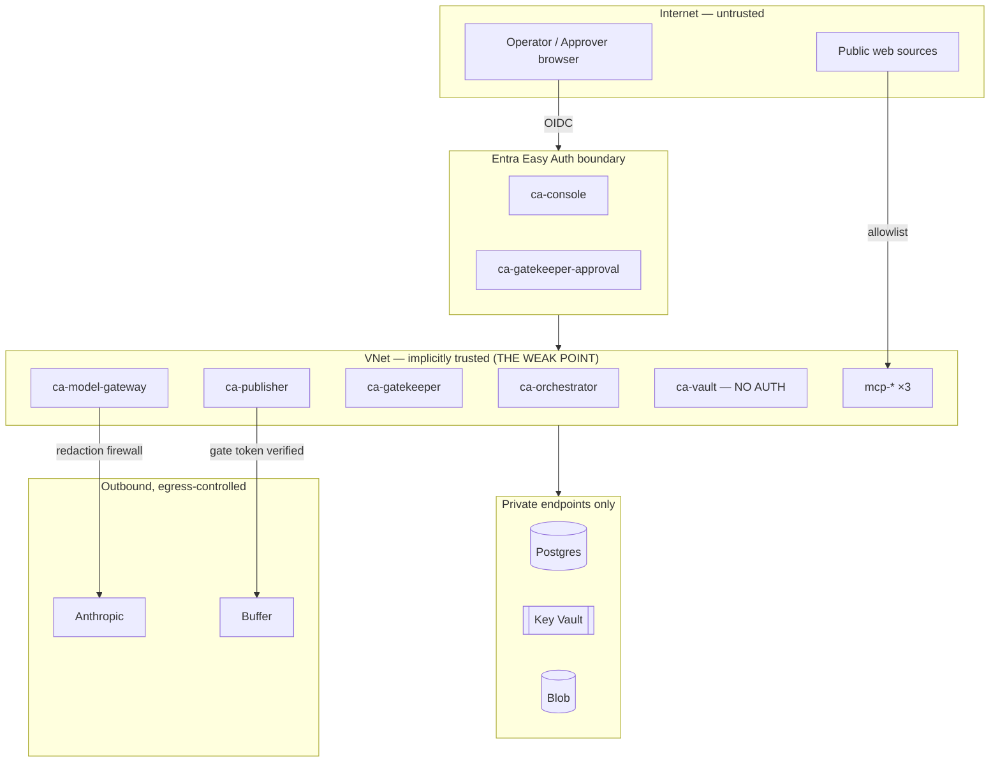
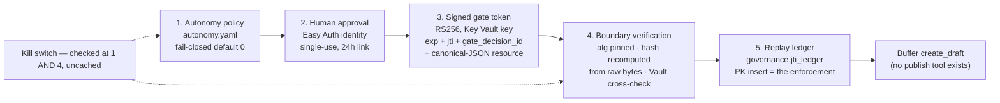
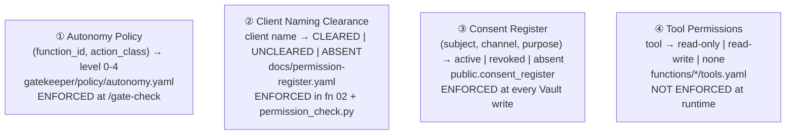

# 14 — Security Model & Permission Model

*What the code enforces. Where a control is documented but not enforced, it
is marked **NOT ENFORCED**.*

---

## Part 1 — Security Model

### 1.1 Trust boundaries



**The security model is fundamentally perimeter-based.** Once inside the
VNet, there is no service-to-service authentication at all — five of eight
services enforce zero authentication. This is documented, not accidental
(`docs/accepted-risks.md`), but it is the single largest structural weakness.

### 1.2 Authentication inventory

| Boundary | Mechanism | Strength |
|---|---|---|
| Human → console | Entra Easy Auth + FIC (no client secret) | **Strong** |
| Human → approval app | Entra Easy Auth, `Return401` | **Strong** |
| Service → Postgres | admin username/password from Key Vault | Moderate — a single shared admin account for 5 schemas |
| Service → Key Vault | managed identity | **Strong** |
| Service → Blob | managed identity (no account key, no SAS) | **Strong** |
| Service → Service Bus | managed identity, `disableLocalAuth: true` | **Strong** |
| Service → Anthropic | API key from Key Vault via secretRef | Standard |
| Service → ACR | managed identity `AcrPull`, admin user disabled | **Strong** |
| CI → Azure | OIDC federated identity, **zero client secrets across 13 workflows** | **Strong** |
| **Service → Service** | **none** | **Absent** |

### 1.3 The authorisation chain for an outbound action

Five independent layers. An attacker must defeat **all five**.



**What each layer defeats:**

| Layer | Defeats |
|---|---|
| 1 | An agent attempting an action outside its mandate; an unlisted function silently gaining authority |
| 2 | Autonomous publication; unattributable approval; link forwarding (identity ≠ possession); stale approvals (24h) |
| 3 | Forged authorisation (asymmetric, issuer-held private key); unbounded validity (`exp`) |
| 4 | `alg:none`; algorithm confusion; **approve-A-publish-B** (hash recomputed from the bytes, never trusted); a corrupted `assets.content_hash` column |
| 5 | Replay across replicas and restarts (durable, PK-enforced, atomic) |
| Kill switch | Everything, within 5 seconds, globally or per function |

### 1.4 The gate token in detail

```
Header  {"alg":"RS256","typ":"JWT"}
Claims  {iss, sub, aud, iat, exp, jti, gate_decision_id,
         resource: '{"content_hash":"<hex>","function_id":"<id>"}'}
```

Four properties, each enforced:

**(a) Algorithm pinning happens first.** `_pin_algorithm()` inspects the
header *before any signature work*, rejecting `alg: none` and algorithm
confusion (HS256 signed with the RSA public PEM as an HMAC secret) with the
distinct reason `invalid_alg`.

**(b) The `resource` claim is canonical JSON, and canonicalisation is a
security property, not formatting.** The frozen v1 schema sets
`additionalProperties: false`, so `function_id` and `content_hash` cannot be
top-level claims. They are packed as
`json.dumps(obj, sort_keys=True, separators=(",",":"))`. The verifier
**re-serialises the parsed claim and requires byte equality** — because
without that, two different serialisations of the same object would compare
unequal, or a semantically different one could compare equal, in a
hash-binding comparison.

**(c) The approver is never a claim.** It is resolved server-side via
`gate_decision_id → gate_decisions.decided_by`, *"so a token never carries a
human identity it could leak."*

**(d) Publisher holds only the public key.** Its managed identity has
verify/get on Key Vault and cannot sign (AC-20).

**Contract-level note:** `contracts/gate-token/spec.md` allows RS256, ES256,
EdDSA and PS256. Only RS256 is issued and accepted, because **Azure Key
Vault standard tier cannot create, sign or verify Ed25519 keys at any SKU**
(learning L-0031).

### 1.5 Data protection

| Control | Mechanism | Strength |
|---|---|---|
| **Egress DLP** | Redaction firewall pre-provider: SA ID (13-digit), SA phone (+27/0XX), email, name-shape + exact-match fixtures | Moderate — regex-based, **coverage known incomplete**, which is *why* every block is audited |
| **Queue redaction** | Metadata-only envelopes, ids not content | **Strong** — structural |
| **Telemetry redaction** | Closed enum keys + 200-char rejection | **Strong** — structural |
| **Consent gating** | 403 on any `data_subject_ref` write with no active matching consent | **Strong** |
| **Encryption at rest** | Azure defaults (Postgres, Blob, Key Vault) | Standard |
| **Encryption in transit** | TLS 1.2 minimum on Service Bus; HTTPS throughout | Standard |
| **Retention** | 4 classes, sweep fails closed on blob-delete error | **Strong** |
| **Content addressing** | SHA-256 blob names, dedup, reference-counted deletion | **Strong** |
| **Error-message hygiene** | DR-3/4/5 — no submitted value ever echoed in a 400 | **Strong, unusually thorough** |

The DR-4 fix deserves repeating because it is the kind of bug that only
appears in careful reviews: matched-pattern ids were originally
`f"fixture:{value}"`, where a fixture value **is** a real client name. That
id went into the caller-facing 400 body *and* into the permanent
`gate_decisions.reason` column — *"defeating the firewall through its own
audit trail."* Ids are now contract-side coordinates
(`fixture:client_names:0`).

### 1.6 Network security

| Resource | Public access | Reachable from |
|---|---|---|
| Postgres | **Disabled** | private endpoint in `snet-pe` |
| Key Vault | **Disabled** | private endpoint |
| Storage | private endpoint | VNet |
| Container Registry | public endpoint, admin user disabled | managed-identity pull only |
| **Service Bus** | **Public (Standard SKU)** | Entra-authenticated callers only |
| Container Apps | 6 internal, 2 external | — |

The Service Bus exposure is an explicitly accepted, budget-owner-approved
risk with **three compensating controls**: `disableLocalAuth: true` (SAS
disabled entirely — Entra only), `minimumTlsVersion: 1.2`, and metadata-only
envelopes. The reasoning is sound: even a successful read exposes only ids.

### 1.7 Audit and non-repudiation

Six append-only tables. Nothing in the codebase issues an `UPDATE` or
`DELETE` against any of them.

| Table | Records | Immutability mechanism |
|---|---|---|
| `gate_decisions` | Every authorisation decision, human and machine | **No `updated_at` column, deliberately** |
| `approval_actions` | Every approval-link click, 4 outcomes | CHECK-constrained outcome |
| `publish_attempts` | Every publish attempt, 12 reasons | CHECK-constrained outcome |
| `vault_internal.audit_log` | Every taxonomy/consent rejection, every retention deletion | Written on an **isolated connection** so it survives the rollback |
| `task_transitions` | Every state change, 10 CHECK-constrained reasons | append-only by construction |
| `jti_ledger` | Every consumed token | PK insert only |

**`write_audit_isolated()` is the subtlest and most important of these.** The
rejection paths run inside a transaction that they then abort by raising. On
a shared connection, the audit row would roll back with everything else —
*"silently losing the very audit trail the rejection is supposed to
produce."* A separate pooled connection makes the audit survive.

### 1.8 Threat model — what an attacker can and cannot do

| Attack | Outcome |
|---|---|
| Steal an approval link | **Blocked** — 401 without an Easy Auth principal |
| Replay a used approval link | **Blocked** — atomic conditional UPDATE; 409 + audit |
| Use an expired link | **Blocked** — 410 + audit |
| Forge a gate token | **Blocked** — RS256, issuer-held private key |
| `alg: none` / algorithm confusion | **Blocked** — pinned before any signature work |
| Replay a gate token | **Blocked** — durable PK-enforced ledger |
| Approve draft A, publish draft B | **Blocked** — hash recomputed from the raw bytes |
| Publish after the kill switch is pulled | **Blocked** — re-checked before jti consumption |
| Exfiltrate PII via a prompt | **Mitigated** — firewall; regex coverage incomplete |
| Exfiltrate PII via a tool definition | **Blocked** — `tools[]` is serialised and scanned |
| Exfiltrate PII via an error message | **Blocked** — DR-3/4/5 |
| Exfiltrate PII via telemetry | **Blocked** — closed enum + 200-char limit |
| Grant an agent new authority by naming a function | **Blocked** — fail-closed default level 0 |
| Bypass approval via a smoke/test function id | **Blocked** — none exists; a test forbids `smoke.*`/`test.*` |
| Name an uncleared client | **Blocked** — default-deny register with a self-test |
| **Reach any internal service from inside the VNet** | **NOT BLOCKED** — no service-to-service auth |
| **Read/write/delete any Vault object from inside the VNet** | **NOT BLOCKED** — zero auth on the system of record |
| **Pull the kill switch as any authenticated tenant user** | **NOT BLOCKED** — authentication without authorisation |
| **Inject instructions via a fetched news article** | **NOT BLOCKED** — no prompt-injection defence |

The four unblocked rows are the security roadmap. Three are one week of work
each (`10-product-roadmap.md` R3, R5, R17).

---

## Part 2 — Permission Model

### 2.1 The four independent permission systems

This platform has **four separate permission models that do not share a
vocabulary or an enforcement point**. Understanding that is essential.



### 2.2 ① Autonomy policy — the delegation-of-authority matrix

```yaml
version: 1
default_level: 0            # fail closed
entries:
  - {function_id: publish.social_post,           action_class: publish,  level: 1}
  - {function_id: publish.paid_ad,               action_class: publish,  level: 0}
  - {function_id: publish.blog_article,          action_class: publish,  level: 2}
  - {function_id: draft.social_post,             action_class: draft,    level: 3}
  - {function_id: draft.brief,                   action_class: draft,    level: 3}
  - {function_id: analyse.signal,                action_class: analyse,  level: 4}
  - {function_id: analyse.campaign_performance,  action_class: analyse,  level: 4}
```

Seven entries. Every unlisted pair resolves to level 0 and is blocked.

| Level | Human? | Token issued? | Audit row? |
|---|---|---|---|
| 0 blocked always | — | ❌ | ✅ `level_0_blocked` |
| 1 single approver | ✅ one click | after approval | ✅ escalated, then approved |
| 2 elevated | ✅ one click *(quorum reserved, not built)* | after approval | ✅ distinct reason string |
| 3 auto-approved, audited | ❌ | ✅ | ✅ `level_3_auto_approved` |
| 4 autonomous passthrough | ❌ | ✅ | ✅ `level_4_autonomous_passthrough` |

**Load-time validation is strict and fails the service, not the request:**
duplicate `(function_id, action_class)` pairs, unknown keys, non-integer or
out-of-range levels, and a non-mapping top level are all `PolicyError` at
startup — *"the service must never start with a half-understood policy and
then fail open on the first request."*

**Two invariants enforced by `tests/test_policy.py`:** no `publish`-class
entry above level 2, and no `function_id` matching `smoke.*` / `test.*`.

The policy is **cached deliberately** (unlike kill switches) because it is a
build-time artefact shipped in the bundle and only changes on redeploy.

### 2.3 ② Client naming clearance — default deny

`docs/permission-register.yaml`, six clients, **all UNCLEARED**: Imperial,
Rotork, Weir, ArcelorMittal SA, SGB Cape, Delta.

```yaml
default_policy: deny
absent_name_policy: deny     # absent == UNCLEARED == blocked
graduates_to: vault.consent_register
```

Four properties, all tested:
- Only the exact string `CLEARED` permits naming. A typo, an empty value, or
  a future `PENDING` all block.
- **Absence blocks identically to explicit UNCLEARED** — same `allowed=False`,
  same violation code. `_self_test()` asserts exactly this equality.
- Alias resolution and case-insensitivity ("imperial logistics" → Imperial).
- **A missing register file returns an empty index, not an allow-all** —
  *"a missing register cannot mean 'allow everything'."*

The file documents its own graduation path to the Vault `consent_register`
table, with the requirement that *"the default-deny semantics must survive
that move unchanged."*

### 2.4 ③ Consent register — POPIA-shaped, enforced at write time

Enforced in `services/vault/vault/routers/objects.py::handle_consent_gate`:

```
if object_table == "consent_register":  return None   # a grant is not a consumption
if "data_subject_ref" not in payload:   return None   # not client-derived
if not consent_channel or not consent_purpose:  raise 422
consent_id = find_active_consent(subject, channel, purpose)   # revoked_at IS NULL
if consent_id is None:  audit + raise 403 consent_required
link_consent(object, consent_id)                              # durable linkage
```

The self-exclusion is important and explained: gating `consent_register` on
itself *"would make it structurally impossible to ever record a subject's
first consent."*

Note the two deliberately distinct naming schemes, called out in the code so
they are never conflated: the generic cross-cutting
`consent_channel`/`consent_purpose` payload keys used to gate *other* object
types, versus `consent_register`'s own `channel`/`purpose` **columns**.

### 2.5 ④ Tool permissions — declared, NOT ENFORCED

```yaml
tools:
  - name: permission_register_lookup
    permissions: read-only
    scope: docs/permission-register.yaml
```

`contracts/function-definition/tools.schema.json` calls `permissions` *"the
coarse permission class the orchestrator enforces."* **The orchestrator does
not read `tools.yaml` at all.**

Real enforcement is architectural: handlers only construct the clients they
were written to construct, and each MCP server enforces its own guardrail
server-side. That is defence by construction — arguably stronger — but the
manifest implies a capability system that does not exist.

### 2.6 Human roles — as implemented

| Role | Identity | Can do | Cannot do |
|---|---|---|---|
| **Approver** | Entra principal on the approval-action request | Approve/reject one specific action bound to one content hash | Anything else — the app mounts exactly one functional route |
| **Operator** | Entra principal on a console request | Read all 6 screens; toggle the kill switch | Approve, create, edit, delete — the console has one mutating route |
| **Engineer** | GitHub + OIDC | Change policy, prompts, code; deploy | Bypass the `cmos-dev` GitHub Environment human gate |
| **Directory admin** | Entra admin | App registration, FIC, assignment | — |

**No role hierarchy, no groups, no per-object ACLs, no delegation.** Identity
is entirely delegated to Entra; there is no in-app authorisation model at
all — no `users`, `roles` or `permissions` tables.

### 2.7 Machine identities

| Identity | Grants |
|---|---|
| `id-orchestrator` | Service Bus Sender + Receiver, ACR pull, App Insights |
| `id-vault` | Key Vault Secrets User, Storage Blob Data Contributor, ACR pull |
| `id-gateway` (user-assigned) | Key Vault Secrets User, ACR pull |
| `id-gatekeeper` | Key Vault **Crypto User (sign)**, ACR pull |
| `id-publisher` | Key Vault **Crypto User (verify/get only — cannot sign)** | 
| `id-console` | App Insights reader, ACR pull |
| `id-mcp-*` ×3 | Key Vault Secrets User (scoped), ACR pull |
| Logic Apps ×3 | Service Bus **Data Sender only** |
| GitHub OIDC | Contributor + User Access Administrator on the subscription |

The gatekeeper/publisher split is the important one: **the service that signs
cannot verify-only, and the service that verifies cannot sign.** That is
correct key separation.

The GitHub OIDC identity holding **User Access Administrator** is the widest
grant in the system — necessary because Bicep declares role assignments
inline, but it means a compromised workflow can grant itself anything.

### 2.8 Permission model gaps

| Gap | Severity |
|---|---|
| **No service-to-service authentication** | Critical |
| **No authorisation on the console** — any authenticated tenant user reaches the kill switch | High |
| **Tool permissions declared but not enforced** | Medium — the manifest implies a capability system that isn't there |
| **No role model** — no users/roles/permissions tables, no groups, no delegation | Medium |
| **Level 2 ≡ level 1** — no quorum, no second approver | Medium |
| **No approval delegation or timeout escalation** | Medium |
| **Single shared Postgres admin account across 5 schemas** | Medium — no per-service DB roles |
| **GitHub OIDC holds User Access Administrator** | Medium |
| **No per-function budget differentiation** — `budgets.yaml.agents` is `{}` | Low |
| **No IP allowlisting on external apps** | Low |
