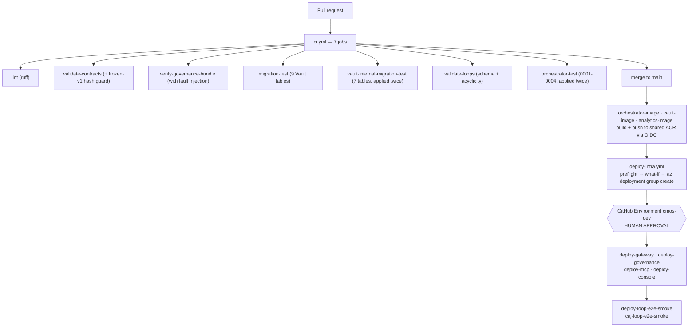

# 15 — Deployment Architecture & Configuration Guide

---

## Part 1 — Deployment Architecture

### 1.1 Target environment

One Azure resource group: **`cmos-dev`**, region **`southafricanorth`**
(pinned as a literal string in `app-insights.bicep`, never
`resourceGroup().location`, so the data-residency guarantee cannot silently
drift when another module's default changes).

### 1.2 Resource inventory

| Resource | Name / SKU | Notes |
|---|---|---|
| VNet | `vnet-cmos-dev` `10.20.0.0/16` | `snet-cae-infra` `/23` (delegated to `Microsoft.App/environments`), `snet-pe` `/27` |
| Container Apps Env | `cae-cmos-dev` | VNet-integrated, linked to `log-cmos-dev` |
| Postgres | `psql-cmos-dev`, PG16, `Standard_B1ms` Burstable, 32GB | `publicNetworkAccess: Disabled`, private endpoint, AZ 1, 7-day backup, **no HA** |
| Service Bus | `sb-cmos-dev-<unique>`, **Standard** | `disableLocalAuth: true`, TLS 1.2, queues `task` + `event` |
| Key Vault | `kv-cmos-dev-<unique>` | `publicNetworkAccess: Disabled`, private endpoint, RBAC mode |
| Storage | `st...` | containers `vault-assets`, `analytics-fabric-export` |
| ACR | `acrcmosshared<unique>`, **Basic** | `adminUserEnabled: false` |
| App Insights | workspace-based, `southafricanorth` | linked to `log-cmos-dev` |
| Private DNS zones | postgres / vault / blob | linked to the VNet |
| Container Apps | 10 | see below |
| Container Apps Jobs | 17 | see below |
| Logic Apps | 3 | Consumption, each with its own identity + SB Data Sender role |

### 1.3 Container Apps

| App | Ingress | Replicas | Purpose |
|---|---|---|---|
| `ca-orchestrator` | internal | 1–3 | FastAPI + background worker loop |
| `ca-model-gateway` | internal | — | completions |
| `ca-gatekeeper` | internal | — | gate-check, decisions, approval-status |
| `ca-gatekeeper-approval` | **external + Easy Auth** | — | the single external governance route |
| `ca-publisher` | internal | — | publish verification |
| `ca-vault` | internal | 1–3 | system of record |
| `ca-console` | **external + Easy Auth** | — | operator UI |
| `mcp-web` / `mcp-buffer` / `mcp-canva` | internal | — | tool plane |

**The `max_size=12` connection-pool setting in `vault/db.py` is derived from
this table:** 3 replicas × 12 = 36 connections against Postgres's confirmed
`max_connections=50`, leaving headroom for migration/query/retention/rollup
jobs. The previous value of 20 allowed 60 — already over the limit on its own
(finding PERF-2).

### 1.4 Container Apps Jobs

| Category | Jobs |
|---|---|
| **Migration** | `caj-vault-migrate`, `caj-vault-sidecar-migrate`, `caj-orchestrator-migrate`, `caj-governance-migrate`, `caj-analytics-migrate`, `caj-mcp-ops-migrate` |
| **Smoke** | `caj-gateway-smoke`, `caj-vault-smoke-test`, `caj-orchestrator-smoke-test`, `caj-governance-smoke`, `caj-mcp-smoke`, `caj-loop-e2e-smoke`, `caj-analytics-buffer-smoke` |
| **Scheduled** | `caj-analytics-nightly-ingest` (cron `0 1 * * *`), `caj-vault-retention-expiry` |
| **Operational** | `caj-vault-query`, `caj-vault-secret-writer` |

Migration jobs exist because Postgres has no public endpoint — **the only way
to run DDL is from inside the VNet**.

### 1.5 CI/CD



**13 workflows. Zero client secrets.** Everything authenticates via OIDC
federated identity (`AZURE_CLIENT_ID` / `AZURE_TENANT_ID` /
`AZURE_SUBSCRIPTION_ID`).

### 1.6 Deployment patterns learned the hard way

Each of these is a compound learning, and each is now a repository-wide rule:

**(a) The three-part image bootstrap contract** (L-0018, L-0048, L-0060 —
independently reproduced on four separate Container Apps):
1. the Bicep `containerImage` param defaults to a **public MCR placeholder**;
2. the deploy workflow's preflight resolves the app's **current live image**
   via `az containerapp show` — but only if `latestReadyRevisionName` is
   non-empty, otherwise it re-bootstraps rather than replaying an image
   reference that has never worked;
3. only the image workflow ever sets a real image.

**(b) Never declare `registries[]` on a new `Microsoft.App/jobs` resource**
(L-0049, L-0061, L-0071). A user-assigned identity cannot be newly attached
*and* referenced for ACR pull in the same create.

**(c) User-assigned, not system-assigned, when a role assignment is needed in
the same deployment** (L-0020). A system-assigned `principalId` only resolves
once the resource reaches a terminal state — which requires the very role
assignment being declared. Circular. A
`Microsoft.ManagedIdentity/userAssignedIdentities` resource resolves
synchronously and breaks the cycle.

**(d) Never resolve an Azure resource with `list --query "[0].x"`** (L-0021,
L-0036). Once a second resource of that type exists in the RG, list order
silently picks the wrong one. A `deploy-gateway` UNAUTHORIZED pull failure was
traced to exactly this — the image pushed successfully to an *orphaned*
registry the app had no `AcrPull` grant for.

**(e) `az containerapp job start` with any Container Argument replaces the
whole container** (L-0022). Passing `--env-vars` alone fails with
`ContainerAppImageRequired`; adding `--image` back still silently drops the
template's `command` and `secretRef`. The fix is a full `--yaml` override per
invocation.

**(f) Base64-encode every SQL secret** (L-0012). Container Apps collapses a
literal `$$` in secret values to `$`, corrupting PL/pgSQL dollar-quoting.
CI reproduces the exact encoding round-trip before applying, so the failure
mode cannot escape to a live deploy.

**(g) `CONTRACTS_DIR` / `FUNCTIONS_DIR`** (L-0062). A containerised service
that reads repo-root files at runtime cannot use a parents-walk — the image
has no repository around it. Confirmed live:
`loop_load_failed ... No such file or directory:
'/contracts/orchestrator/loop-definition.schema.json'`. The fix is an
env-var override, evaluated lazily, with the image staging only the files it
actually needs.

---

## Part 2 — Configuration Guide

### 2.1 Configuration philosophy

Four tiers, and the boundaries between them are deliberate:

| Tier | Where | Change process |
|---|---|---|
| **Policy** | YAML in git | Pull request + review + deploy |
| **Infrastructure** | Bicep + `*.parameters.json` | Pull request + `deploy-infra` + human gate |
| **Runtime** | Container Apps env vars / secretRefs | `az containerapp update` or redeploy |
| **Secrets** | Key Vault, referenced by secretRef | Operator, via the gated in-VNet path |

### 2.2 Policy files — the platform's control surface

| File | Governs | Effect of a change |
|---|---|---|
| `services/gatekeeper/policy/autonomy.yaml` | What agents may do | Immediate on redeploy; **validated at startup, fails the service on error** |
| `services/model-gateway/policy/routing.yaml` | Logical model → tier/provider/model | A model upgrade is **one reviewed line** |
| `services/model-gateway/policy/budgets.yaml` | Daily USD per function; downgrade path | Cost ceiling and degradation behaviour |
| `contracts/model-gateway/redaction-rules.yaml` | PII patterns + fixtures | **Frozen** — hash-guarded; changes need a version bump |
| `docs/permission-register.yaml` | Which clients may be named | Read at runtime by `permission_check.py` |
| `services/orchestrator/loops/*.yaml` | Workflow DAGs | Validated at startup; a bad loop is logged, not fatal |
| `functions/09-*/fetch_sources.yaml` | Knowledge sources | Read at runtime; must stay in sync with `MCP_WEB_ALLOWLIST` |
| `functions/*/prompt.md` | Agent behaviour | Staged into the image; requires a rebuild |

### 2.3 Environment variables by service

**Orchestrator**
| Var | Default | Purpose |
|---|---|---|
| `DATABASE_URL` | — | task_state; **absent ⇒ `/status` returns `[]`, no crash** |
| `SERVICE_BUS_NAMESPACE` | — | **absent ⇒ the local double is used** |
| `VAULT_API_URL` | — | Vault base URL |
| `WORKER_POLL_INTERVAL_S` | `1.0` | queue poll cadence |
| `CONTRACTS_DIR` / `FUNCTIONS_DIR` | repo-relative | **must be set in the container** |
| `CMOS_DAILY_LOOP_BUDGET_USD` | `5.00` | AC-10 loop budget |
| `CMOS_GATEWAY_BASE_URL` / `CMOS_GATEKEEPER_BASE_URL` / `CMOS_MCP_WEB_BASE_URL` | — | override live FQDN resolution |
| `APPLICATIONINSIGHTS_CONNECTION_STRING` | — | absent ⇒ telemetry no-op, never a crash |

**Model Gateway**
| Var | Default | Purpose |
|---|---|---|
| `DATABASE_URL` | — | costs + gate_decisions |
| `ANTHROPIC_API_KEY` | — | via secretRef |
| `KEY_VAULT_NAME` | — | vault name |
| `DELIBERATE_FLAG_ENABLED` | `false` | reasoning-hint feature flag |
| `CONTRACTS_DIR` | repo-relative | **must be set in the container** |

**Gatekeeper**
| Var | Default | Purpose |
|---|---|---|
| `DATABASE_URL` / `TEST_DATABASE_URL` | — | **TEST wins, so a test run cannot touch prod** |
| `AUTONOMY_POLICY_PATH` | `policy/autonomy.yaml` | policy location |
| `SIGNER_BACKEND` | `local` | **`keyvault` in production** |
| `KEY_VAULT_URL`, `GATE_SIGNING_KEY_NAME` | — / `gate-token-signing-key` | signing key |
| `GATE_TOKEN_ISSUER` / `_AUDIENCE` / `_TTL_SECONDS` | `cmos-gatekeeper` / `cmos-publisher` / `900` | token claims |
| `TEAMS_WEBHOOK_URL` | — | **absent ⇒ inbox-row delivery** |
| `APPROVAL_BASE_URL` | `https://approval.invalid` | **must be set — the default is a deliberate poison value** |
| `APPROVAL_LINK_TTL_SECONDS` | `86400` | 24h |

**Publisher**
| Var | Default | Purpose |
|---|---|---|
| `PUBLISHER_DRY_RUN` | **`true`** | `false` enables live Buffer |
| `GATE_TOKEN_PUBLIC_KEY_PEM` | — | accepts raw PEM **or** base64 |
| `GATE_TOKEN_ALGORITHMS` | `RS256` | pinned allowlist |
| `VAULT_API_URL` | — | asset cross-check |
| `CMOS_MCP_BUFFER_BASE_URL` | — | override |

**Vault**
| Var | Default | Purpose |
|---|---|---|
| `DATABASE_URL` | — | **falls back to a Key Vault lookup at first DB use** |
| `KEY_VAULT_NAME` / `KEY_VAULT_URL` | — | fallback source |
| `DB_CONNECTION_SECRET_NAME` | `vault-db-connection-string` | secret name |
| `STORAGE_ACCOUNT_NAME` / `BLOB_CONTAINER_NAME` | — / `vault-assets` | blob storage |

**Console**
| Var | Default | Purpose |
|---|---|---|
| `VAULT_API_MODE` | `mock` | `real` + `VAULT_API_BASE_URL` — **config-only cutover, field-verified** |
| `GATEKEEPER_API_MODE` | `mock` | `real` **blocked — no REST API exists yet** |
| `APPLICATIONINSIGHTS_WORKSPACE_ID` | — | KQL trace queries |
| `CONSOLE_SEED_FIXTURES_JSON_B64` | — | local dev seed |

**MCP servers**
| Var | Default | Purpose |
|---|---|---|
| `MCP_WEB_LIVE_MODE` | unset | **non-secret flag** — mcp-web has no vendor credential |
| `MCP_WEB_ALLOWLIST` | `example.com,api.example.com` | **must match `fetch_sources.yaml`'s domains** |
| `RATE_LIMIT_MAX` / `RATE_LIMIT_WINDOW_SEC` | `5` / `1.0` | sliding window |
| `BUFFER_API_KEY` | — | presence ⇒ live mode |
| `CANVA_CLIENT_ID` / `CANVA_CLIENT_SECRET` | — | both ⇒ live mode |
| `MCP_OPS_DB_POOL_MAX_SIZE` / `_TIMEOUT_SECONDS` | `5` / `5.0` | bounds Postgres connections per server |

### 2.4 The dual-mode pattern

Every external integration follows the same rule: **fixture mode is the
default and requires nothing; live mode activates purely on the presence of a
credential env var. No code or config edit is ever needed.**

| Component | Live trigger |
|---|---|
| mcp-web | `MCP_WEB_LIVE_MODE` truthy |
| mcp-buffer | `BUFFER_API_KEY` resolvable |
| mcp-canva | `CANVA_CLIENT_ID` **and** `CANVA_CLIENT_SECRET` |
| analytics Buffer | `BUFFER_API_KEY` resolvable |
| Publisher | `PUBLISHER_DRY_RUN=false` *(and never for a proof-circuit asset)* |
| registry evals | `ANTHROPIC_API_KEY` + `--live` |
| Teams | `TEAMS_WEBHOOK_URL` present |

**Learning L-0074 warns about exactly this design:** a
"goes-live-automatically-once-credentials-exist" path must be *independently
verified live*, not assumed to work because the fixture path does.

### 2.5 Bootstrap sequence for a fresh environment

```bash
# 0. Prerequisites
az login
az extension add --name containerapp --yes
az provider register --namespace Microsoft.App
az provider register --namespace Microsoft.DBforPostgreSQL
az provider register --namespace Microsoft.ServiceBus
az provider register --namespace Microsoft.ContainerRegistry   # NOT in deploy-infra's preflight

# 1. Infrastructure (placeholder images — this is expected and correct)
az deployment group create -g cmos-dev -f infra/main.bicep \
  -p infra/dev.parameters.json -p administratorLoginPassword=<generated>

# 2. Migrations — the ONLY way to run DDL (Postgres has no public endpoint)
for j in caj-vault-migrate caj-vault-sidecar-migrate caj-governance-migrate \
         caj-orchestrator-migrate caj-analytics-migrate caj-mcp-ops-migrate; do
  az containerapp job start -g cmos-dev -n "$j"
done

# 3. Secrets (operator, via the gated in-VNet path — see docs/credentials-runbook.md)
#    ANTHROPIC_API_KEY · buffer-api-key · canva-client-id/-secret
#    teams-webhook-url (optional) · vault-db-connection-string (caj-vault-secret-writer)

# 4. Console auth — one-time, requires directory admin rights
bash scripts/bootstrap-console-auth.sh          # see docs/console-auth-runbook.md
# THEN, in the Portal: Enterprise Application → "Assignment required" = Yes
#   and assign only intended operators. This is the ONLY authorisation control.

# 5. Real images
gh workflow run orchestrator-image.yml
gh workflow run vault-image.yml
gh workflow run analytics-image.yml
gh workflow run deploy-gateway.yml
gh workflow run deploy-governance.yml
gh workflow run deploy-mcp.yml
gh workflow run deploy-console.yml

# 6. Verify
for j in caj-vault-smoke-test caj-orchestrator-smoke-test caj-governance-smoke \
         caj-mcp-smoke caj-gateway-smoke; do
  az containerapp job start -g cmos-dev -n "$j"
done
gh workflow run deploy-loop-e2e-smoke.yml
```

### 2.6 Operational runbook essentials

**Never hardcode an FQDN.** Every address is resolved live:
```bash
ORCH=$(az containerapp show -g cmos-dev -n ca-orchestrator \
  --query properties.configuration.ingress.fqdn -o tsv)
```

**Logs and job status:**
```bash
az containerapp logs show -g cmos-dev -n ca-orchestrator
az containerapp job execution list -g cmos-dev -n caj-loop-e2e-smoke
az containerapp job logs show -g cmos-dev -n caj-vault-migrate --container <name>   # --container is REQUIRED (L-0024)
```

**Ad-hoc SQL** — `caj-vault-query`, and it **must** be invoked with a full
`--yaml` override, never `--env-vars QUERY=...` (L-0022).

**Emergency stop:**
```bash
curl -X POST -H "Content-Type: application/json" \
  -d '{"active":true,"reason":"incident-2026-08-06"}' \
  https://<console-fqdn>/kill-switch/toggle
```
Propagates to the next gate decision and the next publish attempt — no cache,
no TTL.

**Trace a run:**
```bash
curl -H "Accept: application/json" https://<console>/tasks/<task_ref>/trace
curl https://<orch>/runs/<task_ref>
```

### 2.7 Configuration risks

| Risk | Consequence |
|---|---|
| `MCP_WEB_ALLOWLIST` and `fetch_sources.yaml` can silently diverge | Ingestion fails with an allowlist rejection nobody expects |
| `APPROVAL_BASE_URL` defaults to `https://approval.invalid` | Approval links break silently if unset — deliberately poison, but unset is not loud |
| `SIGNER_BACKEND` defaults to `local` | A misconfigured production deploy signs with an **ephemeral key**; every token then fails verification |
| `PUBLISHER_DRY_RUN=false` is one env var away | The only guard is a proof-circuit tag on the asset |
| `TEST_DATABASE_URL` wins over `DATABASE_URL` | Good for tests; catastrophic if it leaks into a production env |
| `main.bicep` deploys everything together | A governance deploy rotates the Postgres admin password (bug `8277d38`); blast radius is the whole platform |
| `budgets.yaml.agents` is `{}` | Every function shares one $20/day default — no per-agent ceiling |
| Prompt changes require an image rebuild | Content changes carry deployment risk |
