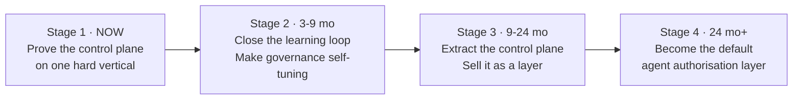

# 16 — Product Vision & Strategy

*Grounded entirely in what the code proves the team can build. No market
sizing, no assumed demand — the argument is made from implementation
evidence.*

---

## 1. Product vision

> **Every enterprise will run AI agents that do real work. Almost none will
> be able to prove what those agents were allowed to do, what they actually
> did, what it cost, or who authorised it. Canvas builds the layer that
> proves all four.**

The evidence that this is the real vision, rather than a repositioning
exercise, is the code distribution: ~92% of the implementation is governance,
control, measurement and infrastructure; ~8% is marketing capability. The
team did not build a marketing tool and add controls. **They built a control
plane and pointed it at marketing to prove it works.**

## 2. Product strategy

### The three-part thesis

**(1) Governance is the bottleneck, not capability.**
Model quality is a commodity that improves monthly without your effort.
`routing.yaml`'s own header treats a model upgrade as *"one reviewed line."*
What does not commoditise is the ability to answer a GC, a CFO, a CISO and an
auditor in the same sentence. This codebase can.

**(2) Prove it on a hard vertical first.**
Marketing content is a genuinely hostile test case: outputs are public,
irreversible, brand-critical, legally exposed (client naming, unsupported
claims), and cross-border (a US inference provider processing SA data). A
control plane that survives *that* survives most enterprise use cases. The
platform is already running it live.

**(3) Then generalise the layer, not the application.**
`gatekeeper`, `model-gateway`, `publisher`, `vault`, `registry` and
`telemetry-lib` contain **zero marketing logic**. The seam is not aspirational
— it is a fact of the current file layout.

### Strategic sequence

| Stage | Objective | Success measure |
|---|---|---|
| **1 · Prove** | A live, governed, measured AI pipeline | ✅ largely achieved — daily loop live, real Anthropic calls, real metering, real approval cards. Remaining: activate the 20 packages, real publish, enterprise-grade auth |
| **2 · Learn** | Governance that tunes itself from its own evidence | An `autonomy.yaml` diff proposed automatically from approval history and merged by a human |
| **3 · Extract** | An SDK + control plane usable by any agent framework | A third-party agent routing its tool calls through the gate |
| **4 · Default** | The layer enterprises assume they need | Referenced in procurement checklists |

## 3. Why this team can do it — evidence, not assertion

The strongest argument is not the platform. It is the **quality of judgement
visible in the code**, which is what a technical investor or an acquiring CTO
would actually assess:

| Evidence | What it demonstrates |
|---|---|
| The redaction firewall was **too strict to function**, then narrowed four times — each narrowing scoped to one pattern and one named content class, each recorded with its reasoning and its authoriser | Ability to operate a security control under production pressure without weakening it silently |
| Matched-pattern ids were changed from `fixture:{value}` to `fixture:{group}:{index}` because the original **echoed the client's real name into the audit column** | The kind of finding that only comes from adversarial review, caught and fixed |
| `write_audit_isolated()` exists because a rejection's own transaction rollback would have destroyed its audit row | Understanding of transactional semantics at the level that matters for compliance |
| `qa_blocked` given its own transition reason, its own DB CHECK value, and counted as smoke-test *success* | Distinguishing "the AI broke" from "the AI correctly said no" — most platforms conflate these |
| Migration 0003 root-caused as the true cause after a fix scoped to 0004 "had zero effect for exactly this reason: 0004 was never reached" | Root-cause discipline, not symptom-patching |
| `NOT_READY_MAX_REQUEUES = 20` tuned against **observed** ~14s production cadence, with the arithmetic against the smoke budget written out | Empirical tuning over theoretical defaults |
| Function 18-03 deliberately proof-light because positioning.md doesn't claim manufacturing | Epistemic honesty encoded as a testable property |
| `docs/accepted-risks.md` names four unclosed risks, including one flagged as *"not a user-approved risk acceptance ... flagged here explicitly so it is tracked rather than silently shipped"* | Institutional honesty |
| 79 classified compound learnings with strengthening and recurrence history | A learning organisation, evidenced rather than claimed |

**A CTO evaluating an acquisition would read `.compound/index.md` and
`docs/accepted-risks.md` before reading any code, and would conclude the team
is unusually mature.**

## 4. The moat

Ranked by durability:

### M1 — Institutional judgement (most durable)
79 learnings across four classes, several marked as recurring three or four
times. Learning L-0048's image-bootstrap contract independently reproduced on
four separate Container Apps before being written down as a rule. **This is
path-dependent knowledge — it cannot be copied, only re-earned through the
same incidents.**

### M2 — Governance depth
Five independent authorisation layers, all fail-closed, all tested. A
competitor can build the same in months — but they will not know *which*
controls matter until they have had the incidents. See M1.

### M3 — Regional specificity
SA ID and phone regexes in a frozen contract. POPIA s11 lawful-basis
modelling. POPIA s72 documented as explicitly unresolved rather than assumed
away. `southafricanorth` pinned as a literal. South African English as a
brand rule. **For a Johannesburg CFO evaluating US AI tooling, this is not a
feature — it is the purchase criterion.** It is also, honestly, a ceiling:
Frankfurt would need a rebuild.

### M4 — Contract discipline
Ten hash-frozen contracts, CI-enforced, read *at runtime* by the services
that must honour them. This makes the platform safely extensible by parallel
teams — which is what made the parallel-session build model work at all.

### M5 — The compound engineering method
The most valuable and the least productised. See §7.

## 5. What could kill this

| Risk | Likelihood | Severity | Mitigation available in-code |
|---|---|---|---|
| **Cloud providers bundle governance into their agent platforms** | High | High | Azure/AWS will do *model-level* safety. This does *action-level* authorisation with human approval bound to content hashes. Emphasise that distinction, and integrate rather than compete |
| **The market doesn't price governance yet** | Medium | High | Lead with cost control (`cost_per_accepted_asset`) — CFOs buy that today. Governance is the upsell |
| **Single-tenant architecture blocks every SaaS model** | **Certain** | High | Decide tenancy in Horizon 2, before more production data accumulates (`07-operating-model.md` §D.3) |
| **The 20 unwired agents make demos hollow** | **Certain today** | Medium | R1 registry-driven dispatch — 2–3 weeks |
| **Regional moat becomes a regional ceiling** | Medium | Medium | The redaction rules are a data contract; a `redaction-rules-eu.yaml` is additive, not a rewrite |
| **Key-person dependency on the agent loop** | Medium | High | The 79 learnings *are* the mitigation — they encode the method outside anyone's head. Productise it (§7) |
| **Anthropic dependency** | Medium | Medium | The extension point is built and untested. R12 exercises it and simultaneously solves POPIA s72 via in-region Azure OpenAI |

## 6. The strategic decision that matters most

> **Is Canvas Marketing OS a product, or is it the proof for a different
> product?**

| | If it's the product | If it's the proof |
|---|---|---|
| **Next 6 months** | Build marketing depth: calendar UI, more channels, CRM integration, activate all 23 agents | Extract the SDK, add multi-provider, MCP-native integration, publish the governance model |
| **Metric** | Content volume, engagement, marketing seats | Agent actions governed, integrations, developers |
| **Buyer** | CMO | CTO / CISO / Head of AI |
| **Comparable** | Jasper, Writer, Typeface | Credo AI, LLMOps, "Vanta for AI agents" |
| **Multiple** | 6–10× ARR | 15–25× ARR |
| **Risk** | Crowded, well-funded, governance moat may not be priced | Category creation is slow and expensive |
| **Code readiness** | 8% of the code | **92% of the code** |

**The code has already answered this question.** The recommendation is a
sequenced both: keep Canvas Marketing OS as the flagship reference
implementation and the first paying customer, and extract the governance
layer as the product. The marketing platform becomes the demo that a
governance platform desperately needs — a *live, hostile, public,
irreversible* use case where the controls visibly matter.

## 7. The under-exploited asset

The `.compound/` learning system and the worktree-per-session agent loop that
produced this repository are, strategically, the most interesting artefact
here — and they are entirely unproductised.

**What exists:** a spec→plan→build→multi-lens-review→learn loop, with
isolation per unit of work, frozen contracts as the coordination protocol
between parallel sessions, a documented first-to-land-wins conflict rule, and
a classified learning corpus that later specs cite as acceptance criteria.

**What it proved:** a fully-governed, POPIA-aware, cost-metered, human-gated,
production-deployed AI platform on Azure — 917 files, 8 services, 5 schemas,
128 test files, 400 test functions, 13 CI/CD workflows, live in `cmos-dev`.

**Why it matters commercially:** every enterprise asking *"how do we use AI
agents to build software safely at scale?"* is asking exactly the question
this loop answers, and this repository is the answer with a working exhibit
attached.

**[INFERRED]** Three options: sell it as a consulting practice
("compound engineering"); license the framework; or fold it into the
governance product as *"the method we used to build the platform that governs
your agents — and the same governance applies to your engineering agents."*
The third is the most coherent, because it makes the product and the method
the same story.

## 8. Vision statement

> **Canvas gives enterprises the confidence to let AI act.**
>
> Not to draft, not to suggest, not to assist — to **act**: to publish, to
> spend, to commit, to touch systems that matter. We do that by making every
> agent action a governed transaction: authorised against a policy a human
> wrote, approved by a named person against the exact bytes they saw, bound
> by a cryptographic token that can be used once, verified independently at
> the boundary, metered to the cent, and recorded forever — including every
> refusal.
>
> We proved it on the hardest thing we had: our own marketing, in public,
> with a US model provider, under South African privacy law.
>
> **Autonomy you can audit.**
