# Comprehensive System Architecture & Process Map

**System:** Canvas Marketing OS (CMOS)
**Repository:** `rooipiet-tech/canvas-marketing-os`
**Document date:** 17 August 2026 · **Revision 2.1**, re-verified against `main` @ `53a2560`
**Method:** Reverse-engineered from source. Every architectural claim below cites the file it was read from. Claims that could not be resolved from the repository are labelled **Unknown / Requires Confirmation**.

> **Revision 2 note.** Revision 1 was cut at `5c8ee07`. `main` has since advanced **59 commits / 138 files / ~17k lines**, and a large share of that work closes findings this document raised. Every fact below has been re-verified against the current tree — including F6, F9 and F11, which are now confirmed rather than carried forward. §14.0 summarises what moved.

---

## How to read this document

| If you want… | Go to |
|---|---|
| The 60-second version | §1 Executive System Overview |
| One picture of the whole system | §2 Master Architecture Diagram (**Level 1**) |
| How the tiers stack | §3 Architecture Layers |
| A specific subsystem in depth | §4 Subsystem Maps (**Level 2**) |
| How a job actually runs, end to end | §5 Process Flows and §13 Critical Journeys (**Level 3**) |
| What the AI agents are and how they interact | §6 Agent Architecture |
| Where data lives and who writes it | §7 Data-Flow Architecture |
| What breaks what | §8 Dependency Graph |
| External systems and credentials | §9 Integration Map |
| Everything that can start work | §10 System Trigger Map |
| A component inventory | §11 Component Catalogue |
| The relationship graph | §12 System Relationship Graph |
| What's wrong and what to do | §14 Findings, §15 Improvement Opportunities |
| Where each claim came from | §18 Evidence Index |

**Diagram conventions.** Used consistently in every diagram in this document:

| Shape / style | Meaning |
|---|---|
| `([Rounded])` | Human actor |
| `[Rectangle]` | Service or application |
| `[[Subroutine]]` | Agent (LLM-invoking function) |
| `[(Cylinder)]` | Database / schema / table |
| `[/Parallelogram/]` | Queue or message channel |
| `{Diamond}` | Decision point |
| `((Circle))` | Trigger / scheduled event |
| `[\Trapezoid\]` | External third-party system |
| Solid arrow `-->` | Synchronous call or control flow |
| Dashed arrow `-.->` | Asynchronous / event / best-effort |

---

## 1. Executive System Overview

### 1.1 What the system does

Canvas Marketing OS is an **agent-native marketing operations platform** built for Canvas Intelligence, a South African data-engineering firm selling to the office of the CFO. It automates the pipeline that a marketing team would otherwise run by hand:

> **scan the market → score what matters → write a brief → draft content → review it against brand and factual rules → get a human to approve it → schedule or publish it → measure what happened → report on cost and performance.**

It is not a content generator with a UI bolted on. It is a **governed workflow engine**: the interesting engineering is not in producing text, it is in the controls that sit around producing text — cost budgets, a data-redaction firewall, a client-naming permission register, an autonomy policy, cryptographic publish authorisation, kill switches, and an append-only audit trail.

### 1.2 Primary objectives

Five objectives are visible as first-class, enforced mechanisms in the code — each one has dedicated modules, database tables, and tests:

1. **Produce marketing output continuously and unattended.** Three declarative loops (`services/orchestrator/loops/*.yaml`) fire on schedules and fan out into task graphs.
2. **Never publish anything a human didn't authorise.** Autonomy levels (`services/gatekeeper/policy/autonomy.yaml`) + short-lived signed JWTs (`contracts/gate-token/spec.md`) + verification at the publish boundary (`services/publisher/app/verifier.py`).
3. **Never leak personal or client data.** A redaction firewall in front of every LLM call (`services/model-gateway/redaction.py`), metadata-only queue envelopes (`contracts/service-bus/spec.md`), a default-deny client-naming register (`functions/02-brand-steward-qa/permission_check.py`), and POPIA-shaped consent gating (`services/vault/vault/consent.py`).
4. **Keep spend bounded and attributable.** Every model call is metered to a `costs` row keyed by `agent_run_id`, with per-function daily budgets that downgrade the model tier before they block (`services/model-gateway/budget.py`, `metering.py`).
5. **Be operable by an agent, not only a human.** Every service exposes plain HTTP that a script can drive — refusal reasons included. This is stated explicitly as "agent-native by construction (AC-17)" in `services/publisher/main.py` and `services/orchestrator/main.py`.

### 1.3 Who and what interacts with it

| Actor | Nature | How it interacts |
|---|---|---|
| **Marketing operator / approver** ("Pieter" in code comments) | Human | Clicks Approve/Reject on a Teams Adaptive Card or an Entra-protected deep link; reads the Console |
| **Console operator** | Human | Browses tasks, traces, costs, Vault objects; flips the kill switch |
| **Scheduled triggers** | Machine | 3 Logic Apps + 2+ Container Apps Jobs fire the loops |
| **AI agents** | Machine | 14 wired LLM-invoking functions produce and review content |
| **External SaaS** | Machine | Anthropic, Buffer, Canva, GA4, Search Console, LinkedIn, Microsoft Teams, Mailchimp *(unwired)*, Microsoft Fabric |
| **Automation agents / scripts** | Machine | Drive every service over HTTP; e2e suite in `tests/e2e/` does exactly this |

### 1.4 Major functional areas

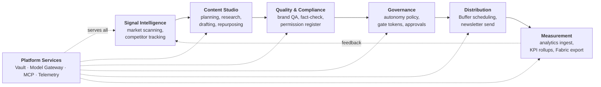

### 1.5 Major architectural components

| Component | Type | Runtime | Source |
|---|---|---|---|
| **Orchestrator** | Task-graph engine + FastAPI | Container App `ca-orchestrator` | `services/orchestrator/` |
| **Shared policy** | Scoring, scan profiles, source candidates as reviewed YAML | Read at runtime by dispatch handlers | `functions/_shared/` |
| **Model Gateway** | LLM broker with policy pipeline | Container App `ca-model-gateway` | `services/model-gateway/` |
| **Gatekeeper** | Autonomy policy + token issuer | Container Apps `ca-gatekeeper` (internal) + `ca-gatekeeper-approval` (external) | `services/gatekeeper/` |
| **Publisher** | Gate-token verifier + publish executor | Container App `ca-publisher` (internal) | `services/publisher/` |
| **Vault** | Domain object store API | Container App `ca-vault` | `services/vault/` |
| **Analytics Ingest** | Nightly ELT pipeline | Container Apps Job `caj-analytics-nightly-ingest` | `services/analytics-ingest/` |
| **MCP Servers** | Tool surfaces for agents | Container Apps `mcp-web`, `mcp-buffer`, `mcp-canva` | `mcp/` |
| **Console** | Operator web UI | Container App behind Easy Auth | `console/` |
| **Registry** | Function-package validator/signer | CI-only tooling | `services/registry/` |
| **Telemetry Lib** | Shared OTel wrapper | Python package, embedded | `services/telemetry-lib/` |
| **Function packages** | 25 agent definitions | Prompts + schemas, read at runtime | `functions/` |
| **Contracts** | 9 hash-frozen interface specs | Validated in CI | `contracts/` |

### 1.6 How information and work flow through the system

The system has one dominant flow shape, repeated for every loop:

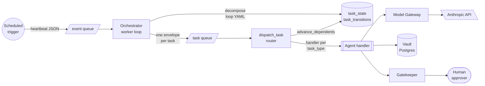

Three properties define this flow:

1. **The queue carries pointers, never payloads.** A `TaskEnvelope` holds only ids — `task_id`, `agent_run_id`, `campaign_id` — plus a string-only `metadata` bag. All real content is fetched from Postgres by id. This is a deliberate compensating control for running Service Bus Standard SKU without a private endpoint (`contracts/service-bus/spec.md`, `docs/accepted-risks.md`).

2. **The dependency graph is the control mechanism, not handler logic.** `db.advance_dependents()` flips a task `pending → dispatchable` only when *every* `depends_on` entry has reached `completed`. Isolation between sibling drafts is achieved by graph shape, not by filtering inside a handler — this was an explicit redesign after a live incident (`services/orchestrator/loops/weekly-content-loop.yaml`, "ROUND 34" header comment).

3. **All tasks are published to the queue up front, at decompose time.** Nothing re-publishes them later. A task whose turn hasn't come raises `TaskNotReadyError` and its message is bounced back onto the queue, bounded at 20 requeues (`orchestrator/worker.py:NOT_READY_MAX_REQUEUES`). This is the single most consequential design decision in the system — see §14.

### 1.7 The most important design principles and architectural decisions

| # | Principle | Evidence | Consequence |
|---|---|---|---|
| **D1** | **Frozen contracts.** 9 interface files under `contracts/` are hash-guarded; breaking changes must land under `/v2/`. | `contracts/.frozen-v1.sha256`, `scripts/validate_contracts.py` | Extensions are made *additively* — e.g. `function_id`/`content_hash` are packed into the gate token's existing `resource` claim as canonical JSON rather than added as claims. |
| **D2** | **Policy is data, not code.** Routing, budgets, autonomy levels, fetch sources, loop graphs, redaction rules are all YAML. | `policy/routing.yaml`, `policy/budgets.yaml`, `policy/autonomy.yaml`, `loops/*.yaml`, `fetch_sources.yaml` | A model upgrade or an autonomy change is a reviewed one-line diff, not a deploy of new logic. |
| **D3** | **Fail closed.** Unlisted autonomy pair → level 0 (blocked). Unlisted client name → blocked identically to explicit UNCLEARED. Failed Vault lookup on publish → refuse. | `autonomy.yaml:default_level: 0`, `permission_check.py:check_clearance`, `publisher/app/vault_lookup.py` | Absence is never permission. |
| **D4** | **Append-only audit.** `gate_decisions` has no `updated_at` *by design*; `publish_attempts`, `approval_actions`, `task_transitions` are all insert-only. | `contracts/vault-schema/schema.sql` comments | Every branch — including every refusal — leaves exactly one row. |
| **D5** | **Defence in depth over single gates.** The kill switch is duplicated in Gatekeeper *and* Publisher with a parity test. Publish checks the content hash by recomputation *and* cross-checks the Vault. Redaction runs even though schema validation already ran. | `test_kill_switch_parity.py`, `routers/publish.py` ordering docstring | Costs duplication; buys independence. |
| **D6** | **Degrade, don't crash.** Missing `DATABASE_URL`, `SERVICE_BUS_NAMESPACE`, telemetry connection string, or Teams webhook are all normal states that log and continue. | `orchestrator/main.py` lifespan, `orchestrator/config.py` | Startup never fails on config absence — but see §14 on the observability cost. |
| **D7** | **Never guess a hostname.** Service URLs resolve via `az containerapp show` at runtime, or an env override. Never a hardcoded FQDN. | `orchestrator/clients/azure_fqdn.py` | Robust to redeploys; introduces an Azure-CLI runtime dependency (§14). |
| **D8** | **Errors never echo caller input.** Validation and routing messages are built from *schema-side facts only*, because they run before the redaction firewall. | `model-gateway/completion.py:validate_request`, `routing.py:unknown_model_message` | Closes an unscanned, unaudited exfiltration path. |
| **D9** | **Two independent state machines.** The Service Bus transport's `maxDeliveryCount` is fully decoupled from the application's own `retry_count`/backoff/dead-letter. | `orchestrator/state_machine.py` module docstring | Retries are observable in Postgres, not hidden in broker internals. |

---

## 2. Master System Architecture Diagram — **Level 1**

One picture of the entire platform. Everything below drills into a region of this map.

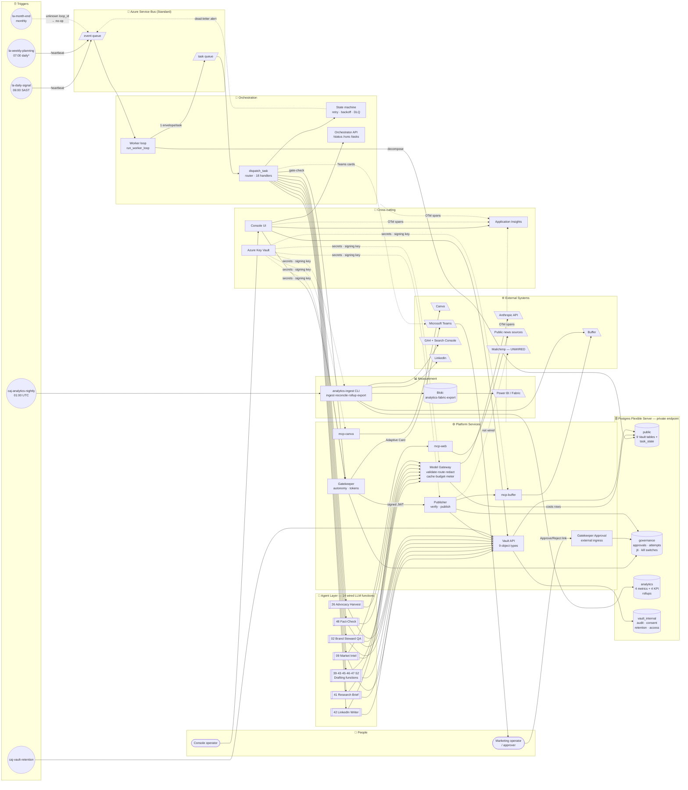

`*` The weekly trigger fires **daily** at 07:00 SAST. That is the deliberate cadence, not an override — one complete content cycle every morning for review. See §14.F3.

---

## 3. Architecture Layers

The system resolves into **seven layers**. The layering is real, not aspirational: each boundary is enforced by network ingress rules (`external: false` on all but two apps), by contract validation in CI, or by both.

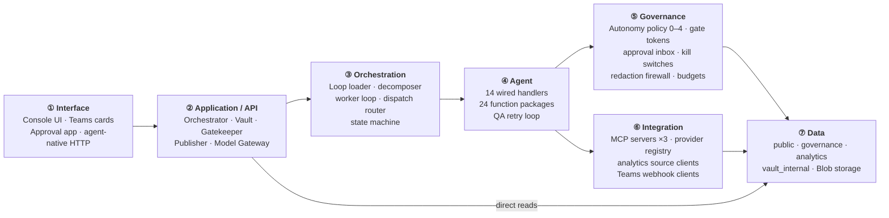

### Layer responsibilities

| Layer | Owns | Must not | Key evidence |
|---|---|---|---|
| **① Interface** | Human identity, rendering, deep links | Hold business logic; decide approvals from link possession | `console/app/auth.py`, `gatekeeper/app/routers/approval_action.py` |
| **② Application/API** | HTTP contract enforcement, error taxonomy | Bypass the layers below | `vault/main.py` exception handler, `model-gateway/main.py` |
| **③ Orchestration** | Task lifecycle, dependency resolution, retries | Know what a task *means* | `orchestrator/worker.py`, `state_machine.py` |
| **④ Agent** | Prompt assembly, output parsing, artefact creation | Call a provider SDK directly | `orchestrator/dispatch.py`, `functions/*/prompt.md` |
| **⑤ Governance** | Every allow/deny ruling and its audit row | Cache a decision | `gatekeeper/app/kill_switch.py` "NO CACHING, EVER" |
| **⑥ Integration** | Vendor protocol translation, credential use | Expose a publish path it wasn't given | `mcp/mcp-buffer/app/dispatch.py` |
| **⑦ Data** | Durable truth, FK integrity, retention | — | `contracts/vault-schema/schema.sql` |

### The two trust boundaries

Only **two** endpoints are reachable from outside the VNet:

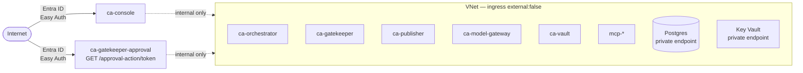

Everything inside the VNet trusts its callers. `orchestrator/main.py` states this explicitly for `/tasks/{task_id}/review`: *"Internal-ingress-only, same trust boundary as /health, /status … no additional auth check, consistent with every other route here."* This is a deliberate, documented posture — and a real risk if the boundary is ever weakened (§14.S2).

---

## 4. Subsystem Maps — **Level 2**

Ten subsystems. Each gets a fact table and its own node-and-edge diagram.

---

### 4.1 Orchestration & Task Lifecycle

**Purpose.** Turn a scheduled heartbeat into a persisted, dependency-ordered task graph, then drive every task to a terminal state exactly once.

| Facet | Detail |
|---|---|
| **Components** | `main.py` (FastAPI + lifespan), `worker.py` (poll loop), `decompose.py`, `loop_loader.py`, `dispatch.py` (router), `state_machine.py`, `dead_letter.py`, `db.py`, `run_state.py`, `task_review.py`, `servicebus/{producer,consumer,local_double}.py` |
| **Inputs** | `HeartbeatEvent` on `event` queue; `TaskEnvelope` on `task` queue; loop YAML at startup |
| **Outputs** | `task_state`/`task_transitions` rows; `TaskEnvelope` messages; `DeadLetterAlert` on `event`; `result_ref` JSONB payloads; HTTP status JSON |
| **Dependencies** | Postgres (`public.task_state`), Service Bus, Model Gateway, Vault, Gatekeeper, mcp-web, `functions/` prompt files, `contracts/` schema files |
| **Upstream** | Logic Apps triggers |
| **Downstream** | Every agent handler; Gatekeeper; Teams; Console |
| **Data used** | `task_state`, `task_transitions` (owned); Vault tables (via HTTP) |
| **APIs exposed** | `GET /health`, `GET /status`, `GET /runs/{task_ref}`, `GET /tasks/{task_id}/review` |
| **Agents involved** | All 14 wired agents, invoked through `DISPATCH_TABLE` |
| **Triggers** | Heartbeat messages; queue redelivery; internal requeue |
| **Business rules** | ① A task dispatches only in state `dispatchable`. ② `advance_dependents` requires **all** deps `completed`. ③ 3 failures → `dead_lettered`. ④ A dep in `dead_lettered`/`failed` → immediate cascade, no retry. ⑤ Duplicate message on a terminal task → discard silently. ⑥ `task_id = uuid5(event_id, loop_task_id)` — deterministic and idempotent per heartbeat. |
| **Failure points** | Queue-bounce starvation (§14.C1); non-idempotent handler retries (§14.R1); worker loop is a single `asyncio.Task` inside the API process; `result_ref` lineage walk capped at `MAX_LINEAGE_HOPS = 6` |

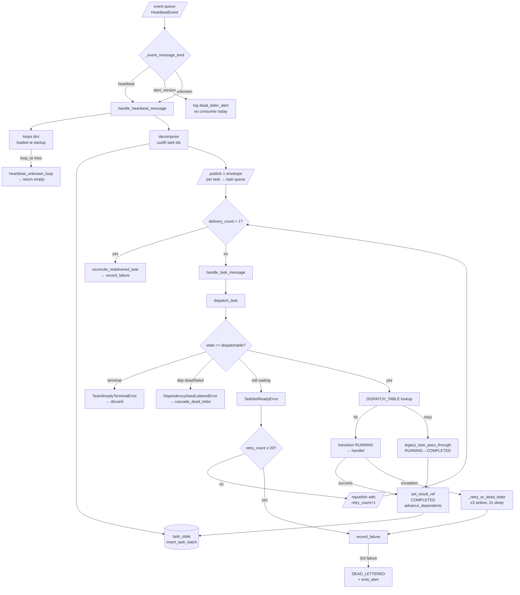

---

### 4.2 Model Gateway

**Purpose.** The single, provider-agnostic doorway to every LLM call, so cost, redaction, budget and provider swaps happen in exactly one place.

| Facet | Detail |
|---|---|
| **Components** | `main.py` (router + exception mapping), `completion.py` (the pipeline), `routing.py`, `redaction.py`, `budget.py`, `caching.py`, `metering.py`, `gate_decisions.py`, `providers/{base,registry,anthropic}.py`, `db.py` |
| **Inputs** | `CompletionRequest` JSON: `model`, `messages`, `agent_run_id`, optional `max_tokens`, `temperature`, `tools`, plus additive `task_ref`, `deliberate`, `content_class` |
| **Outputs** | `CompletionResponse` with `content`, `usage`, `cost_id`; 3 `costs` rows; `gate_decisions` row on block/breach; one JSON log line per request |
| **Dependencies** | `contracts/model-gateway/openapi.yaml` (read at runtime), `redaction-rules.yaml`, Anthropic API, Postgres |
| **Upstream** | Every agent handler in `dispatch.py`; registry eval harness |
| **Downstream** | Anthropic; `public.costs`; `public.gate_decisions` |
| **Business rules** | ① Validate against the frozen schema before touching any field. ② Never echo a submitted value in an error. ③ Redact before any provider call. ④ Same `task_ref` ⇒ one upstream call. ⑤ Soft breach (≥80% of daily limit) downgrades tier; hard breach returns 429 + `gate_decisions` escalation, provider never called. ⑥ Metering failure must not fail a paid-for completion. |
| **Failure points** | In-process cache is per-replica only (§14.B2); startup model-liveness check is advisory; price table is hand-maintained (§14.M1) |

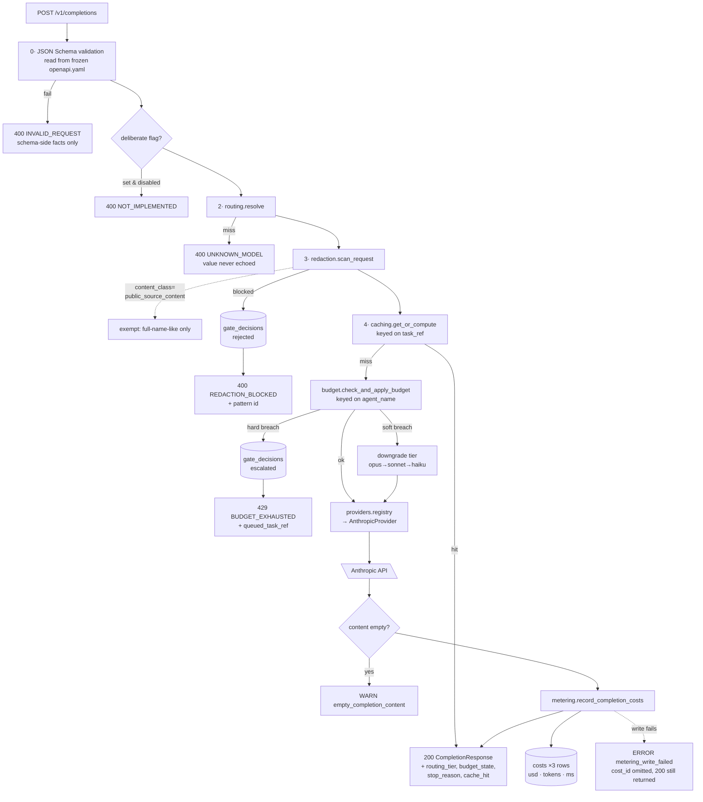

**Redaction scope** — stated precisely because it has been narrowed twice after live incidents:

| Scanned | Not scanned | Why |
|---|---|---|
| `messages[*].content` where role ∈ {user, assistant, tool} | role = `system` | System prompts are static, developer-authored files (`_read_prompt()`); the universal LLM convention makes them operator instructions, never end-user content |
| serialized `tools[]` payload | — | The one contract field with `additionalProperties: true` — a messages-only scanner would be bypassable |
| all 4 heuristic patterns + fixture exact-matches | `full-name-like`, **only** when `content_class == "public_source_content"` | Public news prose and positioning copy trip "two consecutive Title-Case words" constantly; 4 authorised call sites in `dispatch.py` only |

---

### 4.3 Agent / Content Studio Subsystem

**Purpose.** Convert a plan and a research brief into six reviewable content assets per week, plus the daily brief chain.

| Facet | Detail |
|---|---|
| **Components** | 18 handlers in `dispatch.py`; 24 function packages in `functions/`; shared helpers `_draft_social_post_handler`, `_render_*`, `_parse_json_content`, `resolve_lineage_result` |
| **Inputs** | `TaskEnvelope`; ancestor `result_ref`; Vault briefs/assets; `prompt.md` files |
| **Outputs** | Vault `assets` (with `content_hash`), `briefs`, `signals`; `agent_runs` rows; `result_ref` |
| **Dependencies** | Model Gateway, Vault, `FUNCTIONS_DIR` staged into the container image |
| **Business rules** | ① Every function returns a single bare JSON object; a chatty model is tolerated by `raw_decode` + trailing-content logging. ② Client naming is default-deny. ③ Every claim needs a proof point. ④ Case-study drafts deliberately have **no** Friday Buffer task — human-initiated cadence only. ⑤ `max_tokens` is sized per asset type (1536 → 4096) after a live truncation incident. |
| **Failure points** | Prompt files must be staged into the image (`FUNCTIONS_DIR`) — a class of bug that has bitten twice (§14.P1); JSON parse failures are the most common dead-letter cause historically |

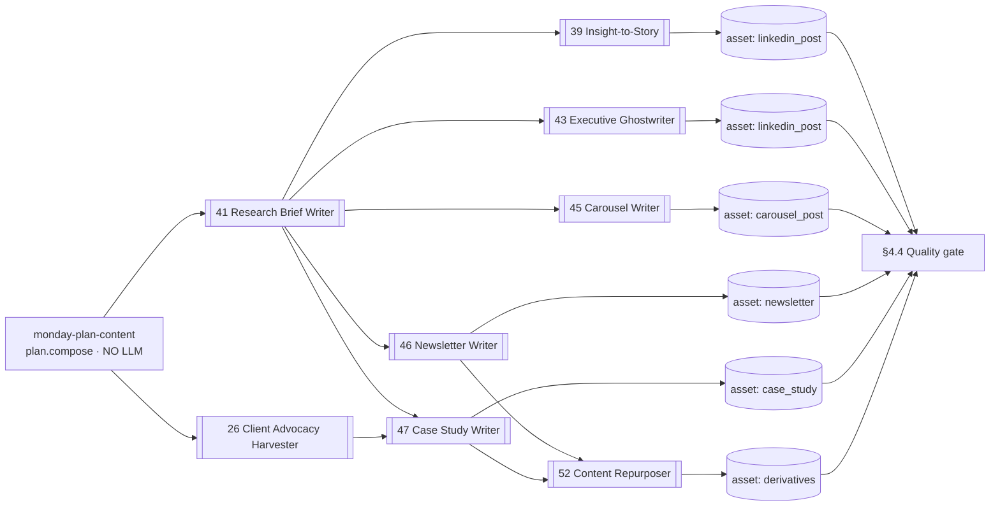

**Function package anatomy** — every package under `functions/NN-name/` carries the same five artefacts, validated by `services/registry/validate_package.py`:

| File | Role |
|---|---|
| `prompt.md` | The system prompt sent to the gateway — the agent's actual instructions |
| `schema.json` | Input contract |
| `tools.yaml` | Declared tool surface + permission tier, validated against `contracts/function-definition/tools.schema.json` |
| `skill.md` | Human-facing purpose / when-to-invoke / when-NOT-to-invoke |
| `evals/task-0N-*.json` | 5 golden eval tasks with rubrics, run in CI |

---

### 4.4 Quality & Compliance Subsystem

**Purpose.** Stop non-compliant content before it can reach a gate-check — and, since 11 Aug 2026, try to *fix* it automatically first.

| Facet | Detail |
|---|---|
| **Components** | `qa_review_handler`, `_single_draft_qa_review`, `_run_qa_retry_loop`, `_run_single_qa_check`, `_regenerate_draft_content`, `_looks_hollowed`, `_finalize_qa_failure`, `brand_rules.reconcile_violations`, `functions/02-brand-steward-qa/permission_check.py`, `services/registry/safety_suite.py` |
| **Inputs** | Draft asset bytes; `client_references`; channel; `docs/permission-register.yaml` |
| **Outputs** | `pass`/`violations` verdict; regenerated assets; `FAILED`/`QA_BLOCKED` transitions; Teams "needs edit" / "retries exhausted" cards |
| **Business rules** | ① `pass` is true only when `violations` is empty — no partial pass. ② `uncleared-client-reference` is **never retryable**. ③ Every retry re-runs *both* review kinds, not just the failing one. ④ Anti-hollowing detection is advisory only — it never blocks a retry. ⑤ A Postgres advisory lock on the draft's `task_id` makes exactly one sibling the retry owner; the loser finalises immediately rather than blocking. |
| **Failure points** | A losing sibling may emit a "needs edit" card that the winner supersedes seconds later — documented and accepted; `draft-content-repurpose` has no regeneration recipe and falls back to single-shot |

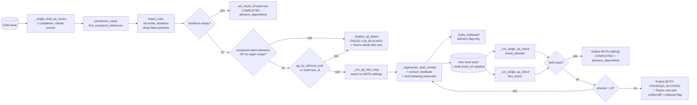

**The six Brand Steward checks** (`functions/02-brand-steward-qa/prompt.md`):

| # | Violation code | Rule | Exemption |
|---|---|---|---|
| 1 | `uncleared-client-reference` | Default deny; absence ≠ permission | none — nothing in the register is CLEARED today |
| 2 | `link-shortener` | No bit.ly / lnkd.in / tinyurl / ow.ly / buff.ly | none |
| 3 | `sa-english-spelling` | SA English required | none |
| 4 | `missing-cta` | Exactly one CTA | `channel: internal-brief` |
| 5 | `url-utm` | Full canvasintelligence.com URL with utm_source/medium/campaign | `channel: internal-brief` |
| 6 | `unsupported-claim` | Proof over platitude — a superlative needs a number, artefact or CLEARED client | none |

The same six codes are also implemented **deterministically** (regex + lexicon, no model) in `services/registry/safety_suite.py` for CI. Two independent implementations of the same policy — see §14.D1.

---

### 4.5 Governance Subsystem (Gatekeeper)

**Purpose.** Decide whether an action may happen, record that decision immutably, and — only if approved — mint a short-lived cryptographic authorisation.

| Facet | Detail |
|---|---|
| **Components** | `main.py` (internal), `approval_main.py` (external), `routers/{gate_check,approval_action,approval_status,decisions}.py`, `policy_loader.py`, `approval_inbox.py`, `tokens.py`, `signer/{keyvault,local}_signer.py`, `kill_switch.py`, `teams_client.py`, `auth.py` |
| **Inputs** | `GateCheckRequest`: `agent_run_id`, `function_id`, `action_class`, `content_hash`, preview fields |
| **Outputs** | Exactly one `gate_decisions` row per call; optionally an `approval_inbox` row + Teams card + approve/reject URLs; on approval, an RS256 JWT |
| **Business rules** | ① Kill switch checked **first**, uncached, every call. ② Unlisted `(function_id, action_class)` → level 0. ③ No `publish` entry may sit above level 2 (test-enforced). ④ No `smoke.*`/`test.*` function_id may exist (RISK-01). ⑤ Approval links are single-use via atomic conditional UPDATE and expire in 24h. ⑥ The approver is the Easy-Auth principal, never the link holder. |
| **Failure points** | Key Vault availability for signing; a level-2 "elevated" tier is documented as reserved but behaves identically to level 1 today |

```mermaid
flowchart LR
  GC[POST /gate-check] --> KS{kill_switch.is_blocked<br/>uncached SELECT}
  KS -->|blocked| R1[(gate_decisions: rejected<br/>kill_switch_active:scope)]
  KS --> LV[policy_loader.level_for<br/>autonomy.yaml]
  LV -->|"level 0<br/>(also the default)"| R2[(gate_decisions: rejected<br/>level_0_blocked)]
  LV -->|level 1 or 2| PRIOR{latest_approved<br/>for agent_run+fn+hash?}
  PRIOR -->|none| ESC[(gate_decisions: escalated)]
  ESC --> INB[(approval_inbox row<br/>link_token, expires_at)]
  INB --> DISP{teams-webhook-url<br/>configured?}
  DISP -->|yes| TC[Adaptive Card<br/>Action.OpenUrl ×2]
  DISP -->|no| INBOX[inbox row IS<br/>the delivery mechanism]
  TC --> HUM([Approver clicks])
  INBOX --> CONS[Console /approvals]
  HUM --> AA[GET /approval-action/token<br/>ca-gatekeeper-approval]
  AA --> AUTH{Easy Auth principal?}
  AUTH -->|no| U401[401 before token lookup]
  AUTH --> CONSUME{atomic UPDATE<br/>link_consumed_at IS NULL}
  CONSUME -->|lost race| AUD1[(approval_actions:<br/>link_already_used)]
  CONSUME -->|expired| AUD2[(approval_actions:<br/>link_expired)]
  CONSUME -->|won| AUD3[(approval_actions:<br/>approved / rejected)]
  AUD3 --> R3[(gate_decisions: approved<br/>decided_by = principal)]

  PRIOR -->|found| APPR
  LV -->|level 3| APPR[(gate_decisions: approved<br/>auto_approved)]
  LV -->|level 4| APPR
  R3 --> TOK
  APPR --> TOK[issue_gate_token<br/>RS256, Key Vault signer]
  TOK --> JWT[["JWT: exp, jti,<br/>gate_decision_id,<br/>resource = canonical JSON<br/>content_hash + function_id"]]
```

**Autonomy levels** (`services/gatekeeper/policy/autonomy.yaml`):

| Level | Meaning | Shipped entries |
|---|---|---|
| **0** | Blocked always — no approval can unblock | `publish.paid_ad`; **and every unlisted pair** |
| **1** | Single human approver | `publish.social_post` |
| **2** | Elevated approval (same mechanism today; reserved for quorum) | `publish.blog_article` |
| **3** | Auto-approved and audited | `draft.social_post`, `draft.brief` |
| **4** | Fully autonomous, logged | `analyse.signal`, `analyse.campaign_performance` |

---

### 4.6 Publishing & Distribution Subsystem

**Purpose.** Be the only thing that can turn an authorisation into an external side effect — and refuse, auditably, on any doubt.

| Facet | Detail |
|---|---|
| **Components** | `routers/publish.py`, `routers/publish_attempts.py`, `verifier.py`, `jti_ledger.py`, `hashing.py`, `kill_switch.py`, `vault_lookup.py`, `buffer_client.py`, `esp_client.py`, `vault_adapter.py` |
| **Inputs** | `PublishRequest`: gate token, raw content bytes, `function_id`, `agent_run_id`, optional `asset_id` |
| **Outputs** | Exactly one `governance.publish_attempts` row per call; a Buffer draft in live mode; `jti_ledger` consumption |
| **Business rules** | The ordering is the design — see below |
| **Failure points** | `esp_client.py` is written but **not wired** into the router; `buffer_client.resolve_live_fqdn` shells out to `az` at runtime |

**Check ordering rationale** (from `routers/publish.py`'s docstring — each position is deliberate):

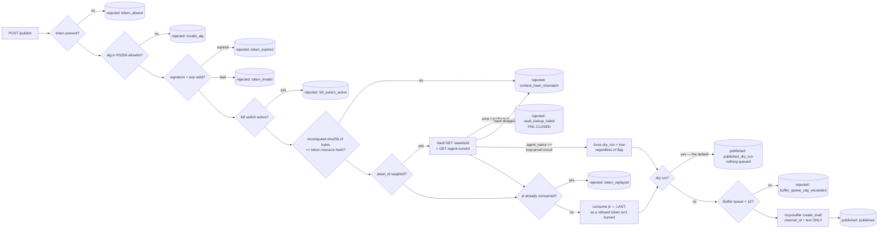

Three ordering facts worth stating plainly:
- **Kill switch is re-checked after token verification but before consumption** — a pre-issued, still-valid token cannot outlive an operator flipping the switch.
- **The Vault cross-check runs before the jti burn** — a broken lookup fails closed *without* spending the token.
- **The jti is consumed last** — a token refused for any other reason remains usable once the cause is fixed.

---

### 4.7 Vault (Data Custody) Subsystem

**Purpose.** Own the domain objects, and enforce POPIA-shaped consent, retention and access accounting on top of them.

| Facet | Detail |
|---|---|
| **Components** | `main.py` (+ structured request-logging middleware), `routers/{objects,consent,retention,utilisation}.py`, `models.py` (9-type registry), `consent.py`, `retention.py`, `storage.py`, `rollup.py`, `audit.py`, `db.py` |
| **Inputs** | HTTP CRUD on 9 object types; `X-Caller-Service` header |
| **Outputs** | Domain rows; `vault_internal.{access_log, utilisation_daily, consent_linkage, retention_policy, audit_log}`; one JSON log line + `X-Correlation-Id` per request |
| **Business rules** | ① A create carrying `data_subject_ref` is rejected unless a matching non-revoked `consent_register` row exists — and the accepted write is durably linked to it. ② Retention classes map to fixed durations; `legal_hold` uses a year-9999 sentinel so the NOT NULL constraint holds uniformly. ③ Every individual-object GET writes an `access_log` row, rolled up daily. |
| **Failure points** | Console's Vault search fetches full lists then filters client-side — explicitly flagged in-code as interim (§14.B3) |

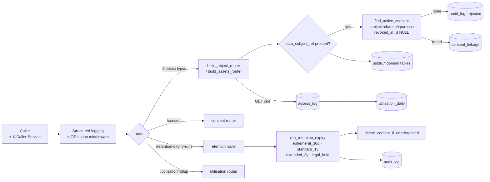

---

### 4.8 Analytics & Measurement Subsystem

**Purpose.** Close the loop — pull performance data back from every channel, reconcile it to campaigns, compute four KPIs, and hand it to Fabric/Power BI.

| Facet | Detail |
|---|---|
| **Components** | `cli.py` (`run` / `nightly`), `ingest.py`, `utm.py`, `rollup.py`, `fabric_export.py`, `blob_writer.py`, source clients `{buffer,ga4,search_console,linkedin}_client.py`, `google_auth.py`, `credentials.py`, `vault_client.py` |
| **Trigger** | Container Apps Job `caj-analytics-nightly-ingest`, cron `0 1 * * *` (01:00 UTC / 03:00 SAST) running `python -m analytics_ingest.cli nightly --day <yesterday>` |
| **Business rules** | ① Every rollup upserts `ON CONFLICT … DO UPDATE` — re-runs are idempotent. ② Rows whose `utm_campaign` doesn't match `utm_campaign_map` are quarantined with a reason, never silently dropped. ③ Groups with zero impressions / zero accepted assets are skipped rather than dividing by zero. ④ The export self-validates against `analytics/contracts/fabric-nightly-export.schema.json` before upload. |
| **Failure points** | Dual-mode fixtures vs. live — only Buffer has a live path in this session; the loop file documents a graph the orchestrator does **not** execute (§14.F2) |

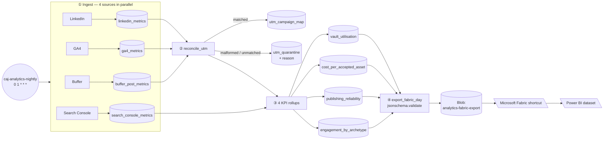

---

### 4.9 MCP Tool Subsystem

**Purpose.** Give agents a uniform, permission-scoped tool surface, and keep every vendor credential behind it.

| Server | Tools | Mode gate | Notable constraint |
|---|---|---|---|
| **mcp-web** | `fetch_url` | `MCP_WEB_LIVE_MODE` (non-secret flag, waivered — this server has no vendor credential) | Egress allow-list checked *before* any network call; sliding-window rate limit |
| **mcp-buffer** | `list_queue`, `get_post`, `create_draft` | Presence of `BUFFER_API_KEY` / Key Vault secret | `create_draft` status is **hardcoded server-side**; no tool exposes a status/mode/state parameter; no name or description may match `publish\|share.?now\|send.?now\|go.?live` (pytest-enforced) |
| **mcp-canva** | `create_design_from_template`, `bulk_create_from_csv`, `export_design` | Credential presence | Both creation tools are **template-locked** — `template_id` is required, so no free-form design creation path exists |

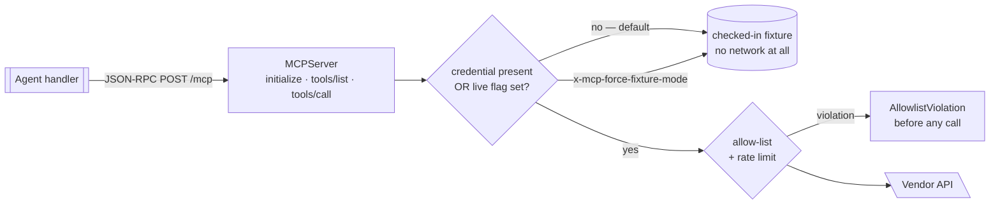

---

### 4.10 Console, Telemetry & Delivery Subsystem

| Facet | Detail |
|---|---|
| **Console** | FastAPI + Jinja2, behind Container Apps Easy Auth with `unauthenticatedClientAction: Return401`. Read routes: `/tasks`, `/tasks/{ref}/trace`, `/review/{task_id}`, `/approvals`, `/vault-search`, `/costs`, `/kill-switch`. One write route: `POST /kill-switch/toggle`, same-origin-checked, operator identity taken from Easy Auth headers. `/health` is deliberately unauthenticated for probes. |
| **Telemetry** | `services/telemetry-lib` wraps OpenTelemetry with a **closed enum** of span attribute keys (`function_id`, `task_ref`, `model`, `registry_version`, `cost` required; `status`, `duration_ms`, `error_code` optional) and structurally rejects values over 200 chars — mirroring the queue's no-free-text rule for spans. Every service wires `traceparent` propagation. Exporter: Application Insights. |
| **Registry / CI** | `services/registry` validates package shape, builds a **byte-reproducible** canonical-JSON manifest signed with Ed25519 (no timestamps, no absolute paths, CRLF normalised), runs golden evals in mocked mode with a per-rubric assertion of zero live calls, and runs the deterministic safety suite. 15 GitHub Actions workflows cover CI, per-service image builds, infra deploy via OIDC federated identity (no client secrets), and Slack/Teams deploy notification. |

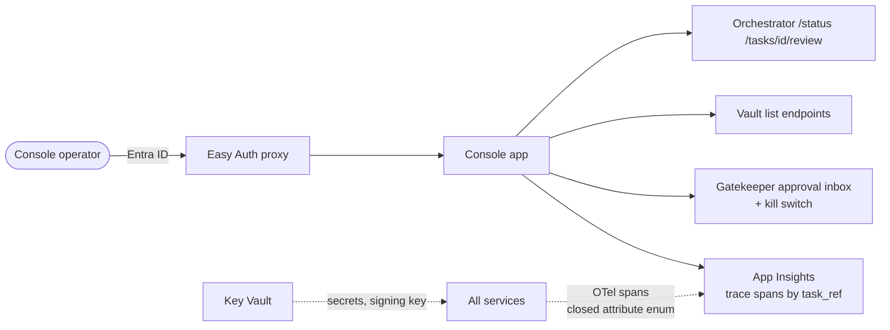

---

## 5. End-to-End Process Flows — **Level 3**

Five processes matter. Each is traced **Trigger → Input → Processing → Decisions → Agents/Services → Data → External → Output → Next action**.

---

### 5.1 Process A — Daily Signal Loop

**Trigger:** Logic App `la-daily-signal-loop-trigger`, 06:00 South Africa Standard Time, daily.
**Status (revision 2):** all **23 tasks now have real handlers**. At revision 1 only 6 did; the other 17 were `legacy_task_pass_through` no-ops. The eleven S10 scanners are registered from one factory (`SCANNER_TASKS` → `_make_scanner_handler` → `**SCANNER_HANDLERS`), so a naive grep of `DISPATCH_TABLE` still under-counts them — resolve the spread before concluding anything is unwired.

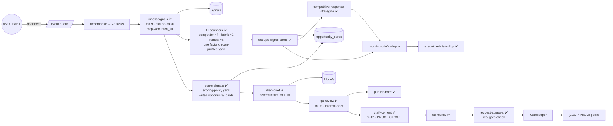

**The S8 Proof Circuit** deserves a note. It is a deliberately isolated, permanently dry-run exercise of the full `signal → brief → draft → QA → approval-card` path against the **live** platform. Its isolation is enforced in three independent places:

1. `params.proof_circuit: true` in the loop YAML → carried onto `TaskEnvelope.metadata` by `worker._task_metadata`.
2. Every Vault `agent_run` it creates is tagged `agent_name = "loop-proof-circuit"`.
3. **Publisher forces `dry_run = true`** whenever an asset's `agent_name` resolves to that constant — *regardless of the `PUBLISHER_DRY_RUN` flag* (`publisher/app/vault_lookup.py`). The constant is duplicated in both services and kept honest by a cross-service test.

---

### 5.2 Process B — Weekly Content Loop

**Trigger:** Logic App `la-weekly-planning-trigger`, **07:00 SAST every day**. Daily is the deliberate cadence (confirmed 17 Aug 2026) — one complete cycle lands each morning for review.
**All 27 tasks have real handlers.** This is the production content pipeline.

The loop id and its `monday-` … `friday-` task-id prefixes are **dependency-chain names, not a schedule.** One heartbeat decomposes the whole graph and runs it as fast as `depends_on` allows, so a daily fire means a full Mon-Fri cycle per day — not one weekday's slice per day.

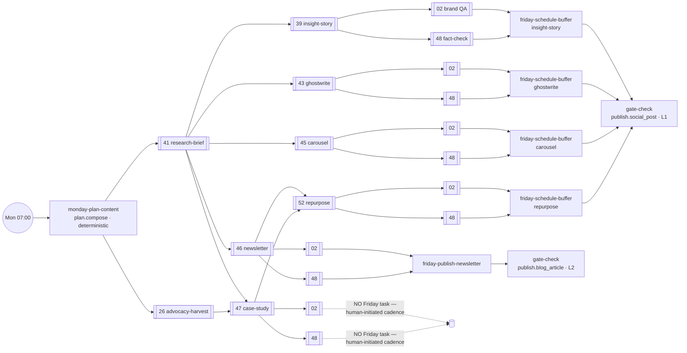

**Why the graph looks like this.** It originally had **two** aggregate Thursday tasks, each depending on all six Wednesday drafts and resolving to one all-or-nothing state. On the night of 10 Aug 2026, a **spelling typo in one draft** dead-lettered the Friday publish tasks for every other draft — including 4–5 that individually passed both reviews cleanly. The fix was a full restructure to 12 per-draft review tasks. The isolation comes from the dependency graph shape, not from handler-level filtering. This is the clearest example in the codebase of a load-bearing architectural principle: *let the graph enforce isolation.*

---

### 5.3 Process C — Human Approval & Publish

The most security-sensitive path in the system.

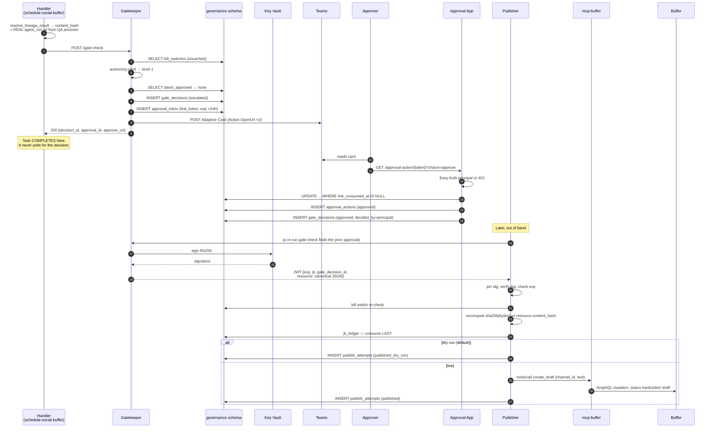

**Note the gap.** The handler completes as soon as `/gate-check` responds. Nothing in the orchestrator subsequently reacts to the human's decision — there is no inbound callback surface. Approval-to-publish is currently a **manual, out-of-band step**. The code says so plainly: Phase 2b and Phase 3 of the QA feedback design are *"DELIBERATELY NOT implemented … both need a new inbound API surface … that does not exist anywhere in this codebase yet."* (§14.F4)

---

### 5.4 Process D — Failure, Retry and Cascade

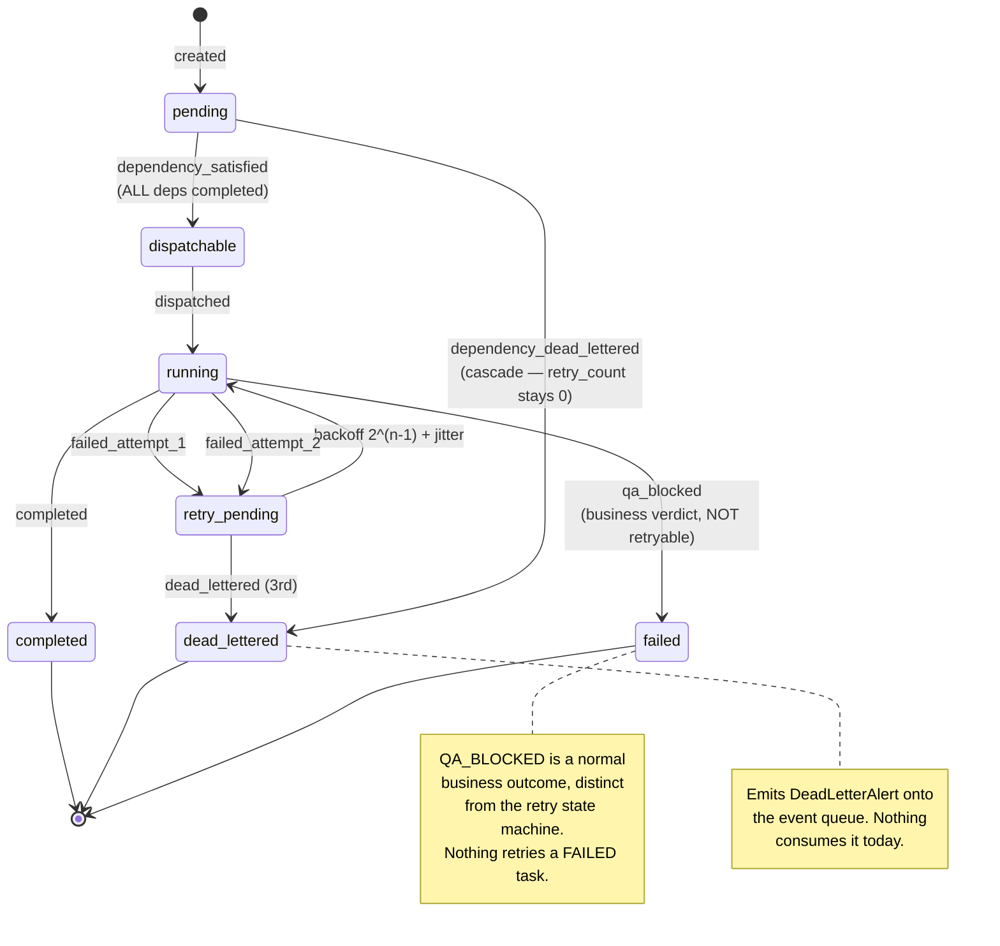

Two distinct dead-letter reasons exist on purpose, so an operator reading `task_transitions` can tell *"we tried 3 times and gave up"* (`dead_lettered`) from *"we never tried, it was already impossible"* (`dependency_dead_lettered`). The cascade check is **one hop only** — deliberately, because wave-by-wave propagation reaches every descendant on the next check without a recursive lineage walk.

---

### 5.5 Process E — Nightly Analytics & Reporting

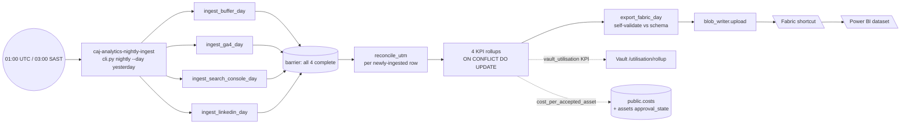

The KPI set is small and deliberate — four numbers that answer *"is this working and what is it costing?"*:

| KPI | Formula | Source |
|---|---|---|
| Engagement rate by post archetype | Σ(reactions+comments+shares+clicks) / Σ(impressions), grouped by (source, archetype) | `buffer_post_metrics` ∪ `linkedin_metrics` |
| Publishing reliability | scheduled vs. actually-published | `scheduled_posts` |
| Cost per accepted asset | Σ(costs.usd) / count(approved assets) | `public.costs` → `agent_runs` → `campaigns`; `assets.approval_state` |
| Vault utilisation | access counts by object class | `vault_internal.utilisation_daily` |

---

## 6. Agent Architecture

### 6.1 What counts as an agent here

There is no long-running autonomous agent loop in this system. An "agent" is a **function package** — a versioned bundle of prompt, input schema, tool declarations, skill description and golden evals — invoked by an orchestrator handler as a **single, stateless completion** through the Model Gateway. The agency lives in the *graph*, not in any individual agent.

```mermaid
flowchart LR
  subgraph PKG["Function package (git-versioned)"]
    PR[prompt.md<br/>system prompt]
    SC[schema.json<br/>input contract]
    TL[tools.yaml<br/>declared tools + perms]
    SK[skill.md<br/>when to / when NOT to invoke]
    EV[evals/ ×5<br/>golden tasks + rubrics]
  end
  PKG -->|read at runtime| H[Handler in dispatch.py]
  H -->|system + user JSON| GW[Model Gateway]
  GW --> LLM[\Anthropic\]
  LLM --> P[_parse_json_content<br/>raw_decode, tolerate trailing]
  P --> ART[(Vault artefact<br/>+ agent_run + costs)]
  EV -.->|CI only| REG[registry eval harness<br/>mocked, zero live calls]
```

### 6.2 The wired agents

Every row below was traced from `DISPATCH_TABLE` through its handler to the `prompt.md` it reads. Revision 2 adds the eleven scanners (§6.3), function 17 (source scout) and the month-end reporter; the fourteen below are the content-producing core.

| Agent | Function ID | Purpose | Trigger (task_type) | Model | Key inputs | Outputs → stored | Decisions it makes |
|---|---|---|---|---|---|---|---|
| **Market Intelligence Director** | `09-market-intelligence-director` | Scan a topic, return ≥3 attributed market signals | `ingest-signals` | `claude-haiku` | `fetch_sources.yaml` topic/horizon + 4 fetched page bodies via mcp-web | `signals` row (payload JSONB) | Which items qualify as signals; pillar tagging; confidence level; drops unattributable items |
| **Brief Composer** | `brief.compose` | Render signals into a full + executive brief | `draft-brief` | **none** — deterministic | Ancestor `vault_signal_id` | 2 `briefs` rows | none (pure rendering) |
| **Brand Steward QA** | `02-brand-steward-qa` | Six-check compliance verdict | `qa-review`, `qa-review-brand-steward` | `claude-sonnet` | draft text, `client_references`, channel | verdict → `result_ref`; `agent_run` | pass/fail; which violation codes apply |
| **Fact-Check Verdict** | `48-fact-check-verdict` | Verify every proof point traces to a closed source list | `qa-review-fact-check` | `claude-sonnet` | draft text | verdict → `result_ref` | traceable vs. fabricated |
| **LinkedIn Post Writer** | `42-linkedin-post-writer` | One CFO-audience LinkedIn post from one proof point | `draft-content` | `claude-sonnet` | pillar, proof point, campaign UTM | `assets` (linkedin_post) | copy, CTA, hook |
| **Content Planner** | `plan.compose` | Rotate the week's pillar | `plan-content-monday` | **none** — deterministic | `CONTENT_PILLARS` list | `result_ref` (pillar) | pillar rotation |
| **Research Brief Writer** | `41-research-brief-writer` | Turn signals into a cited research brief | `draft-research-brief` | `claude-sonnet` | week's signals | `briefs` row | which claims have citable sources |
| **Client Advocacy Harvester** | `26-client-advocacy-harvester` | Harvest advocacy quotes against consent + permission register | `draft-client-advocacy-harvest` | `claude-sonnet` | consent fixture, permission register | `result_ref` | whether a quote is usable / must stay client-free |
| **Insight-to-Story Editor** | `39-insight-to-story-editor` | Narrative story draft | `draft-insight-to-story` | `claude-sonnet` (2048 tok) | research brief, pillar | `assets` (linkedin_post) | narrative framing |
| **Executive Ghostwriter** | `43-executive-ghostwriter` | Executive-voice piece, never fabricating an opinion | `draft-executive-ghostwrite` | `claude-sonnet` (2560 tok) | research brief | `assets` (linkedin_post) | voice, what the exec did/didn't say |
| **Carousel Post Writer** | `45-carousel-post-writer` | Multi-slide carousel + Canva Bulk Create CSV manifest | `draft-carousel-post` | `claude-sonnet` (2560 tok) | research brief proof points | `assets` (carousel_post) | slide breakdown |
| **Newsletter Writer** | `46-newsletter-writer` | Owned-channel newsletter digest | `draft-newsletter` | `claude-sonnet` (3584 tok) | research brief | `assets` (newsletter) | subject line, section selection |
| **Case Study Writer** | `47-case-study-writer` | Case study, client-free unless CLEARED | `draft-case-study` | `claude-sonnet` (4096 tok) | research brief + cleared advocacy quote | `assets` (case_study) | whether a client may be named |
| **Content Repurposer** | `52-content-repurposer` | Derivative short formats from newsletter/case study | `draft-content-repurpose` | `claude-sonnet` | source draft selection | `assets` (derivatives) | which source, which target formats |

**Common to every LLM agent:**

| Aspect | Behaviour |
|---|---|
| **Prompt/instructions** | `functions/<id>/prompt.md`, read from `FUNCTIONS_DIR` at call time — never inlined in Python |
| **Tools** | Declared in `tools.yaml`; only function 09 actually reaches a tool at runtime (mcp-web `fetch_url`). The rest declare read-only lookups that are implemented as *prompt instructions plus deterministic post-checks*, not runtime tool calls — **an important nuance** (§14.A1) |
| **Data sources** | Vault via HTTP; `docs/positioning.md`, `docs/permission-register.yaml` as prompt-referenced sources |
| **Error handling** | Exception → `DispatchError` → `_retry_or_dead_letter` → 3 strikes → `dead_lettered` + alert. JSON parse failure logs a 4000-char preview (the only place a raw response is ever persisted) |
| **Human approval** | Required only at the publish boundary, via Gatekeeper levels 1/2. Drafting is level 3 (auto-approved, audited); analysis is level 4 |
| **Where outputs go** | `agent_runs.output` (JSONB) + a typed artefact row + `task_state.result_ref` — three places, deliberately |

### 6.3 The eleven S10 scanners — wired since revision 1

At revision 1 these eleven packages had complete definitions (prompt, schema, tools, skill, 5 evals each) and a task in `daily-signal-loop.yaml`, but **no entry in `DISPATCH_TABLE`**, so every one was a `legacy_task_pass_through` no-op:

`10-competitor-discovery-scanner` · `11-competitor-change-monitor` · `12-competitive-positioning-analyst` · `13-competitor-content-performance-scout` · `16-microsoft-fabric-ecosystem-scout` · `18-01` … `18-06 vertical-intel-*` · `25-competitive-response-strategist`

All eleven are now registered, and the way they are registered is worth knowing:

```python
SCANNER_TASKS: dict[str, tuple[str, str, str]] = {
    # task_type: (function_id, default profile_id, agent_name)
    "competitor-discovery-scan": ("10-competitor-discovery-scanner", ...),
    ...
}
DISPATCH_TABLE = { **SCANNER_HANDLERS, "ingest-signals": ..., ... }
```

One factory (`_make_scanner_handler`) builds all eleven from a table, and they enter `DISPATCH_TABLE` as a **dict spread**. A grep for `"task-type":` in `DISPATCH_TABLE` therefore misses them and reports eleven false no-ops — resolve `SCANNER_TASKS` before drawing any conclusion. Their scan scope is data, in `functions/_shared/scan-profiles.yaml`.

Deliberately **not** written straight to `opportunity_cards`: the eleven share three listening scopes, so the same event legitimately surfaces several times. De-duplication is `dedupe-signal-cards`' job, and card rows are written only after it runs (`dispatch.py`'s `SCANNER_TASKS` header comment).

### 6.4 Agent Interaction Graph

Distinguishing agents ⟦double⟧, tools, databases, external services and humans.

```mermaid
flowchart LR
  classDef agent fill:#e2f2ea,stroke:#0f5c4a,color:#0d3b30
  classDef tool fill:#e7f3e6,stroke:#3d8168,color:#17401f
  classDef data fill:#fdf0dc,stroke:#c08a2e,color:#4a3510
  classDef ext fill:#fbe6ea,stroke:#b24a63,color:#4a1a26
  classDef human fill:#efe6f7,stroke:#7a4fa3,color:#2a1a3d
  classDef dec fill:#eef0f2,stroke:#6b7684,color:#1d2530

  A09[[09 Market Intel]]:::agent
  A41[[41 Research Brief]]:::agent
  A26[[26 Advocacy]]:::agent
  ADRAFT[[39·43·45·46·47·52<br/>Drafting agents]]:::agent
  A42[[42 LinkedIn]]:::agent
  A02[[02 Brand Steward]]:::agent
  A48[[48 Fact-Check]]:::agent
  BC[[brief.compose<br/>deterministic]]:::agent
  PL[[plan.compose<br/>deterministic]]:::agent

  MW[mcp-web fetch_url]:::tool
  MB[mcp-buffer create_draft]:::tool
  MC[mcp-canva templates]:::tool
  PCK[permission_check.py]:::tool
  BRL[brand_rules<br/>reconcile_violations]:::tool
  GWT[Model Gateway]:::tool

  VS[(signals)]:::data
  VB[(briefs)]:::data
  VA[(assets)]:::data
  VR[(agent_runs)]:::data
  VC[(costs)]:::data
  GD[(gate_decisions)]:::data
  AI[(approval_inbox)]:::data
  PA[(publish_attempts)]:::data

  ANT[\Anthropic\]:::ext
  BUF[\Buffer\]:::ext
  NEWS[\News sources\]:::ext
  TMS[\Teams\]:::ext

  HUM([Approver]):::human

  DQA{QA verdict}:::dec
  DGT{Autonomy level}:::dec

  NEWS --> MW --> A09
  A09 -->|GENERATES| VS
  VS --> BC -->|GENERATES| VB
  PL -->|pillar| A41
  VS --> A41 -->|GENERATES| VB
  A26 --> ADRAFT
  VB --> ADRAFT -->|GENERATES| VA
  VB --> A42 -->|GENERATES| VA

  VA --> A02 --> DQA
  VA --> A48 --> DQA
  PCK --> A02
  BRL --> A02
  BRL --> A48
  DQA -->|fail, retryable| ADRAFT
  DQA -->|fail, terminal| TMS
  DQA -->|pass| DGT

  A09 & A41 & A26 & ADRAFT & A42 & A02 & A48 -->|CALLS| GWT --> ANT
  GWT -->|WRITES_TO| VC
  A09 & A41 & A26 & ADRAFT & A42 & A02 & A48 -->|WRITES_TO| VR

  DGT -->|"level 1/2"| AI --> TMS --> HUM
  HUM -->|APPROVES| GD
  DGT -->|"level 3/4"| GD
  GD -->|"signed token"| PA
  PA -->|live mode only| MB --> BUF
  MC -.->|"declared, not wired<br/>into any handler"| BUF
```

---

## 7. Data-Flow Architecture

### 7.1 Source → Ingestion → Transformation → Storage → Processing → Consumption → Output

```mermaid
flowchart LR
  subgraph SRC["Sources"]
    S1[\Public news<br/>+ MS Learn\]
    S2[\Buffer API\]
    S3[\GA4 / Search Console\]
    S4[\LinkedIn\]
    S5[Human input:<br/>positioning.md,<br/>permission-register.yaml]
    S6[\Anthropic completions\]
  end

  subgraph ING["Ingestion"]
    I1[mcp-web fetch_url<br/>allow-listed, rate-limited]
    I2[analytics_ingest<br/>source clients]
    I3[Vault API POST]
  end

  subgraph TFM["Transformation"]
    T1[LLM structuring<br/>→ JSON contract]
    T2[Deterministic render<br/>_render_brief / _render_*]
    T3[reconcile_utm<br/>match or quarantine]
    T4[KPI rollups<br/>SQL aggregation]
    T5[content_hash<br/>sha256 of bytes]
  end

  subgraph STO["Storage"]
    P1[(public: signals, briefs,<br/>assets, campaigns,<br/>agent_runs, costs,<br/>gate_decisions, consent,<br/>opportunity_cards)]
    P2[(public: task_state,<br/>task_transitions)]
    P3[(governance: kill_switches,<br/>approval_inbox/actions,<br/>publish_attempts, jti_ledger)]
    P4[(analytics: 4 metrics,<br/>utm map/quarantine,<br/>scheduled_posts,<br/>4 KPI rollups)]
    P5[(vault_internal: access_log,<br/>utilisation_daily,<br/>consent_linkage,<br/>retention_policy, audit_log)]
    P6[(Blob: fabric export)]
  end

  subgraph CON["Consumption"]
    C1[Console UI]
    C2[Orchestrator /status /runs]
    C3[App Insights spans]
    C4[\Power BI / Fabric\]
    C5[\Teams cards\]
  end

  S1 --> I1 --> T1
  S6 --> T1 --> I3 --> P1
  S5 -.->|prompt-referenced| T1
  T1 --> T2 --> I3
  T1 --> T5 --> P1
  S2 & S3 & S4 --> I2 --> P4
  P4 --> T3 --> P4
  P4 --> T4 --> P4
  P4 --> P6 --> C4
  P1 --> C1 & C2
  P2 --> C2
  P3 --> C1
  P5 --> T4
  P1 & P3 --> C5
  ALLSVC[All services] -.-> C3
```

### 7.2 Major datasets and ownership

One Postgres Flexible Server, four schemas. **Ownership** = the single component permitted to write.

| Schema | Table | Owner (writer) | Readers | Notes |
|---|---|---|---|---|
| `public` | `campaigns` | Vault API | Orchestrator, Console, analytics | Top of the cost roll-up chain |
| `public` | `signals` | Vault API (via ingest handler) | draft-brief handler, Console | JSONB payload from function 09 |
| `public` | `opportunity_cards` | Vault API | Console | **Declared in the frozen schema; no writer found in any handler** — Unknown / Requires Confirmation |
| `public` | `briefs` | Vault API | drafting handlers, QA, Console | |
| `public` | `agent_runs` | Vault API | Gateway (budget lookup), Publisher, Console, analytics | `NOT NULL` FK → campaigns |
| `public` | `assets` | Vault API | QA, Publisher, Console | version + approval_state + self-referencing predecessor |
| `public` | `gate_decisions` | Gatekeeper **and** Model Gateway | Publisher, Console | Append-only; two independent writers (§14.D2) |
| `public` | `costs` | Model Gateway `metering.py` | Gateway budget, analytics, Console | 3 rows per completion: usd, tokens, ms |
| `public` | `consent_register` | Vault API | Vault consent gate | POPIA s11/s69-shaped |
| `public` | `task_state` | Orchestrator only | Orchestrator, Console | `result_ref` JSONB is the inter-task data bus |
| `public` | `task_transitions` | Orchestrator only | Console, operators | CHECK-constrained closed reason vocabulary |
| `governance` | `kill_switches` | Console toggle route | Gatekeeper, Publisher (uncached, every call) | |
| `governance` | `approval_inbox` | Gatekeeper | Approval app, Console | single-use link token, 24h TTL |
| `governance` | `approval_actions` | Approval app | Console, audit | all 4 click outcomes recorded |
| `governance` | `publish_attempts` | Publisher only | Console, audit | one row per branch, including refusals |
| `governance` | `jti_ledger` | Publisher only | Publisher | replay prevention; durable, never in-memory |
| `analytics` | 4 metrics tables | analytics-ingest | rollups, Power BI | |
| `analytics` | `utm_campaign_map` / `utm_quarantine` | analytics-ingest | reconciliation | |
| `analytics` | 4 `kpi_rollup_*` | analytics-ingest | Fabric export, Power BI | upsert-idempotent |
| `vault_internal` | `access_log` → `utilisation_daily` | Vault | utilisation KPI | pure telemetry, no personal data |
| `vault_internal` | `consent_linkage` | Vault | audit | links an accepted write to the consent that permitted it |
| `vault_internal` | `retention_policy` | Vault | retention sweep | |
| `vault_internal` | `audit_log` | Vault | audit | rejection + deletion paths only |

### 7.3 The unbroken cost chain

```mermaid
flowchart LR
  CO[(costs)] -->|"NOT NULL FK"| AR[(agent_runs)] -->|"NOT NULL FK"| CA[(campaigns)]
  AR --> AS[(assets)]
  AR --> GD[(gate_decisions)]
  AS -.->|"no direct FK —<br/>join via agent_run_id,<br/>take latest decided_at"| GD
```

`costs → agent_runs → campaigns` is a deliberate unbroken FK chain enabling per-campaign cost roll-up. `assets` and `gate_decisions` deliberately have **no direct FK** to each other; the documented join convention is `assets.agent_run_id = gate_decisions.agent_run_id ORDER BY decided_at DESC LIMIT 1`, which is authoritative precisely because `gate_decisions` is append-only.

### 7.4 The inter-task data bus

The mechanism by which one task hands work to the next is worth stating explicitly, because it is not obvious from any single file:

```mermaid
flowchart LR
  H1[Handler A] -->|"db.set_result_ref(task_id, {...})"| TS[(task_state.result_ref<br/>JSONB)]
  TS -->|"resolve_lineage_result<br/>BFS up depends_on,<br/>max 6 hops"| H2[Handler B]
  H2 -->|"reads vault_asset_id,<br/>content_hash, brief_id,<br/>agent_run_id, campaign_id"| VAULT[(Vault tables)]
```

`resolve_lineage_result` performs a **breadth-first walk up the `depends_on` ancestry** until it finds a task carrying a non-null `result_ref`. This is what lets it transparently walk *past* a pass-through no-op — `draft-brief`'s immediate predecessor is `score-signals` (a no-op with no `result_ref`), so the walk continues to `ingest-signals` two hops back. One mechanism, no per-loop special-casing.

---

## 8. Dependency Graph

```mermaid
flowchart TB
  classDef spof fill:#fadcdc,stroke:#c0392b,color:#4a1414,stroke-width:3px
  classDef shared fill:#e3edf8,stroke:#2f6fad,color:#12283d
  classDef ext fill:#fbe6ea,stroke:#b24a63,color:#4a1a26
  classDef norm fill:#f2f4f6,stroke:#8a95a1,color:#1d2530

  PG[(Postgres Flexible Server<br/>ALL 4 schemas)]:::spof
  SB[/Service Bus namespace<br/>task + event/]:::spof
  KV[Key Vault<br/>signing key + secrets]:::spof
  ACR[Container Registry]:::spof
  VNET[VNet + Private DNS]:::spof

  GW[Model Gateway]:::shared
  VA[Vault API]:::shared
  GK[Gatekeeper]:::shared
  TL[telemetry-lib]:::shared
  CTR[contracts/ frozen files]:::shared
  FNS[functions/ prompt files]:::shared

  ORC[Orchestrator]:::norm
  PB[Publisher]:::norm
  CON[Console]:::norm
  AN[analytics-ingest]:::norm
  MW[mcp-web]:::norm
  MB[mcp-buffer]:::norm
  MC[mcp-canva]:::norm
  AZC[Azure CLI in container<br/>FQDN resolution]:::spof

  ANT[\Anthropic API\]:::ext
  BUF[\Buffer\]:::ext
  TMS[\Teams webhook\]:::ext
  GOO[\Google APIs\]:::ext
  LNK[\LinkedIn\]:::ext
  AIS[App Insights]:::ext

  ORC --> PG & SB & GW & VA & GK & MW & CTR & FNS & TL & AZC
  GW --> PG & ANT & CTR & TL
  VA --> PG & TL
  GK --> PG & KV & TMS & TL
  PB --> PG & KV & VA & MB & TL
  CON --> ORC & VA & GK & AIS & TL
  AN --> PG & BUF & GOO & LNK & KV
  MB --> BUF & KV
  MC --> BUF
  MW -.-> AZC
  MC --> KV

  GW & VA & GK & PB & ORC & CON & MW & MB & MC --> VNET
  GW & VA & GK & PB & ORC & CON & MW & MB & MC --> ACR
  ALL2[All services] -.-> AIS
```

### 8.1 Critical dependencies and single points of failure

| Rank | Component | Blast radius if it fails | Mitigation present? |
|---|---|---|---|
| **1** | **Postgres Flexible Server** | Total. All 4 schemas — domain data, task state, governance audit, analytics — sit on one server. Orchestrator can't transition tasks, Gatekeeper can't decide, Publisher can't check replay, Console shows nothing. | None architecturally. `/health` endpoints deliberately avoid DB round-trips so probes stay green — which *masks* the outage rather than mitigating it. |
| **2** | **Service Bus namespace** | No work starts and no task progresses. Heartbeats are lost (Logic Apps do not retry into a durable store). | Local double exists for tests only. |
| **3** | **Model Gateway** | Every LLM agent halts. It is the *only* permitted path to a provider. | Single-purpose service, small surface; per-replica cache means no shared-state failure. |
| **4** | **Key Vault** | No new gate tokens can be signed → nothing can be authorised to publish. | Publisher can read the public key from an env-threaded secret, so *verification* survives; *issuance* does not. |
| **5** | **Vault API** | Every handler fails: agents can't create runs, assets or briefs. | None. |
| **6** | **Azure CLI availability inside containers** | `resolve_live_fqdn` shells out to `az containerapp show`. If the CLI is missing, unauthenticated, or slow, service discovery returns `None` and clients fail — *by design it never fabricates a hostname*. | Env-var override (`CMOS_*_BASE_URL`) wins; results are memoised per process. |
| **7** | **Anthropic API** | All content generation stops; deterministic handlers (`brief.compose`, `plan.compose`) still work. | Provider registry makes a second provider a data + one-registration change. |
| **8** | **The orchestrator worker task** | It is a single `asyncio.Task` inside the FastAPI process. If its startup raised, `worker_task = None` and the API still serves `/health` 200 — **the system looks healthy and does nothing**. | `worker_loop_start_failed` is logged at WARNING only. |

### 8.2 Shared services and highly connected components

| Component | In-degree | Why it matters |
|---|---|---|
| **Postgres** | 9 services | Everything |
| **telemetry-lib** | 7 services | Installed editable from source in every image; a breaking change touches every service simultaneously |
| **contracts/** | 4 services read at **runtime** (not just build) | Gateway reads `openapi.yaml` and `redaction-rules.yaml`; Orchestrator reads `loop-definition.schema.json`. Requires per-image staging + `CONTRACTS_DIR` |
| **`functions/` prompt files** | Orchestrator (runtime) + registry (CI) | Requires per-image staging + `FUNCTIONS_DIR` |
| **Vault API** | 4 callers | |
| **`AGENT_NAME_LOOP_PROOF` constant** | Duplicated in orchestrator + publisher | Kept honest by a cross-service test — a deliberate coupling made explicit |
| **`kill_switch.py`** | Duplicated in gatekeeper + publisher | Kept honest by `test_kill_switch_parity.py` |

### 8.3 Circular dependencies

**No import-level cycles exist** between services — each is independently packaged, and the two duplicated modules (`kill_switch.py`, verifier constants) exist precisely *to avoid* a shared library that would create one.

Two **runtime** cycles do exist and are intentional:

```mermaid
flowchart LR
  A[Orchestrator dispatch] -->|"POST /v1/completions"| B[Model Gateway]
  B -->|"writes costs row"| C[(public.costs)]
  A -->|"GET /costs/{id} for span attr"| D[Vault API] --> C
  D -.->|"best-effort; failure<br/>never blocks handler"| A

  E[QA review task] -->|"violation → regenerate"| F[Drafting agent]
  F -->|"new asset"| E
```

The QA↔drafting cycle is bounded at `MAX_QA_RETRY_ATTEMPTS = 10` and serialised by a Postgres advisory lock. The cost-lookup cycle is explicitly best-effort — a failure only leaves the telemetry span's `cost` attribute at `0.0`.

### 8.4 Lazy imports as deliberate decoupling

`dispatch.py` imports `teams_notify` **inside** functions, `state_machine` imports `dead_letter.emit_alert` inside `record_failure`, and `worker.handle_task_message` imports `dispatch` inside the function body. These break what would otherwise be import cycles within the orchestrator package — a real pattern worth knowing before refactoring.

---

## 9. Integration Map

```mermaid
flowchart TB
  subgraph CMOS["Canvas Marketing OS"]
    GW[Model Gateway]
    MW[mcp-web]
    MB[mcp-buffer]
    MC[mcp-canva]
    GK[Gatekeeper]
    ORC[Orchestrator]
    PB[Publisher]
    AN[analytics-ingest]
    CON[Console]
  end

  subgraph AZ["Azure platform"]
    KV[Key Vault]
    AIS[App Insights]
    BLB[Blob Storage]
    ENT[Entra ID]
    ACR[Container Registry]
    SB[Service Bus]
  end

  subgraph TP["Third parties"]
    ANT[\Anthropic Messages API\]
    BUF[\Buffer GraphQL\]
    CNV[\Canva Connect API\]
    TMS[\Teams via Power Automate\]
    GA4[\GA4 Data API\]
    GSC[\Search Console API\]
    LNK[\LinkedIn API\]
    MCH[\Mailchimp — NOT WIRED\]
    FAB[\Microsoft Fabric\]
    NWS[\learn.microsoft.com<br/>moneyweb.co.za<br/>businesstech.co.za\]
    SLK[\Slack — CI only\]
  end

  GW -->|"HTTPS, API key from KV"| ANT
  MW -->|"HTTPS GET, allow-listed"| NWS
  MB -->|"GraphQL, Bearer token"| BUF
  MC -->|"OAuth"| CNV
  GK -->|"HTTPS POST Adaptive Card"| TMS
  ORC -->|"HTTPS POST Adaptive Card"| TMS
  PB -->|"MCP JSON-RPC"| MB
  PB -.->|"written, unwired"| MCH
  AN -->|"service account"| GA4 & GSC
  AN -->|"OAuth / token"| LNK
  AN -->|"API key"| BUF
  AN --> BLB --> FAB
  CON & GK -->|"Easy Auth"| ENT
  ALLS[All] --> KV & AIS & ACR
  ORC --> SB
```

### 9.1 Integration register

| External system | Purpose | Connection | Auth | Data sent | Data received | Frequency / trigger | Failure handling |
|---|---|---|---|---|---|---|---|
| **Anthropic Messages API** | All content generation and QA verdicts | HTTPS via `providers/anthropic.py`, behind Model Gateway | API key from Key Vault | System prompt (static file) + user JSON (redaction-scanned) | Completion text + token usage + stop_reason | Every agent task, ~40+ calls/day | `httpx.HTTPStatusError` → 500 `PROVIDER_ERROR`; empty content logged WARNING; task retried 3× then dead-lettered |
| **Buffer (GraphQL)** | Social scheduling | mcp-buffer + a separate Publisher client | Bearer token, `BUFFER_API_KEY` | `channel_id`, `text` **only** | Post id, queue list | Live-mode publish; nightly metrics pull | Fixture mode when credential absent; free-tier queue cap (10) checked live before create; `BufferClientError` → refusal row |
| **Canva Connect** | Design creation from brand templates | mcp-canva | OAuth (`scripts/oauth_consent.py`) | `template_id` + autofill data | Design id, export URL | **Not invoked by any orchestrator handler today** | Fixture mode default |
| **Microsoft Teams** | Approval cards, brief cards, needs-edit / retries-exhausted cards | HTTPS POST to a Power Automate HTTP-trigger URL | URL is the credential (from Key Vault) | Adaptive Card 1.4 JSON with `Action.OpenUrl` deep links | none | On every level-1/2 escalation and QA block | Absent `TEAMS_WEBHOOK_URL` → silent no-op; the inbox row remains the delivery mechanism |
| **GA4 Data API** | Landing-page metrics | `ga4_client.py` + `google_auth.py` | Google service account | Property id, date range | Sessions, landing pages, UTM | Nightly | Fixture fallback; failure isolated per source |
| **Search Console API** | Organic search metrics | `search_console_client.py` | Google service account | Site URL, date range | Queries, impressions, clicks | Nightly | As above; **no `utm_campaign` column** — excluded from reconciliation by construction |
| **LinkedIn API** | Post performance | `linkedin_client.py` | Token | Org id, date | Impressions, reactions, comments, shares | Nightly | Fixture fallback |
| **Microsoft Fabric / Power BI** | Executive reporting | Blob container shortcut + `analytics/powerbi/analytics-dataset.json` | Managed identity to blob; Fabric-side shortcut | Validated nightly export JSON | none | Nightly after rollups | Payload self-validated before upload; upload failure reported as a simulated marker in dry-run |
| **Mailchimp** | Newsletter send | `publisher/app/esp_client.py` | **Not configured** | — | — | — | **NOT WIRED.** Three non-code prerequisites are documented as blocking: a Mailchimp account, an audience with a physical mailing address, and CRM sync. Approving a newsletter card today sends no email. |
| **Public news sources** | Market signal evidence | mcp-web `fetch_url` | none | URL only | Page body, truncated to 2000 chars | Daily, 4 URLs | Per-source failure skipped; if all fail → `DispatchError`; redaction block → drop one source and retry |
| **Entra ID** | Human identity | Container Apps Easy Auth | OIDC | — | Principal headers | Every console/approval request | `Return401` on unauthenticated |
| **Slack** | Deploy notifications | GitHub Actions reusable workflow | Webhook secret | Deploy status + run URL | none | Per deploy | CI-only; no runtime dependency |

### 9.2 Credential handling

No credential is committed. `docs/credentials-runbook.md` defines the Key Vault naming convention and the POPIA cross-border transfer considerations per foreign-hosted provider. Container Apps secrets are base64-encoded on the way in to defend against the platform's `$$ → $` collapse. Infra deploys use **OIDC federated identity — no client secrets** (`.github/workflows/deploy-infra.yml`). The one committed keypair is `services/registry/keys/dev-signing-key.*`, and every use of it prints a WARNING to stderr on every run.

---

## 10. System Trigger Map

Everything that can initiate activity, traced **Trigger → Process → Component/Agent → Output**.

**① Loop triggers** — Logic Apps that publish a heartbeat onto the `event` queue for the orchestrator to decompose:

```mermaid
flowchart LR
  T1((la-daily-signal-loop<br/>06:00 SAST daily)) --> P1[daily-signal-loop<br/>23 tasks, all real] --> O1[brief + cards +<br/>proof-circuit approval card]
  T2((la-weekly-planning<br/>07:00 SAST daily)) --> P2[weekly-content-loop<br/>27 tasks, all real] --> O2[6 assets + 5 gate-checks]
  T3((la-month-end-reporting<br/>last day of month)) --> P3["month-end-reporting ✅<br/>report_month_end_handler"] --> O3[month-end report<br/>+ stated caveats]
  T6((la-publish-trigger)) --> P17["publish-loop ✅<br/>sweep approved assets"] --> O17[published, or a<br/>recorded refusal per asset]
  T7((la-source-discovery)) --> P18["source-discovery-loop ✅<br/>fn 17 propose → probe"] --> O18[source candidates,<br/>behind an approval gate]
```

**② Container Apps Jobs** — scheduled compute that bypasses the orchestrator entirely:

```mermaid
flowchart LR
  T4(("caj-analytics-nightly<br/>0 1 * * * UTC")) --> P4[analytics nightly pipeline<br/>ingest · reconcile · rollup · export] --> O4[KPI rollups + Fabric export]
  T5((caj-vault-retention)) --> P5[retention sweep] --> O5[expired objects deleted<br/>+ audit rows]
```

**③ Human and developer-initiated triggers:**

```mermaid
flowchart LR
  H1([Approve/Reject click]) --> P6[approval_action] --> O6[approval_actions +<br/>gate_decisions approved]
  H2([Kill-switch toggle]) --> P7[kill_switch toggle] --> O7["all gate-checks and<br/>publishes blocked < 5s"]
  H3([Console page load]) --> P8[console read paths] --> O8[rendered pages]
  C1((push / PR to main)) --> P15[ci · registry ·<br/>contract validation] --> O15[merge gate]
  C2((workflow_dispatch)) --> P16[image build + deploy] --> O16[new Container App revision]
```

**④ System-internal triggers — task lifecycle:**

```mermaid
flowchart LR
  S1[Task completion] --> P9[advance_dependents] --> O9[pending → dispatchable]
  S2["Queue redelivery<br/>delivery_count > 1"] --> P10[record_failure] --> O10[retry_pending<br/>or dead_lettered]
  S3[Not-ready requeue] --> P11[republish envelope] --> O11[retry_count+1,<br/>max 20 bounces]
```

**⑤ System-internal triggers — failure and correction:**

```mermaid
flowchart LR
  S4[QA violation] --> P12[regenerate + recheck] --> O12[clean draft, or<br/>≤10 attempts exhausted]
  S5[3rd failure] --> P13[emit_alert] --> O13["DeadLetterAlert →<br/>event queue (no consumer)"]
  S6[Dependency terminal] --> P14[cascade_dead_letter] --> O14[immediate dead-letter,<br/>retry_count stays 0]
```

### 10.1 Trigger register

| Trigger | Type | Cadence | Mechanism | Initiates | Notes |
|---|---|---|---|---|---|
| `la-daily-signal-loop-trigger` | Scheduled | Daily 06:00 SAST | Logic App → HTTP POST to Service Bus `event` with MSI auth | daily-signal-loop | Sender role only, never Receiver |
| `la-weekly-planning-trigger` | Scheduled | **Daily 07:00 SAST** | Logic App → `event` | weekly-content-loop | Daily is the deliberate standing cadence (confirmed 17 Aug 2026), not a pending revert. One complete Mon-Fri content cycle per fire — the day-named task ids are dependency-chain names, not a schedule |
| `la-month-end-reporting-trigger` | Scheduled | Monthly | Logic App → `event` | `month-end-reporting` loop | ✅ Fixed since revision 1 — the loop file now exists and `report_month_end_handler` renders a month-end report that states its own caveats. |
| `la-publish-trigger` | Scheduled | Per Bicep | Logic App → `event` | `publish-loop` | ✅ New. Sweeps approved-but-unpublished assets; dry-run by default. |
| `la-source-discovery-trigger` | Scheduled | Per Bicep | Logic App → `event` | `source-discovery-loop` | ✅ New. Function 17 proposes and probes new sources behind its own approval gate. |
| `caj-analytics-nightly-ingest` | Scheduled job | `0 1 * * *` UTC | Container Apps Job | Full analytics pipeline | Bypasses the orchestrator entirely |
| `caj-vault-retention-expiry` | Scheduled job | Per Bicep | Container Apps Job → `python -m vault.retention` | Retention sweep | |
| `caj-orchestrator-migrate`, `caj-governance-migration`, `caj-vault-*-migration`, `caj-analytics-migration` | Deploy job | On deploy | Container Apps Jobs, base64-encoded SQL secret | Schema migrations | |
| `caj-loop-e2e-smoke`, `caj-governance-smoke`, `caj-mcp-smoke`, `caj-*-smoke` | Deploy job | On deploy | Container Apps Jobs | Post-deploy verification | `caj-loop-e2e-smoke` budget: 40 attempts × 15 s = 600 s |
| Approve/Reject link click | Human | Ad hoc | GET on external approval app | Approval finalisation | Single-use, 24h TTL |
| Kill-switch toggle | Human | Ad hoc | Console POST | Global or per-function block | Propagates to the very next decision — no cache |
| `advance_dependents` | System event | Per completion | Direct SQL | Downstream task readiness | |
| Service Bus redelivery | System event | On lock lapse | `delivery_count > 1` | `record_failure` | Signature of a crash between receive and complete |
| Not-ready requeue | System event | Per poll pass | Republish | Deferred dispatch | Bounded at 20 |
| QA violation | Agent decision | Per failed review | Advisory-lock-guarded loop | Regeneration | ≤10 attempts |
| Dead-letter | System event | 3rd failure | `emit_alert` → `event` queue | **Nothing consumes it** | Logged as informational only |
| GitHub push / PR | CI | Per commit | Actions | Lint, contract validation, migration test, registry gates, bundle verification | |

---

## 11. Detailed Component Catalogue

| Component | Type | Purpose | Inputs | Outputs | Dependencies | Trigger | Data used | Connected components |
|---|---|---|---|---|---|---|---|---|
| `orchestrator/main.py` | Service (FastAPI) | HTTP surface + worker lifespan | HTTP | `/health`, `/status`, `/runs/{ref}`, `/tasks/{id}/review` | db, worker, loop_loader | HTTP request; process start | `task_state`, `task_transitions` | Console, e2e suite |
| `orchestrator/worker.py` | Background loop | Poll both queues, route messages | Queue messages | Task envelopes, state transitions | Service Bus, db, dispatch | Continuous poll (1 s) | `task_state` | dispatch, state_machine, producer |
| `orchestrator/dispatch.py` | Router + 18 handlers | Execute a task_type | `TaskEnvelope`, ancestor `result_ref` | Vault artefacts, gate-checks, `result_ref` | Gateway, Vault, Gatekeeper, mcp-web, `functions/` | Called by worker | all Vault tables | every agent, every platform service |
| `orchestrator/state_machine.py` | Module | Retry / backoff / dead-letter / cascade | task_id, db | Transitions + alerts | db, dead_letter | Handler failure | `task_state` | worker, dead_letter |
| `orchestrator/decompose.py` | Module | Loop + heartbeat → task list | `LoopDefinition`, `HeartbeatEvent` | Task dicts with uuid5 ids | — | Heartbeat | — | worker, db |
| `orchestrator/loop_loader.py` | Module | Load + validate loop YAML, enforce acyclicity | YAML files | `LoopDefinition` | `contracts/orchestrator/loop-definition.schema.json` | Process start | — | main, worker |
| `orchestrator/db.py` | Data access | All task-state SQL incl. advisory locks | SQL params | Rows, lock connections | Postgres | Every handler | `task_state`, `task_transitions` | everything in orchestrator |
| `orchestrator/teams_notify.py` | Integration | Brief / needs-edit / retries-exhausted cards | Card fields | HTTP POST | `TEAMS_WEBHOOK_URL`, `CMOS_CONSOLE_BASE_URL` | Handler events | — | Teams, Console |
| `orchestrator/brand_rules.py` | Module | Drop QA false positives | violations, draft text | reconciled violations | — | Every QA verdict | — | QA handlers |
| `model-gateway/completion.py` | Pipeline | The 5-stage completion pipeline | Request dict | `(status, body)` | routing, redaction, budget, caching, metering, providers | HTTP POST | `costs`, `gate_decisions`, `agent_runs` | all agents |
| `model-gateway/redaction.py` | Firewall | Block PII-shaped content pre-provider | payload, exemptions | `RedactionResult` | `redaction-rules.yaml` | Every completion | — | completion, gate_decisions |
| `model-gateway/budget.py` | Policy | Per-agent_name daily budget | agent_run_id, tier | `(tier, state)` | `budgets.yaml`, `costs` | Every completion | `costs`, `agent_runs` | completion, routing |
| `model-gateway/caching.py` | Idempotency | One compute per `task_ref` | task_ref, closure | Response + hit flag | — | Every completion | — | completion |
| `model-gateway/metering.py` | Accounting | 3 cost rows per completion | tier, tokens, latency | `cost_id` | — | Successful completion | `costs` | Vault, analytics |
| `model-gateway/providers/registry.py` | Extension point | provider name → adapter | name | Provider instance | — | Per completion | — | anthropic adapter |
| `gatekeeper/routers/gate_check.py` | Decision engine | Autonomy ruling + token issuance | `GateCheckRequest` | `GateCheckResponse` + 1 audit row | policy_loader, kill_switch, approval_inbox, signer | HTTP POST | `gate_decisions`, `approval_inbox`, `kill_switches` | Orchestrator, Publisher, Teams |
| `gatekeeper/app/tokens.py` | Crypto | Mint RS256 gate tokens | decision id, hash, function_id | JWT | signer (Key Vault or local) | Approved decision | — | Publisher verifier |
| `gatekeeper/app/approval_inbox.py` | Workflow | Single-use, TTL-bounded approval links | decision + preview | inbox row, urls, card | Teams client | Level 1/2 escalation | `approval_inbox` | Approval app, Console |
| `gatekeeper/app/kill_switch.py` | Control | Uncached block check | conn, function_id | `BlockStatus` | Postgres | Every decision | `kill_switches` | gate_check |
| `publisher/routers/publish.py` | Enforcement | Verify, refuse or publish | `PublishRequest` | 1 `publish_attempts` row | verifier, jti_ledger, kill_switch, vault_lookup, buffer_client | HTTP POST | `governance.*`, Vault assets | mcp-buffer, Vault |
| `publisher/app/verifier.py` | Crypto | Alg-pinned JWT verification | token, public key | claims or `VerificationError` | PyJWT only — **imports nothing from `app`** | Every publish | — | publish router, parity test |
| `publisher/app/jti_ledger.py` | Replay guard | Durable single-use jti | jti | consumed / already-seen | Postgres | Every publish | `jti_ledger` | publish router |
| `vault/routers/objects.py` | CRUD | 9 object types + consent gate | HTTP | Domain rows | consent, storage, audit | HTTP | `public.*`, `vault_internal.*` | every agent, Console |
| `vault/retention.py` | Job + route | Retention-class expiry sweep | date | Deletions + audit | storage | Job or HTTP | `retention_policy` | retention job |
| `vault/rollup.py` | Accounting | Access log → daily utilisation | date | Upserted rows | — | Per GET + rollup | `access_log`, `utilisation_daily` | analytics KPI |
| `analytics-ingest/cli.py` | Job entrypoint | `run` / `nightly` subcommands | day, source flags | Row counts, JSON | all ingest modules | Container Apps Job | `analytics.*` | Fabric, Power BI |
| `analytics-ingest/utm.py` | Transform | Reconcile or quarantine UTM | new rows | matched / quarantined | `utm_campaign_map` | Nightly | `analytics.*` | rollups |
| `analytics-ingest/fabric_export.py` | Export | Assemble + self-validate payload | day | Validated dict | `fabric-nightly-export.schema.json` | Nightly | 4 KPI tables | blob_writer |
| `mcp/common/mcp_common/protocol.py` | Framework | MCP JSON-RPC over HTTP | JSON-RPC | initialize / tools/list / tools/call | FastAPI | HTTP POST `/mcp` | — | all 3 MCP servers |
| `mcp-web/app/tools.py` | Tool | Allow-listed, rate-limited fetch | url | body | allow-list, rate limiter | `tools/call` | — | function 09 |
| `mcp-buffer/app/dispatch.py` | Tool | Read queue + create draft | channel_id, text | Buffer response | Buffer GraphQL | `tools/call` | — | Publisher |
| `mcp-canva/app/dispatch.py` | Tool | Template-locked design creation | template_id + data | design/export | Canva API | `tools/call` | — | **no orchestrator caller** |
| `console/app/routes_reads.py` | UI | 7 read pages | HTTP + Easy Auth | HTML | services layer | HTTP | all schemas via APIs | Orchestrator, Vault, Gatekeeper, App Insights |
| `console/app/routes_write.py` | UI | Kill-switch toggle only | HTTP + same-origin | State change | Gatekeeper client | HTTP POST | `kill_switches` | Gatekeeper |
| `registry/build_registry.py` | CI tool | Reproducible signed manifest | `functions/` | `registry.json` + `.sig` | Ed25519 signing | CI | — | CI gates |
| `registry/eval_harness.py` | CI tool | Golden evals, mocked | eval fixtures | Pass/fail per rubric | stub gateway | CI | — | CI gates |
| `registry/safety_suite.py` | CI tool | Deterministic brand checks | markdown | Violation lines | regex + lexicon | CI + declared tool | — | function 42 tools.yaml |
| `telemetry-lib` | Library | Typed, enum-constrained spans | attributes | OTel spans | OpenTelemetry | Import | — | 7 services |
| `scripts/validate_contracts.py` | CI tool | Contract correctness + freeze guard | `contracts/` | Pass/fail | `.frozen-v1.sha256` | CI | — | CI |
| `functions/task-worker/function_app.py` | **Stub** | Azure Function health route only | HTTP | `{"status":"ok"}` | — | HTTP | — | **nothing** — the real consumer is the orchestrator worker |

---

## 12. System Relationship Graph

Typed nodes, typed edges. This exposes relationships that reading any single file would not reveal.

```mermaid
flowchart TB
  classDef human fill:#efe6f7,stroke:#7a4fa3,color:#2a1a3d
  classDef app fill:#e3edf8,stroke:#2f6fad,color:#12283d
  classDef agent fill:#e2f2ea,stroke:#0f5c4a,color:#0d3b30
  classDef svc fill:#eaf0f5,stroke:#4a6b85,color:#1d2530
  classDef fn fill:#f7f1de,stroke:#a8842c,color:#4a3a10
  classDef api fill:#e0f1f1,stroke:#2b7f7f,color:#0f3d3d
  classDef db fill:#fdf0dc,stroke:#c08a2e,color:#4a3510
  classDef ds fill:#fdeadd,stroke:#c2703a,color:#4a2a15
  classDef ext fill:#fbe6ea,stroke:#b24a63,color:#4a1a26
  classDef trig fill:#e8e8f5,stroke:#5a5aa8,color:#22224a
  classDef out fill:#f3e6f7,stroke:#8a4aa8,color:#3a1a45

  APPROVER([Approver]):::human
  OPERATOR([Console operator]):::human

  CONSOLE[Console]:::app
  APPROVALAPP[Approval App]:::app

  DISPATCH[dispatch_task]:::svc
  WORKER[worker loop]:::svc
  GATEKEEPER[Gatekeeper]:::svc
  PUBLISHER[Publisher]:::svc
  GATEWAY[Model Gateway]:::svc
  VAULTSVC[Vault API]:::svc
  ANALYTICS[analytics-ingest]:::svc

  AG09[[Agent 09]]:::agent
  AG42[[Agent 42]]:::agent
  AG02[[Agent 02]]:::agent
  AG48[[Agent 48]]:::agent
  AGW[[Weekly drafting agents]]:::agent

  FETCH[fetch_url]:::fn
  CREATEDRAFT[create_draft]:::fn
  PERMCHK[permission_check]:::fn
  RETRY[qa retry loop]:::fn

  GATECHECK[/gate-check API/]:::api
  COMPLETIONS[/"v1/completions API"/]:::api
  PUBLISHAPI[/publish API/]:::api
  STATUSAPI[/"status + runs API"/]:::api

  TASKSTATE[(task_state)]:::db
  AGENTRUNS[(agent_runs)]:::db
  ASSETS[(assets)]:::db
  COSTS[(costs)]:::db
  GATEDEC[(gate_decisions)]:::db
  APPINBOX[(approval_inbox)]:::db
  PUBATT[(publish_attempts)]:::db
  JTI[(jti_ledger)]:::db
  KPIS[(kpi_rollup_*)]:::db

  PERMREG[permission-register.yaml]:::ds
  POSITION[positioning.md]:::ds
  AUTONOMY[autonomy.yaml]:::ds
  ROUTING[routing.yaml]:::ds
  LOOPS[loops/*.yaml]:::ds

  ANTHROPIC[\Anthropic\]:::ext
  BUFFER[\Buffer\]:::ext
  TEAMS[\Teams\]:::ext
  POWERBI[\Power BI\]:::ext

  CRON((Logic App cron)):::trig
  NIGHTLY((Nightly job)):::trig

  CARD[Approval card]:::out
  POST[Scheduled post]:::out
  BRIEF[Morning brief]:::out
  REPORT[KPI report]:::out

  CRON -->|TRIGGERS| WORKER
  WORKER -->|READS_FROM| LOOPS
  WORKER -->|WRITES_TO| TASKSTATE
  WORKER -->|ORCHESTRATES| DISPATCH
  DISPATCH -->|ORCHESTRATES| AG09 & AG42 & AG02 & AG48 & AGW
  DISPATCH -->|WRITES_TO| TASKSTATE

  AG09 -->|CALLS| FETCH
  AG09 & AG42 & AG02 & AG48 & AGW -->|CALLS| COMPLETIONS
  COMPLETIONS -->|DEPENDS_ON| GATEWAY
  GATEWAY -->|READS_FROM| ROUTING
  GATEWAY -->|SENDS_TO| ANTHROPIC
  GATEWAY -->|WRITES_TO| COSTS
  COSTS -->|DEPENDS_ON| AGENTRUNS

  AG42 & AGW -->|GENERATES| ASSETS
  AG09 -->|GENERATES| BRIEF
  AG02 -->|CALLS| PERMCHK -->|READS_FROM| PERMREG
  AG02 & AG48 -->|READS_FROM| ASSETS
  AG02 -->|TRIGGERS| RETRY -->|ORCHESTRATES| AGW
  AG42 & AGW & AG02 -->|READS_FROM| POSITION
  AG09 & AG42 & AG02 & AG48 & AGW -->|WRITES_TO| AGENTRUNS

  DISPATCH -->|CALLS| GATECHECK -->|DEPENDS_ON| GATEKEEPER
  GATEKEEPER -->|READS_FROM| AUTONOMY
  GATEKEEPER -->|WRITES_TO| GATEDEC
  GATEKEEPER -->|WRITES_TO| APPINBOX
  GATEKEEPER -->|SENDS_TO| TEAMS -->|GENERATES| CARD
  CARD -->|RECEIVES_FROM| APPROVER
  APPROVER -->|APPROVES| APPROVALAPP -->|WRITES_TO| GATEDEC

  GATEDEC -->|DEPENDS_ON| AGENTRUNS
  GATEKEEPER -->|SENDS_TO| PUBLISHAPI -->|DEPENDS_ON| PUBLISHER
  PUBLISHER -->|READS_FROM| ASSETS
  PUBLISHER -->|WRITES_TO| PUBATT & JTI
  PUBLISHER -->|CALLS| CREATEDRAFT -->|SENDS_TO| BUFFER -->|GENERATES| POST

  NIGHTLY -->|TRIGGERS| ANALYTICS
  ANALYTICS -->|RECEIVES_FROM| BUFFER
  ANALYTICS -->|READS_FROM| COSTS
  ANALYTICS -->|WRITES_TO| KPIS -->|SENDS_TO| POWERBI -->|GENERATES| REPORT

  OPERATOR -->|READS_FROM| CONSOLE
  CONSOLE -->|CALLS| STATUSAPI & GATECHECK
  CONSOLE -->|READS_FROM| ASSETS & COSTS & APPINBOX
  VAULTSVC -->|WRITES_TO| ASSETS & AGENTRUNS
```

### 12.1 Non-obvious relationships this graph exposes

| Relationship | Why it isn't obvious | Consequence |
|---|---|---|
| **Model Gateway `WRITES_TO` `gate_decisions`** | `gate_decisions` reads like a Gatekeeper-owned table | Two independent services append to the same audit table with different `decided_by` prefixes (`gatekeeper:policy`, and the gateway's redaction/budget deciders). Auditing "all decisions" must query both. |
| **Budget is keyed on `agent_name`, resolved from `agent_run_id`** | Budgets look campaign-scoped | A budget breach for one agent affects every loop that uses it. `agent_name` is set by the handler, and proof-circuit runs rewrite it to `loop-proof-circuit` — so the proof circuit has its **own** budget bucket. |
| **`result_ref` is the real inter-task data bus** | It's a JSONB column on a state table | Task coupling is via JSONB key names, not typed contracts — a rename breaks a downstream handler silently. |
| **`resolve_lineage_result` walks *past* no-op tasks** | Looks like a simple parent lookup | The 17 daily-loop no-ops are invisible to downstream handlers, which is why the loop still "works" despite them. |
| **Publisher reads `agent_runs.agent_name` to force dry-run** | Publisher looks purely token-driven | A data value in the Vault overrides a runtime environment flag — a safety property enforced from the data side. |
| **`request-approval` completes before any human decides** | Named like a blocking gate | The task graph proceeds; there is no wait-for-approval state. |
| **Console reads App Insights directly** | Console looks like a Postgres reader | Trace pages depend on the App Insights query API, a fourth data source beyond the three schemas. |
| **`brand_rules.reconcile_violations` can overturn an LLM verdict** | QA looks model-authoritative | A deterministic post-check drops model false positives before the pass/fail decision — the model is advisory on those codes. |

---

## 13. Critical End-to-End Journeys

### 13.1 Journey 1 — A market signal becomes an approval card

The full daily path, every component and decision.

**Part A — trigger, signal ingestion and brief composition.**

```mermaid
sequenceDiagram
  autonumber
  participant LA as Logic App
  participant SB as Service Bus
  participant WK as Worker
  participant DB as task_state
  participant MW as mcp-web
  participant GW as Model Gateway
  participant AN as Anthropic
  participant VA as Vault
  participant GK as Gatekeeper
  participant TM as Teams

  LA->>SB: POST heartbeat {loop_id: daily-signal-loop}
  WK->>SB: receive(event, max 10)
  WK->>WK: _event_message_kind → "heartbeat"
  WK->>WK: decompose → 23 tasks (uuid5)
  WK->>DB: insert_task_batch
  WK->>SB: publish 23 envelopes → task queue

  Note over WK: ingest has no deps → dispatchable
  WK->>WK: dispatch_task(ingest-signals)
  WK->>MW: tools/call fetch_url ×4
  MW-->>WK: 4 bodies (2000 chars each)
  WK->>VA: get_or_create_campaign + create_agent_run(running)
  WK->>GW: POST /v1/completions {claude-haiku, content_class: public_source_content}
  GW->>GW: validate → route → redact (full-name-like exempt)
  alt REDACTION_BLOCKED
    GW-->>WK: 400
    WK->>WK: drop 1 source, retry with remainder
  end
  GW->>AN: messages
  AN-->>GW: JSON signals
  GW->>VA: 3 costs rows
  GW-->>WK: content + cost_id
  WK->>VA: create_signal + update_agent_run(succeeded)
  WK->>DB: set_result_ref + COMPLETED + advance_dependents

  Note over DB: score-signals (no-op) → COMPLETED → advances draft
  WK->>WK: dispatch_task(draft-brief)
  WK->>DB: resolve_lineage_result — walks PAST score to ingest
  WK->>VA: get_signal → _render_brief (no LLM)
  WK->>VA: create_brief ×2 (full + executive)
  WK->>TM: notify_brief_ready (no-op if webhook unset)
```

**Part B — QA gate, proof circuit and approval card.** Continues from the brief written above.

```mermaid
sequenceDiagram
  autonumber
  participant WK as Worker
  participant DB as task_state
  participant GW as Model Gateway
  participant AN as Anthropic
  participant VA as Vault
  participant GK as Gatekeeper
  participant TM as Teams

  WK->>WK: dispatch_task(qa-review, channel: internal-brief)
  WK->>GW: claude-sonnet + function 02 prompt
  GW->>AN: verdict request
  AN-->>GW: {pass, violations}
  WK->>WK: permission_check + brand_rules.reconcile
  alt violations
    WK->>DB: FAILED / QA_BLOCKED
    WK->>TM: needs-edit card (280-char excerpt + console link)
    Note over DB: publish-brief cascade-dead-lettered
  else clean
    WK->>DB: COMPLETED → advance
  end

  WK->>WK: dispatch_task(draft-content) [PROOF CIRCUIT]
  WK->>VA: create_asset(linkedin_post, agent_name=loop-proof-circuit)
  WK->>WK: dispatch_task(qa-review) [content QA]
  WK->>WK: dispatch_task(request-approval)
  WK->>GK: POST /gate-check {publish.social_post, publish, content_hash,<br/>agent_run_id from QA ancestor}
  GK->>GK: kill switch → level 1 → no prior approval
  GK->>GK: gate_decisions(escalated) + approval_inbox row
  GK->>TM: Adaptive Card "[LOOP-PROOF] publish.social_post"
  GK-->>WK: decision_id, approve_url, reject_url
  WK->>DB: COMPLETED — never waits for the human
```

**Final outcome:** a morning brief in the Vault, a Teams brief card (when the webhook is configured), and a clearly-tagged `[LOOP-PROOF]` approval card whose eventual approval is hard-wired to dry-run.

---

### 13.2 Journey 2 — A weekly draft fails QA, self-corrects, and reaches Buffer

The most intricate control flow in the system.

```mermaid
sequenceDiagram
  autonumber
  participant TH1 as thursday-brand-steward-qa-newsletter
  participant TH2 as thursday-fact-check-newsletter
  participant PG as Postgres advisory lock
  participant GW as Model Gateway
  participant VA as Vault
  participant TM as Teams
  participant FR as friday-publish-newsletter
  participant GK as Gatekeeper

  par Both Thursday reviews dispatch independently
    TH1->>GW: function 02 review of newsletter asset
    TH2->>GW: function 48 review of the same asset
  end
  GW-->>TH1: violations: [missing-cta]
  GW-->>TH2: violations: []

  TH1->>TH1: not never-retryable, regen recipe exists
  TH1->>PG: pg_try_advisory_lock(hash(draft_task_id))
  PG-->>TH1: acquired — TH1 is the retry OWNER
  Note over TH2: TH2 already passed, so it isn't<br/>contending. Had it also failed, it would<br/>get None and finalize single-shot immediately.

  loop up to 10 attempts
    TH1->>GW: regenerate with revision_feedback:<br/>{previous_draft, violations_to_fix, anti-hollowing instruction}
    GW-->>TH1: revised JSON
    TH1->>TH1: _looks_hollowed? (advisory flag only)
    TH1->>VA: create_asset (new version)
    TH1->>TH1: db.set_result_ref(DRAFT task) — points at the new asset
    TH1->>GW: re-run BOTH reviews on the revision
    alt both clean
      TH1->>TH1: finalize BOTH siblings COMPLETED + advance_dependents
    end
  end

  alt retries exhausted
    TH1->>TH1: finalize BOTH FAILED / QA_BLOCKED
    TH1->>TM: retries-exhausted card:<br/>unified diff, hollowed flag, attempt count
    Note over FR: cascade_dead_letter — this draft's<br/>Friday task only. Siblings unaffected.
  end

  TH1->>PG: pg_advisory_unlock_all + close
  FR->>FR: resolve_lineage_result → content_hash + agent_run_id
  FR->>GK: POST /gate-check {publish.blog_article, level 2}
  GK->>TM: elevated approval card
  FR->>FR: COMPLETED
  Note over FR: No email will send even when approved —<br/>esp_client.py is unwired.
```

**Three subtleties worth calling out:**
1. The retry loop **rewrites the draft task's `result_ref`**, so Friday's lineage walk resolves the *corrected* asset, not the original.
2. The owner finalises **both** sibling tasks, including one it doesn't own — the only place in the codebase where a handler writes another task's terminal state.
3. A losing sibling emits a "needs edit" card that the winner may supersede seconds later. Documented and accepted: *"a possible duplicate/stale-looking Teams notification is far cheaper than a stuck task handler."*

---

### 13.3 Journey 3 — An operator kills everything

```mermaid
sequenceDiagram
  autonumber
  participant OP as Operator
  participant CON as Console
  participant EA as Easy Auth
  participant GDB as governance.kill_switches
  participant GK as Gatekeeper
  participant PB as Publisher

  OP->>CON: POST /kill-switch/toggle
  CON->>CON: _same_origin_or_reject
  CON->>EA: read X-MS-CLIENT-PRINCIPAL-* headers
  EA-->>CON: principal (the recorded operator identity)
  CON->>GK: toggle
  GK->>GDB: UPDATE active = true (scope: global)

  Note over GDB,PB: No cache anywhere — the next decision sees it
  GK->>GDB: next /gate-check: SELECT (uncached)
  GK-->>GK: rejected, reason kill_switch_active:global
  PB->>GDB: next /publish: SELECT (uncached, duplicated module)
  PB-->>PB: rejected, reason kill_switch_active:global
```

Propagation is bounded by the next database read, not by a cache TTL. The module is duplicated across two services that share no library, and `test_kill_switch_parity.py` loads **both files** and asserts identical behaviour across the full scope/function_id matrix.

---

### 13.4 Journey 4 — A published post becomes a KPI

```mermaid
flowchart LR
  P[Buffer post published] -->|"next night 01:00 UTC"| I[ingest_buffer_day]
  I --> BT[(buffer_post_metrics<br/>impressions, reactions,<br/>comments, shares, clicks,<br/>utm_campaign, post_archetype)]
  BT --> R{utm_campaign matches<br/>utm_campaign_map?}
  R -->|no| Q[(utm_quarantine + reason)]
  R -->|yes| K1[rollup_engagement_by_archetype]
  BT --> K2[rollup_publishing_reliability]
  CS[(public.costs)] --> K3[rollup_cost_per_accepted_asset]
  AS[(public.assets<br/>approval_state)] --> K3
  VU[(vault_internal.utilisation_daily)] --> K4[rollup_vault_utilisation]
  K1 & K2 & K3 & K4 --> EX[export_fabric_day<br/>jsonschema.validate]
  EX --> BL[(Blob)] --> FB[\Fabric shortcut\] --> PBI[\Power BI\] --> EXEC([Executive report])
```

This is the only feedback path from published output back to a decision-relevant number — and it is currently **advisory**: nothing in the orchestrator reads `kpi_rollup_*` to change future content decisions (§14.F5).

---

## 14. Architecture Findings

**Facts observed in the codebase are marked 🔍. Interpretations and recommendations are marked 💬.**

### 14.0 What changed between revision 1 and revision 2

`main` advanced 59 commits between `5c8ee07` and `e17a157`. Re-verifying every revision-1 finding against the current tree:

| # | Revision-1 finding | Status now | Evidence |
|---|---|---|---|
| **F1** | 17 of 23 daily-loop tasks were no-ops | ✅ **Closed.** 0 of 23. All eleven scanners wired via a factory, plus `score-signals`, `dedupe-signal-cards`, `competitive-response-strategize`, both brief rollups and `publish-brief` | `dispatch.py` `SCANNER_TASKS` / `DISPATCH_TABLE` |
| **F4** | Monthly trigger fired at a loop file that didn't exist | ✅ **Closed.** `month-end-reporting-loop.yaml` + `report_month_end_handler` | `loops/month-end-reporting-loop.yaml` |
| **F7** | Approval → publish was a manual, out-of-band step | ✅ **Closed.** `publish-loop.yaml` sweeps approved-but-unpublished assets, re-checks each approval, mints a token on a second `/gate-check`, and posts the exact approved bytes to Publisher | `loops/publish-loop.yaml`, `publish_approved_assets_handler` |
| **F10** | `opportunity_cards` had no writer | ✅ **Closed.** Written by scoring/dedupe, read back by planning and the brief | `vault_client_ext.create_opportunity_card`, `list_opportunity_cards` |
| **P4** | Monday planning was `week % 5`, blind to data | ✅ **Closed.** Reads recent scored signals, picks the top pillar, falls back to the rotation only when there is no evidence — and records which of the two it used | `plan_content_monday_handler`, `_recent_scored_signals`, `_top_pillar` |
| — | *(new)* Scoring thresholds were implicit | ✅ Now reviewed data | `functions/_shared/scoring-policy.yaml` |
| — | *(new)* Source list was a fixed allowlist | ✅ `source-discovery-loop` + function 17 propose/probe sources behind their own approval gate | `loops/source-discovery-loop.yaml` |
| — | *(new)* Measurement had nothing to join on | ✅ `record_scheduled_post()` writes `analytics.scheduled_posts`; campaigns register in `analytics.utm_campaign_map` | `orchestrator/db.py:551,582` |
| **F2** | Nightly analytics loop is documentary, not executed | ⬜ **Unchanged, by design.** Still 7 no-op task types; the real pipeline is `caj-analytics-nightly-ingest` | loop file header |
| **F3** | Weekly trigger fires daily, not Monday | ✅ **Closed — as intended behaviour, not a revert.** Confirmed 17 Aug 2026 that daily *is* the standing cadence. The `TEMPORARY` marker and the dead commented-out weekly block are removed and the header now states the ruling. **This document's revision-1 framing was wrong**: it read a stale comment as evidence of a defect and costed it as ~7× overspend. The cadence was a deliberate product decision throughout | `weekly-planning-trigger.bicep` header |
| **F8** | Newsletter ESP written but unwired | ❌ **Still open.** No `esp_client` import in any publish router | `publisher/app/routers/` |
| **F12** | Fact-check prompt self-declares "not approved policy" | ❌ **Still open.** Header unchanged, and it still gates publication | `functions/48-fact-check-verdict/prompt.md:3` |
| **F5** | Performance never feeds decisions | ⚠️ **Partly.** Archetype engagement is now read — but only by `_render_month_end_report`. Planning is driven by *signal* scores, never by *published-post performance* | `dispatch.py:3962`, `db.py:413` |
| **F6** | Dead-letter alert has no consumer | ❌ **Still open, and worse than recorded.** The branch is still `informational only today`, and there are **no Azure Monitor alert rules anywhere in `infra/`** — so a dead-lettered task emits an alert onto a queue nobody reads, into a log nobody is paged on | `worker.py:426-437`; no `metricAlerts`/`scheduledQueryRules` in IaC |
| **F9** | mcp-canva has no orchestrator caller | ❌ **Still open, and materially more serious than "unused".** It is a **fully deployed Container App** — own managed identity, Key Vault and ACR role assignments, and two live OAuth secrets (`CANVA_CLIENT_ID`, `CANVA_CLIENT_SECRET`) — built and shipped by `deploy-mcp.yml`, and **invoked by nothing**. Function 45 still emits a `canva_bulk_create_csv` manifest into every carousel asset that no handler consumes | `infra/main.bicep:957,994,1031,1114-1130`; `functions/45-*/prompt.md:23`; zero callers outside `mcp/` |
| **F11** | `functions/task-worker/` is a health-check stub | ❌ **Still open, but harmless.** 23 lines, one route. Confirmed **not deployed and not built** — no reference in `infra/` or any workflow. Pure dead scaffolding | the file; absent from `infra/`, `.github/workflows/` |

**The one attribution gap that survived.** `create_draft` still sends exactly two arguments — `channel_id` and `text` — so `analytics.post_archetype` still has **no writer anywhere**. It is read by the month-end report and by `db.py`'s engagement query, but nothing populates it: the headline KPI still groups on a column the system never fills. The other two join keys (`scheduled_posts`, `utm_campaign_map`) were closed in revision 2; this is the remaining third, and it is now the single highest-value small fix in the codebase.

**Closed in the 2.1 refresh** (7 further commits, `e17a157` → `53a2560`):

| Finding | Status | Evidence |
|---|---|---|
| **B3** — Console fetched full Vault lists and filtered client-side | ✅ **Closed.** Reads are paged (`_fetch_all` over `limit`/`offset`, capped by the API at 500), and only after that was fixed did the console flip from the mock to the real Vault — `VAULT_API_MODE: 'real'` | `console/app/services.py:23-53`; `console-app.bicep:204`; `console/tests/test_vault_reads_are_paged.py` |
| — *(new)* A quiet market day dead-lettered the daily loop | ✅ Now reports itself instead of failing | `test_dispatch_ingest_quiet_scan.py` |
| — *(new)* Ingest floors counted sources rather than inspecting them | ✅ Floors now look inside the fetched content | `test_dispatch_ingest_content_floor.py` |
| — *(new)* First two scanners promoted to live sources | ✅ Running off seeded source candidates | `functions/_shared/source-candidates.yaml` |

**Complexity moved sharply the other way.** `dispatch.py` went from **2,890 to 7,068 lines** — a 2.4× increase in the file that was already the hardest to reason about. Everything in §14.3's C1 entry applies with more force, and §15's R5 (split `dispatch.py`) is now the highest-priority maintainability item rather than a nice-to-have.

### 14.1 Architectural strengths

| # | Strength | Evidence |
|---|---|---|
| **S+1** | 🔍 **Governance is genuinely architectural, not procedural.** Autonomy levels, asymmetric signed tokens with algorithm pinning, a durable replay ledger, canonical-JSON hash binding, single-use TTL-bounded approval links, and an append-only decision trail. 💬 This is materially stronger than most systems of this size. | `contracts/gate-token/spec.md`, `publisher/app/verifier.py`, `gatekeeper/app/approval_inbox.py` |
| **S+2** | 🔍 **Policy-as-data throughout.** Routing, budgets, autonomy, loops, fetch sources and redaction rules are all reviewable YAML. A model upgrade is one reviewed line. | `policy/*.yaml`, `loops/*.yaml` |
| **S+3** | 🔍 **Fail-closed defaults are consistent.** Unlisted autonomy pair → blocked. Unlisted client → blocked. Failed Vault lookup → refuse. Missing register file → empty index, not "allow all". | `autonomy.yaml`, `permission_check.py` |
| **S+4** | 🔍 **Every branch leaves exactly one audit row**, including refusals — with distinct machine-readable reason strings. | `routers/publish.py`, `routers/gate_check.py` docstrings |
| **S+5** | 🔍 **The comment culture is exceptional.** Nearly every non-obvious decision carries a dated incident writeup naming the symptom, the root cause and the reasoning. 💬 This is the single biggest asset for a new engineer, and it is what made this reverse-engineering tractable. | throughout, e.g. `redaction.py` INCIDENT 1–3 |
| **S+6** | 🔍 **Isolation via graph shape, not handler filtering.** The round-34 restructure fixed a real cascade bug by changing the dependency graph rather than adding conditional logic. | `weekly-content-loop.yaml` header |
| **S+7** | 🔍 **Contract freezing with a hash guard**, plus additive-extension discipline (packing `function_id`/`content_hash` into an existing claim rather than breaking the freeze). | `contracts/.frozen-v1.sha256`, `gate-token/spec.md` addendum |
| **S+8** | 🔍 **Reproducible, signed function registry** — no timestamps, no absolute paths, CRLF-normalised hashes, deterministic Ed25519, verified byte-identical twice in CI. | `registry/build_registry.py`, `.github/workflows/registry.yml` |
| **S+9** | 🔍 **Telemetry is redaction-aware by construction** — a closed attribute-key enum and a 200-char structural rejection, mirroring the queue's no-free-text rule. | `telemetry_lib/attributes.py` |

### 14.2 Facts: gaps between declared and actual behaviour

> **Read with §14.0.** This table is preserved as it stood at revision 1, because the reasoning behind each finding is still the clearest statement of *why* it mattered. F1, F4, F7 and F10 are now **closed** — see §14.0 for what closed them. F3, F8 and F12 remain open exactly as written.


| # | Finding | Evidence | 💬 Impact |
|---|---|---|---|
| **F1** | 🔍 **17 of 23 `daily-signal-loop` tasks have no handler.** All 11 competitive/vertical-intelligence scanners, plus dedupe, response-strategise, both brief rollups, `score-signals` and `publish-brief`, fall through to `legacy_task_pass_through` — `RUNNING → COMPLETED`, producing nothing. Their function packages (prompts, schemas, evals) exist and are complete. | `DISPATCH_TABLE` vs. `daily-signal-loop.yaml`, verified programmatically | The loop reports success daily while ~74% of its declared work is a no-op. An operator reading `/status` sees 23 completed tasks. This is the highest-value finding in the document. |
| **F2** | 🔍 **`nightly-analytics-ingest-loop.yaml` is documentation, not execution.** All 7 task types are unhandled; the real work runs in a separate Container Apps Job. The file's own header says so. | loop file header, `nightly-ingest-job.bicep` | Honest, but it means a loop file in `loops/` may or may not be executable — a reader can't tell without checking `DISPATCH_TABLE`. |
| **F3** | 🔍 **The weekly trigger fires daily.** `frequency: Day, interval: 1`. | `weekly-planning-trigger.bicep` | ✅ **Resolved as intended, 17 Aug 2026 — this finding was a misreading.** A `TEMPORARY` comment awaiting a revert that never came is indistinguishable in source from a defect, and this document called it one. It is the standing cadence: one complete content cycle every morning for review. The marker is gone and the file now says so. **Lesson worth keeping: a stale comment is evidence of a stale comment, not of intent.** The real residual risk is a live one — see F13. |
| **F4** | 🔍 **`la-month-end-reporting-trigger` targets a loop that does not exist.** No `month-end-reporting` file in `loops/`. The Bicep comment acknowledges the heartbeat will be "logged and skipped". | `month-end-reporting-trigger.bicep`, `ls loops/` | A monthly no-op that logs a warning. Deployed infrastructure with no effect. |
| **F5** | 🔍 **No feedback loop from published performance to decisions.** At revision 2 archetype engagement is read by the month-end report, and planning is now evidence-led — but off *signal* scores, not off *what actually performed*. | `dispatch.py:3962`; `plan_content_monday_handler` | The measurement subsystem still informs humans, not the machine. |
| **F6** | 🔍 **`DeadLetterAlert` has no consumer**, and **no alert rule exists in IaC**. The worker logs it as "informational only today"; nothing pages anyone. | `worker.py:426-437`; no `metricAlerts`/`scheduledQueryRules` under `infra/` | A task can exhaust its retries and die with the only trace being a log line nobody is watching. This is the observability gap (§14.7 O2) with a concrete failure attached. |
| **F7** | 🔍 **Approval → publish is not automated.** `request-approval` completes on gate-check response; there is no inbound callback surface. Phases 2b and 3 of the QA design are explicitly deferred for exactly this reason. | `dispatch.py` F-QA-RETRY-LOOP block | The last mile is manual. |
| **F8** | 🔍 **`esp_client.py` is written but unwired**; `publish_newsletter_handler` requests approval and stops. The code says so explicitly. | `esp_client.py`, `dispatch.py` module docstring | Approving a newsletter card sends no email. |
| **F9** | 🔍 **mcp-canva is deployed but invoked by nothing.** A live Container App with its own identity, Key Vault + ACR role assignments and two Canva OAuth secrets, shipped by `deploy-mcp.yml` — with zero callers outside `mcp/` itself. Function 45 still emits a `canva_bulk_create_csv` manifest nothing consumes. | `infra/main.bicep:957,994,1031,1114-1130`; `functions/45-*/prompt.md:23` | Not merely "carousel production is manual". This is standing compute cost plus a live third-party credential held by a service with no consumer — surface that exists only to be attacked. Either wire it or decommission it. |
| **F10** | 🔍 **`opportunity_cards` has no writer.** The table is in the frozen schema and routed by the Vault API, but no handler creates a row. | `contracts/vault-schema/schema.sql`, `dispatch.py` | "Opportunity scoring", named in the README, is not implemented. |
| **F11** | 🔍 **`functions/task-worker/function_app.py` is a health-check stub** whose docstring says the real consumer "is implemented in a later wave" — it was, in the orchestrator. Confirmed **not deployed and not built**: no reference in `infra/` or any workflow. | the file; absent from `infra/`, `.github/workflows/` | Harmless at runtime, but it implies an Azure Functions tier that does not exist, and every reader has to work that out. Delete it. |
| **F12** | 🔍 **`48-fact-check-verdict/prompt.md` is a self-declared unapproved first draft** — yet it gates real content reaching Buffer and the newsletter. | the prompt's own header | An unreviewed policy is in the production critical path. |
| **F13** | 🔍 **The daily cadence will breach Buffer's queue cap the moment publishing goes live.** Each cycle requests 4 social posts (`friday-schedule-social-buffer-*` × 4). Daily × 4 = ~28 queued posts/week against a free-tier cap of **10**, enforced by a live `list_queue` count in Publisher. | `weekly-content-loop.yaml`; `publisher/app/config.py:BUFFER_FREE_TIER_QUEUE_CAP` | 💬 Currently masked: `PUBLISHER_DRY_RUN` defaults true and is set nowhere in infra, so nothing is queued today. It fails safe when it does bite — a `buffer_queue_cap_exceeded` refusal row, not a crash — but it will refuse silently from roughly day 3 of live publishing. Decide before flipping the flag: a paid Buffer tier, fewer posts per cycle, or accepting that the cap throttles output. |

### 14.3 Complexity hotspots

| # | Hotspot | 🔍 Fact | 💬 Assessment |
|---|---|---|---|
| **C1** | `dispatch.py` at **7,068 lines** (2,890 at revision 1, 6,920 at revision 2) holds routing, 28+ handlers plus an 11-handler factory, the QA retry loop, scoring, scanning, dedupe, month-end reporting, lineage resolution, JSON parsing and 4 exception classes. | measured | The single hardest file to reason about. Handler bodies are formulaic and near-duplicated; the retry loop alone is ~450 lines. |
| **C2** | **Dispatch readiness is a five-way branch** — dispatchable / already-terminal / dependency-terminal / not-ready / unregistered — each with a different recovery. | `dispatch_task` | Correct and well-documented, but understanding it requires reading four exception docstrings totalling ~150 lines. |
| **C3** | **The queue-bounce mechanism.** All tasks are published up front; not-ready tasks bounce up to 20 times. The `NOT_READY_MAX_REQUEUES = 20` comment shows it was tuned against an observed ~14 s inter-requeue interval to fit inside a 600 s smoke budget. | `worker.py` | 💬 The bound is empirically fitted to current graph width and replica count. A wider loop or a slower stage could exceed it and dead-letter healthy tasks. This is the most fragile numeric constant in the system. |
| **C4** | **Three overlapping identifiers** for one unit of work: `task_id` (uuid5), `envelope.agent_run_id` (a *synthetic* uuid5 that is never a real row), and the real `agent_run_id` inside `result_ref`. Confusing these caused a live FK-violation bug. | `request_approval_handler` ROUND 34 docstring | 💬 A naming-level trap that has already cost one production incident. |
| **C5** | **`content_class` exemption sprawl.** Four separately-authorised call sites now set `public_source_content`, each requiring its own recorded sign-off. | `redaction.py` INCIDENT 2/3 | 💬 The governance around it is exemplary; the trend is the concern. |

### 14.4 Duplicate functionality

| # | 🔍 Duplication | Why it exists | 💬 View |
|---|---|---|---|
| **D1** | The six brand-safety rules exist **twice**: as prose in `02-brand-steward-qa/prompt.md` (model-judged) and as regex/lexicon in `registry/safety_suite.py` (deterministic, CI-only). | Different execution contexts | Real drift risk — the deterministic suite is never run against live drafts. |
| **D2** | `gate_decisions` has **two writer services** with different `decided_by` conventions. | Gateway needed an audit sink for redaction/budget rulings | Reasonable reuse; makes "list all decisions" queries subtle. |
| **D3** | `kill_switch.py` duplicated in gatekeeper + publisher. | The two services share no library | Deliberate, parity-tested. Acceptable. |
| **D4** | `AGENT_NAME_LOOP_PROOF` duplicated across services. | Same reason | Deliberate, test-enforced. |
| **D5** | Two independent Buffer clients (`mcp-buffer/app/dispatch.py`, `publisher/app/buffer_client.py`) and two `resolve_live_fqdn` implementations. | Same reason | The FQDN one is a genuine copy-paste — `orchestrator/clients/azure_fqdn.py` already generalises it. |
| **D6** | `qa_review_handler` and `_single_draft_qa_review` are structural siblings with near-identical bodies. | Deliberately kept separate; documented | 💬 ~200 lines of parallel logic that must be changed in lockstep. |

### 14.5 Bottlenecks, fragility and single points of failure

| # | Issue | 🔍 Evidence | 💬 Risk |
|---|---|---|---|
| **B1** | **One Postgres server holds all four schemas.** | `infra/main.bicep` | Total-outage SPOF; no read/write separation; analytics rollups compete with the transactional hot path. |
| **B2** | **The `task_ref` idempotency cache is process-local**, explicitly "out of scope" for multi-replica consistency — while the orchestrator runs `maxReplicas: 3`. | `caching.py` docstring | Concurrent replicas can double-spend on the same `task_ref`. |
| **B3** | ✅ **Closed in revision 2.1.** Reads are now paged over `limit`/`offset` rather than fetching whole lists, and the console moved from the mock to the real Vault only after that was true. | `console/app/services.py:23-53`; `console-app.bicep:204` | The ordering matters: flipping to the real Vault first would have silently reported "no costs" for any day past the first page. |
| **B4** | **`resolve_live_fqdn` shells out to `az`** at runtime from inside containers. | `clients/azure_fqdn.py` | A CLI/auth/latency problem becomes a service-discovery outage. Memoised per process, which also means a redeployed dependency isn't re-resolved until restart. |
| **B5** | **The worker is a single asyncio task inside the API process.** If startup fails it is set to `None`, `/health` still returns 200. | `main.py` lifespan | Silent total stall that looks healthy. |
| **B6** | **`_retry_or_dead_letter` sleeps 2 s inside the handler path** and re-invokes the same handler in-process. | `worker.py` | Ties up a worker slot; the retry is not queue-mediated. |
| **B7** | **The QA retry loop can issue up to 30 model calls for one draft** (10 regenerations × 1 regen + 2 reviews). | `_run_qa_retry_loop` | A pathological draft can consume a large share of the daily budget. Budget breach only *downgrades* the tier — it doesn't stop the loop. |
| **B8** | **Handler retries are not idempotent**, acknowledged in the code: *"a handler that partially wrote to Vault before failing is not guaranteed idempotent on retry (e.g. a duplicate signal/agent_run row is possible)."* | `worker.py:_retry_or_dead_letter` | Duplicate Vault rows on retry. |

### 14.6 Security observations

| # | Observation | 🔍 Evidence | 💬 Assessment |
|---|---|---|---|
| **SEC1** | 🔍 **Service Bus Standard SKU, no private endpoint, public endpoint reachable.** | `docs/accepted-risks.md` | Formally accepted with three compensating controls (`disableLocalAuth`, TLS 1.2+, metadata-only envelopes) and a documented production hardening path. Well handled. |
| **SEC2** | 🔍 **No authentication between internal services.** Orchestrator, Vault, Gatekeeper, Publisher and Gateway accept any in-VNet caller. `/gate-check` authenticates nothing beyond a well-formed UUID. | `orchestrator/main.py` route docstring, `gate_check.py` | Consistent and documented, and the `smoke.governance_cycle` entry was *removed* precisely because it made this exploitable. 💬 The entire security model rests on the VNet boundary holding. |
| **SEC3** | 🔍 **A committed dev signing keypair** exists at `services/registry/keys/`. | the files | Registry-artefact signing only, never gate tokens; every use prints a stderr WARNING. Acceptable, worth a periodic re-check. |
| **SEC4** | 🔍 **Buffer channel IDs and org ID are hardcoded** in `publisher/app/config.py` and `weekly-content-loop.yaml`. | those files | Not secrets, but environment-coupled config in source. |
| **SEC5** | 🔍 **Redaction pattern coverage is acknowledged as incomplete** in its own module docstring. | `redaction.py` | Honest. It is defence-in-depth on top of the consent regime, not the primary control. |
| **SEC6** | 🔍 **Console `/health` is deliberately unauthenticated** to let Container Apps probes bypass Easy Auth, with a residual-risk note. | `console/app/main.py` | Correctly scoped — returns only `{"status":"ok"}`. |

### 14.7 Scalability, maintainability and observability

| # | Concern | 🔍 Fact | 💬 View |
|---|---|---|---|
| **SC1** | Queue-bounce coordination is O(tasks × poll passes); tuned empirically for today's graph width. | `NOT_READY_MAX_REQUEUES` comment | Won't scale to substantially wider loops. |
| **SC2** | `advance_dependents` runs a query per candidate per completion. | `db.py` | Fine at 26 tasks; not at thousands. |
| **SC3** | Analytics reads and transactional writes share one server. | `main.bicep` | Contention grows with history. |
| **M1** | Model prices are a hand-maintained dict in `metering.py`. | that file | Cost figures silently drift from reality on any provider price change. |
| **M2** | Runtime dependence on staged `contracts/` and `functions/` directories via `CONTRACTS_DIR`/`FUNCTIONS_DIR` has caused this bug class **twice** (documented as L-0062). | `orchestrator/config.py` | Each new runtime-read directory is a new instance of the same trap. |
| **M3** | `result_ref` coupling is by untyped JSONB key name. | throughout `dispatch.py` | A key rename breaks a downstream handler with no compile- or test-time signal. |
| **O1** | 🔍 **Config absence is indistinguishable from config error.** Missing `TEAMS_WEBHOOK_URL`, `DATABASE_URL`, App Insights, or a failed worker start all log at WARNING/INFO and continue. | `main.py`, `teams_notify.py` | The degrade-gracefully principle (D6) has an observability cost: there is no "expected-but-absent" alarm. |
| **O2** | 🔍 **No alerting at all in IaC.** Re-confirmed at revision 2: `infra/` contains no `metricAlerts`, no `scheduledQueryRules`, no action groups — so nothing pages on dead-letters, QA-block rates, budget breaches or a loop that silently stops completing. | no alert rules anywhere under `infra/` | Detection is entirely manual. Combined with F6 (the dead-letter alert nothing consumes) and B5 (a failed worker still serving `/health` 200), the system's most likely failure mode — doing nothing while looking healthy — has no automated detector. Alerts could still exist portal-side outside IaC; if so they are undiscoverable from the repo, which is its own problem. |
| **O3** | 🔍 A raw model response is persisted **only** on JSON parse failure (4000-char preview). `agent_runs` stays at `running` when a handler fails before `update_agent_run`. | `_parse_json_content` | Failed runs leave a stale `running` row; there is no reaper. |

### 14.8 Areas that are difficult to understand

1. **The five-way readiness branch** in `dispatch_task` (§14.C2).
2. **The three-identifier confusion** around `agent_run_id` (§14.C4).
3. **The advisory-lock ownership transfer**, where one task finalises another's terminal state (§13.2).
4. **Which loop files are executable** — you must diff the YAML against `DISPATCH_TABLE` (§14.F1/F2).
5. **The `content_class` exemption chain** — four call sites, three incidents, one narrow pattern.
6. **Lazy in-function imports** that exist to break cycles (§8.4) and disappear from a static import graph.

---

## 15. Architecture Improvement Opportunities

💬 **This section is recommendation only. No code was changed.**

> **Revision 2 status.** **R1 (make declared work provably executed), R3 (close approve → publish)** and the planning half of **R12** have all been implemented on `main` — see §14.0. **R2 (weekly cadence)** is untouched and is now the cheapest open win in the document. **R5 (split `dispatch.py`)** has gone from *High* to the top of the list: the file has grown 2.4× since it was written. The revised order is:
>
> 1. ~~**R2** — weekly cadence~~ **withdrawn: daily is intended** (17 Aug 2026). See R2 for why this document got it wrong
> 2. **P9a** — thread `utm_campaign` + `post_archetype` through `create_draft`; the last unpopulated join key (§14.0)
> 3. **R5** — split `dispatch.py`, now 7,068 lines and still growing
> 4. **R6** — observability, still entirely open (F6 + O2 + B5 compound)
> 5. **F13** — decide the Buffer queue-cap posture before publishing goes live
>
> Everything below is preserved as written at revision 1; the closed items are marked in §14.0 rather than deleted, so the reasoning survives.

### CRITICAL

#### R1 — Make declared work and executed work provably identical ✅ *implemented on `main` (§14.0)*

| | |
|---|---|
| **Current** | 17 of 23 daily-loop tasks and all 7 nightly-loop tasks silently pass through with no handler (F1, F2). |
| **Problem** | The system reports success for work it never performed. An operator cannot distinguish "done" from "skipped" from `/status`. |
| **Proposed** | Add a startup assertion in `loop_loader.py`: every `task_type` in every shipped loop must either be in `DISPATCH_TABLE` or carry an explicit `params.passthrough: true`. Fail loudly at startup otherwise. Surface a `handler: real \| passthrough` field on `/status` and in the Console. |
| **Benefit** | Eliminates the largest declared/actual gap; makes future drift impossible. |
| **Complexity** | Low — one loader check, one schema field, one response field. |
| **Dependencies** | Requires deciding, per unwired task, whether to implement it or mark it explicitly deferred. |
| **Considerations** | The 11 intelligence packages already have prompts, schemas and evals — wiring them is mostly handler plumbing that mirrors `_draft_social_post_handler`. Decide deliberately: implement or delete. |

#### R2 — ~~Restore the weekly trigger to its intended cadence~~ ❌ **WITHDRAWN — this recommendation was wrong**

The premise was false. Daily *is* the intended cadence, confirmed 17 Aug 2026; the `TEMPORARY` comment it rested on was stale, not a pending revert. Acting on this recommendation would have cut content output to a seventh of what the owner wants.

Kept visible rather than deleted, because the failure mode is instructive and cheap to repeat: **a comment describing intent is not evidence of intent.** Where a schedule, a flag or a threshold looks wrong, confirm against the person who set it before costing it as a defect. The trigger file now states the ruling in its header so the next reader cannot make the same mistake.

The residual risk the cadence *does* carry is real and is tracked separately as **F13** (Buffer queue cap on live publishing).

<details><summary>Original recommendation, as written at revision 1</summary>


| | |
|---|---|
| **Current** | `frequency: Day, interval: 1`; the weekly block is commented out (F3). |
| **Problem** | ~7× the intended model spend and content volume. |
| **Proposed** | Restore `frequency: Week, weekDays: [Monday], hours: ['7']`. Add a CI check that no scheduling Bicep contains a `TEMPORARY` marker on a merged branch. |
| **Benefit** | Immediate, large cost reduction; correct product behaviour. |
| **Complexity** | Trivial — one Bicep block. |
| **Dependencies** | Confirm with the owner that the daily cadence isn't currently intentional. |

</details>

#### R3 — Close the approval → publish loop ✅ *implemented on `main` via `publish-loop.yaml` (§14.0)*

| | |
|---|---|
| **Current** | `request-approval` completes at gate-check; nothing reacts to the human decision (F7, F8). |
| **Problem** | The system automates everything except the final action, so the last mile is manual and the pipeline's value is unrealised. |
| **Proposed** | Add a small inbound surface — a `post-approval` task type polled from `approval_inbox`, or an approval-app webhook that publishes an event onto the `event` queue. The orchestrator then dispatches a `publish` task that calls Publisher with the token. Wire `esp_client.py` behind the existing dry-run flag. |
| **Benefit** | Completes the product thesis. |
| **Complexity** | Medium — new task type, new event kind, Publisher call path. |
| **Dependencies** | Mailchimp account + audience + physical address (non-code, documented). |
| **Considerations** | Keep dry-run as the default and preserve the proof-circuit forced-dry-run rule. |

### HIGH

#### R4 — Replace queue-bouncing with completion-driven dispatch

| | |
|---|---|
| **Current** | All tasks are published at decompose time; not-ready tasks bounce ≤20 times (C3, SC1). |
| **Problem** | The retry bound is empirically fitted to today's graph width and replica count. A wider loop or slower stage dead-letters healthy tasks. It also generates large volumes of pointless queue traffic. |
| **Proposed** | Publish only tasks with no dependencies at decompose time. Have `advance_dependents` publish a task's envelope at the moment it flips to `dispatchable`. Keep `TaskNotReadyError` as a safety net for genuine races, with a much smaller bound. |
| **Benefit** | Removes the most fragile constant; eliminates bounce traffic; makes graph width irrelevant to correctness. |
| **Complexity** | Medium — `advance_dependents` gains a producer dependency; `NOT_READY_MAX_REQUEUES` becomes a true edge case. |
| **Dependencies** | Careful handling of the multi-replica publish race (an insert-guard or a `published_at` column). |

#### R5 — Split `dispatch.py`

| | |
|---|---|
| **Current** | 2,890 lines mixing routing, 18 handlers, the retry loop and shared helpers (C1). |
| **Problem** | Highest-change-rate file in the system; every incident touches it. |
| **Proposed** | `dispatch/router.py` (table + readiness), `dispatch/handlers/{ingest,brief,content,qa,approval}.py`, `dispatch/qa_retry.py`, `dispatch/lineage.py`, `dispatch/parsing.py`. Keep `DISPATCH_TABLE` as the single registration point. |
| **Benefit** | Reviewability; smaller blast radius; parallel work becomes possible. |
| **Complexity** | Medium, mechanical — the existing test suite covers the seams well. |
| **Considerations** | Preserve the incident-history comments verbatim; they are the file's highest-value content. |

#### R6 — Make silent degradation observable ⬆ *raised: F6, O2 and B5 are now confirmed to compound*

| | |
|---|---|
| **Current** | Missing config, a failed worker start, an unconsumed dead-letter alert and a QA block all log and continue (O1, O2, F6). |
| **Problem** | The system's most likely failure mode is *doing nothing while looking healthy*. |
| **Proposed** | Introduce a `DEGRADED` concept: a `/readiness` endpoint distinct from `/health` that reports worker-task liveness, DB reachability and each expected-but-absent integration. Declare expected integrations explicitly (e.g. `CMOS_EXPECT_TEAMS=true`) so absence becomes an error rather than a default. Add Azure Monitor alert rules **in Bicep** for dead-letter rate, QA-block rate, budget hard breaches, and loop-completion age. |
| **Benefit** | Converts the system's quietest failures into paged ones. |
| **Complexity** | Medium. |
| **Dependencies** | App Insights (already deployed). |

#### R7 — Make handler retries idempotent

| | |
|---|---|
| **Current** | Retries can duplicate Vault rows; acknowledged in-code (B8). |
| **Problem** | Duplicate `signals`/`agent_runs` corrupt cost attribution and KPI denominators. |
| **Proposed** | Give every handler a deterministic idempotency key — `uuid5(task_id, artefact_role)` — and make Vault creates upsert on it. `get_or_create_campaign` already demonstrates the pattern. |
| **Benefit** | Retries become safe; cost figures become trustworthy. |
| **Complexity** | Medium — one additive column + unique index per artefact table. |
| **Dependencies** | ⚠️ `contracts/vault-schema/schema.sql` is frozen. Additive columns/indexes need an explicit freeze decision or a `/v2` namespace. |

### MEDIUM

#### R8 — Bound the QA retry loop by cost, not just attempts
**Current:** ≤10 attempts × 3 completions (B7). **Problem:** one pathological draft can dominate the daily budget; a soft breach only downgrades the tier. **Proposed:** accumulate per-draft spend inside `_run_qa_retry_loop` and exit early past a configured ceiling; add early exit when two consecutive attempts return an identical violation set. **Benefit:** predictable worst-case spend. **Complexity:** low.

#### R9 — Unify the two brand-safety implementations
**Current:** prose rules and regex rules for the same six codes (D1). **Problem:** silent drift. **Proposed:** run `safety_suite.py` as a deterministic pre-pass inside `_single_draft_qa_review` and send only the *residual* judgement to the model; the model then handles only genuinely judgement-requiring codes (`unsupported-claim`). **Benefit:** cheaper, faster, more consistent; removes the drift. **Complexity:** medium — needs an eval comparison first. **Note:** `brand_rules.reconcile_violations` is already a partial step in this direction.

#### R10 — Separate analytics storage from the transactional database
**Current:** four schemas on one server (B1, SC3). **Proposed:** move `analytics` to its own database or a read replica; point Power BI at that. **Benefit:** removes reporting contention; shrinks blast radius. **Complexity:** medium. **Dependencies:** cross-database reads for `cost_per_accepted_asset` — resolve with a nightly extract rather than a live join.

#### R11 — Replace runtime `az` shell-outs with configuration
**Current:** service discovery via subprocess (B4, D5). **Proposed:** thread every service URL in as a Container Apps env var at deploy time (Bicep already knows the FQDNs); keep `resolve_live_fqdn` as a local-dev fallback only. **Benefit:** removes a runtime CLI dependency, a subprocess per cold start, and a duplicated module. **Complexity:** low — Bicep already has the outputs.

#### R12 — Give `result_ref` a typed contract
**Current:** untyped JSONB keyed by convention (M3). **Proposed:** a `ResultRef` Pydantic model per producing task type, validated on write in `set_result_ref` and on read in `resolve_lineage_result`. **Benefit:** breaks the silent-rename failure mode. **Complexity:** low-medium.

### LOW

| # | Recommendation |
|---|---|
| **R13** | Delete `functions/task-worker/` (F11). Confirmed not deployed and not built, so deletion is risk-free; the only cost of keeping it is every future reader having to work out that the tier is imaginary. |
| **R14** | Remove `la-month-end-reporting-trigger` or ship the `month-end-reporting` loop file (F4). |
| **R15** | Get `48-fact-check-verdict/prompt.md` reviewed and drop the "first draft, not approved" banner — or gate the task off until it is (F12). |
| **R16** | Move model prices out of `metering.py` into `policy/prices.yaml` alongside the other policy data (M1). |
| **R17** | Add a periodic liveness check for `fetch_sources.yaml` URLs — the file's own comment asks for this, noting a retired page "silently narrows" signal quality. |
| **R18** | Move Buffer channel/org IDs into environment configuration (SEC4). |
| **R19** | Add a reaper for `agent_runs` stuck at `running` after a handler failure (O3). |
| **R20** | **Promoted to High.** `mcp-canva` is deployed, holds two live Canva OAuth secrets, and has no caller (F9). Decide deliberately: wire `bulk_create_from_csv` into the carousel handler so function 45's manifest is actually used, or decommission the app and revoke its credentials. Leaving a credentialled, unreachable service running is the one option that has cost and risk but no benefit. |

---

## 16. Three Levels of Visualisation

The diagrams in this document are deliberately layered so a reader can drill down without ever meeting an unreadable diagram.

```mermaid
flowchart LR
  L1["<b>Level 1</b><br/>Executive Architecture Map<br/>§2 · §3<br/><br/><i>Whole system, one picture</i>"]
  L2["<b>Level 2</b><br/>Subsystem Architecture<br/>§4.1 – §4.10<br/><br/><i>One diagram per<br/>functional area</i>"]
  L3["<b>Level 3</b><br/>Detailed Process Maps<br/>§5 · §6.4 · §7 · §13<br/><br/><i>Workflows, agents, APIs,<br/>data movement, sequences</i>"]
  L4["<b>Reference</b><br/>§8 · §9 · §10 · §11 · §12<br/><br/><i>Dependencies, integrations,<br/>triggers, catalogue, graph</i>"]
  L1 -->|drill down| L2 -->|drill down| L3 --> L4
```

| Level | Diagrams | Answers |
|---|---|---|
| **1 — Executive** | §2 master map, §3 layer stack, §3 trust boundary | *What is this system made of?* |
| **2 — Subsystem** | 10 subsystem diagrams (§4) | *How does one functional area work?* |
| **3 — Process** | 5 process flows (§5), agent interaction graph (§6.4), 4 data-flow diagrams (§7), 4 journeys (§13) | *What exactly happens, step by step?* |
| **Reference** | Dependency graph (§8), integration map (§9), trigger map (§10), component catalogue (§11), relationship graph (§12) | *What depends on what, and where does it live?* |

---

## 17. Documentation Standards Used

- **Mermaid** for all diagrams: `flowchart` for architecture and data flow, `sequenceDiagram` for journeys, `stateDiagram-v2` for the task lifecycle.
- **Consistent node shapes and edge semantics** — the legend at the top of this document applies to every diagram.
- **Consistent terminology.** A *loop* is a YAML task-graph definition; a *task* is one node in a decomposed loop; a *handler* is the Python function that executes a `task_type`; an *agent* is a function package invoked by a handler; a *function package* is the versioned bundle under `functions/`; the *Vault* is Postgres, never Azure Key Vault (which is always written "Key Vault").
- **Multiple focused diagrams over one dense one.** No diagram exceeds ~35 nodes.
- **Fact/interpretation separation.** 🔍 marks something read from the repository; 💬 marks assessment or recommendation.
- **Explicit uncertainty.** Anything not resolvable from source is labelled **Unknown / Requires Confirmation**.

---

## 18. Evidence Index

Every significant conclusion traced to its source.

| Conclusion | Evidence |
|---|---|
| System purpose, layout, worktree workflow | `README.md` |
| Queue envelope is metadata-only | `contracts/service-bus/{task-envelope.schema.json,spec.md}` |
| 9 Vault tables, FK chains, append-only convention, join convention | `contracts/vault-schema/schema.sql` |
| Gate-token claims, alg allowlist, canonical-JSON `resource` packing | `contracts/gate-token/{schema.json,spec.md}` |
| Completion API shape, runtime schema validation | `contracts/model-gateway/openapi.yaml`, `services/model-gateway/completion.py` |
| Loop-definition shape, acyclicity is app-level | `contracts/orchestrator/loop-definition.schema.json`, `orchestrator/loop_loader.py` |
| Contract freezing | `contracts/.frozen-v1.sha256`, `scripts/validate_contracts.py`, `.gitattributes` |
| 6 loop definitions, task graphs, round-34 restructure, proof circuit | `services/orchestrator/loops/*.yaml` |
| Scanner factory, scoring policy, scan profiles, source candidates | `dispatch.py` `SCANNER_TASKS`; `functions/_shared/*.yaml` |
| Approve → publish sweep | `loops/publish-loop.yaml`, `publish_approved_assets_handler` |
| Measurement join keys | `orchestrator/db.py:551` (utm_campaign_map), `:582` (scheduled_posts) |
| Worker loop, requeue bound, redelivery reconciliation, event discrimination | `orchestrator/worker.py` |
| Dispatch table, 18 handlers, 4 exception classes, QA retry loop, lineage walk | `orchestrator/dispatch.py` |
| Retry/backoff/cascade/idempotency semantics | `orchestrator/state_machine.py` |
| Task states and transition reasons | `orchestrator/models.py`, `migrations/000{1,3,4}_*.sql` |
| `result_ref` as data bus | `migrations/0002_task_result_ref.sql`, `orchestrator/db.py` |
| Advisory-lock ownership | `orchestrator/db.py:try_advisory_lock` |
| `advance_dependents` all-deps rule | `orchestrator/db.py:advance_dependents` |
| Deterministic uuid5 decomposition | `orchestrator/decompose.py` |
| Runtime contracts/functions staging | `orchestrator/config.py`, `.github/workflows/orchestrator-image.yml` |
| Gateway pipeline order, error hygiene, additive fields | `model-gateway/{completion,main,routing}.py` |
| Redaction scope + 3 incidents + exemptions | `model-gateway/redaction.py` |
| Budget downgrade/breach semantics | `model-gateway/{budget.py,policy/budgets.yaml}` |
| Metering: 3 rows, price table | `model-gateway/metering.py` |
| Per-process cache, explicit multi-replica scope | `model-gateway/caching.py` |
| Model routing + live-model validation | `model-gateway/policy/routing.yaml`, `main.py` |
| Autonomy levels, fail-closed default, RISK-01 removal | `gatekeeper/policy/autonomy.yaml` |
| Gate-check branches, kill-switch-first ordering | `gatekeeper/app/routers/gate_check.py` |
| Approval links: single-use, TTL, Easy-Auth approver | `gatekeeper/app/{approval_inbox.py,routers/approval_action.py}` |
| Adaptive Card / OpenUrl rationale | `gatekeeper/app/teams_client.py` |
| Kill switch: Postgres not Key Vault, no caching, duplicated | `gatekeeper/app/kill_switch.py`, `tests/test_kill_switch_parity.py` |
| Publish check ordering and refusal taxonomy | `publisher/app/routers/publish.py` |
| Verifier standalone, alg pinning, canonical resource | `publisher/app/verifier.py` |
| Proof-circuit forced dry-run | `publisher/app/{vault_lookup.py,config.py}` |
| Buffer draft-only invariant | `publisher/app/buffer_client.py`, `mcp/mcp-buffer/{tools.yaml,app/dispatch.py}` |
| ESP unwired + Mailchimp trade-offs | `publisher/app/esp_client.py` |
| Vault 9 object types, consent gate, retention, utilisation | `services/vault/vault/*` |
| Analytics pipeline, idempotent rollups, UTM quarantine, self-validating export | `services/analytics-ingest/analytics_ingest/*` |
| Fabric export contract | `analytics/contracts/fabric-nightly-export.schema.json` |
| MCP protocol, fixture mode, allow-list, template lock | `mcp/common/mcp_common/protocol.py`, `mcp/*/tools.yaml`, `mcp/mcp-web/app/tools.py` |
| Console routes, Easy Auth, interim search | `console/app/{main,auth,routes_reads,routes_write,services}.py` |
| Telemetry closed enum + length rejection | `services/telemetry-lib/telemetry_lib/attributes.py` |
| Registry reproducibility, signing, evals, safety suite | `services/registry/{build_registry,signing,eval_harness,safety_suite}.py` |
| Agent definitions | `functions/*/prompt.md`, `skill.md`, `tools.yaml`, `schema.json`, `evals/` |
| Default-deny client naming | `functions/02-brand-steward-qa/permission_check.py`, `docs/permission-register.yaml` |
| Fetch source allow-list | `functions/09-market-intelligence-director/fetch_sources.yaml` |
| Fact-check prompt is an unapproved draft | `functions/48-fact-check-verdict/prompt.md` |
| Trigger schedules and heartbeat bodies | `infra/modules/scheduling/*.bicep` |
| Nightly job cron and command | `infra/modules/analytics/nightly-ingest-job.bicep` |
| Infra topology, private endpoints, dependsOn policy | `infra/main.bicep`, `infra/modules/*` |
| Governance schema tables | `infra/modules/governance/migrations/0001_governance_init.sql` |
| CI gates, OIDC-only deploys, bundle verification | `.github/workflows/{ci,registry,deploy-infra,orchestrator-image}.yml` |
| Accepted risks + compensating controls | `docs/accepted-risks.md` |
| Round-34 batch-gating incident | `docs/content-learnings.md`, `weekly-content-loop.yaml` header |
| Live e2e verification approach | `tests/e2e/*` |

### Items labelled Unknown / Requires Confirmation

| Item | Why it could not be resolved |
|---|---|
| Whether Azure Monitor alert rules exist portal-side, outside IaC | Re-confirmed at revision 2 that `infra/` defines none. Portal-created rules cannot be ruled out from the repository — but if they exist, they are invisible to anyone reading the code, which §14.7 O2 treats as a finding in its own right. |
| Whether `opportunity_cards` is written by anything outside this repo | No writer found in any handler or service. |
| Current live values of Key Vault secrets (which integrations are actually enabled) | Secrets are correctly absent from the repo; live mode for Buffer/Canva/Teams is credential-gated at runtime. |
| Whether `mcp-canva`'s Canva OAuth credentials are still live | The app and its Key Vault secret references are deployed; whether the secrets currently hold valid values is not determinable from the repository. It changes how urgent R20 is, so worth checking directly. |
| Actual production data volumes / current spend against the $5.00 daily loop budget | Requires live telemetry, not source. |

---

*Compiled by reverse-engineering the `rooipiet-tech/canvas-marketing-os` repository at commit `5c8ee07`. Diagrams and findings are traceable to the file paths cited throughout. No source code was modified in producing this document.*
